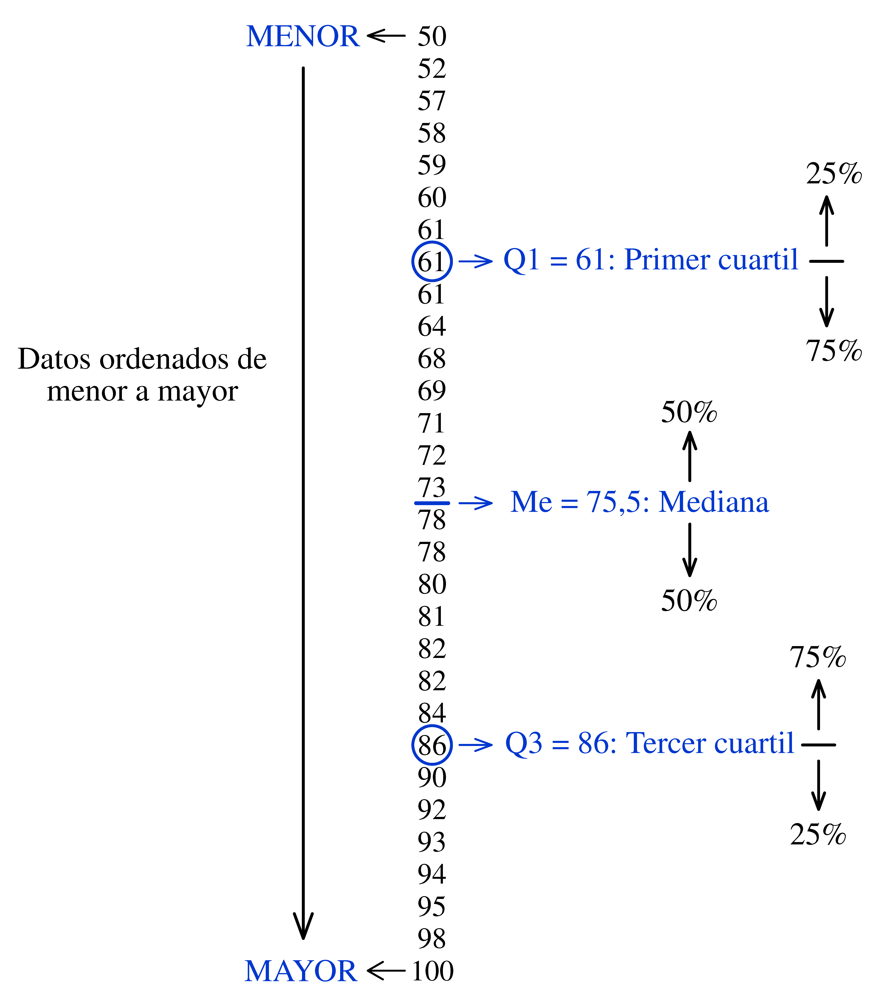
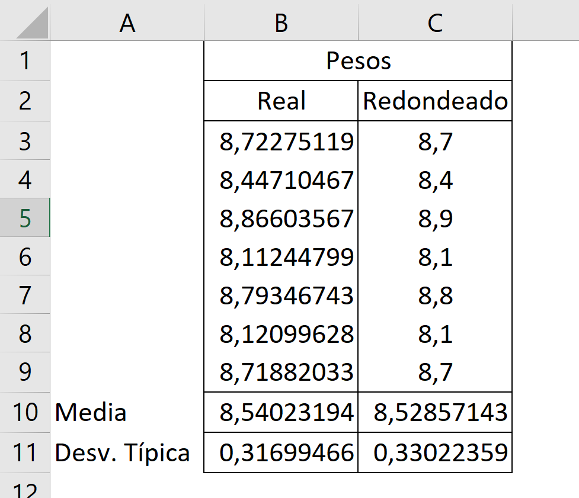

# Síntesis numérica de datos

Si tiene que describir la cara de alguien al que ha visto cometer un delito es posible que se centre en aspectos poco relevantes o que utilice unos términos que su interlocutor no sabrá interpretar tal como usted pretende. Sin embargo, los policías entrenados para realizar este tipo de descripciones saben en qué deben fijarse y cómo describirlo. También, por supuesto, el que recibe la información debe saber interpretar los datos que le dan.

Con la síntesis numérica de datos ocurre algo parecido, se trata de saber en qué aspectos nos tenemos que fijar, en cómo describirlos –en este caso medirlos– y en cómo interpretar los resultados obtenidos.

Estas medidas se pueden agrupar en varios tipos:

-   **Medidas de tendencia central**: indican en torno a qué valor se mueven los datos. Típicamente se considera la media, la mediana y la moda, aunque esta última –en general– no es demasiado relevante.

-   **Medidas de dispersión**: informan sobre la variabilidad de los datos. Los valores 0 y 100 tienen media 50, igual que 55 y 45, pero la dispersión --que muchas veces es lo más importante-- es muy diferente. Medidas típicas de dispersión son: el rango, la desviación media, la varianza y la desviación típica. El coeficiente de variación no es exactamente una medida de dispersión pero también lo incluimos en este grupo.

-   **Medidas de posición**: sirven para situar la posición de un valor dentro de un conjunto. Si quiere saber si está entre el 25% de los que tienen mejor salario en su empresa o entre el 25% de los que lo tienen más bajo, solo necesita saber el primer y el tercer cuartil de la distribución de los salarios. Además de los cuartiles hablaremos de deciles y percentiles, una simple generalización.

También --en un apéndice-- comentaremos algunos aspectos relacionados con el cálculo y el uso de los porcentajes. Se utilizan con frecuencia para describir situaciones numéricas y apenas se les presta atención en este contexto aunque no son tan fáciles e inocentes como parece.

## Medidas de tendencia central

La cantinela “media, mediana y moda” –medidas de tendencia central por excelencia– constituye para muchos el primer recuerdo de su paso por el curso de estadística. Vamos a repasar el significado, los posibles peligros y lo que se puede esperar de cada una de estas medidas.

### Media aritmética {.unnumbered}

Tanto el cálculo como el significado de la media aritmética son bien conocidos por los estudiantes. Además de que la idea es sencilla, su cálculo tiene interés para saber si se aprobará una asignatura a la vista de las notas que se han ido obteniendo.

Cuando los datos se presentan tabulados no hay que olvidar que cada uno se repite tantas veces como indica su **frecuencia absoluta**. En la [Tabla 2.1](#tbl-tabla-hijos), la variable considerada es el número de hijos por familia ($x$) y el número de familias para cada uno de esos valores es la frecuencia absoluta ($n$).

```{=html}
<div id="tbl-tabla-hijos" class="tabla-wrapper04">
<table class="tabla-0201">

<caption>Tabla 2.1: Número de hijos por familia</caption>

<colgroup>
  <col style="width: 40%" />
  <col style="width: 10%" />
  <col style="width: 10%" />
  <col style="width: 10%" />
  <col style="width: 10%" />
  <col style="width: 10%" />
  <col style="width: 10%" />
</colgroup>
  
<thead>
<tr>
<th>Número de hijos (<i>x</i>):</th>
<th>0</th>
<th>1</th>
<th>2</th>
<th>3</th>
<th>4</th>
<th>5</th>
</tr>
</thead>

<tbody>
<tr>
<td>Número de familias (<i>n</i>):</td> 
<td>13</td>
<td>21</td>
<td>15</td>
<td>8</td>
<td>1</td>
<td>2</td>
</tr>

</tbody>
</table>
</div>
```
El valor medio ($\bar{x}$) del número de hijos por famila es igual a:

$$\bar{x} = \frac{\sum_{i} n_i \, x_i }{N} \:  = \:  1,\!48$$

Donde $N$ es el número total de datos ($\sum_i n_i = 60$) y $k$ es el número de valores que puede tomar $x$, en este caso $k=6$ (de 0 a 5).

Para cada valor $x_i$ su \textbf{frecuencia relativa} es $f_i = n_i/N$, por tanto, también podemos calcular la media usando la fórmula: $$\bar{x} = \sum_{i=1}^k f_i \, x_i   =  1,\!48 $$ Vale la pena fijarse en esta expresión porque es análoga a la que veremos más adelante para definir la esperanza matemática (solo hay que cambiar frecuencia relativa por probabilidad). La esperanza matemática es también un valor medio, pero no referido a unos datos concretos, sino a un planteamiento en el que se consideran las probabilidades asociadas a cada uno de los valores que puede tomar la variable.

```{=html}
<div id="tbl-ProsCons"; class="tabla-wrapper06">
<table class="tabla-ProsCons">

<caption>Tabla 2.2: Media aritmética. Pros y contras</caption>

  <colgroup>
    <col style="width: 10%;">
    <col style="width: 90%;">
  </colgroup>
  <tbody>
    <tr style="border-top: 1px solid #dee2e6; border-bottom: 1px solid #dee2e6;">
      <!-- ✅ PRIMERA CELDA -->
      <td style="padding: 8px 0px 8px 0px; vertical-align: top; text-align: center;">
      <!-- top right bottom left -->
        <div style="display: flex; flex-direction: column; align-items: center; gap: 12px;">
          <strong>PROS</strong>
          <span class="fa-solid fa-thumbs-up fa-xl" style="color: #0ca701;"></span>
        </div>
      </td>

      <!-- ✅ SEGUNDA CELDA -->
      <td style="padding: 12px 15px 8px 0px; vertical-align: top;">
        <ul style="margin: 0; padding-left: 6px; line-height: 1.2;">
          <li>Medida de tendencia central más conocida y utilizada.</li>
          <li>Fácil de interpretar.</li>
        </ul>
      </td>
    </tr>

    <tr style="border-top: 1px solid #dee2e6; border-bottom: 1px solid #dee2e6;">
      <!-- ✅ PRIMERA CELDA -->
      <td style="padding: 8px 0px 8px 0px; vertical-align: top; text-align: center;">
        <div style="display: flex; flex-direction: column; align-items: center; gap: 12px;">
          <strong>CONS</strong>
          <span class="fa-solid fa-thumbs-down fa-xl" style="color: #f03333; "></span>
        </div>
      </td>
      
       <!-- ✅ SEGUNDA CELDA -->
      <td style="padding: 12px 15px 8px 0px; vertical-align: top;">
        <ul style="margin: 0; padding-left: 18px; line-height: 1.2;">
          <li>Muy influenciable por valores extremos.</li>
          <li>Poco representativa si la distribución es muy asimétrica.</li>
        </ul>
      </td>
    </tr>
  </tbody>
</table>
</div>
```
::: callout-note
## A veces no está claro cómo se ha calculado la media

¿Cómo se calcula la temperatura media de un día? ¿Se toma la temperatura cada minuto y se calcula el promedio? ¿o se toma cada hora? ¿o cada 6 horas? Si se hace el promedio de las temperaturas máxima y mínima no se le debería llamar temperatura media.
:::

::: {style="height: 1px;"}
:::

### Mediana {.unnumbered}

Se ordenan los valores de menor a mayor y el que queda en el centro es la mediana. Si el número de valores es par, se toma como mediana el promedio de los dos centrales.

La mediana tiene unas propiedades de las que carece la media, por lo que es un buen complemento informativo e incluso puede ser más útil en algunos casos. Sus ventajas respecto a la media son:

-   Es más robusta frente a la presencia de valores anómalos. Supongamos que nuestros datos son:

    $$2, \; 5, \; 6, \;7 \;\text{ y  }\; 9$$

    La media es 5,6 y la mediana es 6. Si al introducir los datos en el ordenador nos equivocamos y, en último lugar, en vez de 9 introducimos 99, la media pasa a ser 23,8, mientras que la mediana sigue siendo 6. Esto hace que la mediana sea útil cuando nos enfrentamos a un conjunto de datos que puede contener valores anómalos (posibles errores, problemas con la importación…) ya que da una idea del valor en torno al que se mueven que está menos afectado por esos valores anomálos.

-   Por su propia definición, la mediana deja un 50% de las observaciones por debajo y el otro 50% por encima y esto le da unas ventajas que la media no tiene. Si queremos saber si en nuestra empresa estamos entre los que cobran más o entre los que cobran menos, debemos comparar nuestro salario con la mediana, no con la media. Si sólo hay 10 trabajadores y los salarios son (en las unidades que corresponda):

    $$8, \; 8, \; 9, \;9, \; 10, \; 10, \; 11, \;11, \; 12 \;\text{ y  }\; 100$$

    en este caso, todos menos uno (el 90%) están por debajo de la media, que es 18,8. Esto no ocurre nunca con la mediana: si estamos por encima de la mediana, estamos entre el 50% de los que más cobran. Otro ejemplo: si en un examen las notas van de 0 a 10 y se aprueba con una nota igual o superior a 5, si la nota media es 5 no sabemos cuántos han aprobado. Si se han examinado 50 estudiantes, puede ocurrir que 41 hayan suspendido con un 4; 8 hayan sacado un 10 y uno haya obtenido un 6. Esto da una media de 5, aunque el 82% ha suspendido. Si la mediana es 5, seguro que como mínimo la mitad han aprobado (como mínimo porque pueden haber muchos estudiantes con un 5).

En una población cuyos valores se distribuyen de forma simétrica respecto a su valor central, la media y la mediana coinciden, y entonces todo son ventajas. Si los valores que tenemos provienen de una población de ese tipo no andarán muy lejos una de otra. En cualquier caso, siempre podemos calcular las dos y aprovechar lo mejor de cada una.

::: callout-note
## Distribución de los salarios

El ejecutivo mejor pagado de las empresas cotizadas en la bolsa española en 2023 tuvo unos ingresos de 23,77 millones de euros[^02_sintesisnumerica-1]. Su empresa tenía ese año 2.299 empleados en España, suponiendo que todos menos él cobraran solo el salario mínimo (15.120 €/año), se podría decir que en promedio cobraron 25.453 €/año, un 68% más de lo que en realidad cobrarían todos menos uno.
:::

[^02_sintesisnumerica-1]: Ver la noticia [aquí](https://elpais.com/economia/negocios/2024-05-04/mi-jefe-cobra-77-veces-mas-que-yo-estas-son-las-empresas-espanolas-con-mayor-desigualdad-salarial-entre-directivos-y-empleados.html).

```{=html}
<div id="tbl-ProsCons"; class="tabla-wrapper34">
<table class="tabla-ProsCons">

<caption>Tabla 2.3: Mediana. Pros y contras</caption>

  <colgroup>
    <col style="width: 10%;">
    <col style="width: 90%;">
  </colgroup>
  <tbody>
  
    <tr style="border-top: 1px solid #dee2e6; border-bottom: 1px solid #dee2e6;">
      <!-- ✅ PRIMERA CELDA -->
      <td style="padding: 8px 0px 8px 0px; vertical-align: top; text-align: center;">
      <!-- top right bottom left -->
        <div style="display: flex; flex-direction: column; align-items: center; gap: 12px;">
          <strong>PROS</strong>
          <span class="fa-solid fa-thumbs-up fa-xl" style="color: #0ca701;"></span>
        </div>
      </td>

      <!-- ✅ SEGUNDA CELDA -->
      <td style="padding: 12px 15px 8px 0px; vertical-align: top;">
        <ul style="margin: 0; padding-left: 18px; line-height: 1.2;">
          <li>Medida de tendencia central más conocida y utilizada.</li>
          <li>Fácil de interpretar.</li>
        </ul>
      </td>
    </tr>

    <tr style="border-top: 1px solid #dee2e6; border-bottom: 1px solid #dee2e6;">
      <!-- ✅ PRIMERA CELDA -->
      <td style="padding: 8px 0px 8px 0px; vertical-align: top; text-align: center;">
        <div style="display: flex; flex-direction: column; align-items: center; gap: 12px;">
          <strong>CONS</strong>
          <span class="fa-solid fa-thumbs-down fa-xl" style="color: #f03333; "></span>
        </div>
      </td>
      
       <!-- ✅ SEGUNDA CELDA -->
      <td style="padding: 20px 15px 22px 0px; vertical-align: top;">
        <ul style="margin: 0; padding-left: 18px; line-height: 1.2;">
          <li>No tiene fórmula. No la dan las calculadoras.</li>
        </ul>
      </td>
    </tr>
  </tbody>
</table>
</div>
```
### Moda {.unnumbered}

Dado un conjunto de valores, la moda es el que más se repite. A diferencia de la media y la mediana, puede no ser única y se puede aplicar también a variables cualitativas (no numéricas). Si realizamos un estudio sobre el método de transporte que usan los estudiantes para ir a su escuela, la moda puede ser el autobús o ir andando. No es una medida muy relevante. Siempre aparece en los libros pero rara vez en los resúmenes estadísticos.

```{=html}
<div id="tbl-ProsCons"; class="tabla-wrapper34">
<table class="tabla-ProsCons">

<caption>Tabla 2.4: Moda. Pros y contras</caption>

  <colgroup>
    <col style="width: 10%;">
    <col style="width: 90%;">
  </colgroup>
  <tbody>
    <tr style="border-bottom: 1px solid #dee2e6; border-top: 1px solid #dee2e6;">
    
      <!-- ✅ PRIMERA CELDA -->
      <td style="padding: 8px 0px 8px 0px; vertical-align: top; text-align: center;">
      <!-- top right bottom left -->
        <div style="display: flex; flex-direction: column; align-items: center; gap: 12px;">
          <strong>PROS</strong>
          <span class="fa-solid fa-thumbs-up fa-xl" style="color: #0ca701;"></span>
        </div>
      </td>

      <!-- ✅ SEGUNDA CELDA -->
      <td style="padding: 18px 15px 24px 0px; vertical-align: top;">
        <ul style="margin: 0; padding-left: 18px; line-height: 1.2;">
          <li>También se puede aplicar a datos cualitativos.</li>
        </ul>
      </td>
    </tr>
    
    <tr style="border-top: 1px solid #dee2e6; border-bottom: 1px solid #dee2e6;">
      <!-- ✅ PRIMERA CELDA -->
      <td style="padding: 8px 0px 8px 0px; vertical-align: top; text-align: center;">
        <div style="display: flex; flex-direction: column; align-items: center; gap: 12px;">
          <strong>CONS</strong>
          <span class="fa-solid fa-thumbs-down fa-xl" style="color: #f03333; "></span>
        </div>
      </td>
      
       <!-- ✅ SEGUNDA CELDA -->
      <td style="padding: 18px 15px 24px 0px; vertical-align: top;">
        <ul style="margin: 0; padding-left: 18px; line-height: 1.2;">
          <li>En general tiene poco interés práctico y es poco usada.</li>
        </ul>
      </td>
    </tr>
  </tbody>
</table>
</div>
```
A modo de resumen de este apartado, la [@fig-salariosINE] muestra la distribución de los salarios en España en 2021. Tiene dos "Salarios más frecuentes" (observe que se evita el término "moda", quizá porque se puede prestar a malas interpretaciones). Cuando se da esta circunstancia se dice que la distribución es bimodal. El salario medio es mayor que el mediano porque los salarios muy altos tiran de la media, pero apenas afectan a la mediana.

![Distribución de los salarios en España en 2021. Fuente: INE[^02_sintesisnumerica-2].](Figuras_02/f0201_distribucionSalariosINE.png){#fig-salariosINE .fig-normal_0201 fig-align="center"}

[^02_sintesisnumerica-2]: INE: "[Encuesta Anual de Estructura Salarial. Año 2021](https://www.ine.es/prensa/ees_2021.pdf)"

[^02_sintesisnumerica-3]: INE: "[Encuesta Anual de Estructura Salarial. Año 2021](https://www.ine.es/prensa/ees_2021.pdf)"

## Medidas de dispersión

Quizá lo más importante de este capítulo --y de todo el libro-- es interiorizar la importancia de considerar la variabilidad para describir datos, para analizarlos y para tomar decisiones.

Todos hemos oído algún chiste que ridiculiza la interpretación de la realidad basada solo en valores medios:

-   Si un señor se come un pollo y otro no come nada, la estadística lo explica diciendo que se han comido un promedio de medio pollo cada uno.

-   Si usted va a la cocina de su casa, pone la cabeza en el horno y los pies en el frigorífico, tendrá el cuerpo a la temperatura media ideal.

-   Aunque no sabía nadar se atrevió a cruzar el río cuando le dijeron que la profundidad media era solo de un metro. Se ahogó.

En ocasiones la práctica habitual no está muy alejada de esas caricaturas. Estamos acostumbrados a clasificar los países por su renta per cápita y eso es el medio pollo que se come cada uno. La variabilidad en la renta también es un excelente indicador del nivel de desarrollo y bienestar de un país. Un caso similar en un terreno que nos queda cercano son los resultados de las pruebas PISA, estamos acostumbrados a ver la clasificación de los valores medios por países, pero apenas se habla de la variabilidad dentro de cada país.

La variabilidad es, en muchas ocasiones, el principal problema al que hay que enfrentarse para extraer información de los datos, y el primer paso para tratarla es saber cómo medirla.

### Rango {.unnumbered}

Es la diferencia entre los valores máximo y mínimo. Si el rango de edades de los asistentes a un concierto es de 5 años, significa que todos tienen edades similares, pero si es de 50 años es que ese tipo de música interesa a personas de varias generaciones.

```{=html}
<div id="tbl-ProsCons"; class="tabla-wrapper05">
<table class="tabla-ProsCons">

<caption>Tabla 2.5: Rango. Pros y contras</caption>

  <colgroup>
    <col style="width: 10%;">
    <col style="width: 90%;">
  </colgroup>
  <tbody>
    <tr style="border-bottom: 1px solid #dee2e6; border-top: 1px solid #dee2e6;">

      <!-- ✅ PRIMERA CELDA -->
      <td style="padding: 6px 0px 8px 0px; vertical-align: top; text-align: center;">
      <!-- top right bottom left -->
        <div style="display: flex; flex-direction: column; align-items: center; gap: 12px;">
          <strong>PROS</strong>
          <span class="fa-solid fa-thumbs-up fa-xl" style="color: #0ca701;"></span>
        </div>
      </td>

      <!-- ✅ SEGUNDA CELDA -->
      <td style="padding: 18px 15px 24px 0px; vertical-align: top;">
        <ul style="margin: 0; padding-left: 18px; line-height: 1.2;">
          <li>Muy fácil de entender y de calcular.</li>
        </ul>
      </td>
    </tr>

    <tr style="border-top: 1px solid #dee2e6; border-bottom: 1px solid #dee2e6;">
      <!-- ✅ PRIMERA CELDA -->
      <td style="padding: 6px 0px 8px 0px; vertical-align: top; text-align: center;">
        <div style="display: flex; flex-direction: column; align-items: center; gap: 12px;">
          <strong>CONS</strong>
          <span class="fa-solid fa-thumbs-down fa-xl" style="color: #f03333; "></span>
        </div>
      </td>
      
       <!-- ✅ SEGUNDA CELDA -->
      <td style="padding: 10px 15px 10px 0px; vertical-align: top;">
        <ul style="margin: 0; padding-left: 18px; line-height: 1.2;">
          <li>Solo cuentan los valores extremos, que pueden ser anómalos o no representativos del conjunto de datos.</li>
        </ul>
      </td>
    </tr>
  </tbody>
</table>
</div>
```
### Desviación media {.unnumbered}

Interesa una medida de dispersión en la que todos los valores tengan algo que decir, tal como ocurre con la media. Con esta idea, una medida de dispersión podría ser el promedio de las distancias de cada valor respecto a la media, pero una de las propiedades de la media es que equilibra esas distancias de manera que el promedio siempre será igual a cero. Si el resultado siempre es el mismo, haya mucha o poca dispersión, está claro que esta medida no nos sirve.

Existen dos formas de resolver este problema. Una de ellas es usar las distancias en valor absoluto. En este caso tenemos lo que llamamos *desviación media*, que sí es una medida de variabilidad (a más variabilidad, mayor desviación media). Si nuestros valores son: $x_1,\, x_2, \, \dotsc \, x_N$ y su valor medio es $\bar{x}$, tendremos: $$ DM = \frac{\sum_{i=1}^N |x_i - \bar{x}|}{N} $$

```{=html}
<div id="tbl-ProsCons"; class="tabla-wrapper34">
<table class="tabla-ProsCons">

<caption>Tabla 2.6: Desviación media. Pros y contras</caption>

  <colgroup>
    <col style="width: 10%;">
    <col style="width: 90%;">
  </colgroup>
  <tbody>
    <tr style="border-bottom: 1px solid #dee2e6; border-top: 1px solid #dee2e6;">

      <!-- ✅ PRIMERA CELDA -->
      <td style="padding: 6px 0px 8px 0px; vertical-align: top; text-align: center;">
      <!-- top right bottom left -->
        <div style="display: flex; flex-direction: column; align-items: center; gap: 12px;">
          <strong>PROS</strong>
          <span class="fa-solid fa-thumbs-up fa-xl" style="color: #0ca701;"></span>
        </div>
      </td>

      <!-- ✅ SEGUNDA CELDA -->
      <td style="padding: 18px 15px 24px 0px; vertical-align: top;">
        <ul style="margin: 0; padding-left: 18px; line-height: 1.2;">
          <li>Fácil de explicar y de justificar.</li>
        </ul>
      </td>
    </tr>

    <tr style="border-top: 1px solid #dee2e6; border-bottom: 1px solid #dee2e6;">
      <!-- ✅ PRIMERA CELDA -->
      <td style="padding: 12px 0px 8px 0px; vertical-align: top; text-align: center;">
        <div style="display: flex; flex-direction: column; align-items: center; gap: 12px;">
          <strong>CONS</strong>
          <span class="fa-solid fa-thumbs-down fa-xl" style="color: #f03333; "></span>
        </div>
      </td>
      
       <!-- ✅ SEGUNDA CELDA -->
      <td style="padding: 10px 15px 10px 0px; vertical-align: top;">
        <ul style="margin: 0; padding-left: 18px; line-height: 1.5;">
          <li>Tiene poco recorrido en la teoría estadística.</li>
          <li>Existe otra medida --la desviación típica-- con más posibilidades de aplicación y mejores propiedades.</li>
        </ul>
      </td>
    </tr>

  </tbody>
</table>
</div>
```
### Varianza {.unnumbered}

::: callout-note
## ¿Varianza o variancia?

Las dos son válidas según el diccionario de la Real Academia Española. Nosotros usaremos *varianza*.
:::

Simplemente elevamos las diferencias al cuadrado en vez de usar su valor absoluto. Si tenemos un conjunto de $N$ datos con media $\mu$ y queremos conocer la varianza de \textbf{esos datos} usamos la expresión: $$ \sigma^2 = \frac{\sum_{i=1}^N ( x_i - \mu )^2}{N} $$

El principal problema de la varianza es que sus unidades son el cuadrado de las unidades de los datos. Esto dificulta su interpretación, pero el problema se resuelve fácilmente usando como medida su raíz cuadrada, que es lo que llamamos desviación típica.

```{=html}
<div id="tbl-ProsCons"; class="tabla-wrapper34">
<table class="tabla-ProsCons">

<caption>Tabla 2.7: Varianza. Pros y contras</caption>

  <colgroup>
    <col style="width: 10%;">
    <col style="width: 90%;">
  </colgroup>
  <tbody>
    <tr style="border-bottom: 1px solid #dee2e6; border-top: 1px solid #dee2e6;">

      <!-- ✅ PRIMERA CELDA -->
      <td style="padding: 6px 0px 8px 0px; vertical-align: top; text-align: center;">
      <!-- top right bottom left -->
        <div style="display: flex; flex-direction: column; align-items: center; gap: 12px;">
          <strong>PROS</strong>
          <span class="fa-solid fa-thumbs-up fa-xl" style="color: #0ca701;"></span>
        </div>
      </td>

      <!-- ✅ SEGUNDA CELDA -->
      <td style="padding: 12px 15px 12px 0px; vertical-align: top;">
        <ul style="margin: 0; padding-left: 18px; line-height: 1.2;">
          <li>Excelentes propiedades que no tiene ninguna otra medida.</li>
          <li>Constituye el eje central de métodos estadísticos muy relevantes.</li>
        </ul>
      </td>

    </tr>

    <tr style="border-top: 1px solid #dee2e6; border-bottom: 1px solid #dee2e6;">
      <!-- ✅ PRIMERA CELDA -->
      <td style="padding: 12px 0px 8px 0px; vertical-align: top; text-align: center;">
        <div style="display: flex; flex-direction: column; align-items: center; gap: 12px;">
          <strong>CONS</strong>
          <span class="fa-solid fa-thumbs-down fa-xl" style="color: #f03333; "></span>
        </div>
      </td>
      
       <!-- ✅ SEGUNDA CELDA -->
      <td style="padding: 12px 15px 12px 0px; vertical-align: top;">
        <ul style="margin: 0; padding-left: 18px; line-height: 1.2;">
          <li>Sus unidades son el cuadrado de las unidades de los datos, lo que dificulta su interpretación.</li>
        </ul>
      </td>
    </tr>
  </tbody>
</table>
</div>
```
#### ¿Se divide por $n$ o por $n-1$? {.unnumbered}

Cuando tenemos un conjunto de datos y nos interesa conocer la varianza de **esos datos** dividimos por el número de los que tenemos, pero aunque esta parece la situación más habitual, no es así. Lo habitual es que nuestro interés no sea tanto conocer la varianza de los datos disponibles como **estimar la varianza de la población** de la cual provienen.

En este caso tampoco se conoce la media de la población de manera que debemos sustituir su valor por la media de la muestra ($\bar{x}$). Esta sustitución tiene más influencia de la que parece, ya que la media de la muestra se adapta a los datos con los que se calcula y la variabilidad obtenida tiende a ser menor de la que presenta la población. Puede demostrarse que si en vez de dividir por el número de datos $n$ (al número de elementos de la muestra le llamamos $n$ minúscula) se divide por $n-1$ esa subestimación --se llama *sesgo*-- ya no se da. Por tanto, la fórmula que usamos en la práctica es: $$ s^2 = \frac{\sum_{i=1}^n ( x_i - \bar{x})^2}{n-1} $$

Esta corrección es especialmente importante cuando se tienen muestras pequeñas, ya que puede haber una diferencia importante entre dividir por $n$ o hacerlo por $n-1$.

::: {style="height: 1px;"}
:::

::: callout-note
## La varianza obtenida con calculadora u ordenador

En algunas calculadoras y en hojas de cálculo existen dos opciones para calcular la varianza: dividiendo por $N\!$ o por $n\!\!-\!\!1$ según se tenga una población o una muestra. Los paquetes de software estadístico suelen calcularla siempre dividiendo por $n\!\!-\!\!1$ porque casi siempre tenemos muestras. Si en algún caso interesa obtener la varianza dividiendo por $N$ el truco consiste en añadir la media como un dato más.
:::

::: {style="height: 1px;"}
:::

### Desviación típica {.unnumbered}

Es la raíz cuadrada de la varianza. En el caso más habitual de tener una muestra: $$s = \sqrt {\frac{\sum_{i=1}^n ( x_i - \bar{x} )^2}{n-1}}$$

La raíz cuadrada hace que sus unidades sean las mismas que las de los datos. El precio a pagar es la pérdida de las propiedades algebraicas que tiene la varianza, por lo que en los desarrollos teóricos es muy habitual que el protagonismo lo tenga esta última.

Entre los muchos méritos de la desviación típica, podemos decir que, junto con la media, forman una pareja perfecta para describir el comportamiento de muchas variables aleatorias. En particular, constituye el "ADN" de la distribución Normal. Si una variable sigue esta distribución basta conocer su media y su desviación típica para calcular cualquier probabilidad relacionada con los valores que puede tomar. Si el peso de unos paquetes de azúcar sigue una distribución Normal con una media de 1000 g y una desviación típica de 15 g, podemos decir que --en números redondos-- el 95% de los paquetes tendrán un peso comprendido entre 970 y 1030 g, y también que el 68% tendrá un peso comprendido entre 985 y 1015. Además, podríamos responder cualquier pregunta similar, por ejemplo, qué porcentaje de paquetes tendrá un peso por debajo de 980 g (será el 9%).

También destaca su presencia en la estimación del valor de la media poblacional $\mu$. Lo hacemos tomando una muestra de tamaño $n$ y calculando su media $\bar{x}$. El problema es que cada vez que tomemos una muestra, el valor de $\bar{x}$ cambiará, así que, mejor que apostar por un valor concreto, preferimos dar un intervalo de valores razonables para $\mu$. Para calcular ese intervalo necesitamos conocer la variabilidad que presentan los valores de $\bar{x}$. Pues bien, la desviación típica de $\bar{x}$ **siempre** es igual a la desviación típica de la población dividida por $\sqrt{n}$. Esto es verdad para **todas** las distribuciones, no solo para la Normal.

En definitiva, la desviación típica aparece en muchos contextos y con mucha relevancia. El calificativo "típica" resulta, en este caso, apropiado y bien merecido.

::: callout-note
## Otros nombres para la desviación típica

También se puede llamar desviación estándar, pero no de otra manera, aunque algunos textos se refieren a ella como desviación tipo o desvío típico.
:::

```{=html}
<div id="tbl-ProsCons"; class="tabla-wrapper34">
<table class="tabla-ProsCons">

<caption>Tabla 2.8: Desviación típica. Pros y contras</caption>

  <colgroup>
    <col style="width: 10%;">
    <col style="width: 90%;">
  </colgroup>
  <tbody>
    <tr style="border-bottom: 1px solid #dee2e6; border-top: 1px solid #dee2e6;">

      <!-- ✅ PRIMERA CELDA -->
      <td style="padding: 8px 0px 8px 0px; vertical-align: top; text-align: center;">
      <!-- top right bottom left -->
        <div style="display: flex; flex-direction: column; align-items: center; gap: 12px;">
          <strong>PROS</strong>
          <span class="fa-solid fa-thumbs-up fa-xl" style="color: #0ca701;"></span>
        </div>
      </td>

      <!-- ✅ SEGUNDA CELDA -->
      <td style="padding: 12px 15px 8px 0px; vertical-align: top;">
        <ul style="margin: 0; padding-left: 18px; line-height: 1.2;">
          <li>Es la medida de dispersión más utilizada.</li>
          <li>Con la media forman una pareja perfecta. Son los parámetros que definen la distribución Normal.
        </ul>
      </td>
    </tr>

    <tr style="border-top: 1px solid #dee2e6; border-bottom: 1px solid #dee2e6;">
      <!-- ✅ PRIMERA CELDA -->
      <td style="padding: 8px 0px 8px 0px; vertical-align: top; text-align: center;">
        <div style="display: flex; flex-direction: column; align-items: center; gap: 12px;">
          <strong>CONS</strong>
          <span class="fa-solid fa-thumbs-down fa-xl" style="color: #f03333; "></span>
        </div>
      </td>
      
       <!-- ✅ SEGUNDA CELDA -->
      <td style="padding: 12px 15px 8px 0px; vertical-align: top;">
        <ul style="margin: 0; padding-left: 18px; line-height: 1.2;">
          <li> Malas propiedades algebraicas.</li>
					<li> Su interpretación no es intuitiva.</li>
        </ul>
      </td>
    </tr>
  </tbody>
</table>
</div>
```
### Coeficiente de variación {.unnumbered}

Suponga que tiene delante cuatro gatos con los siguientes pesos: 1,5; 2,0; 6,0 y 6,5 kg. Ahora piense en cuatro vacas cuyos pesos son: 490, 495, 505 y 510 kg. ¿En qué grupo de animales hay más variabilidad? Seguramente pensará que en el de los gatos, donde hay dos bastante canijos y otros dos muy gordos, mientras que verá las vacas prácticamente iguales. Pero si calcula las desviaciones típicas obtendrá:

$$ s_{gatos} = 2{,}61\, \text{kg} \quad \quad  s_{vacas} = 9{,}13\, \text{kg}$$

Es mayor la desviación típica del peso de las vacas. Esto es así porque las diferencias respecto a la media son --en valores absolutos--: 2,5; 2,0; 2,0; 2,5 para los gatos y 10, 5, 5, 10 para las vacas. Como las diferencias son mayores en el caso de las vacas, su desviación típica es mayor.

En situaciones como esta, donde conviene valorar la variabilidad teniendo en cuenta el valor medio, usamos el coeficiente de variación $CV$. Se define como: $$CV = \frac{s}{\bar{x}}$$

Con frecuencia este valor se multiplica por 100 para darlo como porcentaje. En nuestro ejemplo, para los gatos tenemos un $CV$ del 65,35% mientras que para las vacas es solo del 1,83%.

Para comparar la variabilidad de conjuntos de datos con valores medios muy distintos es mejor utilizar el coeficiente de variación.

```{=html}
<div id="tbl-ProsCons"; class="tabla-wrapper34">
<table class="tabla-ProsCons">

<caption>Tabla 2.9: Coeficiente de variación. Pros y contras</caption>

  <colgroup>
    <col style="width: 10%;">
    <col style="width: 90%;">
  </colgroup>
  <tbody>
    <tr style="border-bottom: 1px solid #dee2e6; border-top: 1px solid #dee2e6;">

      <!-- ✅ PRIMERA CELDA -->
      <td style="padding: 8px 0px 8px 0px; vertical-align: top; text-align: center;">
      <!-- top right bottom left -->
        <div style="display: flex; flex-direction: column; align-items: center; gap: 12px;">
          <strong>PROS</strong>
          <span class="fa-solid fa-thumbs-up fa-xl" style="color: #0ca701;"></span>
        </div>
      </td>

      <!-- ✅ SEGUNDA CELDA -->
      <td style="padding: 12px 15px 8px 0px; vertical-align: top;">
        <ul style="margin: 0; padding-left: 18px; line-height: 1.2;">
          <li>Permite interpretar la variabilidad en el contexto del nivel de respuesta (valor medio).</li>
          <li>Es adimensional. No depende de las unidades de medida.
        </ul>
      </td>
    </tr>

    <tr style="border-top: 1px solid #dee2e6; border-bottom: 1px solid #dee2e6;">
      <!-- ✅ PRIMERA CELDA -->
      <td style="padding: 8px 0px 8px 0px; vertical-align: top; text-align: center;">
        <div style="display: flex; flex-direction: column; align-items: center; gap: 12px;">
          <strong>CONS</strong>
          <span class="fa-solid fa-thumbs-down fa-xl" style="color: #f03333; "></span>
        </div>
      </td>
      
       <!-- ✅ SEGUNDA CELDA -->
      <td style="padding: 12px 15px 8px 0px; vertical-align: top;">
        <ul style="margin: 0; padding-left: 18px; line-height: 1.2;">
          <li> Tiene poco juego en la descripción de variables aleatorias y en la estimación de las características de la población.</li>
        </ul>
      </td>
    </tr>
  </tbody>
</table>
</div>
```
## Medidas de posición

Sirven para establecer unas marcas que delimitan zonas en el conjunto ordenado de los datos. Así, dado un valor, al compararlo con esas marcas se sabe a qué zona pertenece, y si está entre los valores mayores o entre los menores.

### Cuartiles {.unnumbered}

Sabemos que ordenados los datos de menor a mayor, la mediana es el que los separa en dos mitades. Pues bien, conceptualmente (otra cosa es cómo se determina el valor exacto), el primer cuartil ($Q_1$) es la mediana de la primera mitad dejando, por tanto, el 25% de los valores por debajo y el 75% por encima. La mediana de la segunda mitad es el tercer cuartil ($Q_3$), que deja el 75% por debajo y el 25% por encima ([@fig-cuartiles]).

{#fig-cuartiles .fig-normal_0202 fig-align="center"}

Si usted conoce la mediana y los cuartiles de los salarios de su empresa, puede situar fácilmente el suyo. Si $Q_1$ es 1.300€, la mediana es 1.500€ y $Q_3$ es 1.800€, entonces, si usted cobra 1.200€ está entre el 25% que menos gana. Si su salario es de 1.600€ está entre la mitad de los que más ganan, pero como mínimo el 25% de los empleados gana más que usted. Si cobra 2.000€ está entre el 25% de los privilegiados que más ganan.

Para determinar el valor exacto de los cuartiles lo habitual es identificar primero su posición mediante las expresiones: $$P_{Q_1} = 0{,}25(n+1) \quad \text{y} \quad P_{Q_3} = 0{,}75(n+1)$$

Para los datos de la [@fig-cuartiles], donde $n=30$, tenemos que $P_{Q_1} = 7{,}75$ y $P_{Q_3} = 23{,}25$.

Como la posición para el primer cuartil es 7,75, su valor se interpola entre los de las posiciones 7 y 8, de la forma: $$Q_1 = x_7 + 0{,}75(x_8 - x_7) = 61 + 0{,}75(61-61) = 61$$

De manera análoga, para $Q_3$: $$Q_3 = x_{23} + 0{,}25(x_{24} - x_{23}) = 86 + 0{,}25(90-86) = 87$$

Observe que el valor obtenido para $Q_3$ no coincide con el que hemos deducido en la [@fig-cuartiles]. Esto es así porque existen diversos criterios para calcular los cuartiles. En la práctica, esto no importa demasiado, ya que solo estamos interesados en conocer los cuartiles cuando el conjunto de datos es grande y, en ese caso, las diferencias entre los distintos métodos no son relevantes.

::: {style="height: 1px;"}
:::

::: callout-note
## Los cuartiles como zona

Aunque un cuartil es un número y no una zona, a veces se dice que un valor pertenece al primer o al tercer cuartil, y lo que eso significa no siempre está claro. Podría pensarse que pertenecer al primer cuartil significa que el valor es menor que $Q_1$ y que pertenece al tercero cuando es mayor que la mediana y menor que $Q_3$, pero no siempre es así. La relevancia de las revistas científicas se mide por su "factor de impacto", un valor relacionado con el número de citas que tienen los artículos que publican. Para cada ámbito de conocimiento se realizan rankings de revistas según su factor de impacto, y todos queremos publicar en las que lo tienen más alto, que no son las del cuarto, seguido por las del tercer cuartil, sino en las del primero y del segundo. El ranking se hace de mayor a menor.
:::

```{=html}
<div id="tbl-ProsCons"; class="tabla-wrapper34">
<table class="tabla-ProsCons">

<caption>Tabla 2.10: Cuartiles. Pros y contras</caption>

  <colgroup>
    <col style="width: 10%;">
    <col style="width: 90%;">
  </colgroup>
  <tbody>
    <tr style="border-bottom: 1px solid #dee2e6; border-top: 1px solid #dee2e6;">

      <!-- ✅ PRIMERA CELDA -->
      <td style="padding: 8px 0px 8px 0px; vertical-align: top; text-align: center;">
      <!-- top right bottom left -->
        <div style="display: flex; flex-direction: column; align-items: center; gap: 12px;">
          <strong>PROS</strong>
          <span class="fa-solid fa-thumbs-up fa-xl" style="color: #0ca701;"></span>
        </div>
      </td>

      <!-- ✅ SEGUNDA CELDA -->
      <td style="padding: 12px 15px 8px 0px; vertical-align: top;">
        <ul style="margin: 0; padding-left: 18px; line-height: 1.2;">
          <li>Junto con la mediana divide los datos en 4 partes ordenadas.</li>
          <li>Se puede valorar la magnitud de un nuevo valor identificando la parte a la que pertenece.</li>
        </ul>
      </td>
    </tr>

    <tr style="border-top: 1px solid #dee2e6; border-bottom: 1px solid #dee2e6;">
      <!-- ✅ PRIMERA CELDA -->
      <td style="padding: 8px 0px 8px 0px; vertical-align: top; text-align: center;">
        <div style="display: flex; flex-direction: column; align-items: center; gap: 12px;">
          <strong>CONS</strong>
          <span class="fa-solid fa-thumbs-down fa-xl" style="color: #f03333; "></span>
        </div>
      </td>
      
       <!-- ✅ SEGUNDA CELDA -->
      <td style="padding: 12px 15px 8px 0px; vertical-align: top;">
        <ul style="margin: 0; padding-left: 18px; line-height: 1.2;">
          <li> Existen diversas formas de calcularlos, aunque este es un problema más académico que práctico.</li>
        </ul>
      </td>
    </tr>
  </tbody>
</table>
</div>
```
::: {style="height: 0.5px;"}
:::

### Percentiles {.unnumbered}

Se usan para identificar la posición de un valor en el conjunto al que pertenece. Si la estatura de un niño está en el percentil del 46% significa que el 46% de aquellos con los que se compara tienen una estatura menor que la suya.

En un test de inteligencia o de otras habilidades, o en concursos de matemáticas a los que se presentan muchos estudiantes, se informa mejor del resultado obtenido dando el percentil en el que se ha quedado que dando una nota, especialmente si no está clara la escala que se usa o la dificultad de obtener notas altas. Si se dice que ha quedado en el percentil del 98% su puntuación ha sido muy buena, ya que solo ha sido superada por el 2%.

También en la valoración de méritos para la admisión en cursos de posgrado, muchas universidades están más interesadas en el percentil en el que quedó el aspirante entre los de su promoción que en las calificaciones obtenidas, difícilmente comparables entre distintos tipos de estudios y diferentes universidades.

Al igual que ocurre con los cuartiles, existen diferentes criterios para determinar su valor. Una forma sencilla y razonable es identificar primero su posición mediante la expresión $p(n+1)$, siendo $p$ el percentil en escala de 0 a 1 y $n$ el número total de datos. Si se obtiene un número decimal, se interpola igual que hemos hecho con los cuartiles.

Los deciles son los percentiles del 10, 20,… , 100%.

```{=html}
<div id="tbl-ProsCons"; class="tabla-wrapper34">
<table class="tabla-ProsCons">

<caption>Tabla 2.11: Percentiles. Pros y contras</caption>

  <colgroup>
    <col style="width: 10%;">
    <col style="width: 90%;">
  </colgroup>
  <tbody>
    <tr style="border-top: 1px solid #dee2e6; border-bottom: 1px solid #dee2e6;">

      <!-- ✅ PRIMERA CELDA -->
      <td style="padding: 8px 0px 8px 0px; vertical-align: top; text-align: center;">
      <!-- top right bottom left -->
        <div style="display: flex; flex-direction: column; align-items: center; gap: 12px;">
          <strong>PROS</strong>
          <span class="fa-solid fa-thumbs-up fa-xl" style="color: #0ca701;"></span>
        </div>
      </td>

      <!-- ✅ SEGUNDA CELDA -->
      <td style="padding: 18px 15px 24px 0px; vertical-align: top;">
        <ul style="margin: 0; padding-left: 18px; line-height: 1.2;">
          <li>Identifican la posición de un valor en su grupo de referencia.</li>
        </ul>
      </td>
    </tr>

    <tr style="border-top: 1px solid #dee2e6; border-bottom: 1px solid #dee2e6;">
      <!-- ✅ PRIMERA CELDA -->
      <td style="padding: 8px 0px 8px 0px; vertical-align: top; text-align: center;">
        <div style="display: flex; flex-direction: column; align-items: center; gap: 12px;">
          <strong>CONS</strong>
          <span class="fa-solid fa-thumbs-down fa-xl" style="color: #f03333; "></span>
        </div>
      </td>
      
       <!-- ✅ SEGUNDA CELDA -->
      <td style="padding: 12px 15px 8px 0px; vertical-align: top;">
        <ul style="margin: 0; padding-left: 18px; line-height: 1.2;">
          <li> Al igual que los cuartiles, existen diversas formas de calcularlos aunque las diferencias a efectos prácticos no son relevantes.</li>
        </ul>
      </td>
    </tr>
  </tbody>
</table>
</div>
```
::: {style="height: 1px;"}
:::

## APÉNDICE 2.A: Otras medias {.unnumbered}

#### Media ponderada {.unnumbered}

La media ponderada se realiza cuando no se da el mismo peso a todos los valores. Si en una asignatura se tienen dos notas, 6 y 3, la media aritmética es 4,5, pero si se calcula una media ponderada de manera que la primera tenga el doble de peso que la segunda, el resultado es: $$ \bar{x}_p = \frac{2\cdot 6+1 \cdot 3}{3}=5$$

En general, siendo $x_i$ los valores y $p_i$ los pesos asignados a cada valor, tenemos: $$\bar{x}_p = \frac{\sum_i p_i x_i}{\sum_i p_i}$$

#### Media truncada {.unnumbered}

Hemos visto que uno de los problemas de la media aritmética es el de ser muy influenciable por valores extremos. Una forma sencilla de resolver este problema es recortar las puntas de los datos. Podemos eliminar los que quedan por debajo del percentil del 5% y por encima del 95% y, calculando la media aritmética del 90% de los datos centrales, tenemos una media truncada.

#### Media geométrica {.unnumbered}

La media geométrica ($MG$) de un conjunto de valores $x_1, x_2, \cdots , x_n$ es: $$MG = \sqrt[n]{\prod_{i=1}^{n} x_i}$$

Se aplica para calcular tasas medias de crecimiento o tasas medias de interés cuanto este varía cada año. Si deposita 1000 € en un banco, el primer año le dan un 2% de interés y el segundo año un 4% no le están dando un promedio del 3%. Al final del segundo año tendrá: $1000 \cdot 1{,}02 \cdot 1{,}04 = 1060{,}8$€. Si el promedio fuera del 3% podría sustituir el interés de cada año por ese valor, pero el resultado no es el mismo: $1000 \cdot 1{,}03 \cdot 1{,}03 = 1060{,}9$€.

Si al interés medio (en tanto por uno) le llamamos $x$ y a $1+x$ lo llamamos factor de expansión, el valor medio de ese factor de expansión será tal que:

```{=tex}
\begin{equation*} \label{eq1}
    \begin{split}
        1000 \cdot (1+x)(1+x) &= 1000\cdot(1+0{,}02)(1+0{,}03)\\[5pt]
        (1+x)^2 &= (1+0{,}2)(1+0{,}3)\\[5pt]
        1+x &= \sqrt{(1+0{,}2)(1+0{,}3)}
    \end{split}
\end{equation*}
```
De donde $x=1{,}249$, la media geométrica de las tasas anuales.

#### Media armónica {.unnumbered}

Si en un viaje de ida y vuelta realiza la ida a 100 km/h y la vuelta, por el mismo camino, a 120 km/h su velocidad media no es 110 km/h. En efecto, sea $d$ la distancia tanto de ida como de vuelta. El tiempo tardado en la ida es $t_1=d/100$ y en la vuelta $t_2=d/120$ por tanto, la velocidad global será: $$ v = \frac{2d}{\frac{d}{100}+\frac{d}{120}} = \frac{2}{\frac{1}{100}+\frac{1}{120}} = 109{,}1 \text{ km/h} $$

Esto es la media armónica.

::: callout-note
## La media sin adjetivos

Cuando hablamos simplemente de "la media" siempre nos estamos refiriendo a la media aritmética.
:::

::: {style="height: 1px;"}
:::

## APÉNDICE 2.B: Número de decimales en los resultados {.unnumbered}

Cuando se presenta un informe o un trabajo académico, no es buena idea dar decimales que son irrelevantes a efectos prácticos. Se puede decir que durante el último año en un hospital ha nacido un promedio de 3,6 niños cada día, pero no tendría ningún interés decir que ese promedio ha sido de 3,6479342 niños --aunque este sea el valor exacto que se obtiene de los datos-- porque más allá del segundo decimal los números, además de ser irrelevantes, dificultan la lectura de los que realmente interesan.

Por otra parte, si se trabaja con valores de una variable continua, un número excesivo de decimales no solo da una información innecesaria sino también incorrecta. Para verlo claro, supongamos que tenemos 7 cajas de fruta con los siguientes pesos, en kg:

$$8{,}7; \;\; 8{,}4; \;\; 8{,}9; \;\; 8{,}1; \;\; 8{,}8; \;\; 8{,}1; \;\; 8{,}7$$ 
Si se introducen estos valores en una calculadora se obtiene: $$ \text{Media} = 8{,}52857...\text{ kg} \quad \quad  \text{Desv. típica} = 0{,}33022...\text{ kg}$$ ¿Por qué tantos decimales, además de irrelevantes, son incorrectos? La clave está en que, cuando nos dicen que una caja pesa 8,7 kg, no nos están diciendo que pesa 8,7000000... kg sino que su peso puede ser cualquier valor entre 8,65 y 8,7499... (si fuera 8,75 ya se redondearía a 8,8). Por tanto, no podemos pretender que los resultados de cálculos realizados con estos datos redondeados conduzcan a valores con toda la precisión deseada.

En la figura [-@fig-valoresRedondeados] tenemos los valores que podrían corresponder a los pesos reales medidos con mucha precisión (los nuestros son esos mismos valores redondeados con un solo decimal) junto con la media y la desviación típica que podemos considerar como las reales de los pesos de esas cajas. Usando los valores redondeados, los resultados son distintos. El primer decimal sí es el mismo, el segundo cambia, aunque no está muy alejado del verdadero, el tercero ya no tiene nada que ver.

{#fig-valoresRedondeados .fig-normal_0203 fig-align="center"}

Hemos analizado solo un caso concreto, pero la lógica que hay detrás es fácilmente generalizable.

**Moraleja**: cuando presente los resultados de la síntesis numérica de datos, puede darlos con un decimal más de los que tienen los datos originales; dar más decimales es innecesario, complica la lectura y da una falsa sensación de exactitud.

## APÉNDICE 2.C: Porcentajes {.unnumbered}

Son de uso habitual para presentar información numérica, pero no forman parte del elenco de medidas estadísticas, quizá porque parecen simples y no hay mucho que decir sobre ellos. Sin embargo, conviene tenerlos presentes porque se prestan a confusiones y malas interpretaciones.

#### Cálculo del porcentaje {.unnumbered}

Siempre se debe referir al valor inicial. Si el año pasado las naranjas costaban 4 €/kg y este año cuestan 5, su precio ha aumentado un 25%. Si pasan de 5 a 4 habrán disminuido un 20%. No hay simetría al aumentar y disminuir.

#### Operaciones con porcentajes {.unnumbered}

Las operaciones con porcentajes no son triviales. Hacer un 50% de descuento y después otro 20% no es lo mismo que hacer el 70%. Si el valor inicial era 100 €, en el primer caso queda en 40 € mientras que en el segundo el valor final es de 30 €. Si el IVA es del 21%, vender sin IVA no es hacer un 21% de descuento. A veces se dan situaciones paradójicas: si usted está vendiendo al mismo precio que la competencia puede hacer un 33% de descuento y decir que la competencia está vendiendo un 50% más caro.

Los problemas con porcentajes pueden parecer triviales y no serlo. Uno de los más famosos es la llamada “paradoja de las patatas”: supongamos que tenemos 100 kg de patatas cuyo peso está compuesto por agua en un 99%. Con el paso del tiempo las patatas pierden humedad ¿Cuánto pesarán cuando el porcentaje de humedad sea del 98%?[^02_sintesisnumerica-4].

[^02_sintesisnumerica-4]: Después de secarse sigue habiendo 1 kg de "polvo de patata"; si ese kilo es un 2% del total, el total son 50 kg.

#### Porcentajes y puntos porcentuales {.unnumbered}

Si los beneficios han pasado del 2 al 4% no han aumentado un 2% sino el 100% (suponiendo que la base sobre la que se calculan se haya mantenido constante). También podemos decir que han aumentado 2 puntos porcentuales. Es necesario cuidar el lenguaje y no confundir una cosa con la otra.

Curiosidad: Si los beneficios se han multiplicado por 5 no han aumentado un 500% sino un 400%. En efecto, si se doblan han aumentado un 100%, si se triplican habrán aumentado un 200%, y así sucesivamente.

#### Porcentajes basados en niveles y en cambios de nivel {.unnumbered}

Un vendedor vendió el año pasado por valor de 10 millones de euros. Su objetivo para este año era aumentar su facturación un 6%, es decir, vender por valor de 10,6 millones. El vendedor solo ha logrado vender por valor de 10,3 millones, ¿qué porcentaje de objetivo ha logrado? Si el objetivo era el incremento, se ha quedado en la mitad y por tanto solo ha conseguido el 50%, pero si era vender 10,6 millones y ha vendido 10,3 se ha quedado en el 97,2%. En general, los objetivos siempre son sobre el incremento, no sobre el valor absoluto, y esto debe quedar claro.

#### No olvidar los valores a partir de los cuales se calculan los porcentajes {.unnumbered}

Si se realiza un estudio y resulta que 66,7% de los consumidores prefiere el producto X, puede ser que se haya consultado a 3 y lo prefieran 2, o que se haya entrevistado a 3.000 y lo hayan preferido 2.000. La información que da ese porcentaje no es la misma en un caso que en otro.

El porcentaje global para un colectivo formado por varios grupos puede sugerir unas conclusiones que no se dan en ninguno de los grupos, es lo que se conoce como “**paradoja de Simpson**”: una empresa crea 250 nuevos puestos de trabajo en sus departamentos de compras, fabricación y ventas. En total se presentan 355 hombres y 325 mujeres, de los cuales son admitidos 190 hombres (el 53,5%) y solo 60 mujeres (el 18,5%). Se comprueba que el nivel de preparación de hombres y mujeres es similar entre los aspirantes a cada departamento. ¿Podemos asegurar que se ha discriminado a las mujeres? La respuesta es no. Los datos están en la [Tabla 2.12](#tbl-Simpson).

```{=html}
<div id="tbl-Simpson"; class="tabla-wrapper04">
<table class="tabla-0212">

<caption>Tabla 2.12: Paradoja de Simpson. Fijarse solo en los porcentajes totales da una información engañosa</caption>

<colgroup>
    <col style="width: 18%;">
    <col style="width: 12%;">
    <col style="width: 11%;">
    <col style="width: 11%;">
    <col style="width: 11%;">
    <col style="width: 11%;">
    <col style="width: 13%;">
    <col style="width: 13%;">
  </colgroup>
  <thead>
     <tr>
        <th rowspan=2 style="vertical-align: middle;" ALIGN=left> Depart. </th>
        <th rowspan=2 style="vertical-align: middle;" ALIGN=left> Plazas </th>
        <th colspan=2> Aspirantes </th>
        <th colspan=2> Admitidos </th>
        <th colspan=2> % Admitidos </th>
    </tr>
    <tr>
        <th> &nbsp Hom. </th>
        <th> Muj. &nbsp </th>
        <th> &nbsp Hom. </th>
        <th> Muj. &nbsp </th>
        <th> &nbsp Hom. </th>
        <th> Muj. &nbsp </th>
    </tr>
   </thead>
    
    <tr>
    <TD ALIGN=left>Compras <br> Fabricación <br> Ventas  </TD>
    <TD ALIGN=center> 30 <br> 200 <br>20 </TD>
    <TD ALIGN=center> &nbsp 25 <br> &nbsp 250 <br> &nbsp 80   </TD>
    <TD ALIGN=center> 100 &nbsp <br> 25 &nbsp <br> 200 &nbsp  </TD>
    <TD ALIGN=center> &nbsp 5 <br> &nbsp 180 <br> &nbsp 5  </TD>
    <TD ALIGN=center> 25 &nbsp <br>20 &nbsp <br> 15 &nbsp   </TD>
    <TD ALIGN=center> &nbsp 20% <br> &nbsp 72% <br> &nbsp 6,25%  </TD>
    <TD ALIGN=center> 25% &nbsp <br> 80% &nbsp <br> 7,5%  </TD>
    </TR>
    <tr class="total">
<td align="left"><b>TOTAL</b></td>
<td align="center">250</td>
<td align="center">&nbsp 355</td>
<td align="center">325 &nbsp</td>
<td align="center">&nbsp 190</td>
<td align="center">60 &nbsp</td>
<td align="center">&nbsp <b>53,5%</b></td>
<td align="center"><b>18,5%</b></td>
</tr>
</table>
</div>
```
En realidad, han sido las mujeres las que han tenido una mayor proporción de admitidos en los tres departamentos. La clave está en que al departamento que ofrece más plazas se han presentado muchos hombres y pocas mujeres, mientras que ocurre lo contrario en los departamentos en los que se ofrecen menos plazas.

#### Porcentaje ¿de qué? {.unnumbered}

Ante un porcentaje, siempre conviene preguntarse qué significa y cómo se han obtenido los valores con los que se ha calculado. Ya sabemos que en el mundo de la publicidad esas preguntas no suelen tener respuesta: si una crema reduce las arrugas un 33% no está claro si elimina una de cada tres o si reduce un tercio la profundidad de todas ellas. El problema es que estas ambigüedades se presentan también en otros ámbitos, quizá también en los porcentajes que nosotros manejamos. Es necesario que esté claro a qué nos estamos refiriendo.

::: {style="height: 0.5px;"}
:::

## APÉNDICE 2.D: ¿Por qué dividimos por $n-1$? {.unnumbered}

Vamos a trabajar con un ejemplo suponiendo que conocemos la población completa, lujo que no tendremos en la práctica. Los elementos que componen la población, junto con sus mediciones respectivas, son:

```{=html}
<div class="tabla-wrapper00">
<table class="tabla-02Ape2D_1">

<tr>
<td>(A)</td>
<td>(B)</td>
<td>(C)</td>
<td>(D)</td>
<td>(E)</td>
<td>(F)</td>
</tr>

<tr>
<td>2</td>
<td>6</td>
<td>8</td>
<td>10</td>
<td>10</td>
<td>12</td>
</tr>

 </table>
</div>
```
La media poblacional ($\mu$), de estos datos es:

$$\mu = \frac{2+6+8+10+10+12}{6}=8$$ Supongamos que queremos estimar (“hacernos una idea”) el valor ($\mu$), usando una muestra aleatoria de $n = 2$ unidades. En este caso, en el que la población consta solo de 6 unidades, podemos hacer un listado de todas las muestras que pueden resultar al elegir dos unidades al azar. Estas muestras aparecen enumeradas en la siguiente tabla.

```{=html}
<div id="tbl-Dividir_n-1"; class="tabla-wrapper_T0200">
<table class="tabla-02Ape2D_2_3">

<colgroup>
<col style="width: 16.75%" />
<col style="width: 5.5%" />
<col style="width: 5.5%" />
<col style="width: 5.5%" />
<col style="width: 5.5%" />
<col style="width: 5.5%" />
<col style="width: 5.5%" />
<col style="width: 5.5%" />
<col style="width: 5.5%" />
<col style="width: 5.5%" />
<col style="width: 5.5%" />
<col style="width: 5.5%" />
<col style="width: 5.5%" />
<col style="width: 5.5%" />
<col style="width: 5.5%" />
<col style="width: 5.5%" />
</colgroup>

<tbody>
<tr>
<td style="text-align: left;">Muestra nº</td>
<td>1</td>
<td>2</td>
<td>3</td>
<td>4</td>
<td>5</td>
<td>6</td>
<td>7</td>
<td>8</td>
<td>9</td>
<td>10</td>
<td>11</td>
<td>12</td>
<td>13</td>
<td>14</td>
<td>15</td>
</tr>

<tr>
<td>Unidades de la muestra</td>
<td>A<br>B</td>
<td>A<br>C</td>
<td>A<br>D</td>
<td>A<br>E</td>
<td>A<br>F</td>
<td>B<br>C</td>
<td>B<br>D</td>
<td>B<br>E</td>
<td>B<br>F</td>
<td>C<br>D</td>
<td>C<br>E</td>
<td>C<br>F</td>
<td>D<br>E</td>
<td>D<br>F</td>
<td>E<br>F</td>
</tr>

<tr>
<td>Valores en la muestra</td>
<td>2<br>6</td>
<td>2<br>8</td>
<td>2<br>10</td>
<td>2<br>10</td>
<td>2<br>12</td>
<td>6<br>8</td>
<td>6<br>10</td>
<td>6<br>10</td>
<td>6<br>12</td>
<td>8<br>10</td>
<td>8<br>10</td>
<td>8<br>12</td>
<td>10<br>10</td>
<td>10<br>12</td>
<td>10<br>12</td>
</tr>

<tr>
<td>Media muestral</td>
<td>4</td>
<td>5</td>
<td>6</td>
<td>6</td>
<td>7</td>
<td>7</td>
<td>8</td>
<td>8</td>
<td>9</td>
<td>9</td>
<td>9</td>
<td>10</td>
<td>10</td>
<td>11</td>
<td>11</td>
</tr>

</tbody>
</table>
</div
```
Cuando seleccionemos una muestra de dos unidades el resultado será necesariamente alguna de estas 15 posibles combinaciones de dos elementos, con su media $\bar{x}$ correspondiente.

Decimos que $\bar{x}$ es un estimador insesgado de $\mu$ si el promedio de todas las posibles medias coincide exactamente con la media de la población. Para verificarlo, hagamos el promedio de nuestras 15 posibles medias:

$$ \frac{4+5+6+6+7+7+8+8+9+9+9+10+10+11+11}{15}=8 $$ El promedio coincide con $\mu$. Esto pasa en todos los casos, independientemente del tipo de población o del tamaño de la muestra.

Veamos ahora si el estadístico: $$  S_{n}^{2}= \frac{ \sum_{i=1}^{n}{(x_i-\bar{x})^2} }{n} $$ donde $n$ es el tamaño de la muestra, es un estimador insesgado para la varianza $\sigma_{N}^{2}$, calculada como:

$$  \sigma_{N}^{2}= \frac{ \sum_{i=1}^{N}{(x_i-\mu)^2}}{N} $$ donde $N$ es el tamaño de la población. Queremos saber si el promedio de los valores de $S_{n}^{2}$, para cada una de las posibles muestras, da el valor de $\sigma_{N}^{2}$ y para averiguarlo, en primer lugar vamos a calcular la varianza poblacional:

$$  \sigma_{N}^{2}= \frac{(2-8)^2+(6-8)^2+(8-8)^2+...+(12-8)^2}{6} = 10{,}67 $$ Ahora calculamos la varianza para cada muestra de 2 unidades, con la fórmula:

$$  S_{n}^{2}= \frac{ (x_1 - \bar{x})^2 + (x_2 - \bar{x})^2 }{2} $$ obteniéndose los resultados que aparecen en la siguiente tabla:

```{=html}
<div class="tabla-wrapper_T0200">
<table class="tabla-02Ape2D_2_3">
<colgroup>
<col style="width: 16.75%" />
<col style="width: 5.5%" />
<col style="width: 5.5%" />
<col style="width: 5.5%" />
<col style="width: 5.5%" />
<col style="width: 5.5%" />
<col style="width: 5.5%" />
<col style="width: 5.5%" />
<col style="width: 5.5%" />
<col style="width: 5.5%" />
<col style="width: 5.5%" />
<col style="width: 5.5%" />
<col style="width: 5.5%" />
<col style="width: 5.5%" />
<col style="width: 5.5%" />
<col style="width: 5.5%" />
</colgroup>

<tbody>
<tr>
<td style="text-align: left;">Muestra nº</td>
<td>1</td>
<td>2</td>
<td>3</td>
<td>4</td>
<td>5</td>
<td>6</td>
<td>7</td>
<td>8</td>
<td>9</td>
<td>10</td>
<td>11</td>
<td>12</td>
<td>13</td>
<td>14</td>
<td>15</td>
</tr>

<tr>
<td>Valores en la muestra</td>
<td>2<br>6</td>
<td>2<br>8</td>
<td>2<br>10</td>
<td>2<br>10</td>
<td>2<br>12</td>
<td>6<br>8</td>
<td>6<br>10</td>
<td>6<br>10</td>
<td>6<br>12</td>
<td>8<br>10</td>
<td>8<br>10</td>
<td>8<br>12</td>
<td>10<br>10</td>
<td>10<br>12</td>
<td>10<br>12</td>
</tr>

<tr>
<td>Varianza muestral</td>
<td>4</td>
<td>9</td>
<td>16</td>
<td>16</td>
<td>25</td>
<td>1</td>
<td>4</td>
<td>4</td>
<td>9</td>
<td>1</td>
<td>1</td>
<td>4</td>
<td>0</td>
<td>1</td>
<td>1</td>
</tr>

</tbody>
</table>
</div
```
Veamos si el promedio de las posibles varianzas muestrales coincide con 10,67, que es el valor obtenido para $\sigma_{N}^{2}$.

$$\bar{S}^2 = \frac{4+9+16+16+25+1+4+4+9+...+1}{15} = 6{,}4$$ No coincide y, por tanto, $S_{n}^{2}$ no es un estimador insesgado de $\sigma_{N}^{2}$. Sin embargo $S_{n-1}^{2}$, definido de la forma: $$S_{n-1}^{2}= \frac{ \sum_{i=1}^{n}{(x_i-\bar{x})^2} }{n-1}$$ aunque tampoco es un estimador insesgado para $\sigma_{N}^{2}$, sí lo es para $\sigma_{N-1}^{2}$ definido como: $$\sigma_{N-1}^{2}= \frac{ \sum_{i=1}^{N-1}{(x_i-\mu)^2} }{N-1}$$ Efectivamente, $\sigma_{N-1}^{2}$ tiene el valor: $$\sigma_{N-1}^{2}= \frac{(2-8)^2+(6-8)^2+(8-8)^2+...+(12-8)^2}{6-1} = 12{,}8$$ Y si calculamos $S_{n-1}^{2}$ para cada una de nuestras muestras deberemos aplicar la fórmula: $$S_{n-1}^{2}= \frac{ (x_1 - \bar{x})^2 + (x_2 - \bar{x})^2 }{2-1} = \frac{ (x_1 - \bar{x})^2 + (x_2 - \bar{x})^2 }{1}$$ Es decir, que todos los valores de la varianza que aparecen en la tabla anterior quedan ahora multiplicados por dos y, por lo tanto, la media de las varianzas queda también multiplicada por dos, es decir: $$\bar{S}_{n-1}^{2}= 2\cdot 6{,}4 = 12{,}8$$ Quizá este resultado sorprenda, y hasta decepcione, porque seguramente lo esperado era que ( S\_{n-1}\^{2}) fuera un estimador insesgado de $\sigma_{N}^{2}$ y no de $\sigma_{N-1}^{2}$, pero no hay que preocuparse demasiado. A efectos prácticos es casi lo mismo cuando la población es grande, y nosotros no vamos a estimar a través de muestras las características de una población de 6 elementos (en nuestro ejemplo esta ha sido una población “de juguete” para entender lo que estábamos haciendo). Cuando estimemos la varianza de una población, se tratará de una población grande, en la que $\sigma_{N}^{2}$ será prácticamente igual a $\sigma_{N-1}^{2}$. En realidad, el caso más frecuente es el de tener poblaciones teóricas (infinitas), en las que es exactamente lo mismo $\sigma_{N}^{2}$ que $\sigma_{N-1}^{2}$.
