# Representaciones gráficas

Empezamos planteando un reto: la [Tabla 3.1](#tbl-Panaderia) contiene los pesos de una muestra de las barras de pan producidas en una panadería. El pan es elaborado en dos máquinas que son utilizadas por dos operarios, uno por la mañana y otro por la tarde. El peso debe ser de $220 \pm 10$ g. ¿Observa algún problema? Si lo hay, ¿qué se debería hacer para resolverlo?

```{=html}
<div id="tbl-Panaderia" class="tabla-wrapper_T0301">
<table class="tabla-0301">

<caption>Tabla 3.1: Datos tomados en una panadería</caption>

<colgroup>
    <col style="width: 6%;">
    <col style="width: 14%;">
    <col style="width: 9.5%;">
    <col style="width: 9.5%;">
    <col style="width: 9.5%;">
    <col style="width: 9.5%;">
    <col style="width: 4%;">
    <col style="width: 9.5%;">
    <col style="width: 9.5%;">
    <col style="width: 9.5%;">
    <col style="width: 9.5%;">
  </colgroup>
  
  <thead>
      <tr>
        <th style="vertical-align: middle; text-align: center;"> Día </th>
        <th style="vertical-align: middle; text-align: center;"> Operario </th>
        <th colspan="4" style="vertical-align: middle; text-align: center;"> Máquina 1 </th>
        <th>&nbsp;</th>
        <th colspan="4" style="vertical-align: middle; text-align: center;"> Máquina 2 </th>
      </tr>
   </thead>
    <tbody>
      <tr>
        <td>1</td> <td>B</td> <td>220,3</td> <td>215,8</td> <td>220,4</td> <td>221,5</td> <td>&nbsp;</td> <td>217,7</td> <td>214,9</td> <td>214,7</td> <td>218,2</td>
      </tr>
      <tr>
        <td>2</td> <td>A</td> <td>217,7</td> <td>222,7</td> <td>216,0</td> <td>219,4</td> <td>&nbsp;</td> <td>214,1</td> <td>216,2</td> <td>213,1</td> <td>214,7</td>
      </tr>
      <tr>
        <td>3</td> <td>A</td> <td>219,8</td> <td>220,2</td> <td>218,0</td> <td>219,3</td> <td>&nbsp;</td> <td>216,8</td> <td>214,2</td> <td>215,4</td> <td>215,9</td>
      </tr>
      <tr>
        <td>4</td> <td>B</td> <td>220,0</td> <td>223,9</td> <td>220,1</td> <td>216,9</td> <td>&nbsp;</td> <td>218,9</td> <td>218,8</td> <td>215,2</td> <td>219,9</td>
      </tr>
      <tr>
        <td>5</td> <td>B</td> <td>217,9</td> <td>224,2</td> <td>214,1</td> <td>221,1</td> <td>&nbsp;</td> <td>216,5</td> <td>218,0</td> <td>213,8</td> <td>215,2</td>
      </tr>
      
      <tr>
        <td>6</td> <td>A</td> <td>215,5</td> <td>222,0</td> <td>221,7</td> <td>227,0</td> <td>&nbsp;</td> <td>220,1</td> <td>217,6</td> <td>217,9</td> <td>218,4</td>
      </tr>
      <tr>
        <td>7</td> <td>B</td> <td>225,3</td> <td>215,1</td> <td>218,8</td> <td>218,3</td> <td>&nbsp;</td> <td>216,5</td> <td>217,5</td> <td>216,2</td> <td>215,8</td>
      </tr>
      <tr>
        <td>8</td> <td>B</td> <td>222,6</td> <td>219,5</td> <td>223,9</td> <td>221,6</td> <td>&nbsp;</td> <td>218,9</td> <td>215,4</td> <td>215,0</td> <td>215,4</td>
      </tr>
      <tr>
        <td>9</td> <td>B</td> <td>214,1</td> <td>220,6</td> <td>218,8</td> <td>221,6</td> <td>&nbsp;</td> <td>212,8</td> <td>213,4</td> <td>215,1</td> <td>220,8</td>
      </tr>
      <tr>
        <td>10</td> <td>A</td> <td>225,7</td> <td>216,2</td> <td>219,7</td> <td>225,0</td> <td>&nbsp;</td> <td>221,4</td> <td>216,7</td> <td>215,9</td> <td>212,9</td>
      </tr>
      
      <tr>
        <td>11</td> <td>A</td> <td>219,1</td> <td>218,9</td> <td>220.6</td> <td>219,5</td> <td>&nbsp;</td> <td>218,0</td> <td>223,5</td> <td>216,9</td> <td>213,4</td>
      </tr>
      <tr>
        <td>12</td> <td>B</td> <td>223,0</td> <td>219,6</td> <td>217,9</td> <td>216,7</td> <td>&nbsp;</td> <td>216,0</td> <td>214,2</td> <td>221,6</td> <td>213,1</td>
      </tr>
      <tr>
        <td>13</td> <td>A</td> <td>221,1</td> <td>222,4</td> <td>219,6</td> <td>218,8</td> <td>&nbsp;</td> <td>206,5</td> <td>212,5</td> <td>212,0</td> <td>210,3</td>
      </tr>
      <tr>
        <td>14</td> <td>A</td> <td>224,3</td> <td>219,5</td> <td>218,4</td> <td>220,6</td> <td>&nbsp;</td> <td>212,1</td> <td>210,6</td> <td>211,0</td> <td>208,2</td>
      </tr>
      <tr>
        <td>15</td> <td>A</td> <td>222,2</td> <td>219,9</td> <td>222,4</td> <td>222,7</td> <td>&nbsp;</td> <td>211,1</td> <td>208,2</td> <td>209,8</td> <td>210,7</td>
      </tr>
      
      <tr>
        <td>16</td> <td>B</td> <td>219,2</td> <td>213,6</td> <td>219,6</td> <td>222,5</td> <td>&nbsp;</td> <td>209,4</td> <td>211,0</td> <td>210,4</td> <td>212,2</td>
      </tr>
      <tr>
        <td>17</td> <td>B</td> <td>218,0</td> <td>217,3</td> <td>213,0</td> <td>224,1</td> <td>&nbsp;</td> <td>209,4</td> <td>211,8</td> <td>212,7</td> <td>212,5</td>
      </tr>
      <tr>
        <td>18</td> <td>B</td> <td>217,7</td> <td>219,9</td> <td>221,9</td> <td>219,9</td> <td>&nbsp;</td> <td>211,6</td> <td>211,9</td> <td>207,9</td> <td>212,0</td>
      </tr>
      <tr>
        <td>19</td> <td>A</td> <td>217,4</td> <td>219,6</td> <td>217,9</td> <td>222,6</td> <td>&nbsp;</td> <td>217,7</td> <td>215,4</td> <td>214,9</td> <td>216,5</td>
      </tr>
      <tr>
        <td>20</td> <td>A</td> <td>216,1</td> <td>220,4</td> <td>224,5</td> <td>222,2</td> <td>&nbsp;</td> <td>214,3</td> <td>221,4</td> <td>213,4</td> <td>215,0</td>
      </tr>
  </tbody>
</table>
</div>
```
Si trata de sacar conclusiones solo mirando los números es fácil que se equivoque. Aunque solo hay 160 valores, analizarlos "a ojo" siempre es arriesgado. Tampoco es una buena idea empezar calculando medias y desviaciones típicas o, peor todavía, empezar planteando test estadísticos más o menos sofisticados.

Después de valorar la calidad de los datos, es decir, de reflexionar sobre si son representativos del conjunto sobre el que se pretende sacar conclusiones, lo primero que conviene hacer es representarlos gráficamente. De esta manera tenemos una primera idea –muchas veces ya suficiente– de lo que está pasando. También podemos detectar posibles valores anómalos (en nuestro ejemplo no los hay) que si pasan desapercibidos pueden alterar completamente las conclusiones finales.

En la [@fig-histoPanaderia] tenemos los histogramas de nuestros datos separados primero por máquina y después por operario. Siempre es una buena idea analizar los datos según su origen. También habíamos construido histogramas específicos para los datos de cada operario en cada máquina ya que el problema podría estar concentrado en el uso que uno de los operarios hace de una de las máquinas, pero vimos que esto no ocurre.

::: callout-note
## Analizar los datos separándolos según su origen

Cuando se busca la causa de un problema siempre conviene analizar los datos separándolos según su procedencia, por si el problema se concentra en un origen concreto. Pero esto solo es posible si los datos se han recogido teniendo en cuenta ese interés. Si en la panadería se hubieran anotado únicamente los pesos, sin identificar su origen, sería imposible comparar las máquinas y, por tanto, descubrir el origen del problema.
:::

Lo que nuestros gráficos indican es que la máquina 2 está desajustada: está fabricando aproximadamente en torno a 215 g cuando debería hacerlo en torno a 220. Sobre el peso de las unidades de la máquina 1 no hay objeciones. Respecto a los operarios, aunque --como es natural-- sus histogramas no son iguales, no se observa ninguna diferencia que sugiera un comportamiento distinto.

En resumen: habría que ajustar la máquina 2 para que -en promedio- dé el peso objetivo. Respecto a la máquina 1 y a los operarios, no aparece ninguna información relevante.

{#fig-histoPanaderia .fig-normal_0301 fig-align="center"}

## Forma de la distribución, valor central y dispersión

Cuando el interés se centra en conocer la forma que presenta la distribución (si es simétrica, bimodal, ...), el gráfico de uso más habitual es el histograma, aunque cuando se tienen pocos datos es preferible usar diagramas de puntos.

Una alternativa a los histogramas son los boxplots, que permiten resumir en poco espacio la información más relevante de grandes volúmenes de datos, destacando de forma explícita los posibles valores anómalos.

### Histograma {.unnumbered}

En la [Tabla 3.1](#tbl-Tabulacion) están tabulados los valores obtenidos en la máquina 1. El histograma es la representación gráfica de esa tabla y, por lo general, se construye a partir de las frecuencias absolutas. No obstante, cuando se comparan situaciones con distinto número de datos, puede resultar más adecuado emplear frecuencias relativas o porcentajes. El aspecto del histograma no cambia al pasar de un tipo de frecuencia a otro; únicamente se modifica la escala vertical.

```{=html}
<div id="tbl-Tabulacion"; class="tabla-wrapper_T0302">
<table class="tabla-0302">

<caption>Tabla 3.2: Tabulación de los valores obtenidos en la máquina 1.</caption>

<colgroup>
    <col style="width: 25%;">
    <col style="width: 25%;">
    <col style="width: 25%;">
    <col style="width: 25%;">
   
</colgroup>
<thead>
  <tr>
    <th rowspan="2" style="vertical-align: middle; text-align: center;"> Pesos </th>
    <th style="vertical-align: middle; text-align: center;"> Frecuencia </th>
    <th style="vertical-align: middle; text-align: center;"> Frecuencia </th>
    <th rowspan="2" style="vertical-align: middle; text-align: center;"> Porcentaje </th>
  </tr>
  <tr>
    <th> absoluta (<i>n</i>) </th>
    <th> absoluta (<i>f</i>) </th>
  </tr>
</thead>
   
<tbody>
  <tr>
    <td>>212 - 214</td> <td>2</td> <td>0,025</td> <td>2,5</td>
  </tr>
  <tr>
    <td>>214 - 216</td> <td>7</td> <td>0,0875</td> <td>8,75</td>
  </tr>
  <tr>
    <td>>216 - 218</td> <td>12</td> <td>0,15</td> <td>15</td>
  </tr>
  <tr>
    <td>>218 - 220</td> <td>23</td> <td>0,2875</td> <td>28,75</td>
  </tr>
  <tr>
    <td>>220 - 222</td> <td>16</td> <td>0,02</td> <td>20</td>
  </tr>
  <tr>
    <td>>222 - 224</td> <td>12</td> <td>0,015</td> <td>15</td>
  </tr>
  <tr>
    <td>>224 - 226</td> <td>7</td> <td>0,0875</td> <td>8,75</td>
  </tr>
  <tr>
    <td>>226 - 228</td> <td>1</td> <td>0,0125</td> <td>1,25</td>
  </tr>
 <tr>
    <td>Total</td> <td><i>N</i> = 80</td> <td>1</td> <td>100</td>
  </tr>
</tbody>      

</table>
</div>
```
Los histogramas se construyen para variables continuas (las que pueden tomar cualquier valor dentro de un intervalo: peso, longitud, tiempo,...) de forma que cuando acaba una barra empieza otra, sin espacio entre ellas.

Si la variable es discreta (solo toma valores concretos: número de hijos por familia, número de pedidos que se reciben cada día, ...) hablamos de diagrama de barras. En este caso se levanta una barra sobre cada uno de los valores posibles (o grupos de ellos) y las barras pueden no tocarse.

Algunos aspectos a considerar en la construcción de los histogramas son:

-   Conviene tener unos **25 datos como mínimo**. Con menos datos no es capaz de reflejar de forma adecuada la información relevante.

-   Existen fórmulas para orientar en la selección del **número de intervalos** ($h$) en función del número de datos ($N$). La más sencilla es $h=\sqrt{N}$, aunque no interesa tener menos de 5 ni suelen ser necesarios más de 15. En cualquier caso, lo más importante es que la escala del eje horizontal, así como los extremos y la anchura de los intervalos sean números redondos, fáciles de leer y de interpretar. Esta tarea no la suelen hacer bien los paquetes de software y conviene editar el gráfico o hacer uso de las opciones disponibles para colocar los valores que interesan.

-   Cuando se construyen tablas de frecuencia o histogramas siempre surge la duda de a qué intervalo asignar los **valores frontera**. La respuesta es que no importa, solo hay que ser coherente y usar el mismo criterio en todos los intervalos. Nosotros hemos asignado los valores frontera al extremo superior, tal como lo hace por defecto el programa R. Si con los mismos datos, misma anchura de intervalo, mismos valores de los extremos, en fin, todo igual, hacemos el histograma con Minitab[^03_graficos-1], sale distinto. La razón es que Minitab asigna los valores frontera al extremo inferior.

[^03_graficos-1]: <small>R y Minitab son paquetes de software estadístico.</small>

::: callout-note
## La forma del histograma no es única.

Fijando las escalas de los ejes, la forma del histograma depende de la anchura que se elija para los intervalos y también del punto en que se empiezan a construir. Si decidimos que la anchura sea igual a 2, el perfil del histograma no será el mismo si los extremos son 0, 2, 4, 6,.. que si son 1, 3, 5, 7,... Aún así, si tenemos suficientes datos, aunque el perfil cambie, la impresión que dará será la misma.
:::

Un último comentario sobre los histogramas: no hay que esperar que cuando provienen de una distribución Normal su perfil sea simétrico y con la típica forma de campana. Eso hay que esperar cuando se tienen muchos datos (pongamos que más de 1000), pero no cuando se tienen 50 o 100. Lo volveremos a comentar con ejemplos gráficos cuando hablemos de la distribución Normal.

```{=html}
<div id="tbl-ProsCons"; class="tabla-wrapper34">
<table class="tabla-ProsCons">

<caption>Tabla 3.3: Histograma. Pros y contras</caption>

  <colgroup>
    <col style="width: 10%;">
    <col style="width: 90%;">
  </colgroup>
  <tbody>
    <tr style="border-top: 1px solid #dee2e6; border-bottom: 1px solid #dee2e6;">
      <!-- ✅ PRIMERA CELDA -->
      <td style="padding: 22px 0px 8px 0px; vertical-align: top; text-align: center;">
      <!-- top right bottom left -->
        <div style="display: flex; flex-direction: column; align-items: center; gap: 12px;">
          <strong>PROS</strong>
          <span class="fa-solid fa-thumbs-up fa-xl" style="color: #0ca701;"></span>
        </div>
      </td>

      <!-- ✅ SEGUNDA CELDA -->
      <td style="padding: 12px 15px 8px 0px; vertical-align: top;">
        <ul style="margin: 0; padding-left: 6px; line-height: 1.2;">
          <li>Da una visión de la forma de la distribución, del valor en torno al que se mueven los datos y de su dispersión.</li>
          <li>Si se añaden las tolerancias y el valor objetivo, ayuda a valorar como está saliendo la producción en procesos industriales.</li>
        </ul>
      </td>
    </tr>

    <tr style="border-top: 1px solid #dee2e6; border-bottom: 1px solid #dee2e6;">
      <!-- ✅ PRIMERA CELDA -->
      <td style="padding: 22px 0px 8px 0px; vertical-align: top; text-align: center;">
        <div style="display: flex; flex-direction: column; align-items: center; gap: 12px;">
          <strong>CONS</strong>
          <span class="fa-solid fa-thumbs-down fa-xl" style="color: #f03333; "></span>
        </div>
      </td>
      
       <!-- ✅ SEGUNDA CELDA -->
      <td style="padding: 12px 15px 8px 0px; vertical-align: top;">
        <ul style="margin: 0; padding-left: 18px; line-height: 1.2;">
          <li>No es útil si se tienen pocos datos.</li>
          <li>Su aspecto depende del número de intervalos y de los valores en que están situados.</li>
          <li>No informa sobre posibles tendencias o evolución de los datos.</li>
        </ul>
      </td>
    </tr>
  </tbody>
</table>
</div>
```
### Diagrama de puntos {.unnumbered}

Cuando se tienen pocos datos, y especialmente cuando se trata de comparar los de varios grupos, los diagramas de puntos son una herramienta clara y sencilla. Basta construir una escala y colocar cada valor donde le corresponde. Naturalmente, si se comparan varios grupos la escala debe ser la misma para todos ellos.

Se puede pensar que si se tienen pocos datos no vale la pena representarlos gráficamente, pero los gráficos siempre ayudan a ver de forma más clara los resultados obtenidos y también a detectar posibles valores anómalos, si los hay.

Observe los siguientes valores que podrían corresponder a los resultados obtenidos con dos tratamientos, A y B:

```{=html}
<table class="tabla-03sn1">

  <colgroup>
    <col style="width: 14%;">
    <col style="width: 8.6%;">
    <col style="width: 8.6%;">
    <col style="width: 8.6%;">
    <col style="width: 8.6%;">
    <col style="width: 8.6%;">
    <col style="width: 8.6%;">
    <col style="width: 8.6%;">
    <col style="width: 8.6%;">
    <col style="width: 8.6%;">
    <col style="width: 8.6%;">
  </colgroup>

  <tbody>
    <tr>
      <td>Grupo A:</td>
      <td>14,0</td><td>16,0</td><td>14,5</td><td>13,9</td><td>15,3</td>
      <td>12,9</td><td>14,7</td><td>15,1</td><td>15,9</td><td>13,5</td>
    </tr>
    <tr>
      <td>Grupo B:</td>
      <td>17,9</td><td>17,3</td><td>17,3</td><td>15,4</td><td>16,3</td>
      <td>16,9</td><td>17,8</td><td>17,6</td><td>15,7</td><td>16,6</td>
    </tr>
  </tbody>
</table>
```
Seguramente solo mirando los números ya se dará cuenta de que en el grupo B los valores son más altos, pero la situación queda mucho más clara a la vista del diagrama de puntos ([@fig-dotplot]).

{#fig-dotplot .fig-normal_0302 fig-align="center"}

::: callout-note
## ¿Qué aportaría un test estadístico formal?

A la vista de estos diagramas de puntos estamos prácticamente seguros de que el nivel de respuesta con el tratamiento B es mayor que con el A. No hace falta realizar análisis más sofisticados para llegar a esa conclusión. Cuando a la vista del gráfico hay dudas, un test estadístico formal no las aclara, simplemente les asigna un valor numérico (una probabilidad) relacionado con la discrepancia observada. Ese valor ayuda a decidir si nos inclinamos a considerar que hay diferencias o que no las hay. Tratamos este tema con más detalle en el capítulo 8.
:::

```{=html}
<div id="tbl-ProsCons"; class="tabla-wrapper34">
<table class="tabla-ProsCons">

<caption>Tabla 3.4: Diagrama de puntos</caption>

  <colgroup>
    <col style="width: 10%;">
    <col style="width: 90%;">
  </colgroup>
  <tbody>
  
    <tr style="border-top: 1px solid #dee2e6; border-bottom: 1px solid #dee2e6;">
      <!-- ✅ PRIMERA CELDA -->
      <td style="padding: 8px 0px 8px 0px; vertical-align: top; text-align: center;">
      <!-- top right bottom left -->
        <div style="display: flex; flex-direction: column; align-items: center; gap: 12px;">
          <strong>PROS</strong>
          <span class="fa-solid fa-thumbs-up fa-xl" style="color: #0ca701;"></span>
        </div>
      </td>

      <!-- ✅ SEGUNDA CELDA -->
      <td style="padding: 12px 15px 8px 0px; vertical-align: top;">
        <ul style="margin: 0; padding-left: 18px; line-height: 1.2;">
          <li>Especialmente útil para comparar situaciones con pocos datos.</li>
          <li>Es fácil de construir --incluso a mano-- y de interpretar.</li>
        </ul>
      </td>
    </tr>

    <tr style="border-top: 1px solid #dee2e6; border-bottom: 1px solid #dee2e6;">
      <!-- ✅ PRIMERA CELDA -->
      <td style="padding: 8px 0px 8px 0px; vertical-align: top; text-align: center;">
        <div style="display: flex; flex-direction: column; align-items: center; gap: 12px;">
          <strong>CONS</strong>
          <span class="fa-solid fa-thumbs-down fa-xl" style="color: #f03333; "></span>
        </div>
      </td>
      
       <!-- ✅ SEGUNDA CELDA -->
      <td style="padding: 18px 15px 24px 0px; vertical-align: top;">
        <ul style="margin: 0; padding-left: 18px; line-height: 1.2;">
          <li>Hay alternativas mejores cuando se tienen muchos datos.</li>
        </ul>
      </td>
    </tr>
  </tbody>
</table>
</div>
```
### Boxplot {.unnumbered}

Capta los aspectos más relevantes de grandes volúmenes de datos: valor central, simetría y dispersión, destacando de forma individual cada uno de los valores que se podrían considerar anómalos.

Su interpretación exige recordar algunas de las medidas que definimos en el capítulo anterior. Vamos a construir uno paso a paso usando un sencillo conjunto de 15 valores que ya presentamos ordenados:

```{=html}
<table class="tabla-03sn2">

  <colgroup>
    <col style="width: 6,67%;">
    <col style="width: 6,67%;">
    <col style="width: 6,67%;">
    <col style="width: 6,67%;">
    <col style="width: 6,67%;">
    <col style="width: 6,67%;">
    <col style="width: 6,67%;">
    <col style="width: 6,67%;">
    <col style="width: 6,67%;">
    <col style="width: 6,67%;">
    <col style="width: 6,67%;">
    <col style="width: 6,67%;">
    <col style="width: 6,67%;">
    <col style="width: 6,67%;">
    <col style="width: 6,67%;">
  </colgroup>

  <tbody>
    <tr>
      <td><i>1</i></td> <td><i>2</i></td> <td><i>3</i></td> <td><i>4</i></td> <td><i>5</i></td>
      <td><i>6</i></td> <td><i>7</i></td> <td><i>8</i></td> <td><i>9</i></td> <td><i>10</i></td>
      <td><i>11</i></td> <td><i>12</i></td> <td><i>13</i></td> <td><i>14</i></td> <td><i>15</i></td>
      <td>12,9</td><td>14,7</td><td>15,1</td><td>15,9</td><td>13,5</td>
    </tr>
    <tr>
      <td>8</td><td>17</td><td>24</td><td>27</td><td>27</td>
      <td>30</td><td>31</td><td>32</td><td>33</td><td>35</td>
      <td>39</td><td>39</td><td>50</td><td>60</td><td>62</td>
    </tr>
  </tbody>
</table>
```
Empezamos calculando los siguientes valores:

-   Mediana ($Me$). Como tenemos 15 valores, la mediana será el que queda en la posición 8, por tanto: $Me = 32$.

-   Cuartiles ($Q_1$ y $Q_3$). Primero identificamos la posición ($P$) y después calculamos los valores. Como en este caso la posición nos da números enteros no hace falta interpolar. $$P_{Q_1}=0,25(n+1) = 4  \rightarrow Q_1 = 27$$ $$P_{Q_3}=0,75(n+1) = 12  \rightarrow Q_3 = 39$$

-   Rango intercuartílico: $IQR = Q_3 - Q_1 = 39 -27 = 12$

-   Valores frontera ($F_1$ y $F_3$): Marcan el inicio de la zona de anomalías y se sitúan a una distancia de 1,5 veces el rango intercuartílico a partir de cada cuartil, es decir: $$F_1 = Q_1 -1,5 \cdot IQR = 9$$ $$F_3 = Q_3 +1,5 \cdot IQR = 57$$ Ya podemos construir el boxplot. Tomando como referencia una escala que abarque el rango de variación de nuestros datos, seguimos los siguientes pasos:

1.  Construir la caja (rectángulo) cuyos extremos inferior y superior corresponden al valor de los cuartiles $Q_1$ y $Q_3$. El ancho de la caja no importa. Dentro de la caja se traza una línea correspondiente al valor de la mediana.

2.  Colocar las "patas". La de arriba va desde $Q_3$ hasta la última observación antes de entrar en la zona de anomalías. Esta zona empieza en $F_3 = 57$. La última observación antes de llegar a 57 es igual a 50 por tanto, hasta ahí llegará la pata superior. El valor frontera en la parte inferior es $F_1 = 9$, el último valor antes de llegar a 9 es 17 y hasta ahí llega la pata inferior.

3.  Añadir los valores anómalos. Se coloca un símbolo, normalmente un asterisco, en el lugar correspondiente de la escala.<br>

{#fig-boxplotConstruccion .fig-normal_0303 fig-align="center"}

::: callout-note
## Otros nombres para el boxplot

Boxplot se puede traducir por "diagrama de caja". Para que el nombre incluya la referencia a las patas también se le ha llamado "box-and-whisker plot" y como *whisker* se traduce como "bigote", a veces en español se le ha denominado "diagrama de caja y bigotes". En aras de la brevedad nosotros le llamaremos simplemente boxplot. Meter los bigotes seguramente solo sirve para llamar la atención.
:::

Volvamos a los datos de la panadería. En la [@fig-boxplotPanaderia] comparamos los pesos de cada máquina y de cada operario usando boxplots. Igual que en los histogramas, puede verse que la máquina 1 produce en torno al valor objetivo y con una variabilidad que es compatible con las tolerancias establecidas, mientras que la máquina 2 está claramente desajustada. Entre los operarios, tal como habíamos visto, no se aprecia una diferencia relevante.

{#fig-boxplotPanaderia .fig-normal_0304 fig-align="center"}

La [@fig-boxplotEspeVida] muestra la esperanza de vida en 2019 para cada uno de los 196 países del mundo, agrupados según el continente al que pertenecen (datos: Gapminder)[^03_graficos-2]. En el gráfico de la izquierda, la esperanza de vida de cada país se representa con un punto en la columna correspondiente a su continente. Los puntos se desplazan ligeramente de forma aleatoria en el eje horizontal para evitar la superposición y facilitar la percepción de su densidad.

[^03_graficos-2]: <small>[Gapminder](https://www.gapminder.org/data). Esta página web contiene datos económicos y de desarrollo en formatos fáciles de tratar. También es una fuente de inspiración sobre cómo visualizar esa información mediante gráficos no convencionales.</small>

A la derecha se muestran los boxplots correspondientes. En un caso como este, ambos tipos de gráfico pueden resultar apropiados. Sin embargo, si el número de datos fuera muy elevado, sería preferible utilizar los boxplots, ya que en el gráfico de puntos los valores acabarían formando masas compactas en las que no sería posible distinguir unos puntos de otros.

En los boxplots hemos añadido los nombres de los países que aparecen como anomalías en cada continente. En África y en América lo son por tener una esperanza de vida singularmente baja, y en Oceanía, por tenerla alta. Los paquetes de software suelen tener opciones para identificar con facilidad el origen de esos puntos, que muchas veces son los más interesantes.

{#fig-boxplotEspeVida .fig-normal_0305 fig-align="center"}

::: callout-note
## ¿Son siempre "anómalos" los valores marcados como anomalías?

Cuando provienen de una distribución Normal (forma de campana simétrica y con la mayoría de observaciones agrupadas en torno al valor central) si un valor aparece como anomalía significa que está bastante más lejos de donde "debería estar" y vale la pena prestarle atención. Si los datos provienen de otro tipo de distribución, como distribuciones asimétricas con cola larga hacia un lado, estos valores pueden ser perfectamente normales y no deberían considerarse anómalos.
:::

```{=html}
<div id="tbl-ProsCons"; class="tabla-wrapper34">
<table class="tabla-ProsCons">

<caption>Tabla 3.5: Boxplots. Pros y contras</caption>

  <colgroup>
    <col style="width: 10%;">
    <col style="width: 90%;">
  </colgroup>
  <tbody>
  
    <tr style="border-top: 1px solid #dee2e6; border-bottom: 1px solid #dee2e6;">
      <!-- ✅ PRIMERA CELDA -->
      <td style="padding: 18px 0px 8px 0px; vertical-align: top; text-align: center;">
      <!-- top right bottom left -->
        <div style="display: flex; flex-direction: column; align-items: center; gap: 12px;">
          <strong>PROS</strong>
          <span class="fa-solid fa-thumbs-up fa-xl" style="color: #0ca701;"></span>
        </div>
      </td>

      <!-- ✅ SEGUNDA CELDA -->
      <td style="padding: 12px 15px 8px 0px; vertical-align: top;">
        <ul style="margin: 0; padding-left: 18px; line-height: 1.2;">
          <li>Pueden resumir en poco espacio la información más relevante de grandes volúmenes de datos.</li>
          <li>Muy útiles para comparar varios grupos, especialmente si el número de datos es muy grande.</li>
        </ul>
      </td>
    </tr>

    <tr style="border-top: 1px solid #dee2e6; border-bottom: 1px solid #dee2e6;">
      <!-- ✅ PRIMERA CELDA -->
      <td style="padding: 18px 0px 8px 0px; vertical-align: top; text-align: center;">
        <div style="display: flex; flex-direction: column; align-items: center; gap: 12px;">
          <strong>CONS</strong>
          <span class="fa-solid fa-thumbs-down fa-xl" style="color: #f03333; "></span>
        </div>
      </td>
      
       <!-- ✅ SEGUNDA CELDA -->
      <td style="padding: 18px 15px 24px 0px; vertical-align: top;">
        <ul style="margin: 0; padding-left: 18px; line-height: 1.2;">
          <li>No se puede deducir con cuantos datos se ha construido y este es un valor relevante para poderlo interpretar adecuadamente.</li>
          <li>Su interpretación no es intuitiva.</li>
        </ul>
      </td>
    </tr>
  </tbody>
</table>
</div>
```
## Evolución

Cuando los datos se han tomado en orden cronológico, siempre es interesante ver cuál ha sido su evolución. La figura [@fig-evolucionPanaderia] muestra los pesos obtenidos en la panadería a lo largo del mes. Los de las cuatro unidades de cada máquina que se han pesado cada día aparecen alineados verticalmente sobre el número de día, y una línea va uniendo sus valores medios. Además de ver que la máquina 2 está descentrada observamos que en esta máquina se produce un bajón en los pesos desde mediados de la semana 3 hasta mediados de la semana 4. Este aspecto --que puede ayudar a identificar el origen del problema-- es imposible de detectar si solo se usan los gráficos que hemos visto hasta ahora.

{#fig-evolucionPanaderia .fig-normal_0306 fig-align="center"}

### Gráfico de serie temporal {.unnumbered}

Cuando el interés se centra en conocer la evolución de una variable, los gráficos de líneas, o de serie temporal, suelen ser los más adecuados. La [@fig-evoEspVida] muestra la evolución de la esperanza de vida en cinco países, uno de cada continente (datos: [Gapminder](https://www.gapminder.org/data)). Cada valor se representa con un punto y los puntos correspondientes a cada país se unen con una recta que en este caso da sensación de continuidad porque los puntos están muy cerca. Se observa una tendencia creciente en los cinco países con algunos bajones muy pronunciados que podemos identificar con conflictos bélicos.

{#fig-evoEspVida .fig-normal_0307 fig-align="center"}

Como regla general, cuando se trata de representar cómo evoluciona una variable lo mejor es usar diagramas de líneas. No es buena idea usar columnas para representar el valor en cada unidad de tiempo.

::: callout-note
## ¿Qué es la esperanza de vida?

A veces nos esmeramos en dar valores muy precisos sobre variables (salud mental, inteligencia, popularidad, pobreza...) que no está claro cómo se han definido. Un chascarrillo dice que la mejor forma de disminuir el número de pobres de un país es cambiando la definición de pobre. Respecto a la esperanza de vida hay aspectos que no son intuitivos y es interesante ver como se calcula. En la Wikipedia hay información muy clara y detallada sobre este tema, también con datos y gráficos.
:::

```{=html}
<div id="tbl-ProsCons"; class="tabla-wrapper34">
<table class="tabla-ProsCons">

<caption>Tabla 3.6: Gráficos en serie de tiempo. Pros y contras</caption>

  <colgroup>
    <col style="width: 10%;">
    <col style="width: 90%;">
  </colgroup>
  <tbody>
  
    <tr style="border-top: 1px solid #dee2e6; border-bottom: 1px solid #dee2e6;">
      <!-- ✅ PRIMERA CELDA -->
      <td style="padding: 8px 0px 8px 0px; vertical-align: top; text-align: center;">
      <!-- top right bottom left -->
        <div style="display: flex; flex-direction: column; align-items: center; gap: 12px;">
          <strong>PROS</strong>
          <span class="fa-solid fa-thumbs-up fa-xl" style="color: #0ca701;"></span>
        </div>
      </td>

      <!-- ✅ SEGUNDA CELDA -->
      <td style="padding: 12px 15px 8px 0px; vertical-align: top;">
        <ul style="margin: 0; padding-left: 18px; line-height: 1.2;">
          <li>Claro e intuitivo.</li>
          <li>Permite analizar la evolución de varias variables usando distinto tipo de línea (distinto trazo o color).</li>
        </ul>
      </td>
    </tr>

    <tr style="border-top: 1px solid #dee2e6; border-bottom: 1px solid #dee2e6;">
      <!-- ✅ PRIMERA CELDA -->
      <td style="padding: 8px 0px 8px 0px; vertical-align: top; text-align: center;">
        <div style="display: flex; flex-direction: column; align-items: center; gap: 12px;">
          <strong>CONS</strong>
          <span class="fa-solid fa-thumbs-down fa-xl" style="color: #f03333; "></span>
        </div>
      </td>
      
       <!-- ✅ SEGUNDA CELDA -->
      <td style="padding: 12px 15px 15px 0px; vertical-align: top;">
        <ul style="margin: 0; padding-left: 18px; line-height: 1.2;">
          <li>Un manejo descuidado de la escala vertical puede dificultar la valoración de la evolución.</li>
        </ul>
      </td>
    </tr>
  </tbody>
</table>
</div>
```
### Gráfico de serie temporal {.unnumbered}

Para tener una visión general de cómo ha evolucionado la esperanza de vida en todos los países no es buena idea usar un gráfico como el de la [@fig-evoEspVida] con una línea para cada país, puesto que aparecerá una maraña de líneas donde será imposible distinguir unas de otras. Una buena opción es construir un boxplot para cada año con los valores de los 196 países y ver cómo evolucionan esos boxplots ([@fig-evoBoxplotEspVida]). No es posible seguir la evolución de cada país pero sí se tiene una visión general de cómo se han ido moviendo esos valores en el periodo considerado. Por ejemplo, vemos que hasta la década de 1940 algunos países aparecían como anómalos por tener una esperanza de vida muy superior a la habitual y que actualmente esos valores ya no son excepcionales: en el boxplot correspondiente a 2019 --el último-- observamos que quedan al mismo nivel o por debajo del primer cuartil (en el gráfico hemos añadido una línea horizontal a trazos para verlo más claro).

A partir de la segunda mitad del siglo XX desaparecen las anomalías por valores altos pero aparecen algunas anomalías por tener valores singularmente bajos, parece que debido a guerras o desastres naturales. También es interesante observar que los valores máximos presentan una suave tendencia creciente que no sabemos donde nos llevará.

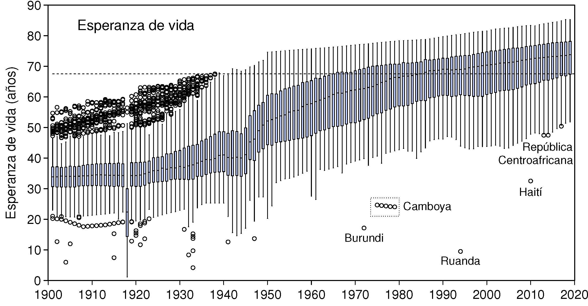{#fig-evoBoxplotEspVida .fig-normal_0308 fig-align="center"}

```{=html}
<div id="tbl-ProsCons" class="tabla-wrapper34">
<table class="tabla-ProsCons">

<caption>Tabla 3.7: Boxplots estratificados por periodo de tiempo. Pros y contras</caption>

  <colgroup>
    <col style="width: 10%;">
    <col style="width: 90%;">
  </colgroup>
  <tbody>
  
    <tr style="border-top: 1px solid #dee2e6; border-bottom: 1px solid #dee2e6;">
      <!-- ✅ PRIMERA CELDA -->
      <td style="padding: 8px 0px 8px 0px; vertical-align: top; text-align: center;">
      <!-- top right bottom left -->
        <div style="display: flex; flex-direction: column; align-items: center; gap: 12px;">
          <strong>PROS</strong>
          <span class="fa-solid fa-thumbs-up fa-xl" style="color: #0ca701;"></span>
        </div>
      </td>

      <!-- ✅ SEGUNDA CELDA -->
      <td style="padding: 12px 15px 8px 0px; vertical-align: top;">
        <ul style="margin: 0; padding-left: 18px; line-height: 1.2;">
          <li>Permite analizar la evolución global de muchas variables.</li>
          <li>Si se dispone de muchas medidas en cada unidad de tiempo permiten visualizar su variabilidad de forma compacta.</li>
        </ul>
      </td>
    </tr>

    <tr style="border-top: 1px solid #dee2e6; border-bottom: 1px solid #dee2e6;">
      <!-- ✅ PRIMERA CELDA -->
      <td style="padding: 3px 0px 12px 0px; vertical-align: top; text-align: center;">
        <div style="display: flex; flex-direction: column; align-items: center; gap: 12px;">
          <strong>CONS</strong>
          <span class="fa-solid fa-thumbs-down fa-xl" style="color: #f03333; "></span>
        </div>
      </td>
      
       <!-- ✅ SEGUNDA CELDA -->
      <td style="padding: 18px 15px 15px 0px; vertical-align: top;">
        <ul style="margin: 0; padding-left: 18px; line-height: 1.2;">
          <li>Interpretación menos intuitiva que los gráficos en serie de tiempo.</li>
        </ul>
      </td>
    </tr>
  </tbody>
</table>
</div>
```
### Evolución de datos económicos {.unnumbered}

El análisis de la evolución de variables en el ámbito de la economía requiere prestar atención a aspectos como los que a continuación se comentan.

#### Inflación {.unnumbered}

Cuando la magnitud representada se mide en dinero, hay que estar atentos a si los valores se presentan tal cual (valores corrientes) o si se han corregido con la inflación (valores constantes), ya que las conclusiones pueden ser muy distintas. Supongamos que en un país los salarios se han duplicado en los últimos 10 años, pasando de 100 a 200, siguiendo la evolución que se muestra en la [@fig-salariosInflacion] (izquierda). A la vista de los datos y de lo empinada que es la tendencia, parece que los trabajadores de este país son unos afortunados.

Incluso si nos dicen que la tasa de inflación durante ese periodo ha sido del 15% anual, parece que las cosas han ido bien, a fin de cuentas, los salarios no han subido el 15% sino el 100%. Pero al hacer las cuentas el panorama cambia. El aumento de los precios se acumula anualmente y si en el año 1 eran igual a 100, el año 2 serán igual a 115 (=100·1,15), el año 3 tendremos 132,5 (=115·1,15), el año 7 ya habrán superado el valor de 200 y el año 10 estarán en 351,79. Es decir, lo que hace 10 años se compraba con un salario ahora se compra con tres y medio. Así pues, las cosas no van tan bien para los trabajadores de ese país.

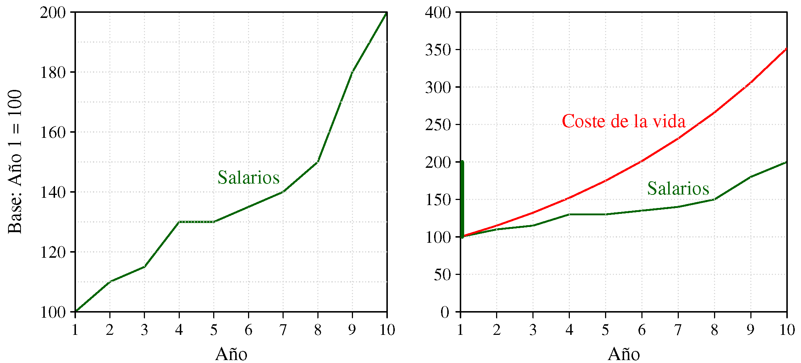{#fig-salariosInflacion .fig-normal_0309 fig-align="center"}

Que el coste de la vida aumente por encima de los salarios significa que el poder adquisitivo disminuye. Si en el año 1 el salario daba para comprar todo lo necesario, en el año 2 ya no llegará, porque aunque se cobre 110, lo que antes se compraba por 100 ahora costará 115 y ya no da para todo sino solo para el 95,7%. En el año 3 se cobra 115 y los precios ya van por 132,25 (solo podremos comprar el 87%), hasta el año 10, en que cobramos 200 pero lo necesario está ya en 351,8, con lo que apenas llegaremos al 57%. La situación queda resumida en la tabla y el gráfico de la [@fig-salariosPoderAdq].

```{=html}
<div class="tabla-wrapper_T0310">
<div style="display: flex; gap: 0rem; align-items: center;">

  <!-- TABLA -->
  <div style="flex: 0.9;">
    <!-- <table style="border-collapse: collapse; width: 100%; text-align: center;"> -->
    <table class="tabla-0310">

<colgroup>
  <col style="width: 16%;">
  <col style="width: 26%;">
  <col style="width: 26%;">
  <col style="width: 32%;">
</colgroup>
  
  <thead>
<tr>
  <th>Día</th>
  <th>Precios</th>
  <th>Salarios</th>
  <th>Poder adquisitivo</th>
</tr>
  </thead>
  <tbody>
<tr><td>1</td><td>100,0</td><td>100</td><td>100</td></tr>
<tr><td>2</td><td>115,0</td><td>110</td><td>95,7</td></tr>
<tr><td>3</td><td>132,3</td><td>115</td><td>87,0</td></tr>
<tr><td>4</td><td>152,1</td><td>130</td><td>85,5</td></tr>
<tr><td>5</td><td>174,9</td><td>130</td><td>74,3</td></tr>
<tr><td>6</td><td>201,1</td><td>135</td><td>67,1</td></tr>
<tr><td>7</td><td>231,3</td><td>140</td><td>60,5</td></tr>
<tr><td>8</td><td>266,0</td><td>150</td><td>56,4</td></tr>
<tr><td>9</td><td>305,9</td><td>180</td><td>58,8</td></tr>
<tr><td>10</td><td>351,8</td><td>200</td><td>56,9</td></tr>
  </tbody>
</table>
  </div>

  <!-- IMAGEN -->
  <div style="flex: 1; text-align: center;">
    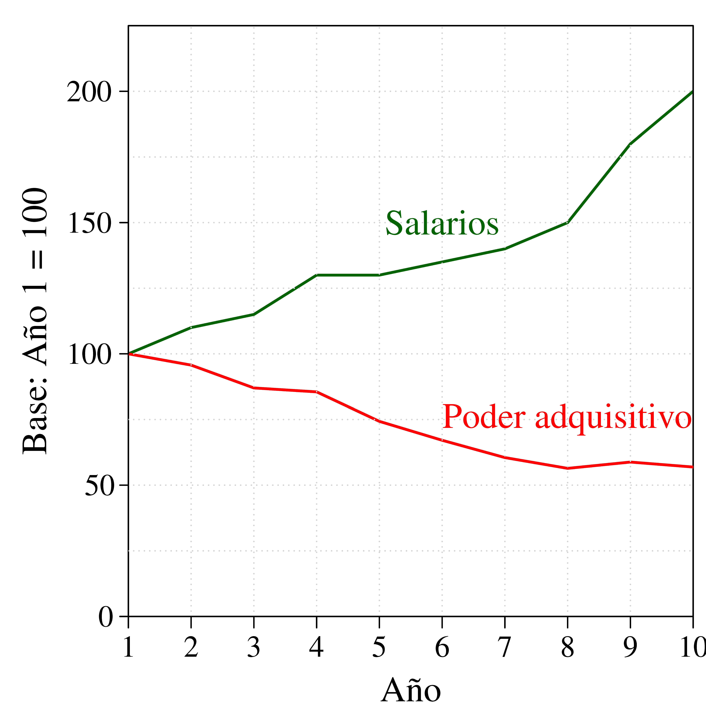
  </div>
</div>
</div>
```
{#fig-salariosPoderAdq .fig-normal_0310_Fantasma fig-align="center"}

#### Valores que presentan estacionalidad {.unnumbered}

Muchas variables que se utilizan para valorar la marcha de la economía presentan estacionalidad, es decir, no se comportan de manera uniforme a lo largo del año, sino que en determinados periodos tienden a subir y en otros a bajar. En España el número de parados suele bajar en diciembre y volver a subir a principios de año. Esto provoca que --aunque interesa que el número de parados sea el menor posible-- la bajada en un mes pueda ser peor noticia que la subida en otro mes. Si normalmente un mes baja en 200.000 y este año solo ha bajado 100.000, las cosas están yendo mal, mientras que si normalmente sube 100.000 y este año solo ha subido 20.000, las cosas van mejor.

A fin de poder valorar mejor la evolución de la variable considerada, es preferible que el eje horizontal solo incluya los 12 meses de un año y se representen por separado las líneas correspondientes a cada uno de los años considerados, como en la parte derecha de la [@fig-salariosPoderAdq][^03_graficos-3], sale distinto. La razón es que Minitab asigna los valores frontera al extremo inferior.

[^03_graficos-3]: <small>Datos: [Servicio Público de Empleo Estatal (España)](https://www.sepe.es/HomeSepe/que-es-el-sepe/estadisticas/empleo.html).</small>

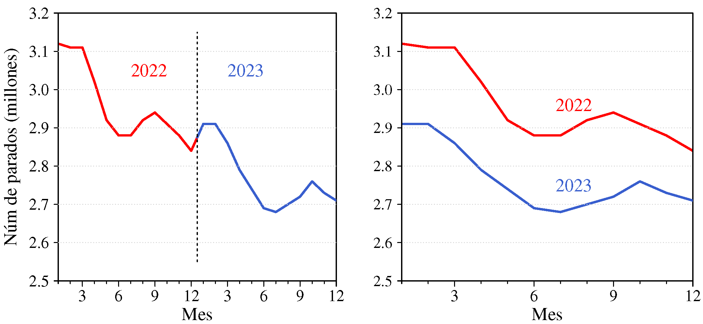{#fig-paro .fig-normal_0311 fig-align="center"}

#### ¿Valores absolutos o porcentajes? {.unnumbered}

En algunos casos lo relevante es el porcentaje de cambio y no su valor absoluto. Si se compara la rentabilidad de dos acciones, una que el año pasado valía 5 y este año vale 10, con otra que valía 50 y ahora vale 55, si representamos el cambio colocando los valores en el eje vertical parece que las dos acciones han subido lo mismo, pero el que compró la primera ha ganado el 100% (ha doblado su valor) mientras que el que compró la segunda solo ha ganado el 10%. Como esto es lo que realmente interesa, es mejor usar porcentajes en el eje vertical, como en la figura de la derecha.

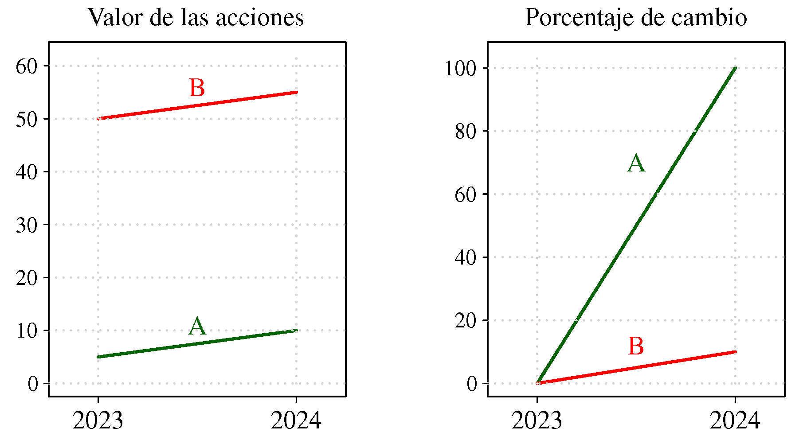{#fig-valorAcciones .fig-normal_0312 fig-align="center"}

## Relación entre variables

Para estudiar la relación entre dos variables cuantitativas, lo habitual --y también lo más sencillo-- es utilizar un diagrama bivariante.

Conviene tener presente que el hecho de que dos variables muestren una estrecha relación entre ellas no implica que exista entre ellas una relación de causa-efecto: es decir, que cambiar el valor de una no necesariamente provoca un cambio en el valor de la otra. Puede existir una tercera variable relacionada con esas dos que al cambiar provoque cambios en las que observamos, sin que exista ninguna relación directa entre ellas. Un ejemplo muy típico es el de los daños que causa un incendio y el número de bomberos que acuden a apagarlo. Se observa en los datos estadísticos que, cuantos más bomberos acuden, mayores son los daños ocasionados, pero a nadie se le ocurre mandar menos bomberos para que los daños sean menores. En este caso, la variable relacionada con las que observamos es --obviamente-- la magnitud del incendio.

### Diagrama bivariante {.unnumbered}

La figura [@fig-espeVida_RentaPC] muestra la relación entre la esperanza de vida y la renta per cápita de la mayoría de países en 2019 (datos: [Gapminder](https://www.gapminder.org/data)). No se han incluido los que tienen menos de 100.000 habitantes, ya que algunos (como Mónaco) tienen rentas muy altas y obligan a utilizar una escala en la que los puntos que interesa observar quedan amontonados.

Utilizando puntos de distinto color se identifica a qué continente pertenece cada país. África tiene la renta y la esperanza de vida más bajas. Además de observar la tendencia general, conocida como curva de Preston[^03_graficos-4], también tienen interés los puntos singulares, es decir, los países que tienen una esperanza de vida singularmente alta o baja en relación con su renta, sobre el diagrama se indican los nombres de algunos de estos países.

[^03_graficos-4]: <small>Puede consultar la Wikipedia, con mayor detalle en inglés.</small>

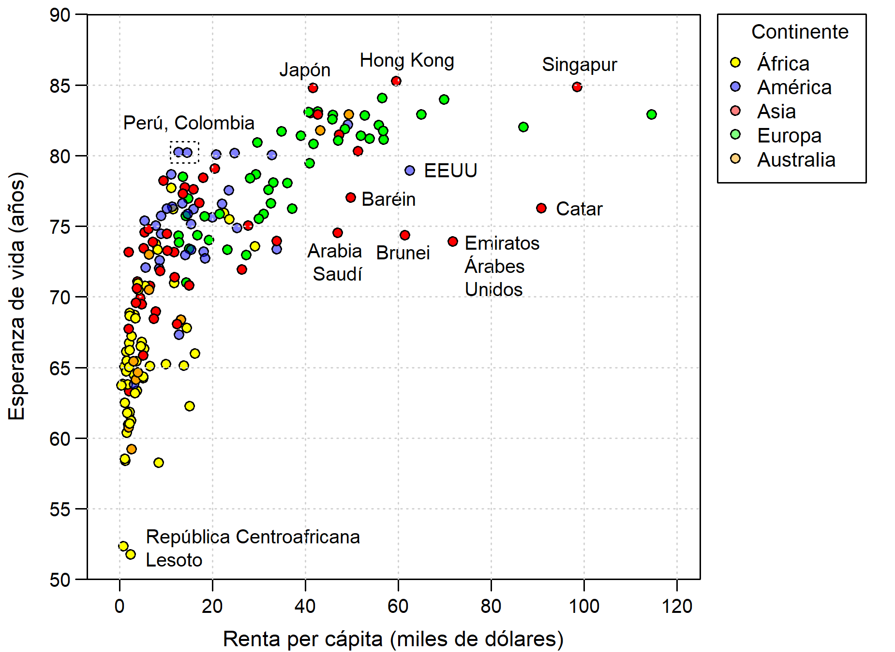{#fig-espeVida_RentaPC .fig-normal_0313 fig-align="center"}

Recuerde que cuando analizamos una variable, debe estar muy claro a qué nos estamos refiriendo. Los gráficos que incluye [Gapminder](https://www.gapminder.org/data) informan con todo detalle sobre el significado de las variables que se incluyen, en particular, de los criterios usados para calcular la renta per cápita[^03_graficos-5]

[^03_graficos-5]: <small>Valores de la renta per cápita ajustados de acuerdo con las diferencias de poder adquisitivo, en dólares USA y con los precios basados en su Índice de Precios al Consumo de 2017. [Más detalles](https://www.gapminder.org/data/documentation/gd001)</small>

::: callout-note
## Otros nombres para el diagrama bivariante

También se conoce como diagrama de correlación o diagrama de dispersión.
:::

En un diagrama bivariante podemos hacer que el tamaño de los puntos esté relacionado con el valor de una nueva variable, dando lugar al llamado *diagrama de burbujas*. En la [@fig-espeVida_RentaPC_mortInf] el tamaño de los puntos está relacionado con la tasa de mortalidad infantil. Se observa que los países con baja esperanza de vida y también baja renta son los que tienen una mayor mortalidad infantil, y que estos países se encuentran básicamente en el continente africano.

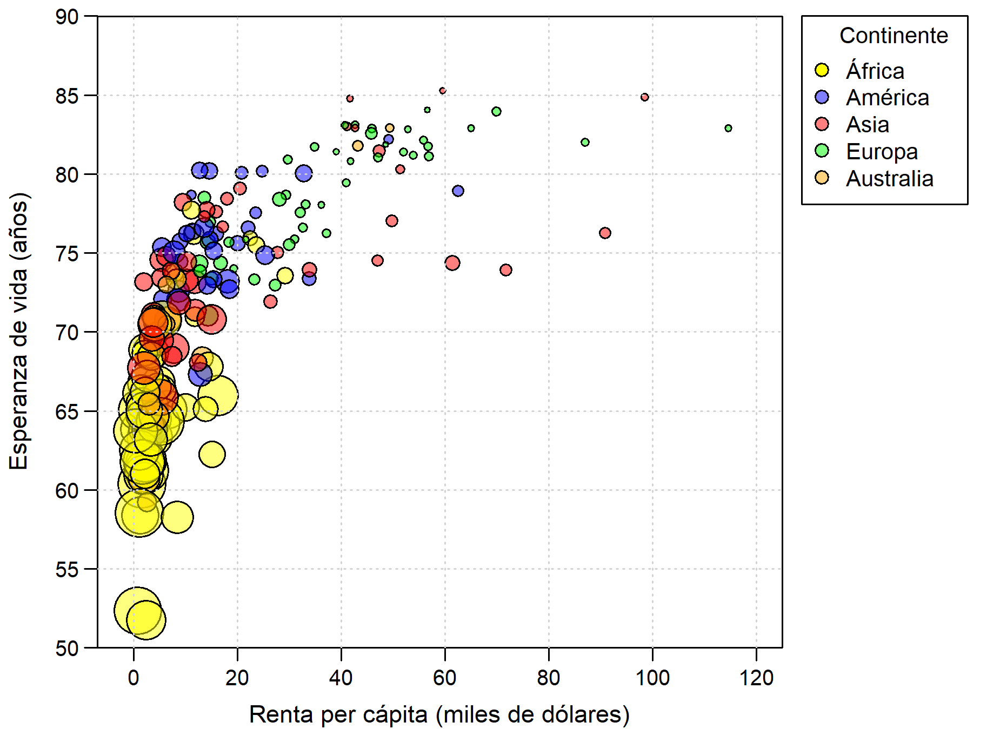{#fig-espeVida_RentaPC_mortInf .fig-normal_0314 fig-align="center"}

::: callout-note
## Cada variable tiene su eje

En el eje horizontal ($x$) colocamos la variable que viene dada y en el vertical ($y$), aquella cuya relación con la primera queremos analizar. No al revés. Para ver si el peso de las personas está relacionado con su estatura, colocamos la estatura en el eje horizontal y el peso en el vertical. La estatura viene dada; si alguien considera que pesa mucho en relación con su estatura, no se plantea crecer, sino perder peso.
:::

```{=html}
<div id="tbl-ProsCons"; class="tabla-wrapper34">
<table class="tabla-ProsCons">

<caption>Tabla 3.8: Diagramas bivariantes. Pros y contras</caption>

  <colgroup>
    <col style="width: 10%;">
    <col style="width: 90%;">
  </colgroup>
  <tbody>
  
    <tr style="border-top: 1px solid #dee2e6; border-bottom: 1px solid #dee2e6;">
      <!-- ✅ PRIMERA CELDA -->
      <td style="padding: 18px 0px 8px 0px; vertical-align: top; text-align: center;">
      <!-- top right bottom left -->
        <div style="display: flex; flex-direction: column; align-items: center; gap: 12px;">
          <strong>PROS</strong>
          <span class="fa-solid fa-thumbs-up fa-xl" style="color: #0ca701;"></span>
        </div>
      </td>

      <!-- ✅ SEGUNDA CELDA -->
      <td style="padding: 12px 15px 8px 0px; vertical-align: top;">
        <ul style="margin: 0; padding-left: 18px; line-height: 1.2;">
          <li>La forma más sencilla de analizar la relación entre dos variables cuantitativas.</li>
          <li>Permite la estratificación usando distintos tipos de punto. Se puede añadir una tercera variable relacionada con el tamaño de los puntos.</li>
        </ul>
      </td>
    </tr>

    <tr style="border-top: 1px solid #dee2e6; border-bottom: 1px solid #dee2e6;">
      <!-- ✅ PRIMERA CELDA -->
      <td style="padding: 8px 0px 12px 0px; vertical-align: top; text-align: center;">
        <div style="display: flex; flex-direction: column; align-items: center; gap: 12px;">
          <strong>CONS</strong>
          <span class="fa-solid fa-thumbs-down fa-xl" style="color: #f03333; "></span>
        </div>
      </td>
      
       <!-- ✅ SEGUNDA CELDA -->
      <td style="padding: 12px 15px 15px 0px; vertical-align: top;">
        <ul style="margin: 0; padding-left: 18px; line-height: 1.2;">
          <li>Cuando se analizan grandes volúmenes de datos puede aparecer una gran mancha de puntos que hace imposible su interpretación.</li>
        </ul>
      </td>
    </tr>
  </tbody>
</table>
</div>
```
### Gráficos 3D para tres variables {.unnumbered}

En general, existen mejores alternativas que usar tres dimensiones para mostrar la relación entre tres variables. La [@fig-Gini_rentaPC_EspVida] representa la esperanza de vida frente al índice de Gini (una medida de desigualdad en la distribución de la riqueza), y la renta per cápita. Aunque los paquetes de software estadístico permiten mover el cubo para buscar la perspectiva más adecuada, no suele ser fácil apreciar de un vistazo las relaciones que existen.

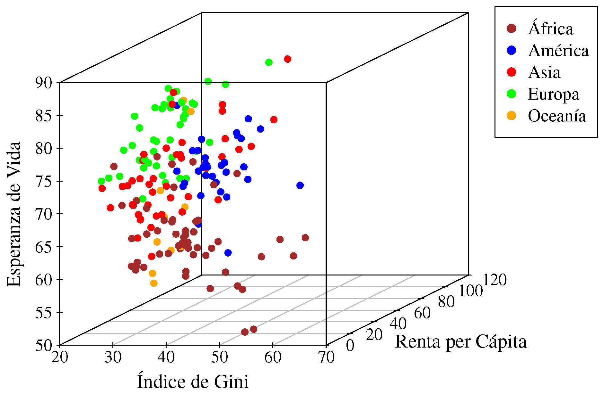{#fig-Gini_rentaPC_EspVida .fig-normal_0315 fig-align="center"}

En la [@fig-Graf2D_Gini_rentaPC_EspVida] se pierde la información sobre el continente al que pertenece cada país, pero se observa con mayor claridad que los valores elevados del índice de Gini están asociados a rentas per cápita bajas —aunque seguramente habrá superricos— y a una menor esperanza de vida.

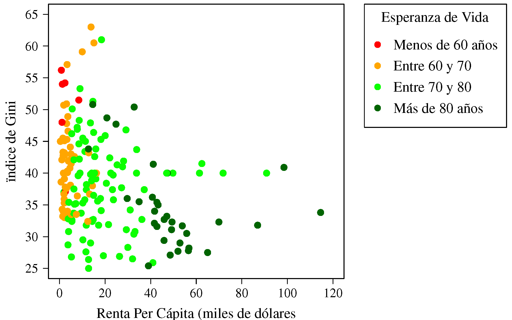{#fig-Graf2D_Gini_rentaPC_EspVida .fig-normal_0316 fig-align="center"}

No hay que dejarse deslumbrar por gráficos que son muy vistosos pero que no transmiten de forma clara la información que contienen los datos.

```{=html}
<div id="tbl-ProsCons"; class="tabla-wrapper34">
<table class="tabla-ProsCons">

<caption>Tabla 3.9: Diagramas 3D. Pros y contras.</caption>

  <colgroup>
    <col style="width: 10%;">
    <col style="width: 90%;">
  </colgroup>
  <tbody>
  
    <tr style="border-top: 1px solid #dee2e6; border-bottom: 1px solid #dee2e6;">
      <!-- ✅ PRIMERA CELDA -->
      <td style="padding: 8px 0px 8px 0px; vertical-align: top; text-align: center;">
      <!-- top right bottom left -->
        <div style="display: flex; flex-direction: column; align-items: center; gap: 12px;">
          <strong>PROS</strong>
          <span class="fa-solid fa-thumbs-up fa-xl" style="color: #0ca701;"></span>
        </div>
      </td>

      <!-- ✅ SEGUNDA CELDA -->
      <td style="padding: 12px 15px 8px 0px; vertical-align: top;">
        <ul style="margin: 0; padding-left: 18px; line-height: 1.2;">
          <li>Pueden ser útiles para una primera exploración de los datos, especialmente cuando se pueden manejar de forma interactiva.</li>
        </ul>
      </td>
    </tr>

    <tr style="border-top: 1px solid #dee2e6; border-bottom: 1px solid #dee2e6;">
      <!-- ✅ PRIMERA CELDA -->
      <td style="padding: 12px 0px 12px 0px; vertical-align: top; text-align: center;">
        <div style="display: flex; flex-direction: column; align-items: center; gap: 12px;">
          <strong>CONS</strong>
          <span class="fa-solid fa-thumbs-down fa-xl" style="color: #f03333; "></span>
        </div>
      </td>
      
       <!-- ✅ SEGUNDA CELDA -->
      <td style="padding: 8px 15px 8px 0px; vertical-align: top;">
        <ul style="margin: 0; padding-left: 18px; line-height: 1.2;">
          <li>No son fáciles de interpretar cuando no hay posibilidad de interacción.</li>
          <li>En general existen otras opciones que muestran la información de forma más clara.</li>
        </ul>
      </td>
    </tr>
  </tbody>
</table>
</div>
```
## Importancia de cada parte

La forma habitual de representar tablas de frecuencias es usar diagramas de barras, con distintas opciones de estratificación. También se utilizan otros gráficos como los diagramas de pastel, aunque con este estilo nosotros preferimos los de tipo *dónut*. Los paquetes de software también presentan otras posibilidades.

### Diagrama de barrras {.unnumbered}

La [@fig-diagramaBarras] utiliza un diagrama de barras para mostrar el número de países que hay en cada continente. A la derecha, cada barra se ha estratificado según el cuartil al que pertenece cada país según su renta per cápita. Se observa que la mayoría de países situados en el primer cuartil (el 25% que tiene menor renta) están en África.

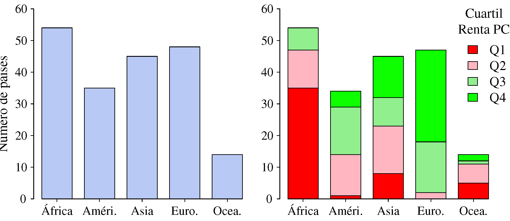{#fig-diagramaBarras .fig-normal_0317 fig-align="center"}

### Gráficos de pastel, y de dónut {.unnumbered}

Otra forma de representar el tamaño de cada una de las partes son los gráficos de pastel (también se usan otros nombres[^03_graficos-6], como el de la izquierda de la [@fig-donutPiePoblacion], donde se representa la población en cada uno de los cinco continentes. Este tipo de diagrama nunca ha tenido mucho predicamento en el ámbito científico-técnico, donde en general se prefieren los diagramas de barras, aunque sí es utilizado en economía y gestión de empresas. Últimamente se está viendo desplazado por el llamado gráfico de dónut (seguimos en la pastelería), en el que la información se ve más clara y se ahorra tinta [@fig-donutPiePoblacion] derecha).

[^03_graficos-6]: <small>Otras denominaciones habituales son: diagrama circular, gráfico de sectores, diagrama de tarta o diagrama de quesitos.</small>

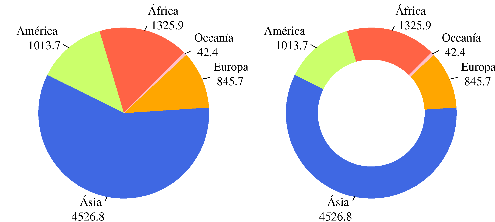{#fig-donutPiePoblacion .fig-normal_0318 fig-align="center"}

::: callout-note
## Diagrama de Florence Nightingale

Florence Nightingale fue una pionera en la recolección y el análisis de datos para mejorar la toma de decisiones en el ámbito sanitario. Utilizaba una representación gráfica que recuerda al diagrama de pastel, pero que en realidad es un histograma ordenado cronológicamente de forma circular[^03_graficos-7].
:::

[^03_graficos-7]: <small>Información detallada en la Wikipedia, buscar: Florence Nightingale.</small>

```{=html}
<div id="tbl-ProsCons"; class="tabla-wrapper34">
<table class="tabla-ProsCons">

<caption>Tabla 3.10: Diagramas de pastel o de dónut. Pros y contras.</caption>

  <colgroup>
    <col style="width: 10%;">
    <col style="width: 90%;">
  </colgroup>
  <tbody>
  
    <tr style="border-top: 1px solid #dee2e6; border-bottom: 1px solid #dee2e6;">
      <!-- ✅ PRIMERA CELDA -->
      <td style="padding: 8px 0px 8px 0px; vertical-align: top; text-align: center;">
      <!-- top right bottom left -->
        <div style="display: flex; flex-direction: column; align-items: center; gap: 12px;">
          <strong>PROS</strong>
          <span class="fa-solid fa-thumbs-up fa-xl" style="color: #0ca701;"></span>
        </div>
      </td>

      <!-- ✅ SEGUNDA CELDA -->
      <td style="padding: 12px 15px 8px 0px; vertical-align: top;">
        <ul style="margin: 0; padding-left: 18px; line-height: 1.2;">
          <li>Representación sencilla e intuitiva de las partes de un total.</li>
          <li>Construcción con paquetes de software de fácil acceso.</li>
        </ul>
      </td>
    </tr>

    <tr style="border-top: 1px solid #dee2e6; border-bottom: 1px solid #dee2e6;">
      <!-- ✅ PRIMERA CELDA -->
      <td style="padding: 12px 0px 12px 0px; vertical-align: top; text-align: center;">
        <div style="display: flex; flex-direction: column; align-items: center; gap: 12px;">
          <strong>CONS</strong>
          <span class="fa-solid fa-thumbs-down fa-xl" style="color: #f03333; "></span>
        </div>
      </td>
      
       <!-- ✅ SEGUNDA CELDA -->
      <td style="padding: 8px 15px 8px 0px; vertical-align: top;">
        <ul style="margin: 0; padding-left: 18px; line-height: 1.2;">
          <li>No deben usarse cuando se tienen muchas partes, ya que cuesta identificar lo que representa cada una.</li>
          <li>Su utilidad es dudosa cuando solo se tienen dos partes ya que un solo número (un porcentaje) da la misma información.</li>
        </ul>
      </td>
    </tr>
  </tbody>
</table>
</div>
```
### Otros gráficos {.unnumbered}

Muchos paquetes de software estadístico permiten el uso de nuevas formas de representación gráfica de los datos, como el diagrama de rectángulos de la [@fig-rectPropor]. A la vista de este gráfico, es interesante observar las enormes diferencias que existen en el número de habitantes de cada país. Realizando algunas sencillas operaciones con la tabla de valores se observa que entre China e India tienen tantos habitantes como los 182 países con menor población (de Vietnam en adelante). Los seis países más poblados (China, India, EE.UU., Indonesia, Pakistán y Brasil) concentran el 50% de la población mundial. Los seis menos poblados (Liechtenstein, Mónaco, San Marino, Palau, Nauru y Tuvalu, los tres primeros europeos y los otros tres de Oceanía) suman unos 150.000 habitantes y apenas representan el 0,00145% de la población mundial.

Estos resultados no son ninguna novedad, pero verlos de forma explícita invita a reflexionar sobre la pertinencia de usar el país como unidad de análisis para comparar indicadores de bienestar y desarrollo. En China o en la India caben casi 30 Colombias u otras tantas Españas.

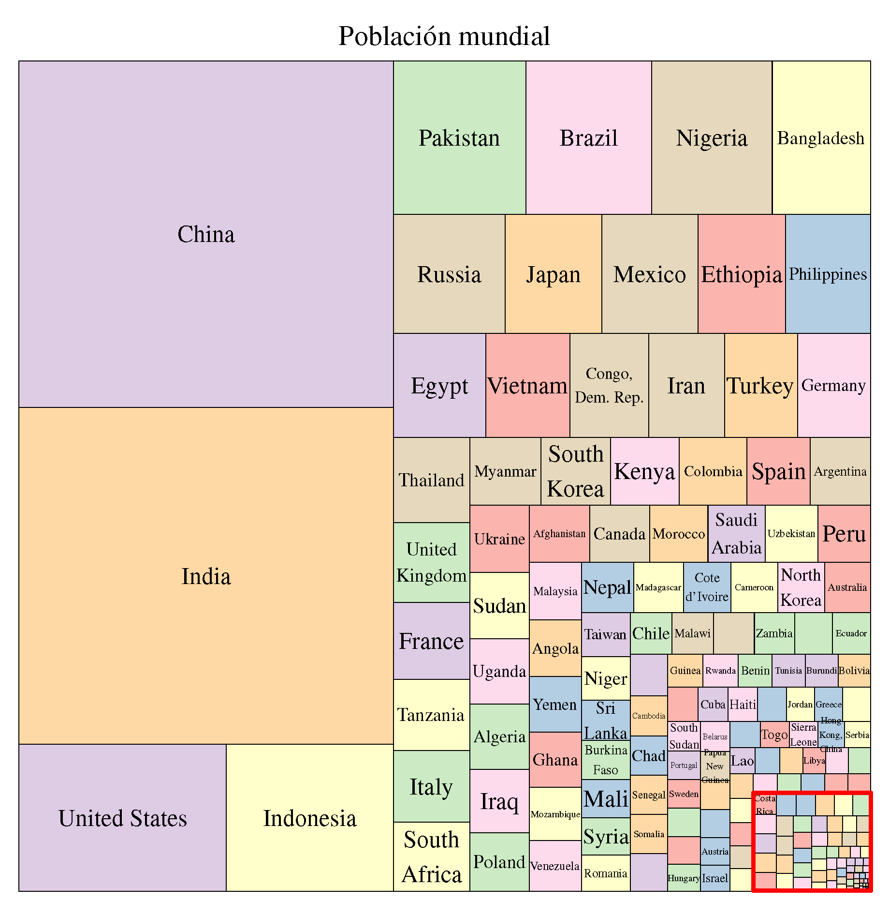{#fig-rectPropor .fig-normal_0319 fig-align="center"}

::: callout-note
## Ranking de medallas en los juegos olímpicos

No parece muy razonable que el ranking de medallas obtenidas en los Juegos Olímpicos se presente usando el país como unidad de comparación, colocando al mismo nivel a países como EE.UU. y a Dominica[^03_graficos-8].
:::

[^03_graficos-8]: <small>Aunque en los Juegos de París 2024, Dominica, un país con 71.500 habitantes, obtuvo una medalla de oro, y Santa Lucía, con 178.500, obtuvo una de oro y otra de plata. China debería haber obtenido casi 20.000 medallas de oro para igualar a Dominica en número de medallas por habitante.</small>

Cuando se trata de representar la distribución geográfica de un valor, lo más claro suele ser hacerlo sobre el mapa adecuado. La [@fig-mapaMundi_MortInf] muestra el intervalo en que se encuentra el índice de mortalidad infantil en cada país. Hay que tener en cuenta que en casos como este la impresión que se da puede variar dependiendo de la forma en que se elijan los intervalos.

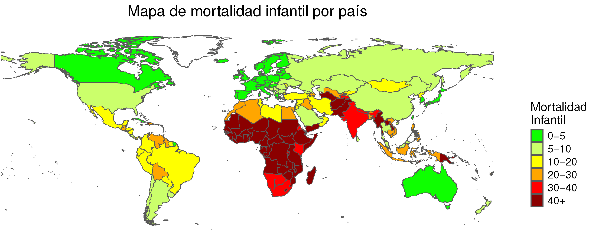{#fig-mapaMundi_MortInf .fig-normal_0320 fig-align="center"}

## Gráficos que conviene evitar

Puede ser discutible cuál es la mejor forma de representar unos datos, pero siempre hay que evitar los gráficos con adornos innecesarios que dificultan su interpretación y --por supuesto-- los que transmiten información falsa o tendenciosa.

### Gráficos con tres dimensiones {.unnumbered}

Si de lo que se trata es de transmitir la información de forma clara --otra cosa es querer impresionar con gráficos "artísticos"--, los gráficos con tres dimensiones son siempre una mala opción. Enredan el gráfico al incluir aspectos irrelevantes que dificultan la transmisión de la información de forma rápida y directa. En la [@fig-graficos3D] queda claro que se lee mejor y más rápido cuando se construyen sin esa tercera dimensión.

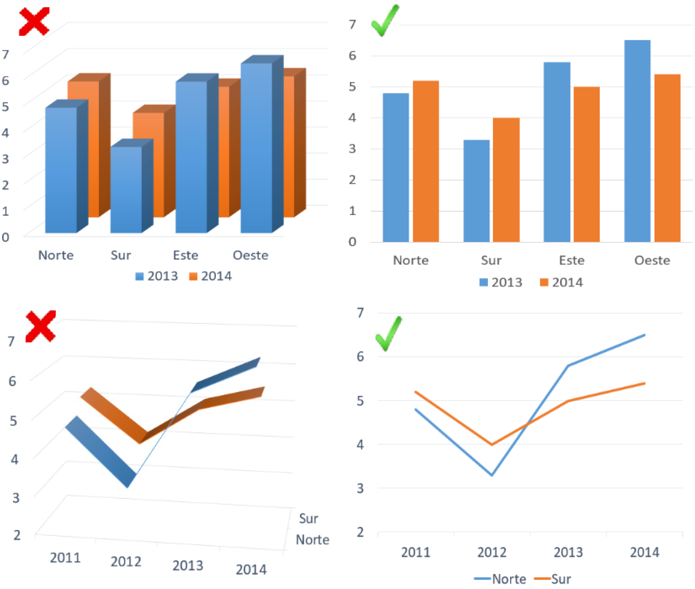{#fig-graficos3D .fig-normal_0321 fig-align="center"}

En los gráficos de pastel, especialmente cuando para destacar un sector se desgaja del resto, el problema no es que sean más difíciles de interpretar, sino que pueden dar a entender una situación que es falsa. En la figura [@fig-pastel3D] en el gráfico 3D parece que el sector Sanidad es el más importante, cuando basta mirar los números para darse cuenta de que no lo es.

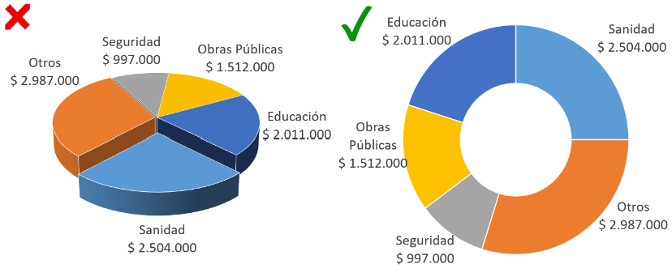{#fig-pastel3D .fig-normal_0322 fig-align="center"}

### Comparar gráficos construidos con diferentes escalas {.unnumbered}

Recordemos el caso de la panadería y supongamos que se dispone de una tercera máquina de la que también se han recogido datos, como en las otras dos. El histograma de estos datos está en la [@fig-distintasEscala], junto al que ya vimos de la máquina 1. ¿Qué puede decirse de la producción de la máquina 3?

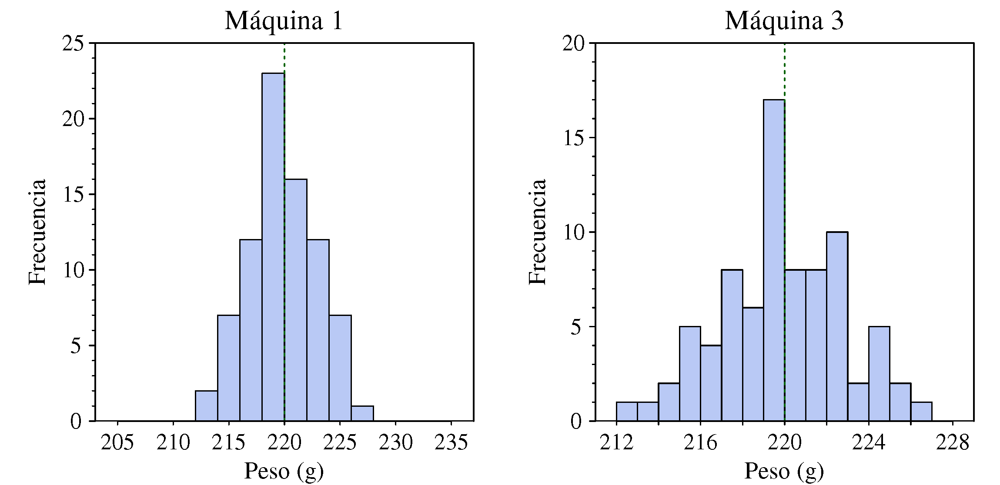{#fig-distintasEscala .fig-normal_0323 fig-align="center"}

Si está pensando que produce con más variabilidad, ha caído en la trampa. Los dos histogramas se han construido con los mismos datos, el diferente aspecto es debido a que la escala del eje horizontal es distinta. Moraleja: cuando se construyen histogramas --o gráficos en general-- para comparar distintas situaciones, es imprescindible que las escalas sean iguales, tal como hemos hecho en la [@fig-histoPanaderia], de lo contrario vamos a confundir a nuestros lectores o incluso nos vamos a engañar nosotros mismos. Esta tarea no la hacen los paquetes de software, que adaptan la escala a la variabilidad de los datos. Es necesario acceder a las opciones y fijar los valores que nos conviene. Si la magnitud representada tiene unas tolerancias, incluirlas en el gráfico, junto con el valor objetivo en el centro de la escala, también ayuda a la interpretación.

### Gráficos que destacan falsas tendencias {.unnumbered}

A veces nos encontramos con un diagrama bivariante en el que la nube de puntos no muestra ninguna relación entre las variables, pero incluye algunos puntos alejados de esa nube. Si se ajusta una recta de regresión, esos puntos singulares pueden influir mucho en su pendiente, sugiriendo la presencia de una relación que en realidad no existe.

La [@fig-rectaTendencia] (izquierda) muestra una situación de este tipo, con tres puntos alejados del resto e incluyendo la recta de regresión ajustada. Esta recta puede dar la sensación de que al aumentar el valor de $X$ también tiende a aumentar el de $Y$, pero esta tendencia viene determinada por los puntos singulares, que quizá son errores o corresponden a circunstancias excepcionales que no forman parte del marco que se está estudiando. Si observamos la zona donde se encuentra la mayoría de puntos (figura de la derecha) constatamos que no existe ninguna relación y, por tanto, la recta de tendencia da una información engañosa.

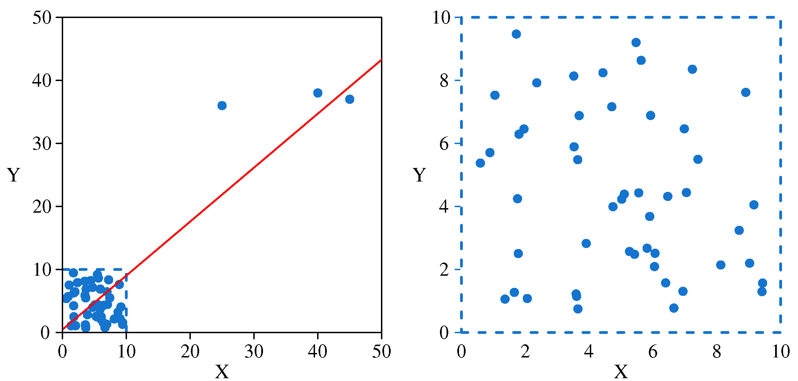{#fig-rectaTendencia .fig-normal_0324 fig-align="center"}

### Pictogramas que exageran las diferencias {.unnumbered}

Recurrir a imágenes para representar cantidades --los llamados "pictogramas"-- puede ser visualmente atractivo pero dar una visión deformada de la información que se quiere transmitir.

Para poner de manifiesto que el precio de la vivienda se ha triplicado en los últimos años podemos representar ese incremento dibujando dos casas, la segunda con el triple de altura que la primera. El problema radica en que si se mantienen las proporciones, la segunda tendrá el triple de altura, pero nueve veces la superficie de la primera, y la sensación que se transmite es que la segunda casa (el segundo precio) es nueve veces mayor que la primera ([@fig-casaConRayas]).

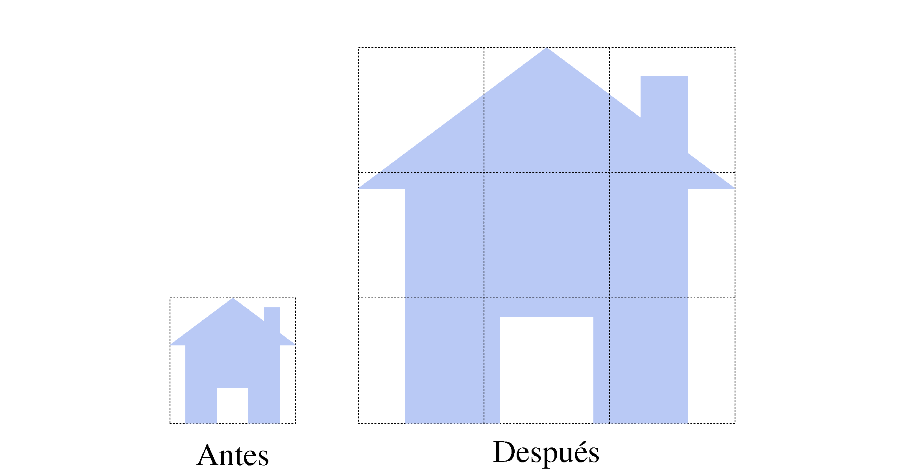{#fig-casaConRayas .fig-normal_0325 fig-align="center"}

Si se utilizan círculos para representar cantidades, lo proporcional a la cantidad debe ser el área, no el diámetro. Si las cantidades a representar son proporcionales a 1, 3 y 5, los diámetros deben serlo a 1, $\sqrt{3}$ y $\sqrt{5}$.

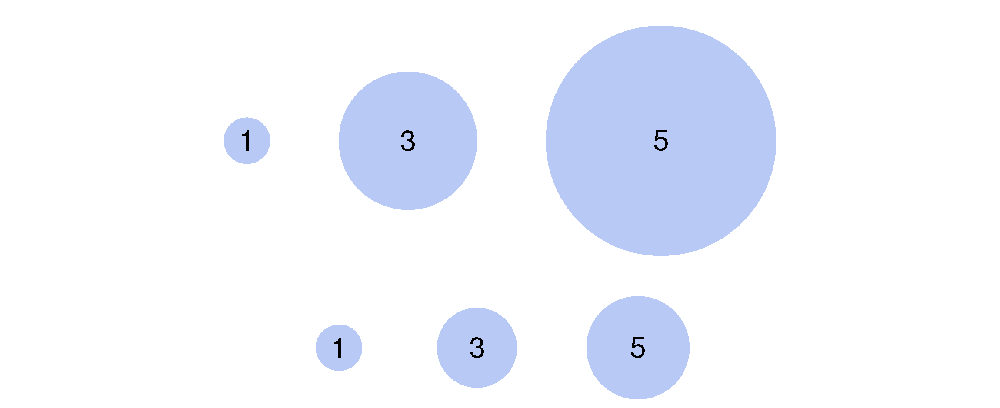{#fig-circulo .fig-normal_0326 fig-align="center"}

## Dar gato por liebre usando gráficos

A veces la información estadística puede ser poco fiable, no porque se digan mentiras --que a veces también, pero ese no es nuestro tema--, sino porque nos presentan los datos de una manera interesada, más orientada a defender un punto de vista o un interés concreto que a reflejar la realidad de forma objetiva. En este terreno de la transmisión de información interesada, los gráficos tienen un papel protagonista.

Naturalmente, una misma información se puede dar de muchas maneras, con gráficos y sin ellos. Es normal que si se tiene interés en dar una cierta impresión se elija la forma que más convenga. Si en una tienda de ropa tienen una prenda barata y pasada de moda, la pueden anunciar con esas palabras o diciendo que es clásica y económica. Algo parecido ocurre con los gráficos, depende de como se construyan pueden dar una impresión u otra. Conocer los trucos y argucias más habituales nos sirve para valorar mejor su calidad y honradez.

### Representar la variable que más conviene {.unnumbered}

Si las exportaciones de enero a junio se han ido reduciendo, de manera que en junio son solo la mitad que en enero, podemos representar los datos con el gráfico de la izquierda de la [@fig-exportaciones] o con el de la derecha, en el que se han usado los mismos datos, pero representando los valores acumulados. Si usted es el responsable de las ventas y presenta el primer gráfico va a dar muy mala impresión pero, sin decir mentiras, puede presentar el segundo y, con un poco de suerte, un buen discurso y pasando rápido sobre los detalles, quizá pase desapercibido.

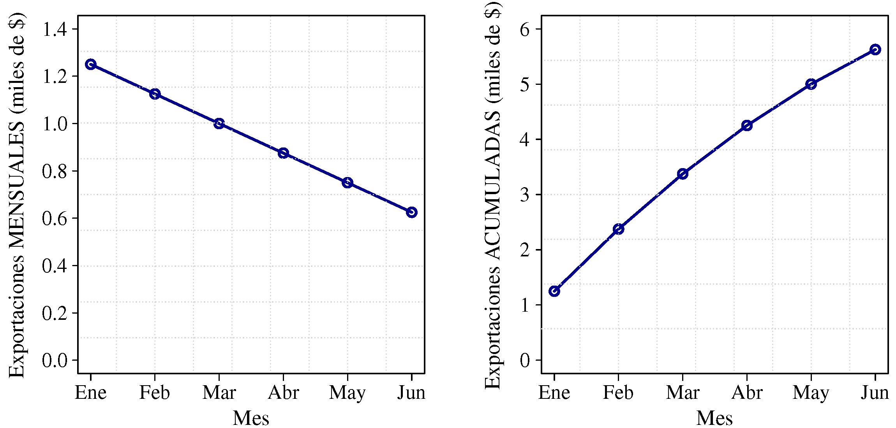{#fig-exportaciones .fig-normal_0327 fig-align="center"}

### Gráficos con escalas inapropiadas {.unnumbered}

#### Diagramas de barras {.unnumbered}

Jugar con la escala vertical en los diagramas de barras es el recurso más habitual para exagerar la diferencia entre grupos. La [@fig-escalaBarra] (izquierda) está inspirada en el gráfico que apareció en un anuncio en el que la cadena de televisión TV4 presumía de tener más audiencia que sus competidoras. Efectivamente, los datos indican que ha tenido un mayor porcentaje de audiencia, pero las diferencias son muy pequeñas --aproximadamente un punto porcentual-- y probablemente quedan dentro del margen de error en este tipo de estimaciones. Sin embargo, la impresión que da a primera vista --que es como seguramente se miran los gráficos en los anuncios-- es que las diferencias son importantes, y todavía se podría exagerar más haciendo partir la escala de 17,5. En el gráfico de la derecha la escala parte de cero, que es lo correcto en este tipo de gráficos, y las diferencias apenas se notan, que es lo que ocurre en realidad.

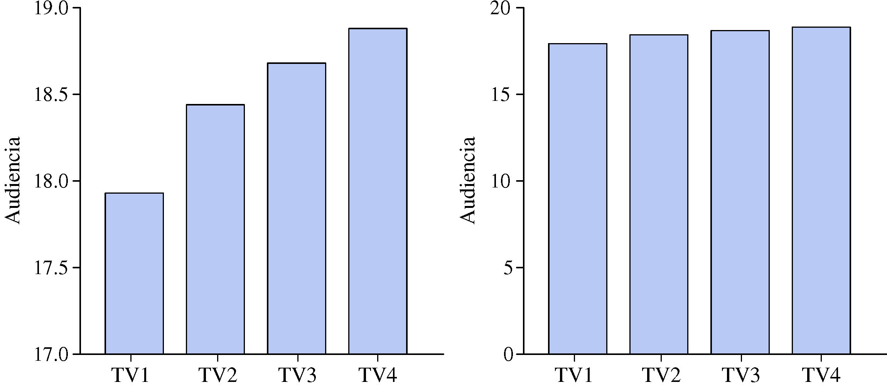{#fig-escalaBarra .fig-normal_0328 fig-align="center"}

#### Gráficos de serie temporal {.unnumbered}

En los gráficos de serie temporal las reglas son otras. No conviene que la escala vertical vaya del valor mínimo al máximo, como en la [@fig-escalaLineas] (izquierda), porque se exageran las diferencias, pero tampoco conviene partir siempre de cero, porque dependiendo de la magnitud representada, los cambios pueden ser relevantes y apenas notarse (derecha). Una interesante guía de estilo de *The Wall Street Journal*[^03_graficos-9] recomienda que el rango de variación de los datos ocupe aproximadamente dos tercios de la escala vertical, tal como hemos realizado en el gráfico de la [@fig-escalaLineas2]. Además, si lo que interesa es la variación más que los valores absolutos, es recomendable representar los porcentajes.

[^03_graficos-9]: <small>Dona M. Wong (2010): "The Wall Street Journal. Guide to Information Graphics".</small>

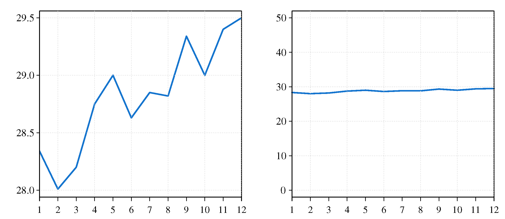{#fig-escalaLineas .fig-normal_0329 fig-align="center"}

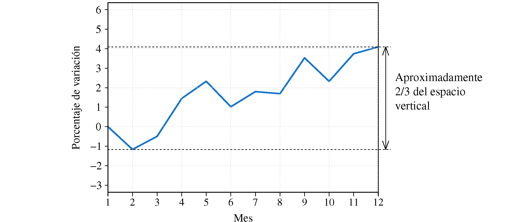{#fig-escalaLineas2 .fig-normal_0330 fig-align="center"}

### Buenas y malas artes en la construcción de gráficos {.unnumbered}

Un clásico sobre cómo dar información interesada usando la estadística es el libro de Darrell Huff: *How to Lie with Statistics*, escrito en 1954 con toques de humor que lo hacen muy ameno y que todavía mantiene interés y actualidad. Existen también libros específicos sobre cómo manipular gráficos, como el de Gerald E. Jones: *How to Lie with Charts*, pero lo fundamental está en el de Huff. El libro de Alberto Cairo: *How Charts Lie* es una exposición muy seria, completa y bien documentada sobre cómo detectar manipulaciones y malos usos de los gráficos.

Un libro que nos parece excelente y que ya hemos citado es la guía de *The Wall Street Journal*, especialmente para representaciones gráficas en el ámbito de la economía . El texto de Cole N. Knaflic: *Storytelling with Data* contiene muchas ideas interesantes y muy bien expuestas sobre como presentar los gráficos de manera que sean más claros e informativos.

::: callout-note
## No todo es manipulación

Dar demasiado protagonismo a la búsqueda de pifias o malos usos de la estadística puede fomentar una imagen frívola de nuestra disciplina, que poco o nada tiene que ver con el método científico. Justo lo contrario de lo que pretendemos. La mayoría de los gráficos que se publican en la prensa seria son correctos y están bien pensados. En la prensa sensacionalista y en la publicidad, la calidad de los gráficos seguramente es similar a la del resto de material publicado.
:::

## Apéndice 3.A: Software para representaciones gráficas y análisis estadísticos {.unnumbered}

Casi todos los gráficos que aparecen en este libro --y en particular los de este capítulo, excepto los de las [@fig-graficos3D] y [-@fig-pastel3D]-- se han realizado con el software estadístico R, un lenguaje de programación gratuito y de código abierto muy utilizado en el ámbito académico. Tiene una versión base que se puede completar con una gran variedad de paquetes para realizar casi cualquier tipo de análisis o representación gráfica. El problema es que familiarizarse con él y usarlo con agilidad exige un tiempo de aprendizaje que no lo hace recomendable para cursos generales de introducción a la estadística. Además, si no se práctica se olvida rápido, por lo que el esfuerzo inicial resulta un esfuerzo poco productivo.

En esta línea de los lenguajes de programación, una alternativa a R es Python. Es una mejor opción para aprender a programar --o para tener un primer contacto con la programación-- y también permite realizar análisis estadísticos[^03_graficos-10]. Puede ser especialmente interesante en cursos impartidos en grados del ámbito de la ciencia o la tecnología en los que la programación con Python forma parte del plan de estudios.

[^03_graficos-10]: <small>Especialmente cuando es completado con el paquete [Pandas](https://pandas.pydata.org).</small>

Otra opción son los paquetes de software que utilizan el lenguaje y los algoritmos de R añadiendo una presentación con menús, de forma que el proceso de aprendizaje es muy corto y toda la energía se puede dedicar al análisis de los datos. De este tipo tenemos, entre otros[^03_graficos-11]:

[^03_graficos-11]: <small>Una revisión y comparación de los más conocidos se encuentra [aquí](https://r4stats.com/articles/software-reviews).</small>

-   **BlueSky Statistics:** Tiene muchas posibilidades de análisis gráfico e incluye una gran variedad de técnicas estadísticas. Tiene un aspecto muy profesional, con una versión gratuita (más que suficiente para los objetivos de un curso introductorio) y también una versión de pago, con más servicios, para empresas.

-   **Jamovi:** Es el que más nos gusta para un curso introductorio. Limpio y claro, prácticamente no necesita explicación. Permite realizar las representaciones gráficas más habituales y aplicar las técnicas de análisis que se incluyen en los primeros cursos. Presenta la peculiaridad de que se pueden añadir "paquetes" desarrollados por otras personas --igual que en R-- lo que puede darle mucho recorrido ([@fig-CapturaJamovi]).

-   **JASP:** Es intuitivo y fácil de usar. Vale la pena tenerlo en cuenta. Con muchas posibilidades de análisis --incluyendo estadística bayesiana-- que van más allá de los contenidos de un curso introductorio.

-   **R Commander:** Ha sido durante muchos años la interfaz utilizada para facilitar el uso de R en cursos introductorios. Se ha convertido en un estándar, pero creemos que ahora existen mejores alternativas.

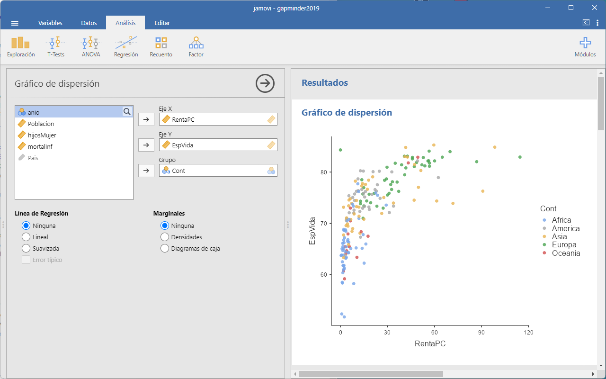{#fig-CapturaJamovi .fig-normal_0331 fig-align="center"}

Las hojas de cálculo son otra opción que suele estar muy a mano. A veces desdeñadas en ámbitos científicos aunque con gran protagonismo en las áreas de economía y gestión. Suelen ser imbatibles para ordenar, seleccionar y filtrar datos, y como casi nunca los tenemos con la estructura adecuada para su análisis, son un buen recurso para facilitar este trabajo previo. Por otra parte, las tablas dinámicas permiten explorar y resumir fácilmente grandes volúmenes de datos, que también se pueden representar gráficamente.

La [@fig-CapturaHCGoogle] muestra un gráfico de burbujas construido con Google Sheets. En cualquier caso, dedicar tiempo a familiarizarse con las hojas de cálculo seguro que es un tiempo bien invertido puesto que están presentes en muchos ámbitos de la vida profesional e incluso personal.

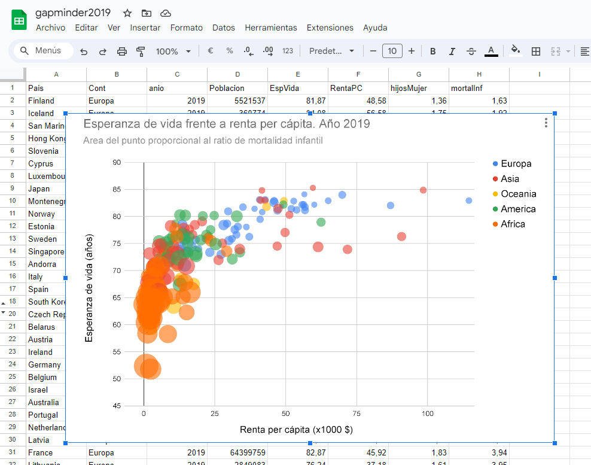{#fig-CapturaHCGoogle .fig-normal_0332 fig-align="center"}

Finalmente, tenemos los paquetes de software comerciales. Algunos, también muy completos e intuitivos, ofrecen condiciones ventajosas para su uso en ámbitos académicos.

## Apéndice 3.B: Cuadros de mando {.unnumbered}

Presentan la información obtenida de bases de datos mediante gráficos y valores clave dispuestos de manera que se visualicen integramente en la pantalla.

Es un instrumento pensado para que los directivos y técnicos puedan seguir la marcha de su empresa con información relevante, veraz y actualizada para tomar en cada caso las decisiones que convenga. Naturalmente, también es útil para seguir la marcha de cualquier proceso u organización, en particular puede ser una herramienta interesante para seguir la evolución de los estudiantes en un centro docente[^03_graficos-12].

[^03_graficos-12]: <small>Puede ver un ejemplo [aquí](https://upcommons.upc.edu/handle/2117/356194) (en catalán)</small>}.

Los gráficos que utiliza pueden ser de cualquier tipo, incluyendo mapas. Los indicadores clave, también llamados KPI (de las siglas en inglés de *Key Performance Indicator*), se presentan de forma destacada. Tanto los gráficos como los indicadores pueden ser interactivos, mostrando valores globales que se pueden segmentar según interese (siempre que esté previsto, por supuesto).

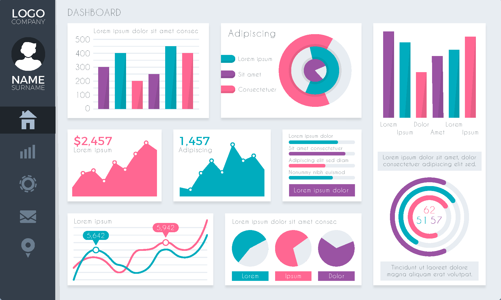{#fig-dashboard .fig-normal_0333 fig-align="center"}

Se pueden construir cuadros de mando con una hoja de cálculo o también usando R con algunos complementos, pero seguramente la mejor opción es usar un paquete de software especializado para esta tarea como *Power BI*. Este paquete es gratuito si los datos de que se alimenta están en el mismo ordenador donde se ha instalado el programa. Esto es útil para aprender su manejo e incluso para usarlo en pequeñas organizaciones. Las grandes empresas tienen sus datos centralizados y para acceder a ellos hay que usar la versión de pago. Si se tiene interés existen tutoriales fáciles de seguir para empezar a usarlo en un tiempo relativamente breve.

En cualquier caso, lo importante no es tanto el software como la identificación de la información clave que debe ser visualizada y cuál es la mejor forma de hacerlo (gráfico, indicador, mapa...). Emprender la tarea de construir un cuadro de mando para monitorizar la marcha de un proceso muchas veces permite descubrir que los datos almacenados no tienen la estructura --y quizá tampoco la calidad-- necesarias para extraer la información que interesa. Tomar conciencia de la importancia de la calidad de los datos y de que estén dispuestos de manera que sea posible obtener la información necesaria, puede ser una de las aportaciones más importantes de esta nueva herramienta.
