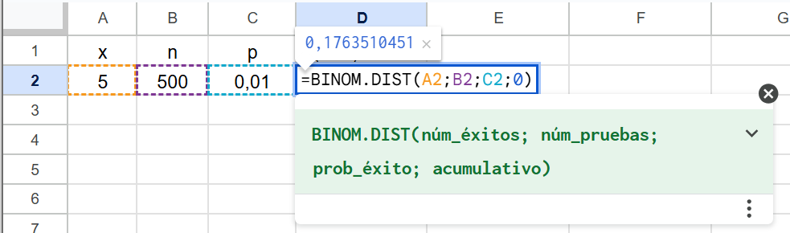
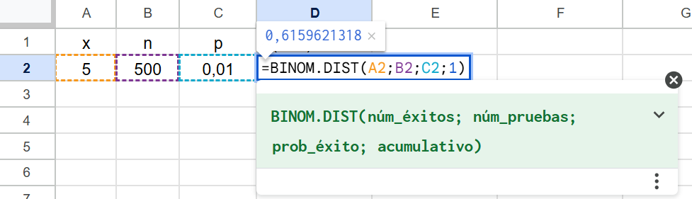
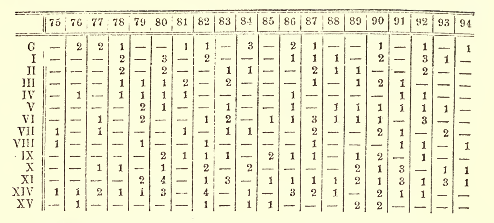
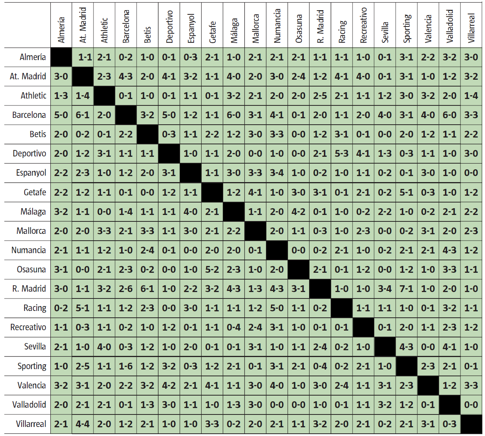

# Distribuciones de probabilidad

Puede parecer que si el valor de una variable depende del azar ya no hay nada más que decir de ella, puesto que azar suena a impredecible, a lotería. Pero esto no es así, el azar se puede clasificar en familias y cada una tiene un patrón de comportamiento específico, aunque, también en este caso, las grandes familias están emparentadas entre ellas. 

Los que no entendemos de carpintería decimos que un mueble es de madera sin entrar en más consideraciones, pero el carpintero sabe que hay maderas de muchos tipos --caras y baratas, con unas propiedades u otras-- y que no todas sirven para todo. Los que nos dedicamos a la estadística no hace falta que sepamos de maderas, pero sí debemos conocer las clases de azar. Si la variable que nos ocupa pertenece a una de las familias conocidas, podemos aplicar sus propiedades sin tener que deducirlas y todo se hace mucho más fácil. Claro que no hablamos de familias, sino de **distribuciones de probabilidad** o de distribuciones sin más.

No se trata de ir haciendo pruebas para ver qué distribución encaja mejor con nuestros datos (si se tienen pocos, encajarán casi todas). Hay que basarse en las características de esos datos y en la forma en que se han obtenido para identificar a qué distribución pertenecen. 

En este capítulo veremos algunas de las distribuciones de uso más frecuente: la equiprobable, la binomial y la de Poisson entre las discretas, y la uniforme y la Normal entre las continuas. Existen otras distribuciones que sonarán a los que alguna vez han estudiado estadística: la $t$-Student, la Chi-cuadrado o la $F$ de Snedecor, pero estas no describen la variabilidad que nos encontramos en los conteos o en las mediciones que realizamos. Son distribuciones instrumentales que se utilizan como referencia en los contrastes de hipótesis. También hablaremos de estas en un próximo capítulo.

## Distribución equiprobable (o uniforme discreta)

Es el caso más simple de variable aleatoria discreta. Puede tomar $n$ valores, todos ellos con la misma probabilidad, que --lógicamente-- será igual a $1/n$. Cuando lanzamos un dado, el resultado obtenido es un valor de una distribución equiprobable.

Existen conjuntos que se pueden considerar poblaciones numeradas, como los $n$ taxis de una ciudad identificados con un número de licencia que va de 1 a $n$. En este caso, una muestra de números de licencia se puede considerar obtenida de una distribución equiprobable. Veremos más adelante que, con los valores de muestras relativamente pequeñas, podemos estimar con mucha precisión el número de taxis que hay en una ciudad.

En estos casos en que la población está formada por números enteros correlativos del 1 al $n$, deducir el valor de la esperanza matemática es casi inmediato, el de la varianza es un poco más entretenido[^05-1]. Las expresiones que se obtienen son:
$$\mathrm{E}(X) = \frac{n+1}{2} \;\;\;\; \;\;\;\; \mathrm{V}(X) = \frac{n^2-1}{12}$$

[^05-1]: Para la expresión de $\mathrm{E}(X^2)$ hay que buscar la de la suma de los cuadrados de los $n$ primeros números naturales.
<span style="display:block; margin-bottom:-20px;"></span>
\begin{equation*}
	\begin{split}
			&\mathrm{E}(X) = 1 \cdot \frac{1}{n} + 2 \cdot \frac{1}{n} + \cdots + n \cdot \frac{1}{n} = \frac{1+2+ \cdots n}{n} = \frac{\frac{n\cdot (n+1)}{2}}{n} = \frac{n+1}{2} \qquad \qquad\qquad\qquad\\[2pt]
			&\mathrm{V}(X) = \mathrm{E}[X- \mathrm{E}(X)]^2 = \mathrm{E}[X^2 - 2X\mathrm{E}(X)+ \mathrm{E}(X)^2 ] = \mathrm{E}(X^2)-\mathrm{E}(X)^2 \\[2pt]
			&\mathrm{E}(X^2) = 1^2 \cdot \frac{1}{n} + 2^2 \cdot \frac{1}{n} + \cdots + n^2 \cdot \frac{1}{n} = \frac{1^2+2^2+ \cdots n^2}{n} = \frac{\frac{2n^3 + 3n^2 +n}{6}}{n}\\[2pt]
			&\mathrm{V}(X) =  \frac{2n^3 + 3n^2 +n}{6n} - \frac{(n+1)^2}{4} = \frac{n^2-1}{12} \\
	\end{split}		
\end{equation*}.	

La suma de variables aleatorias equiprobables no es una variable de ese mismo tipo. La [@fig-sumaEqui] muestra la distribución del valor obtenido al lanzar un dado junto con la correspondiente a la suma de los valores obtenidos al lanzar ocho. En este último caso, el perfil del diagrama de barras seguro que le recuerda a una distribución muy conocida de la que hablaremos con detalle más adelante.
<span style="display:block; margin-bottom:-20px;"></span>

{#fig-sumaEqui .fig-normal3 fig-align="center" width="90%"}

Un último detalle. Los valores de la esperanza matemática y la varianza de la distribución de la suma se deducen fácilmente aplicando las reglas para operar con variables aleatorias. Sea $X$ el resultado de lanzar un dado y $X_8$ la suma del resultado obtenido al lanzar 8 dados. Tenemos:
<span style="display:block; margin-bottom:-5px;"></span>
  \begin{equation*}
 	\begin{split}
 		&\mathrm E(X) = \frac{n+1}{2} = 3.5; \; \qquad \; \mathrm V(X) = \frac{n^2+1}{12} = \frac{35}{12} \\[5pt]
 		&\mathrm E(X_8) = 8 \cdot E(X) = 28; \;\;\!  \quad \mathrm V(X_8) = 8 \cdot \mathrm V(X) = \frac{70}{3}\\[-1pt]
 	\end{split}		
 \end{equation*}
 
 
## Distribución binomial

Vamos a calcular la probabilidad de que, al lanzar cinco veces una moneda al aire, aparezcan --en cualquier orden-- dos caras y tres cruces. Sabemos que la probabilidad de que salga cara (C) es igual a la de que salga cruz (+) e igual a 0,5. La probabilidad de que en dos lanzamientos salga cara **y** cara es $0.5 \cdot 0.5$ (son sucesos independientes, aplicamos la regla de la  "**y**"). La probabilidad de tener la secuencia CC+++ es igual a $0.5^2 \cdot  0.5^3 $.

También podríamos escribir $0.5^5$ pero nos interesa separar las probabilidades de cada uno de los dos resultados posibles para que sea más fácil generalizar la expresión que vamos a obtener. Si planteamos dos secuencias, por ejemplo +C+C+ y C+C++ la probabilidad de obtener la primera **o** la segunda (no se pueden dar las dos a la vez, aplicamos la regla de la **o**) es igual a $0.5^2 \cdot  0.5^3 + 0.5^2 \cdot  0.5^3$.

Para calcular la probabilidad de obtener dos caras en cinco lanzamientos, habrá que sumar la probabilidad de que salgan esas dos caras en un orden concreto tantas veces como ordenaciones se pueden realizar con dos caras y tres cruces. Si los cinco resultados fueran distintos, el número de ordenaciones posibles sería igual a las permutaciones de 5 (5!), pero como hay tres repetidos por un lado (las tres cruces) y dos por otro (las dos caras) hay que dividir por las permutaciones de esos valores ya que esas no cuentan. Es un caso de permutaciones con repetición:
$$\mathrm P_5^{3,2}=\frac{5!}{2! \cdot 3!} = 10$$
Por tanto, la probabilidad de que salgan $X=2$ caras es igual a:
$$\mathrm P(X=2) = \frac{5!}{2! \cdot 3!} \; 0.5^2 \ 0.5^3 = 0,3125$$

¿Para qué sirve calcular esta probabilidad? A no ser que nos dediquemos a apostar sobre el resultado de lanzar monedas parece que sirve de poco, pero no es así. Esta situación se puede generalizar de la siguiente forma:

-   Realizamos $n$ ejecuciones independientes. Esto significa que el resultado de una ejecución no está afectado por el resultado de las anteriores. En nuestro caso, que salga cara o cruz no depende de lo que haya salido antes. 
	
-   Cada ejecución tiene solo dos resultados posibles, en nuestro caso son cara y cruz. En general, para entendernos, a esos dos resultados les llamaremos "éxito" y "fracaso".
	
-   La probabilidad de éxito es la misma en todos los experimentos. Si a esa probabilidad de éxito le llamamos $p$, la de fracaso --también constante-- será $1-p$.

Cuando se cumplen estas tres condiciones, decimos que la variable aleatoria "número de éxitos al realizar $n$ ejecuciones" sigue una **distribución binomial** y podemos calcular fácilmente la probabilidad asociada a cada uno de los valores que puede tomar usando la fórmula que hemos deducido en el ejemplo de las monedas. Generalizando para $n$ ejecuciones, $x$ éxitos y una probabilidad de éxito igual a $p$ tenemos:
$$\mathrm P(X=x) = \frac{n!}{x! \cdot (n-x)!} \; p^x \ (1-p)^{(n-x)}$$ 
Ahora es fácil calcular las probabilidades de obtener $x$ caras al realizar, por ejemplo, $n=10$ lanzamientos. Son las que se indican en la [Tabla 5.1](#tbl-caraCruz)[^05-2].

[^05-2]: Por ejemplo, $\mathrm P(X=3) = \displaystyle\frac{10{!}}{7{!}\,3{!}}0.5^3 \cdot 0.5^7$ = 0,117.

<!-- comentario vacío -->

```{=html}
<div id="tbl-caraCruz" class="tabla-wrapper42b">

  <div class="tabla-caption">
    Tabla 5.1: Probabilidad de que aparezca el número de caras que se indica al lanzar 10 veces una moneda al aire.
  </div>

  <table class="tabla-0501">
<colgroup>
  <col style="width: 20%;">
  <col style="width: 20%;">
</colgroup>
<thead>
  <tr>
    <th>Núm. de caras</th>
    <th>Probabilidad</th>
  </tr>
</thead>
<tbody>
  <tr> <td>0</td> <td>0,001</td> </tr>
  <tr> <td>1</td> <td>0,010</td> </tr>
  <tr> <td>2</td> <td>0,044</td> </tr>
  <tr> <td>3</td> <td>0,117</td> </tr>
  <tr> <td>4</td> <td>0,205</td> </tr>
  <tr> <td>5</td> <td>0,246</td> </tr>
  <tr> <td>6</td> <td>0,205</td> </tr>
  <tr> <td>7</td> <td>0,117</td> </tr>
  <tr> <td>8</td> <td>0,044</td> </tr>
  <tr> <td>9</td> <td>0,010</td> </tr>
  <tr> <td>10</td> <td>0,001</td> </tr>
</tbody>
</table>
</div>
```

La [@fig-ejemplosDistBinomial] muestra distribuciones binomiales con los parámetros que se indican. Con $p=0.5$ la distribución siempre es simétrica respecto al valor medio de $X$. Se observa que --como era de esperar-- si $p < 0.5$ son más probables los valores bajos, y si $p>0.5$ son más probables los altos. Con $p=0.5$ si $n=10$ la probabilidad $ \mathrm P(X=0)$ (por ejemplo: probabilidad de cero caras al lanzar 10 veces una moneda) es muy pequeña, pero se nota en la representación gráfica. Con $n=50$ y manteniendo $p=0.5$ esa probabilidad es prácticamente nula. En esto la intuición no falla.

{#fig-ejemplosDistBinomial .fig-normal3 fig-align="center" width="90%"}

Ejemplos de variables aleatorias que siguen una distribución binomial son:

-   Número de piezas defectuosas en un lote de $n$ unidades, con una probabilidad $p$ de
	que una pieza sea defectuosa.
	
-   Número de ventas si se realizan $n$ acciones comerciales, con una probabilidad de
	éxito (de cada acción) igual a $p$.
	
-   Número de hijos varones si, en total (hombres + mujeres), se tienen $n$. En este caso $p$
	= 0,5.
	
-   Número de transacciones bancarias erróneas si se realizan $n$ y la probabilidad de que una sea
	errónea es $p$.
	
-   Número de enfermos que se curan de un conjunto de $n$ que han seguido un tratamiento
	que cura a una proporción $p$ de los enfermos que lo siguen.

Si un lote de 500 piezas ha sido fabricado con una máquina que produce --a largo plazo-- el 1% de unidades defectuosas (la probabilidad de que una unidad sea defectuosa es 0,01), quizá alguien estará tentado a decir que en ese lote habrá cinco piezas defectuosas, pero en realidad es imposible saber cuántas habrá. Lo que sí podemos hacer es calcular la probabilidad de que haya 0, 1, 2, 3,... Solo tenemos que aplicar la fórmula que acabamos de ver. Por ejemplo, la probabilidad de que haya exactamente cinco unidades defectuosas es:
$$ \mathrm P(X=5) = \frac{500!}{5! \cdot 495!} \; 0.01^5 \ 0.99^{495} = 0.1764$$
No intente calcular los factoriales que aparecen en la fórmula, debe simplificar antes de hacer los cálculos o, mejor, use una calculadora avanzada, aplicaciones en línea o una hoja de cálculo, como en la [@fig-binomialGoogle].

{#fig-binomialGoogle .fig-normal3 fig-align="center" width="80%"}

En muchos casos, el interés no está en la probabilidad de tener un número concreto, sino en la de tener ese valor como máximo. En nuestro ejemplo, la probabilidad de tener como máximo 5 defectos será:
$$\mathrm P(X \leq 5) = \sum_{i=0}^{5}\frac{500!}{i! \cdot (500-i)!} \; 0,01^i \ 0,99^{500-i} = 0.616$$

En estos casos, es obligado el uso de métodos de cálculo automáticos. Si usamos una hoja de cálculo hay que poner un 1 (o la palabra "VERDADERO") como último parámetro para obtener la probabilidad acumulada ([@fig-binomialGoogle_2]).

{#fig-binomialGoogle_2 .fig-normal3 fig-align="center" width="80%"}

Si lo que interesa es la probabilidad de que la variable tome valores mayores a uno determinado, lo podemos calcular a través del complementario. Así, en nuestro caso, la probabilidad de tener más de cinco defectos será:

$$\mathrm P(X > 5) = 1 - \mathrm P(X \leq 5) = 1-0.616 = 0.384 $$ 
Si lo que interesa es la probabilidad de tener cinco o más defectos, tendremos que calcular el complementario de cuatro o menos: 
$$ \mathrm P(X \geq 5) = 1 - \mathrm P(X \leq 4) = 0.4396$$
Ejemplos de cálculo de probabilidades para variables que siguen una distribución binomial son:

-   Probabilidad de que se realicen más de 25 ventas en 100 acciones comerciales, si la probabilidad de que una acción comercial derive en venta es del 25%: $\mathrm P(X>25; n=100; p=0.25) = 1 - \mathrm P(X \leq 25; n=100; p=0.25) = 0.4465$. Observe que el resultado no es igual al 50%.
	
-   Probabilidad de que, si se tienen cuatro hijos, dos sean niños y los otros dos sean niñas: $\mathrm P(X = 2; n=4; p=0.5) = 0.375$. Es más probable que no se produzca ese equilibrio en el reparto.
		
-   Si la probabilidad de que una transacción bancaria sea errónea es del 0,01% y un día se realizan 20.000, calcular la probabilidad de que alguna sea errónea. Se puede calcular considerando que nuestra variable sigue una distribución binomial: $1 - \mathrm P(X =0; n=20\,000; p=0.0001) = 0.8647$, o simplemente calculando: $1- 0.9999^{20\,000}=0.8647$ ($1 -$ todas buenas).
	
-    Si la probabilidad de que un enfermo que sigue un determinado tratamiento se cure es del 30 %, calcular la probabilidad de que, si lo siguen 10 enfermos, se curen más de la mitad. $\mathrm P(X > 5; n=10; p=0.3) = 1 - \mathrm P(X \leq 5; n=10; p=0.3) = 0.04735$.


Finalmente, si $X$ sigue una distribución binomial su valor esperado es $\mathrm E(X)=np$ y su varianza es $\mathrm V(X) = np(1-p)$. En el Apéndice 5.A encontrará la justificación.

### Aplicación de la distribución binomial: *Overbooking* ¿sale a cuenta? {.unnumbered}

Supongamos que para un vuelo que tiene 180 plazas se venden 182 billetes porque se sabe que el 2 % de los pasajeros no se presenta[^05-3].

[^05-3]: En rigor, debería decir: "la probabilidad de que un pasajero no se presente es del 2 %". ¿Cuál es la probabilidad de que todos los que se presenten tengan plaza?

Podemos modelizar esta situación como 182 experimentos independientes, cada uno con dos resultados posibles: "éxito" (no se presenta) y "fracaso" (se presenta), con probabilidades 0,02 y 0,98 respectivamente. 

La probabilidad que nos interesa es la de tener $X \geq 2$ "éxitos" al realizar $n=182$ experimentos con una probabilidad de éxito $p = 0.02$. Sabemos que ese número de éxitos sigue una distribución binomial, por tanto:
$$P(X \geq 2) = 1 - P(X \leq 1) = 1 - \text{B}(x=1; \; n=182; \; p=0,02)=0.8554$$
Si el precio del billete es de 500 \$ y el coste de la indemnización que se debe pagar a cada pasajero sin plaza es de 2.000 \$, se puede calcular la esperanza matemática del beneficio extra que produce vender dos billetes más que plazas disponibles.

Para ello construimos una tabla con los valores que puede tomar la variable aleatoria (número de pasajeros que no se presentan, $X$), junto con las probabilidades correspondientes. En este caso, consideramos que los valores que puede tomar $X$ son 0, 1 y 2 o más, puesto que el beneficio es siempre el mismo (igual a los ingresos de los billetes vendidos de más) cuando los que no se presentan son dos o más pasajeros.


```{=html}
<div id="tbl-Beneficio"; class="tabla-wrapper42">
<table class="tabla-0502">

<caption>Tabla 5.2: Valores para el cálculo de la esperanza matemática de beneficio.</caption>

<colgroup>
  <col style="width: 25%;">
  <col style="width: 33%;">
  <col style="width: 42%;">
</colgroup>
<thead>
  <tr>
    <th>Pasajeros que no se presentan (<em>X</em>)</th>
    <th>Beneficio extra</th>
    <th>Probabilidad <em>p</em></th>
  </tr>
</thead>
<tbody>
  <tr> <td>0</td> <td>2·500 - 2·2000 = -3000</td> <td>P(x = 0; n = 182; p = 0,02) = 0,025</td></tr>
  <tr> <td>1</td> <td>2·500 - 1·2000 = -1000</td> <td>P(x = 1; n = 182; p = 0,02) = 0,119</td></tr>
  <tr> <td>2 o más</td> <td>2·500 = 1000</td> <td>1 - P(X = 0) - (X = 1) = 0,855</td></tr>
</tbody>
</table>
</div>
```

<br>
Por tanto, a partir de los valores de la [Tabla 5.2](#tbl-Beneficio) la esperanza matemática del beneficio extra será:
$$\text{E}(B) = 0.025 \cdot (-3000) + 0,119 \cdot (-1000) + 0,855 \cdot 1000 = 660.24 \$ $$

También se puede determinar el número de billetes conviene vender para maximizar la esperanza matemática de beneficio extra. 

Calculando --tal como hemos visto-- esa esperanza matemática en función del número de billetes vendidos, se obtiene que si se venden 181 es de 448,36 \$, si se venden 183 es de 302,88 \$ y si se venden 184 ya resulta negativa. Con los valores supuestos conviene 182 billetes.

::: callout-note
## La realidad no es igual al modelo

Es una simplificación considerar que todos los pasajeros viajan de forma independiente (muchos lo hacen en pareja o en familia). Por otro lado, la probabilidad de que un pasajero no se presente es una estimación que puede ser más o menos aproximada. En cualquier caso, con los supuestos realizados se tiene una aproximación que puede ser útil a efectos prácticos.
:::

## Distribución de Poisson

Supongamos que una máquina funciona $n=28\,000$ segundos (algo menos de ocho horas) al día y que la probabilidad de que sufra una avería durante un segundo dado es  $p=0.0001$. El número de averías diarias que tendrá esa máquina es una variable aleatoria, $Y_1$,  con distribución binomial y con los valores de $n$ y $p$ indicados. 

Durante un segundo la probabilidad de avería es muy pequeña, pero como durante un día está funcionando muchos segundos la probabilidad de que se averíe alguna vez ya no lo es tanto. La esperanza matemática (valor medio) del número de averías diarias es $\mathrm E(Y_1) = np = 2.8$. La probabilidad de tener desde cero hasta seis averías se encuentra en la primera fila de la [Tabla 5.3](#tbl-binoPoisson).

Si tenemos otra máquina que solo funciona la mitad del tiempo, $n =14\,000$ segundos al día, pero su probabilidad de avería en cada segundo es el doble, $p = 0,0002$, el número de averías diarias será una nueva variable aleatoria, $Y_2$, obviamente también con distribución binomial aunque con distintos valores de los parámetros $n$ y $p$. Puede parecer que, como funciona menos tiempo, el número de averías será menor, pero como la probabilidad de avería es mayor, el resultados no está tan claro. En realidad, la esperanza matemática del número de averías diarias es exactamente la misma en los dos casos y la varianza también es prácticamente idéntica ($\mathrm V(Y_1) = 2,79972$ y $\mathrm V(Y_2) = 2,79944$). Además, las probabilidades asociadas a cada uno de los valores del número de averías diarias son casi las mismas (segunda fila de la [Tabla 5.3](#tbl-binoPoisson)). En realidad, las dos variables tienen un comportamiento prácticamente idéntico.

### La distribución de Poisson como límite de la binomial {.unnumbered}

\noindent Esta similitud entre ambas distribuciones se debe a que, cuando $n$ se hace muy grande y $p$ muy pequeña, la distribución binomial tiende a una nueva distribución que solo depende del producto $np$ y que llamamos **distribución de Poisson**. Esta nueva distribución queda definida con un solo parámetro, $\lambda = np$ y su función de probabilidad es:
$$\mathrm P(x) = \frac{e^{-\lambda}\lambda^x}{x!} $$

En los ejemplos que estamos considerando, $\lambda = 2.8$ y las probabilidades que se obtienen para el número de averías diarias se encuentran en la tercera fila de la [Tabla 5.3](#tbl-binoPoisson). Los valores son realmente muy parecidos a los obtenidos anteriormente.

```{=html}
<div id="tbl-binoPoisson" class="tabla-wrapper42">
<table class="tabla-0503">

<caption>Tabla 5.3: Probabilidad del número de averías según la distribución que se use.</caption>

<colgroup>
    <col style="width: 19.5%;">
    <col style="width: 10.5%;">
    <col style="width: 10.5%;">
    <col style="width: 10.5%;">
    <col style="width: 10.5%;">
    <col style="width: 10.5%;">
    <col style="width: 10.5%;">
    <col style="width: 10.5%;">
</colgroup>

<thead>
   <tr>
        <th rowspan="2"></th>
        <th colspan="7"> Probabilidad de un número de averías igual a:</th>
    </tr>
    <tr>  
        <th>0</th>
        <th>1</th>
        <th>2</th>
        <th>3</th>
        <th>4</th>
        <th>5</th>
        <th>6</th>
    </tr>
</thead>

<tbody>
  <tr>
    <td>Dist. binomial</td> <td></td> <td></td> <td></td> <td></td> <td></td> <td></td> <td></td>
  </tr>
  
  <tr>
    <td>n = 28.000 </td> 
    <td> 0,06080 </td>
    <td> 0,17026</td>
    <td> 0,23838</td>
    <td> 0,22250</td>
    <td> 0,15575</td>
    <td> 0,08721</td>
    <td> 0,04070</td>
	</tr>
	
	<tr>
    <td>p = 0,0001</td> <td></td> <td></td> <td></td> <td></td> <td></td> <td></td> <td></td>
	</tr>
	
	
  <tr>
    <td>Dist. binomial</td> <td></td> <td></td> <td></td> <td></td> <td></td> <td></td> <td></td>
  </tr>
  <tr>
    <td>n = 14.000 </td> 
    <td> 0,06079 </td> 
    <td> 0,17025 </td> 
    <td> 0,23839 </td> 
    <td> 0,22251 </td> 
    <td> 0,15575 </td> 
    <td> 0,08721 </td> 
    <td> 0,040969 </td>
	</tr>
	
	<tr>
    <td>p = 0,0002</td> <td></td> <td></td> <td></td> <td></td> <td></td> <td></td> <td></td>
	</tr>
	
	 <tr>
    <td>Dist. Poisson <br> &lambda; = 2,8</td>
    <td> 0,06081 </td>
    <td> 0,17027</td>
    <td> 0,23838</td>
    <td> 0,22248</td>
    <td> 0,15574</td>
    <td> 0,08721</td>
    <td> 0,04070</td>
	</tr>

 </tbody>

</table>
</div>
```

::: callout-note
## Número de decimales en las probabilidades

En la [Tabla 5.3](#tbl-binoPoisson) se dan las probabilidades con 5 decimales para mostrar las diferencias según la distribución que se use. En la práctica nunca interesan tantos decimales, y si interesaran tendríamos un problema. Estos valores se han calculado de acuerdo con un modelo teórico que seguramente no responde exactamente a lo que ocurre en la práctica, aunque los resultados pueden ser muy útiles para tomar decisiones.
:::

La distribución de Poisson es adecuada para evaluar la probabilidad de que se produzca un cierto número de ocurrencias en un intervalo de tiempo. Se supone que la probabilidad de ocurrencia por unidad de tiempo se mantiene estable y que la aparición de una ocurrencia no afecta a la probabilidad de aparición de la siguiente; pero, aunque no se cumplan exactamente estas condiciones (en la práctica seguramente no se cumplirán nunca) los resultados pueden ser suficientemente aproximados y útiles a efectos prácticos. Algunas variables que es razonable considerar que siguen una distribución de Poisson son:

-   El número de visitas diarias a una página web (con distinto valor medio para los días laborables y los festivos).

-   El número de averías anuales de un ascensor.

-   El número de accidentes de tráfico que se producen cada mes, o cada año, en una determinada zona.

-   El número de paradas por causas imprevistas en una línea de producción durante una semana.

Nos hemos referido a ocurrencias por unidad de tiempo, pero también pueden ser por unidad de longitud, de superficie o, incluso, de volumen. Por ejemplo:

-   Puntos de óxido que aparecen en un rollo de alambre, dado el número medio de puntos de óxido por unidad de longitud en rollos de ese tipo fabricados y/o almacenados en las mismas condiciones.

-   Número de manchas que aparecen en un rollo de papel, también dado el número medio de manchas por metro cuadrado en rollos similares.

-   Si un detergente está formado por bolas blancas --la mayoría-- y algunas azules, número de bolas azules que caen en un cazo de lavado si en promedio caen 10 bolas.

### Situaciones en que puede ser útil usar la distribución de Poisson {.unnumbered}

#### Sobre correos electrónicos (llegadas, visitas...) {.unnumbered}

Si usted recibe un promedio de 5 correos electrónicos cada día entre las 9 y las 10 de la mañana y hoy no ha recibido ninguno, ¿es razonable pensar que el correo está fallando? 

Considerando que el número de correos que se reciben a esa hora sigue una distribución de Poisson, podemos calcular que $\mathrm P(X=0; \lambda = 5) = 0.007$. Como es muy poco probable que no se haya recibido ninguno, mejor ver si está pasando algo.

#### Sobre averías, paradas, incidencias... {.unnumbered}

En los últimos años, un ascensor se ha averiado un promedio de 5 veces al año y reparar una avería cuesta 100 €. Nos ofrecen una tarifa plana de 600 € al año por atender todas las averías que se produzcan. ¿Cuál es la probabilidad de que el nuevo sistema salga más caro?

Considerando que el número de averías es una variable aleatoria con distribución de Poisson y que su valor medio se mantiene constante[^05-4], , las probabilidades son:

[^05-4]: No está claro que en la práctica esta sea siempre una hipótesis razonable. Quizá, con el paso del tiempo, tiende a tener más averías, o se realiza una revisión a fondo y pasa a tener menos. Si no está claro que las hipótesis se cumplan, seguramente es mejor tomar los resultados como valores orientativos.

-   5 averías o menos (perdemos dinero): 61,6 %

-   Exactamente 6 averías (ni ganamos ni perdemos): 14,6 %

-   Más de 6 averías (salimos ganando): 23,8 %

Es más probable que perdamos, pero eso ya lo sabíamos, porque si en promedio hay 5 averías, también tendremos un gasto medio de 500 €. En números redondos, la probabilidad de perder dinero es del 60 %. Quizá se puede compensar con alguna ventaja o preferencia en el servicio.

#### Sobre manchas, taras... {.unnumbered}

Supongamos que empieza a llover y usted tiene un libro de 17$\times$24 cm en una mesa que está en el exterior. Si han caído un promedio de 15 gotas por m<sup>2</sup>, ¿cuál es la probabilidad de que a su libro le haya caído alguna gota?

La superficie del libro es de 0,0408 m<sup>2</sup>. Si caen 15 gotas/m<sup>2</sup> caerán en promedio 0,612 gotas en esa superficie ($15 \cdot 0.0408$). La probabilidad de que no le haya caído ninguna gota es $\mathrm P(X=0; \lambda =0.612) = 0.5423$. La probabilidad que buscamos es $1-0.5423=0.4577$. En números redondos, el 50 %.

### Más ejemplos: De los muertos por coz de caballo en el ejercito prusiano a los goles en la liga española de fútbol {.unnumbered}

En 1898, el economista y estadístico ruso Ladislaus Bortkiewicz \index{Bortkiewicz, Ladislaus} publicó un libro[^05-5] mostrando que la distribución de Poisson puede ser usada para explicar la regularidad estadística que se aprecia en la ocurrencia de sucesos raros. Utilizó datos sobre suicidios y muertes accidentales en diversas circunstancias, pero su ejemplo más famoso es el del número de soldados muertos por coz de caballo en 14 regimientos del ejército prusiano durante un periodo de 20 años. La tabla de la [@fig-tablaCozCaballo] reproduce estos datos tal como aparecen en su libro.

[^05-5]: Se puede consultar [en línea](https://archive.org/details/dasgesetzderklei00bortrich).

{#fig-tablaCozCaballo .fig-normal3 fig-align="center" width="90%"}

En el regimiento G (primera fila) no murió nadie en el año 75 (1875), murieron dos soldados en el 76, otros dos en el 77, etc. El número total de soldados muertos es la suma de todos los valores que aparecen en la tabla y es igual a 196. Como hay 280 casillas (14 filas $\times$ 20 columnas) el número medio de soldados muertos por regimiento y año es de $196/280 = 0.7$.

Considerando que el valor en cada casilla (unidad en que se cuentan las ocurrencias) sigue una distribución de Poisson con media $\lambda = 0.7$, podemos calcular las probabilidades correspondientes a cada uno de los valores que pueden aparecer. La frecuencia teórica de aparición de cada uno de ellos es igual al número de oportunidades (número de casillas) por su probabilidad asociada. El resultado es realmente muy parecido a las frecuencias observadas ([Tabla 5.4](#tbl-tablaCozCaballo)).

```{=html}
<div id="tbl-tablaCozCaballo"; class="tabla-wrapper42">
<table class="tabla-0504">

<caption>Tabla 5.4: Frecuencias teóricas y reales del número de muertos por coz de caballo en el ejército prusiano por regimiento y año (1896 a 1894).</caption>

<colgroup>
  <col style="width: 30%;">
  <col style="width: 25%;">
  <col style="width: 20%;">
  <col style="width: 20%;">
</colgroup>
<thead>
  <tr>
    <th>Muertos por coz de <br> caballo por regimiento <br> y año, <em>x</em></th>
    <th>Probabilidad según <br> modelo de Poisson, <em>p(x)</em></th>
    <th> Frecuencia teórica <br> 280 · <em>p(x)</em></th>
    <th> Frecuencia <br> observada</th>
  </tr>
</thead>

<tbody>
  <tr> <td>0</td> <td>0,4966</td> <td>139</td> <td>144</td> </tr>
  <tr> <td>1</td> <td>0,3476</td> <td>97</td> <td>91</td> </tr>
  <tr> <td>2</td> <td>0,1217</td> <td>34</td> <td>32</td> </tr>
  <tr> <td>3</td> <td>0,0284</td> <td>8</td> <td>11</td> </tr>
  <tr> <td>4</td> <td>0,0050</td> <td>1</td> <td>2</td> </tr>
  <tr> <td>5 o  más</td> <td>0,0007</td> <td>0</td> <td>0</td> </tr>
  <tr> <td>TOTAL</td> <td></td> <td></td> <td>280</td> </tr>
</tbody>
</table>
</div>
```

Puestos a buscar unos datos más acordes con nuestros tiempos, podemos volver al mundo del fútbol y analizar la distribución del número de goles que marca cada equipo  en los partidos de la Primera División de la liga española. 

La [@fig-golesLiga0809]  muestra los resultados de todos los partidos de la temporada 2008-2009. Tenemos los resultados de 380 partidos y, en cada uno de ellos, el número de goles que ha marcado cada equipo. 

{#fig-golesLiga0809 .fig-normal3 fig-align="center" width="90%"}

El primer diagrama de la [@fig-golesFutbol0913] representa estos resultados de la temporada 2008-09. El resto corresponden a las temporadas siguientes, excepto el último, que se ha construido con valores generados aleatoriamente de una distribución de Poisson con  $\lambda = 1.4$, que es el promedio de los goles marcados por cada equipo en cada partido en las temporadas consideradas. Observe que tiene un aspecto muy similar al de los datos reales. 

Nadie sabe cuántos goles marcará cada equipo en un partido de fútbol; pero, si analizamos ese valor para una temporada completa, presenta una regularidad sorprendente que explica muy bien la distribución de Poisson.

{#fig-golesFutbol0913 .fig-normal3 fig-align="center" width="90%"}

### Binomial y Poisson {.unnumbered}

Distinguir cuando una variable sigue una distribución binomial o de Poisson suele ser fácil; pero, si alguna vez tiene dudas, la tabla [Tabla 5.5](#tbl-BinoPoisson) le ayudará a decidir. Las ideas clave son que una variable con distribución binomial tiene un valor máximo (si lanza 10 veces una moneda al aire obtendrá como máximo 10 caras) mientras que, si sigue una distribución de Poisson, ese máximo no existe (no hay valor máximo --en teoría-- para el número de visitas diarias a una página web). Además, en la distribución binomial se puede hablar tanto de número de éxitos (número de caras, por ejemplo) como de fracasos (número de cruces) mientras que esto no es posible con las variables que siguen una distribución de Poisson (no se puede contar el número de "no visitas" a una página web)

```{=html}
<div id="tbl-BinoPoisson"; class="tabla-wrapper_T0505">
<table class="tabla-0505">

<caption>Tabla 5.5: Cómo distinguir cuando una variable sigue una distribución binomial o de Poisson).</caption>

<colgroup>
  <col style="width: 15%;">
  <col style="width: 40%;">
  <col style="width: 40%;">
</colgroup>
<thead>
  <tr>
    <th></th>
    <th>Binomial</th>
    <th>Poisson</th>
  </tr>
</thead>

<tbody>
  <tr> 
    <td>Ejemplo:</td>
    <td>Número de piezas defectuosas <br> en un lote de <em>n</em>.</td> 
    <td>Número de veces que se estropea <br> un ascensor en un mes.</td> 
  </tr>
  <tr> 
    <td>Número <br> máximo:</td> 
    <td>El máximo de piezas defectuosas <br> en un lote de <em>n</em> es igual a <em>n</em>.</td> 
    <td>El ascensor se puede averiar <br> muchas veces en un mes.</td>  
  </tr>
  <tr> 
    <td>Casos <br> contrarios:</td> 
    <td>Se puede hablar del número de piezas correctas o defectuosas.</td> 
    <td>No se puede hablar del número de veces que no se avería el ascensor.</td>  
  </tr>
</tbody>
</table>
</div>
```

## Distribución uniforme

Es la más sencilla para las variables aleatorias continuas. Su función densidad de probabilidad, $f(x)$, es constante en todo el rango en el que está definida. Si $X$ puede variar entre $a$ y $b$ seguro que $f(x) = \frac{1}{b-a}$ para que el área sea igual a uno ([@fig-distribucionUniforme]). Escribimos: $X \sim \text{U}(a, b)$.

{#fig-distribucionUniforme .fig-normal3 fig-align="center" width="90%"}

En la práctica no es habitual encontrarse con patrones de variabilidad que tengan ese tipo de comportamiento, pero estos números aleatorios sirven de base para generar los de otras distribuciones de probabilidad y así poder realizar simulaciones si el software que estamos utilizando no los tiene ya incorporados. Más adelante veremos cómo generar valores de una distribución Normal partiendo de los de una distribución uniforme definida entre 0 y 1.

En todas las distribuciones simétricas respecto al eje $x = k$ la esperanza matemática y también la mediana son iguales a $k$. En nuestro caso, está claro que $k = \frac{a+b}{2}$. Deducir la esperanza matemática de manera formal es un sencillo ejercicio de cálculo:

\begin{equation*}
	\begin{split}
		\mathrm E(X) =\int_a^b x \;\! f(x) \, \mathrm{d}x &=  \int_a^b x \;\! \frac{1}{b-a} \, \mathrm{d}x = \\[5pt]
		&= \left[ \frac{1}{b-a} \;\! \frac{x^2}{2} \right]_a^b =  \frac{1}{b-a} \left( \frac{b^2-a^2}{2}\right) = \\[5pt]
		&=  \frac{1}{b-a}  \frac{(b-a)(b+a)}{2} = \frac{b+a}{2}
	\end{split}
\end{equation*}	

\noindent Deducir la expresión de la varianza también es sencillo (seguimos teniendo polinomios) pero es más entretenido. Esquemáticamente: 
$$\mathrm V(X) = \int_a^b \left( x - \frac{a+b}{2} \right)^2 \frac{1}{b-a}\, \mathrm{d}x = \left[ \frac{\left(x-\frac{a+b}{2} \right)^3}{3(b-a)} \right]_a^b = \frac{(b-a)^2}{12}$$

Calcular probabilidades asociadas a una variable aleatoria con distribución uniforme es trivial. Es muy fácil deducir que si  $X \sim \text{U}(a, b)$:
$$\mathrm P(X>k) = \frac{b-k}{b-a} \quad \text{con}\;\;a \leq k \leq b$$

::: callout-note
## Curiosidad: Uniforme + Uniforme (con misma anchura) = Triangular

Si $X \sim \text{U}(a, b)$  e $Y \sim \text{U}(c, d)$ con $b-a=d-c$ (las dos tienen la misma anchura[^6]) la suma de ambas, $X + Y$ es una variable aleatoria con distribución triangular definida en el intervalo $(a+c; b+d)$ y con moda en $(a+b+c+d)/2$.
:::

[^6]: Si los intervalos en que están definidas tienen distinta anchura, la distribución de la suma tiene forma de trapecio isósceles. La zona plana de $f(x)$ empieza en $a+c+\text{min}(b-a, \; d-c)$.

El primer histograma de la [@fig-sumaUniformes] representa $100\,000$ valores generados aleatoriamente de una distribución $\text{U}(0; 1)$. El segundo --donde aparece claramente una distribución triangular-- es la suma de dos variables aleatorias como la representada anteriormente. Los otros dos histogramas corresponden a la suma de 4 y de 8 de estas variables. A medida que aumenta el número de sumandos, el perfil del histograma se parece cada vez más a una distribución omnipresente cuando se estudia la variabilidad. Es la que comentamos a continuación.

{#fig-sumaUniformes .fig-normal3 fig-align="center" width="90%"}

## Distribución Normal

La distribución Normal describe un tipo de variabilidad muy habitual en la naturaleza. Es la que se da cuando la mayoría de los valores se encuentran agrupados en torno a su valor medio y, a medida que nos alejamos de ese valor --tanto por un lado como por otro--, las observaciones son cada vez más escasas.

Adolphe Quetelet (1796-1874), uno de los pioneros de la estadística moderna, destacó por su interés en estudiar la diversidad en las medidas del cuerpo humano. Uno de los conjuntos de datos más famosos que analizó es el que contiene el perímetro torácico de 5738 soldados escoceses[^7]. En la figura [@fig-QueteletData] tenemos el histograma de esos datos al que se ha superpuesto una curva que se adapta a su perfil, también representada de manera aislada a la derecha. Esta es la curva que representa la distribución Normal, con la misma media ($\mu = 39.8$ pulgadas) y la misma desviación típica ($\sigma = 2.1$ pulgadas) que los datos. Es razonable considerar que los valores analizados han sido obtenidos de la población representada por esa curva, que se puede entender como el perfil de un histograma construido con muchísimos --decimos <<infinitos>>-- datos y con una anchura de los intervalos muy pequeña, tendiendo a cero.

[^7]: Estos datos se pueden ver en: Paul F. Velleman y David C. Hoaglin (1981): "Applications, Basics, and Computing of Exploratory Data Analysis" Duxbury Press, pág. 259. [Publicación original](https://books.google.es/books?id=yDMoAAAAYAAJ), ver página 400.

{#fig-QueteletData .fig-normal3 fig-align="center" width="90%"}

::: callout-note
## El nombre de la distribución Normal

Llamar "normal" a esta distribución no fue muy buena idea. Ocupa un lugar muy destacado en la descripción de la variabilidad aleatoria, pero es tan normal como muchas otras. Para evitar ese nombre algunos textos se refieren a ella como distribución Gaussiana. Nosotros le llamamos Normal, pero escrito en mayúsculas, como nombre propio.
:::

### Descripción y geometría {.unnumbered}

La función que describe la distribución Normal, es decir, su función densidad de probabilidad, es[^8]:
$$f(x) = \frac{1}{\sigma\sqrt{2 \pi}} e^{-\frac{(x-\mu)^2}{2 \sigma^2}} $$
[^8]: El primero en deducirla, como límite de la distribución binomial cuando $n \rightarrow \infty$ y $ 0 < p < 1$,  fue el  matemático francés Abraham de Moivre en 1733. Posteriormente, Gauss puso de manifiesto su utilidad para describir los errores de medición y su nombre quedó asociado a esta distribución. La deducción no es elemental, los interesados le pueden dar un primer vistazo consultando la Wikipedia: "De Moivre–Laplace theorem">>", en inglés

Puede observarse que $f(x)$ solo depende de dos parámetros: $\mu$ y $\sigma$, siendo $ \mathrm E(X)=\mu$ y $ \mathrm V(X)=\sigma^2$, por tanto, esos dos parámetros son su media ($\mu$) y su desviación típica ($\sigma$). La notación que usamos para referirnos a una variable aleatoria con distribución Normal es: $X \sim \text{N} (\mu; \sigma)$. 

La distribución está centrada en $X=\mu$ y el valor de $\sigma$ coincide con la distancia entre $\mu$ y los valores de $x$ donde se encuentran los puntos de inflexión de la curva (pasa de cóncava a convexa)[^9], tal como se indica en la [@fig-geomNormal]. Observe que en las distribuciones de la derecha, solo la de arriba representa una distribución con $\sigma = 2$. Cuando se calculan probabilidades vale la pena realizar un pequeño dibujo de la distribución y marcar la zona correspondiente al área que se está buscando. Si el dibujo se ha realizado manteniendo las proporciones que debe tener (naturalmente, no hace falta que sea muy exacto) la primera evaluación realizada a la vista de ese esquema debe ser coherente con el resultado de los cálculos.

[^9]: Que está centrada en $\mu$ es fácil de deducir a la vista de su función densidad de probabilidad, ya que el valor de $x$ solo aparece en el exponente de $e$ de la forma $(x-\mu)^2$ de manera que las diferencias respecto a $\mu$ producen el mismo resultado tanto si son positivas como negativas. También es fácil deducir que el máximo de $f(x)$ está en $X=\mu$ ya que en este caso el exponente de $e$ --que es negativo-- es igual a cero. La demostración de que tiene puntos de inflexión en $\mu \pm \sigma$ no es tan evidente, se trata de un problema de derivación de funciones, sencillo pero un poco farragoso, que se puede ver [aquí](https://statproofbook.github.io/P/norm-infl.html).

{#fig-geomNormal .fig-normal3 fig-align="center" width="90%"}

Si dos distribuciones tienen la misma desviación típica, $\sigma$, tienen también la misma forma y deslizándolas sobre el eje de las $x$ se pueden superponer. Si tienen la misma media, $\mu$ pero distinta $\sigma$ están centradas en el mismo valor, pero la de menor $\sigma$ se verá más esbelta ([@fig-Normales]). 

{#fig-Normales .fig-normal3 fig-align="center" width="90%"}

::: callout-note
## El área bajo la campana siempre debe ser igual a 1.

Cuando se representan dos distribuciones en los mismos ejes	o con la misma escala, si una es más alta debe ser más estrecha, y si es más baja será más ancha, tal como aparecen en la [@fig-Normales]. En todos los casos el área que encierran debe ser la misma e igual a 1.
:::

### Importancia {.unnumbered}

Este patrón de variabilidad se puede observar en ámbitos que van desde las medidas del cuerpo humano hasta los valores que toman ciertas características de los productos a la salida de su proceso de producción. Ejemplos de variables que es razonable considerar que siguen una distribución Normal son:

-   El peso de los bebés al nacer, estratificado según sean niños o niñas. También, por ejemplo, la estatura a los 10 años o cuando son adultos.	
-   El peso real del contenido de los productos envasados (no todos los paquetes de azúcar de 1 kg pesan exactamente $1\,000.00$ g).
	
-   Valores de determinadas dimensiones u otras características mecánicas (dureza, resistencia,...) de un lote de piezas fabricadas.
	
-   Errores de medición. Cuando medimos una magnitud física, el valor que obtenemos no necesariamente coincide con el valor real de la magnitud que estamos midiendo. Influye el aparato de medida --que no es perfecto--, la habilidad del que mide y, quizá también, las condiciones ambientales. 
	
Seguramente el ejemplo al que más recurrimos en las clases de estadística es el de la distribución de las estaturas: la mayoría se encuentra cerca del valor medio y, cuanto más nos alejamos de ese valor, menor es su frecuencia de aparición. Un ejemplo clásico lo constituyen los datos recopilados por Karl Pearson (1857-1936) sobre la estatura de 1375 mujeres y la de una de las hijas adultas de cada una de ellas[^10]. Los histogramas de las estaturas de madres e hijas se encuentran en la [@fig-Normales]. Puede observarse que ambos se adaptan muy bien a la distribución Normal.

[^10]: Información detallada sobre este conjunto de datos y sobre como obtenerlos se encuentra en: S. Weisberg: "Applied Linear Regression" 4ª.edición (2014). Ed. Wiley, pág. 2. 

{#fig-PearsonData .fig-normal3 fig-align="center" width="90%"}

Pero, además de por explicar muy bien un tipo de variabilidad que observamos en nuestro entorno, hay otra razón por la que la distribución Normal es muy importante: a partir de cierto tamaño de muestra, su media --que es la materia prima con que trabajamos en muchos análisis estadísticos-- puede considerarse una variable aleatoria con distribución Normal, con independencia de cuál sea la distribución de la que provengan los datos de esa muestra.

Ya hemos visto (figura \ref{sumaUniformes}) que la suma de variables aleatorias con distribución uniforme va tomando el aspecto de una distribución Normal a medida que aumenta el número de sumandos. Lo mismo ocurre con la media, que no es más que esa suma dividida por una constante.

Podemos repetir este análisis, pero ahora con la variable <<resultado obtenido al lanzar un dado>>, que sigue una distribución equiprobable. Esta es una distribución totalmente distinta de la Normal, no solo todos los valores tienen la misma probabilidad de ocurrir, sino que, además, es una variable discreta. Esta distribución está representada en el primer diagrama de la figura [@fig-sumaEquiprobable]; en el segundo tenemos la distribución de los valores medios que se pueden obtener al lanzar dos dados. En este caso ya no todos los posibles valores tienen la misma probabilidad de salir: para que la media sea igual a uno tienen que salir dos unos, lo cual es menos probable que obtener una media de 3,5, ya que hay más resultados que conducen a ese valor. Si lanzamos cuatro dados todavía es más difícil obtener valores en los extremos. Si consideramos la media de los valores obtenidos al lanzar ocho dados, el perfil de la campana ya es claramente reconocible.

{#fig-sumaEquiprobable .fig-normal3 fig-align="center" width="90%"}

::: callout-note
## El teorema central del límite

La formalización de que la suma de variables aleatorias independientes de cualquier distribución tiende a la  Normal a medida que aumenta el número de sumandos se conoce con el nombre de Teorema Central del Límite. A veces se escribe "Teorema del Límite Central", pero "Central" es un adjetivo del teorema, en el sentido de principal, o fundamental, como cuando se habla de la estación eentral o el banco central. El límite es como todos los límites.
:::

### Cálculo de probabilidades en la distribución Normal {.unnumbered}

Como ocurre con todas las variables aleatorias continuas, la probabilidad de que tome valores dentro de un intervalo es igual al área bajo la curva de su función densidad de probabilidad en ese intervalo (figura \ref{probNormal}).

