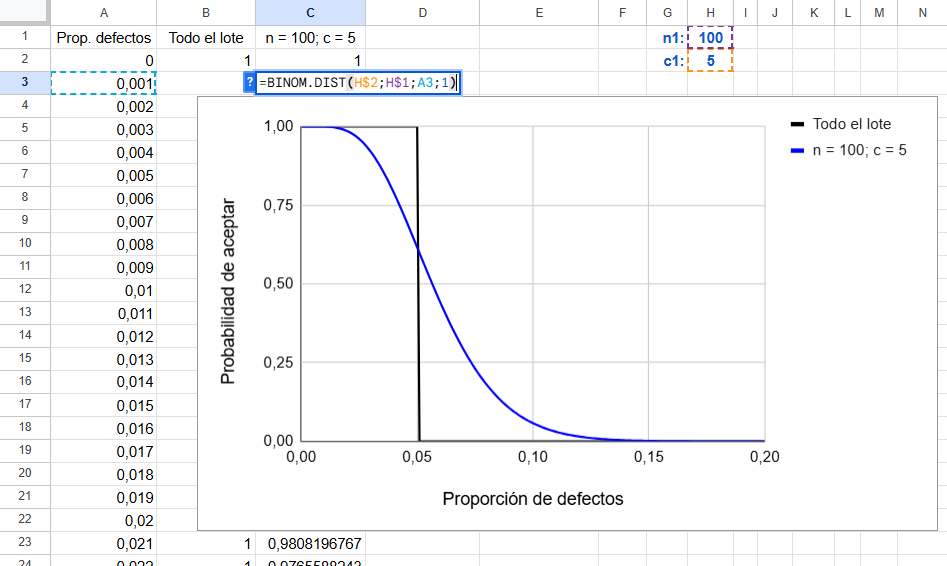
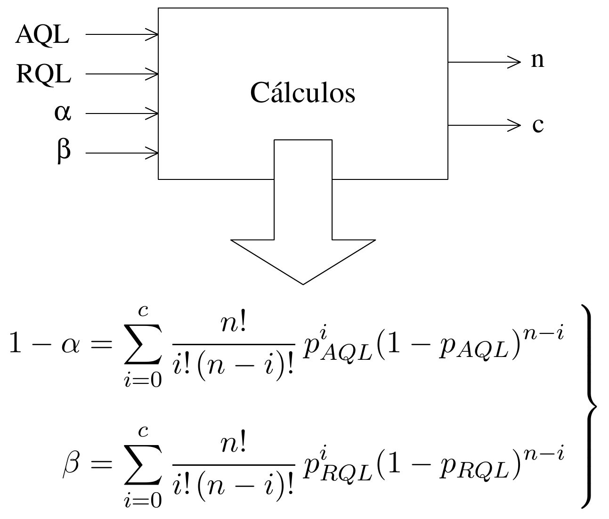

# Muestreo. Encuestas

Una de las actividades típicas de la estadística es estimar las características de una población a partir de los resultados de una muestra. Aunque a menudo nos referimos a la muestra sin dar detalles sobre su origen y cualidades, conviene tener presente que esa es la materia prima con la que vamos a trabajar, y una materia prima de mala calidad conduce inevitablemente a un mal producto.

Conseguir que una muestra sea representativa no es sencillo, especialmente cuando los recursos son limitados. Por ello, vale la pena prestar atención a los procedimientos que permiten obtener muestras de calidad, para evitar que los análisis posteriores —por muy sofisticados que sean— resulten inútiles.

## Población y muestra

Definimos la población como el conjunto de elementos --o de individuos, de ahí su nombre-- que son objeto de estudio. Parece fácil, pero conviene distinguir entre lo que denominamos **población objetivo**, que es ese conjunto que tenemos interés en conocer, y la población de la cual se extrae la muestra, que llamamos **población elegible** y que no necesariamente coinciden. 

Cuando en la universidad, a finales de curso, se pide a los estudiantes que respondan en clase a unas encuestas de valoración de sus profesores, la población elegible (los estudiantes que van a clase a finales del curso) no coincide con la población objetivo, que son todos los estudiantes, también los que no van a clase, quizá porque consideran que el profesor es aburrido o que no les sirve para aprender. 

Si la encuesta se realiza a través de una página web y se puede responder en cualquier momento, ese mayor peso de los que van a clase se dará menos, pero si en clase se insiste en la importancia de responder la encuesta y se les da tiempo para que lo hagan allí mismo, ese fenómeno seguramente también se va a dar. Algo parecido ocurre cuando se hacen encuestas por vía telefónica: una cosa es la población general, y otra aquellos a los que se puede acceder llamándolos por teléfono. Si la población elegible se puede considerar representativa de la población objetivo la diferencia entre ambas tiene poca importancia, pero hay que estar atento porque si no coinciden los resultados pueden favorecer la opinión del grupo más fácilmente accesible.

La **muestra** es el conjunto de elementos seleccionados de la población a través de cuyo análisis se pretende conocer los aspectos de interés de la población en general. La toma de la muestra se denomina **muestreo** y la forma de hacerlo determina su calidad y propiedades. Hay que andarse con cuidado porque --a diferencia de otras materias primas-- solo viéndola no es posible saber si tiene o no la calidad deseada. Hay que saber cómo se ha obtenido.

## Selección de la muestra

Los tipos de muestreo se pueden dividir en dos grandes grupos: muestreo *probabilístico* y muestreo *no probabilístico*.

### Muestreo probabilístico {.unnumbered}

La idea es seleccionar la muestra siguiendo una estrategia en la que el protagonismo lo tiene el azar, lo cual le confiere unas propiedades que se pueden deducir a partir de modelos matemáticos. Según la estrategia seguida, el muestreo probabilístico puede ser (la lista no es exhaustiva):

-   [**Aleatorio simple**]{style="color: #0038CF;"}: Se elige la muestra al azar de entre todo el conjunto de la población. Seguramente el más fácil de tratar en la teoría y el más difícil de llevar a cabo en la práctica.
	
-   [**Estratificado**]{style="color: #0038CF;"}: Se divide la población en estratos homogéneos y se extrae una muestra de cada estrato. Dado un mismo tamaño de muestra global permite realizar estimaciones más precisas para cada estrato.
	
-   [**Sistemático**]{style="color: #0038CF;"}: Se selecciona la muestra siguiendo un criterio que facilita la selección y evita discrecionalidad, que en general no es lo mismo que aleatoriedad. Por ejemplo, en unas elecciones, en las encuestas a pie de urna, ir preguntando a uno de cada 10 por orden de salida. En este caso, que no haya regla de selección puede provocar un sesgo en los resultados si el entrevistador evita a las personas que le parecen antipáticas y tiende a seleccionar a las que le caen bien.
	
-   [**Multietápico**]{style="color: #0038CF;"}: Primero se seleccionan zonas (barrios, estanterías del almacén,...) y dentro de cada zona se seleccionan unidades (individuos, piezas,...). En general es menos costoso porque las unidades están agrupadas y cuesta menos llegar a ellas.

### Muestreo no probabilístico {.unnumbered}

Es el que se utiliza cuando la selección al azar no es viable. \index{Muestreo! no probabilístico} En este caso, las estimaciones no se realizan basándose en las propiedades de las distribuciones de probabilidad que correspondan, sino en argumentos que justifican la representatividad de la muestra. Muestreos de este tipo son:


-   [**Muestreo por cuotas**]{style="color: #0038CF;"}:	Se trata de definir grupos con la mayor homogeneidad posible. La selección dentro de cada grupo no se realiza al azar, sino que cualquier individuo que cumpla los requisitos del grupo puede ser incluido en la muestra (al haber poca variabilidad interna cualquier individuo se considera un buen representante). Este procedimiento se adapta muy bien a las entrevistas telefónicas. La entrevista se realiza a la persona que responde si el grupo al que pertenece aún tiene vacantes, o se puede preguntar si en el hogar hay alguien con el perfil de un grupo que todavía esté sin completar. Cuando todos los grupos se han completado, se entiende que la muestra es un buen reflejo de la población. 
	
-   [**Muestreo razonado**]{style="color: #0038CF;"}:	 En ocasiones lo más conveniente puede ser tomar una muestra que responda a unas características específicas. Por ejemplo, si se viene comprobando que los resultados en un colegio electoral son un buen reflejo de lo que ocurre en todo el país, tomar a los votantes de ese colegio como muestra de todo el país puede ser una buena estrategia.
	
Un muestreo no probabilístico puede ser muy útil y aportar información valiosa, pero sus conclusiones no deben presentarse como si la muestra hubiera sido elegida de forma aleatoria, ni tras la típica cantinela de: "Bajo la hipótesis de muestreo aleatorio simple...". Es como si decimos: "Supongamos que una castaña es una esfera..." y, a partir de ahí llegamos a una serie de conclusiones sobre las características de las castañas[^6-1]

[^6-1]: En España es obligatorio publicar una llamada "ficha técnica" de los sondeos que se publican durante la campaña electoral. La ficha técnica incluye niveles de confianza y márgenes de error muchas veces calculados bajo la hipótesis de muestreo aleatorio simple, aunque es evidente que el muestreo realizado no ha sido de ese tipo.}. 

No hay ninguna garantía de que esas conclusiones sean ciertas, no porque el método usado para obtenerlas sea incorrecto, sino porque la hipótesis en que se basa es falsa. En la presentación de trabajos académicos, suponer que la muestra es aleatoria permite introducir una terminología (niveles de confianza, márgenes de error,...) con la pretensión de dar un aire de mayor rigor científico pero en realidad hacen lo contrario.

### ¿Es lo mismo muestra aleatoria que muestra representativa? {.unnumbered}

No, no es lo mismo. Ni por ser aleatoria ya es representativa, ni que sea representativa implica que sea aleatoria.

Para que una muestra aleatoria sea representativa es necesario que tenga un cierto tamaño. Si en la población existen siete estratos sociales y se toma una muestra de cinco individuos, por muy aleatoria que sea, no podrá ser representativa de la diversidad de esa población. 

Por otro lado, es posible obtener muestras representativas sin selección aleatoria. Esto es lo que se pretende con el muestreo por cuotas. Naturalmente, hay que tener muy clara la estructura de la población, saber dividirla en grupos homogéneos y asignar a cada grupo el peso o el tamaño que le corresponde. Si todo se hace correctamente, esa muestra puede considerarse representativa, aunque el entrevistador se haga una autoentrevista, y se la haga también a sus padres o allegados, siempre que pertenezcan a los grupos especificados en el plan de muestreo. Algunas consideraciones sobre la representatividad son:

-   El término "representativo", o "representante", muchas veces se utiliza con un sentido distinto al que damos en estadística. Así, por ejemplo, cuando se pregunta por un escritor representativo de Colombia en muchas ocasiones se responde que Gabriel García Márquez, aunque seguramente este es el más atípico de los escritores colombianos. O cuando se habla de los atletas representantes de un país en unas olimpiadas, seguro que no son representativos -al menos en forma física- de los ciudadanos de ese país.
	
-   Tenemos una tendencia innata a considerar representativa y, por tanto, a generalizar, en base a muestras muy pequeñas. A veces en base a una sola observación: "Este remedio va muy bien, a mi vecino le funcionó".
	
-   Las muestras autoseleccionadas nunca son representativas. Es una práctica habitual hacer encuestas enviando cuestionarios y sacando conclusiones a partir de los que responden, como si esos fueran una muestra representativa. Los que responden son los que están interesados en el tema de la encuesta, si se pregunta sobre cuánto se recicla responderán más los que están más sensibilizados con los problemas del medio ambiente y, por tanto, los que más reciclan. 
  
    Si usted quiere estimar las características de una población de 1000 empresas y envía un cuestionario a todas ellas, con mucha suerte le responderán 200. Quizá este le parezca un buen número y piense que a partir de ahí se pueden sacar unas buenas conclusiones, pero será mucho más representativa una muestra de 50 empresas elegidas al azar y perseguidas hasta tener su opinión que la de 200 autoseleccionadas. Claro que el margen de error le saldrá mayor con 50 empresas que con 200, pero el primero será cierto y útil y el otro ni una cosa ni otra.


### ¿Como saber si mi muestra es representativa? {.unnumbered}

No existen pruebas formales para verificar la representatividad de una muestra, y es una lástima, porque en muchos estudios estadísticos, donde hay profusión de test de todo tipo, se pasa por alto la justificación de la representatividad de la muestra como si esta fuera una característica innata de todas las muestras y no fuera necesario justificarla.

Una forma de validar la representatividad es comprobar que se resiste un duro interrogatorio que lo ponga en duda. Imagínese que le cuestionan esa representatividad por todas las razones que pueda imaginar (por ejemplo, usted solo ha entrevistado a los que vio con actitud de querer colaborar, y esos tendían a tener un determinada opinión...). Solo si es capaz de rebatir de manera convincente todas y cada una de esas objeciones, podrá considerar que su muestra es razonablemente representativa.

## Encuestas. Aspectos a tener en cuenta

Cuando los elementos de la muestra son personas y la información que se busca --ya sean opiniones, hábitos o preferencias-- se obtiene preguntándoles, decimos que se hace una encuesta.

### La influencia de la pregunta y de cómo se hace {.unnumbered}

La representatividad de la muestra es una condición necesaria --pero no suficiente-- para que las conclusiones obtenidas a través de una encuesta sean fiables.

En los resultados influye la forma de plantear las preguntas y también las palabras que se utilizan. Si se realiza una encuesta para saber si los aficionados de un equipo de futbol están de acuerdo con la destitución de su entrenador, seguramente se obtendrán resultados distintos si se pregunta:

<blockquote>
	*¿Está de acuerdo en que se haya echado al entrenador a media liga?*
</blockquote>

que si la pregunta se realiza de la forma:

<blockquote>
	*¿Le parece bien que, de acuerdo con la decisión de la junta directiva, se haya sustituido al entrenador?*
</blockquote>

Del mismo modo, si se pregunta por acciones militares, no es lo mismo preguntar si se está de acuerdo:

<blockquote>
	*en que nuestro ejército participe en la coalición internacional para resolver el conflicto de...*
</blockquote>

que si se está de acuerdo con que:

<blockquote>
*nuestro ejército se implique en la guerra de...*
</blockquote>

El orden en que se realizan las preguntas y el de las posibles respuestas también puede influir en los resultados. En un sondeo electoral,  si el orden de lectura de los partidos o candidatos es siempre el mismo, la primera y la última mención tienen, en general, mayores probabilidades de ser seleccionadas simplemente por aparecer en esa posición[^6-2]. También los comentarios del entrevistador pueden influir en las respuestas, por eso está muy pautado lo que deben decir.

[^6-2]: Ferrándiz, J.P. y Camas García, F. (2019). La Cocina electoral en España, Ed. Catarata, p. 225.

Por otra parte, hay preguntas que tocan aspectos personales que a la gente no le gusta responder, o lo hace diciendo lo que considera políticamente correcto o lo que supone que al entrevistador le gustará oír. Lograr que las personas respondan y que lo hagan con sinceridad no es fácil. Se requiere entrenamiento, el tiempo y la motivación necesarios para hacerlo bien. Los errores por falta de rigor al redactar o al hacer las preguntas pueden ser enormes y nunca aparecen en ninguna parte.

### Cómo hacer preguntas indiscretas manteniendo la confidencialidad {.unnumbered}

Cuando se pregunta si se ha realizado algún tipo de actividad reprobable o socialmente mal vista, es muy posible que el entrevistado tienda a ocultarlo no siendo sincero en su respuesta o, simplemente, negándose a contestar. En estos casos, existe una forma de mantener la confidencialidad incluso ante el entrevistador. 

Se pide al entrevistado que realice una acción cuyo resultado depende del azar y solo él puede ver. Según cual sea ese resultado, debe responder "sí" (sea cual sea la verdad) o responder sinceramente a la pregunta formulada. Por ejemplo, si lanza una moneda, debe responder "sí" si sale cara, y ser sincero si sale cruz.
 
Aunque es imposible saber si un "sí" se debe a que le ha salido cara o a que ha respondido a la pregunta de interés, es posible estimar la proporción de los que han realizado esa actividad. Si se realizan 1\:\!000 entrevistas y 600 personas responden sí, cabe esperar que unas 500 hayan dado esa respuesta porque les ha salido cara, mientras que de las otras 500 --las que han respondido a la pregunta de interés-- 100 han respondido de forma afirmativa. Luego, la estimación de la proporción será $p$ = 100/500 = 0,2.

También es verdad que esta forma de garantizar la confidencialidad no sale gratis. El precio que se paga es un aumento de la variabilidad en la estimación de la proporción de interés $p$, y este aumento depende de la probabilidad, $\alpha$, de que se responda a la pregunta de interés. Si esa probabilidad es baja, por ejemplo, que salga un seis al lanzar un dado, el entrevistado se sentirá seguro de que no es posible saber la verdad en su caso, pero se pierde precisión en la estimación. Si es alta, como sacar una carta de una baraja y responder a la pregunta planteada si no es un as, tendremos mayor precisión en la estimación, pero el encuestado se sentirá menos protegido (es muy probable que tenga que decir la verdad) y puede mentir.

Hemos simulado el número de síes que se obtendrían para diferentes valores de $\alpha$ si la proporción de interés fuera $p=0.2$. Repitiendo $100\;\!000$ veces esta simulación, hemos identificado los percentiles del 2,5 % y del 97,5 % (dentro queda el 95 %) y, tal como hemos comentado anteriormente, pasamos del número total de síes a la estimación del número de los que responden afirmativamente a la pregunta de interés. La [Tabla 6.1](#tbl-Sies) resume los resultados obtenidos. Observe como el intervalo se va haciendo más estrecho al aumentar el valor de $\alpha$.


```{=html}
<div id="tbl-Sies"; class="tabla-wrapper42">
<table class="tabla-0601">

<caption>Tabla 6.1: Percentiles obtenidos por simulación cuando la proporción estimada es p = 0,2 según sea la probabilidad de responder a la pregunta de interés (&alpha;)</caption>

<colgroup>
  <col style="width: 10%;">
  <col style="width: 15%;">
  <col style="width: 15%;">
  <col style="width: 20%;">
  <col style="width: 20%;">
</colgroup>
<thead>
  <tr>
    <th rowspan="2">&alpha;</th>
    <th colspan="2">Total de síes</th>
    <th colspan="2">Sí a la pregunta de interés</th>
  </tr>
  <tr>
    <th>2,5%</th>
    <th>97,5%</th>
    <th>2,5%</th>
    <th>97,5%</th>
   </tr>
</thead>

<tbody>
  <tr> <td>0,2</td> <td>817</td> <td>863</td> <td>8,5 %</td>  <td>31,0 %</td> </tr>
  <tr> <td>0,3</td> <td>733</td> <td>786</td> <td>11,0 %</td> <td>28,7 %</td> </tr>
  <tr> <td>0,4</td> <td>651</td> <td>709</td> <td>12,8 %</td> <td>27,3 %</td> </tr>
  <tr> <td>0,5</td> <td>570</td> <td>630</td> <td>14,0 %</td> <td>26,0 %</td> </tr>
  <tr> <td>0,6</td> <td>489</td> <td>551</td> <td>14,8 %</td> <td>25,2 %</td> </tr>
  <tr> <td>0,7</td> <td>409</td> <td>471</td> <td>15,6 %</td> <td>24,4 %</td> </tr>
  <tr> <td>0,8</td> <td>330</td> <td>390</td> <td>16,3 %</td> <td>23,8 %</td> </tr>
  <tr> <td>0,9</td> <td>252</td> <td>308</td> <td>16,9 %</td> <td>23,1 %</td> </tr>
  <tr> <td>1</td>   <td>176</td> <td>225</td> <td>17,6 %</td> <td>22,5 %</td> </tr>
</tbody>
</table>
</div>
```

Si, por ejemplo, $\alpha = 0.5$ (el resultado de lanzar una moneda), el 95 % de las veces el número de <<síes>> se encuentra entre 570 y 630. Si es 570 entendemos que 70 son los síes verdaderos y nuestra estimación de los que responden "sí" a la pregunta de interés será 70/500 = 14 %. En el Apéndice 6.B se deduce la relación entre el valor de $\alpha$ y la varianza de la estimación.

### Encuestas "informales" {.unnumbered}

Si en un programa de televisión dicen: "Salimos a la calle y preguntamos la opinión de los ciudadanos sobre..." conviene ser escépticos. Más allá del tamaño de la muestra --que suele ser muy reducido--, los que pasan por ese sitio a esa hora y se prestan a responder delante de la cámara no son una muestra representativa de la población. Casi siempre es evidente que se trata de un *divertimento*. Lo grave es cuando en un trabajo académico se realiza una encuesta más o menos de este tipo y se pretende dar a los resultados un valor que no tienen (a veces incluyendo niveles de confianza y márgenes de error).

También, en algunas ocasiones se nos pide que rellenemos un cuestionario dando nuestra opinión sobre un producto o servicio. En general, solo responden quienes están muy descontentos o muy satisfechos. La encuesta puede servir para detectar esos casos extremos, pero es evidente que sus resultados no se pueden extrapolar al conjunto de los clientes. Incluso puede ocurrir que este tipo de cuestionarios se ponga a disposición del público solo para <<quedar bien>>, para dar la impresión de que interesa su opinión, pero solo para eso.

::: callout-note
## Hacer un estudio estadístico no es hacer una encuesta

Algunas personas piensan que realizar un estudio estadístico exige realizar una encuesta. En absoluto. La  estadística va mucho más allá de las encuestas. Muchas veces los datos que se necesitan ya existen (aunque quizá no sea fácil encontrarlos) o hay que obtenerlos realizando experimentos.
:::

### Conocer la opinión sin hacer encuestas {.unnumbered}

Para conocer la opinión de una población de interés, existen otros métodos además de las encuestas. En estudios de mercado suelen utilizarse los llamados *focus group*. Se trata de reunir un grupo reducido de personas --en torno a ocho o diez-- que represente distintos sectores de la población de interés. Las conversaciones y debates con estas personas, dirigidos por personal experto,  permiten obtener información para valorar el nivel de satisfacción con un producto o servicio y también generar ideas para mejorarlo.

## Inspección por muestreo

El muestreo no solo se aplica en el ámbito de las encuestas. También se usa, por ejemplo, para evaluar el nivel de calidad de un lote de productos sin necesidad de inspeccionarlos todos, uno a uno.

Este tipo de inspección lo puede realizar la propia empresa fabricante, para comprobar que no existen problemas de calidad que hayan pasado desapercibidos durante el proceso de producción, o también en el control de recepción de los componentes adquiridos a proveedores, con el fin de verificar que se cumplen los estándares de calidad establecidos.


### Plan de muestreo. Riesgo del comprador y riesgo del vendedor {.unnumbered}

Vamos a centrarnos en el control de recepción y supongamos que compramos un lote de unidades, cada una de las cuales se puede clasificar como correcta o defectuosa. Pueden ser componentes para un producto que se va a fabricar o también frutas u hortalizas que se van a comercializar.

Si estamos dispuestos a tolerar un 5 % de unidades defectuosas, podemos tomar una muestra de 100 unidades y si aparecen como máximo 5 defectos (el 5 %) considerar que el lote es correcto, mientras que si se encuentran  más de 5 considerar que no cumple con lo pactado y devolverlo o realizar las acciones que se hayan establecido si esto sucede.

Parece que este procedimiento, al tolerar el mismo porcentaje de defectos en la muestra que en el lote, es el más justo, pero tiene algunos inconvenientes. Vamos a echar mano del cálculo de probabilidades para analizar lo que puede suceder.

Supongamos que recibimos un lote con el 3 % de unidades defectuosas. Como está por debajo del 5 % deberíamos aceptarlo, pero puede ocurrir que --por casualidad-- caigan muchas unidades defectuosas en la muestra y rechacemos el lote de manera injusta. Si el tamaño del lote es mucho mayor que el de la muestra -que es lo habitual-- podemos considerar constante la probabilidad de que al extraer una unidad esta sea defectuosa[^6-3] y podemos usar la distribución binomial para calcular la probabilidad de devolver "injustamente" ese lote con el 3 % de defectos. Sea $X$ el número de defectos encontrado en una muestra de $n=100$ unidades. Tenemos:

[^6-3]: El muestreo se realiza sin reposición, de manera que la proporción de unidades defectuosas va cambiando a medida que las vamos extrayendo. Sin embargo, si el tamaño del lote es mucho mayor que el de la muestra, los cambios en la proporción de defectos serán muy pequeños, de manera que pueden ser ignorados y considerar que la proporción se mantiene constante.}

$$\mathrm P(X > 5; n=100; p=0.03) = 0.2115$$
También puede ocurrir que un lote que no cumple con lo establecido sea aceptado. Si el porcentaje de defectos es del 6\% la probabilidad de ser aceptado es:
$$\mathrm P(X \leq 5; n=100; p=0.06) = 0.4407 $$
A la probabilidad de rechazar injustamente un lote que cumple con los requisitos establecidos se le denomina **riesgo del vendedor**, y la probabilidad de aceptarlo cuando no los cumple es el **riesgo del comprador**. En un contexto más general, se habla de falso positivo y falso negativo.

### Curva característica de un plan de muestreo {.unnumbered}

\noindent Dado un plan de muestreo, \index{Plan de muestreo! curva característica} es decir, dados los valores de $n$ (número de unidades a inspeccionar) y $c$ (número máximo de defectos tolerado), la mejor forma de visualizar su comportamiento es mediante la curva que representa la probabilidad de aceptar el lote en función de la proporción de defectos que contiene. Esta curva se denomina **curva característica del plan de muestreo**.

La [@fig-curvaCaracteristica_100_5]. muestra su construcción para el plan definido por $n=100$ y $c=5$ utilizando una hoja de cálculo. En la columna A se indica la proporción de defectos en el lote ($p$) y en la columna C la probabilidad de aceptarlo: $\text{P}(X \leq 5; n=100; p=p)$. También se incluye la que sería la <<curva ideal>>, con una probabilidad de aceptación igual a 1 para cualquier valor de la proporción de defectos menor o igual a 0,05, e igual a cero para valores mayores de esa proporción, pero esta curva solo se puede conseguir inspeccionando el lote completo. 

{#fig-curvaCaracteristica_100_5 .fig-normal3 fig-align="center" width="90%"}

La curva característica también sirve para observar que un plan de muestreo no es necesariamente más riguroso por el hecho de no tolerar ni un solo defecto en la muestra ($c=0$). La [@fig-curvaCaracteristica_Compara] añade la curva correspondiente al plan definido por $n=10$ y $c=0$, donde puede observarse que la probabilidad de aceptación es muy alta para proporciones de defectos por encima de lo establecido. Esta figura también incluye la curva correspondiente al plan definido por $n=500$ y $c=25$. A medida que aumenta el tamaño de la muestra, manteniendo una proporción de defectos igual a la permitida en el lote, la curva característica se va acercando a la curva ideal.

{#fig-curvaCaracteristica_Compara .fig-normal3 fig-align="center" width="90%"}

### Otra vez insistimos: Atención a como se selecciona la muestra {.unnumbered}

\noindent La selección de la muestra para que sea representativa del conjunto que se desea evaluar suele ser el eslabón más débil de la cadena. Dar instrucciones de <<elegir al azar>>, sin más, puede ser interpretado como elegir con preferencia lo que está más a mano, lo cual puede ser representativo de una parte, pero no del todo. Además, puede ser una parte especialmente ``mimada'', si el proveedor conoce esa práctica.

Conviene dar instrucciones precisas de cómo debe seleccionarse la muestra para que sea representativa de todo el conjunto, aunque esto puede ser mucho más laborioso que hacerlo a discreción del inspector. Si esas instrucciones se dan de manera que se puede verificar su cumplimiento, quizá mediante algún tipo de muestreo sistemático si las unidades están numeradas, estaremos más seguros de que el muestreo se ha ejecutado correctamente.

## APÉNDICE 6.A: ¿Por qué cuesta acertar en los sondeos electorales? {.unnumbered}

Cuando se estiman las características de una población a partir de una muestra, siempre hay que asumir un cierto margen de error; pero cuando ese error va más allá de lo esperado, es señal de que falla algo. No es que la teoría estadística sea incorrecta, lo que no se cumple son los principios en que se basa, ya sea por falta de recursos o porque en la práctica es muy difícil cumplirlos. Veamos algunas de estas dificultades.

#### Conseguir que la muestra sea representativa {.unnumbered}

Este no es un problema específico de los sondeos electorales, pero es más difícil conseguir la muestra adecuada si una parte de la población se muestra renuente a responder preguntas sobre sus ideas políticas. Si las razones de la no respuesta fueran independientes de las preferencias de voto, el problema tendría solución desde la estadística. Sin embargo, la práctica ha demostrado que esto no es así: hay más voto oculto en unas opciones políticas que en otras, y el problema se complica.

#### La intención de voto va cambiando {.unnumbered}

Los sondeos electorales se basan en encuestas realizadas varios días, o incluso varias semanas, antes de las elecciones. En algunos países está prohibido publicar resultados de sondeos electorales durante un cierto periodo antes de las elecciones. Por tanto, nos encontramos con dos tipos de extrapolaciones: 1) la que se hace desde la muestra hacia la población, siendo esta la que trata la teoría estadística del muestreo, y 2) la que generaliza los resultados de las fechas en que se ha hecho el sondeo, al día de las elecciones. Pero los partidos se emplean a fondo en sus campañas electorales: se organizan debates, pueden ocurrir sucesos sobre los que se posicionan los candidatos, y todo esto puede afectar a la decisión final del electorado.

#### ¿A quién votarán los indecisos? {.unnumbered}

Los indecisos suelen representar un porcentaje importante de la población y, dependiendo de lo que estos acaben votando, los resultados serán unos u otros. Realizar las estimaciones ignorando a los indecisos no es una buena idea, porque estos acabarán votando (al menos una gran parte). Suponer que entre los indecisos se reproducirán las mismas proporciones que entre los que ya han decidido su voto también es mucho suponer.

Las empresas especializadas en realizar sondeos electorales tienen sus procedimientos para asignar el voto a los indecisos. Las entrevistas empiezan con preguntas <<fáciles>> (edad, profesión,...) que permiten asignar un cierto perfil socioeconómico a los entrevistados. A continuación, se pueden hacer preguntas más relacionadas con la ideología, como su opinión sobre un tema polémico en el que derecha e izquierda tienen opiniones contrapuestas, su valoración de algunos líderes políticos o a quién votó en las últimas elecciones. La respuesta a estas preguntas marca un perfil al que se asigna un voto. La correcta asignación de este voto responde más a conocimientos relacionados con la sociología y con la política que con la estadística, y en esa asignación está el éxito o el fracaso de los resultados del sondeo. 

#### La falta de sinceridad en las respuestas {.unnumbered}

La redacción de las preguntas y el orden en que se realizan son aspectos críticos para conseguir la participación y la sinceridad de los encuestados. Por otra parte, conseguir que el entrevistado se sienta cómodo y responda con sinceridad requiere entrevistadores bien entrenados y motivados (léase bien pagados). 

A veces la situación política hace que algunos ciudadanos prefieran disimular sus preferencias declarando que votarán a las opciones que consideran "mejor vistas". También puede ocurrir que se muestren indecisos cuando en realidad se trata de "decisos cautos".

##### Del porcentaje de votos al número de escaños {.unnumbered}

En muchas ocasiones lo verdaderamente relevante no es el porcentaje de votos sino el número de escaños que va a obtener cada partido. Pequeñas variaciones en el porcentaje de votos --imposibles de precisar mediante muestreo-- provocan cambios en el número de escaños.

Otro problema es que algunas legislaciones electorales exigen un mínimo porcentaje de votos para entrar en el reparto. Si ese porcentaje es del 5 % y la estimación de voto para un partido es del 4 % $\pm$ 2 % no se puede saber si llegará o no al mínimo necesario, y el hecho de que llegue o no llegue afectará también al número de escaños del resto de partidos.

[$$\bullet \;\;\;\;\; \bullet \;\;\;\;\; \bullet $$]{style="color: #0038CF;"}

A pesar de las dificultades comentadas, las empresas especializadas saben cómo hacer las estimaciones en base a su experiencia, aplicando técnicas y conocimientos que van más allá de los procedimientos clásicos de estimación estadística. Sus resultados siempre son esperados con interés y, muchas veces el grado de acercamiento a lo que al final acaba ocurriendo es espectacular. Claro que, como en otros ámbitos, siempre se destacan más los fallos que los aciertos.

## Apéndice 6.B: El precio de la confidencialidad {.unnumbered}

Sea $p$ el verdadero valor de la proporción estimada, y $\alpha$ la probabilidad de que el encuestado deba responder a la pregunta de interés. La probabilidad de obtener un <<sí>> como respuesta es: 
$$P_{si} = (1 - \alpha) + \alpha \cdot p $$
Despejamos $p$:
$$p = \frac{P_{si}-(1-\alpha)}{\alpha} $$
Cuando tenemos los resultados de la encuesta, no tenemos el valor poblacional de $p$, sino una proporción que estima ese valor. A esa proporción le llamamos $\hat{p}$. La proporción de síes que obtenemos en la encuesta también es una variable aleatoria, le llamamos $\hat{P}_{si}$. Por tanto, a partir de la muestra, tendremos:
$$\hat{p} = \frac{\hat{P}_{si}-(1-\alpha)}{\alpha} $$
Recordando que $\mathrm{V}(aX + b) = a^2 \mathrm{V}(X)$ (Apéndice 5.A):
$$\mathrm V(\hat{p}) = \mathrm V \left ( \frac{\hat{P}_{si} - (1 - \alpha)}{\alpha} \right) = \frac{1}{\alpha^2} \mathrm V (\hat{P}_{si})$$
Como $\hat{P}_{si}$ es una proporción referida a una variable aleatoria con distribución binomial (número de entrevistados que responden <<sí>>), tenemos que su varianza es:
$$\mathrm V (\hat{P}_{si}) = \frac{P_{si} (1 - P_{si})}{n} $$
Sustituyendo en la expresión anterior de $\mathrm V(\hat{p})$:
$$\mathrm V (\hat{p}) = \frac{P_{si} (1 - P_{si})}{n \cdot \alpha^2} $$
Ya solo nos falta sustituir $P_{si}$ por su expresión:$P_{si} = (1 - \alpha) + \alpha \cdot p$, y tras un poco de manipulación algebraica, llegamos a:
$$\mathrm V(\hat{p}) = \frac{p(1-p)}{n} + \frac{(1 - \alpha)(1 - p)}{n \cdot \alpha} $$
El primer término, $p(1-p)/n$, es la varianza que tendríamos haciendo la pregunta de forma directa. El segundo es la variabilidad adicional que se añade debido al procedimiento seguido para garantizar la confidencialidad. Ese aumento de la variabilidad es el precio a pagar. Si $\alpha = 1$ (siempre se responde a la pregunta de interés), el segundo término se anula y obtenemos la varianza convencional.
 
## Apéndice 6.C: Diseño de planes de muestreo {.unnumbered}

Conscientes de que cuando se decide en base a una muestra siempre se corren unos riesgos, lo que hacemos es fijar esos riesgos y determinar el plan de muestreo que mejor se adapta a ellos. Fijamos los siguientes cuatro valores:

-   Porcentaje de defectos que estamos dispuestos a aceptar. Se denomina AQL, siglas de *Acceptance Quality Level* y podría ser, por ejemplo, del 1 %. Si el lote viene con esa proporción de defectos queremos que la probabilidad de aceptarlo sea alta. 
	
-   Probabilidad de rechazar un lote que tiene una proporción de defectos igual al AQL. Le llamamos $\alpha$ e interesa que esa probabilidad sea pequeña, podría ser $\alpha = 0.05$.
	
-   Proporción de defectos que consideramos demasiado alta. Se denomina RQL (de *Rejectable Quality Level*) y si un lote viene con esa proporción de defectos queremos que la probabilidad de aceptarlo sea baja. Un valor para el RQL podría ser el 6 %. 
	
-   Probabilidad de aceptar un lote con una proporción de defectos igual al RQL. Le llamamos $\beta$ y queremos que esa probabilidad sea baja. La podemos fijar, por ejemplo, en el 10 %.
	
Podemos asignar valores más bajos a $\alpha$ y $\beta$ pero cuanto menores sean estos (menos riesgos queramos correr) mayor saldrá el tamaño de la muestra.

Los valores de AQL y $1-\alpha$ así como RQL y $\beta$ definen dos puntos en el gráfico de probabilidad de aceptación frente a la proporción de unidades defectuosas ([@fig-puntosClave]). Se trata de encontrar los valores de $n$ y $c$ que corresponden a la curva característica que más se acerca a esos puntos. Con los valores de la figura, este plan es el definido por $n=87$ y $c=2$.

{#fig-puntosClave .fig-normal3 fig-align="center" width="95%"}

Las expresiones que usamos para deducir los valores de $n$ y $c$ en función de AQL, RQL, $\alpha$ y $\beta$ se encuentran en la [@fig-calculoPlanMuestreo]. No parece fácil despejar los valores de $n$ y $c$ de esas expresiones, pero podemos elaborar un programa que para todas las parejas de valores $n$ y $c$ (dentro de unos límites, por ejemplo $n \leq 200$ y $c \leq 6$) identifique la que corresponde al plan que mejor se adapta a los requisitos establecidos.

{#fig-calculoPlanMuestreo .fig-normal3 fig-align="center" width="55%"}

El tema de los planes de inspección por muestreo no se acaba aquí. Existen otros tipos de plan como los de muestreo doble, en los que tras tomar una primera muestra el lote se acepta si el número de defectos es menor o igual que un valor $c_1$ y se rechaza si es mayor o igual que $c_2$, mientras que si está entre $c_1$ y $c_2$ se saca otra muestra y se toma una decisión a la vista del número de defectos total. Estos planes tienen la ventaja de que exigen menos esfuerzo de inspección si el lote es muy bueno o muy malo, dedicando más esfuerzo a los lotes que son dudosos.

Es muy habitual aplicar planes de inspección por muestreo basándose en lo que establecen Normas como las ISO 2859-1:1999 que también contienen otros aspectos como la adaptación del rigor de la inspección al historial del proveedor, usando mayores tamaños de muestra para los proveedores a los que se ha hallado mayor cantidad de defectos en sus últimas entregas. <br>

::: {style="text-align: center; font-size: 1.1em;"}
________________________ [◇]{style="margin: 0 0.4em;"} ________________________ 
:::

<br>


