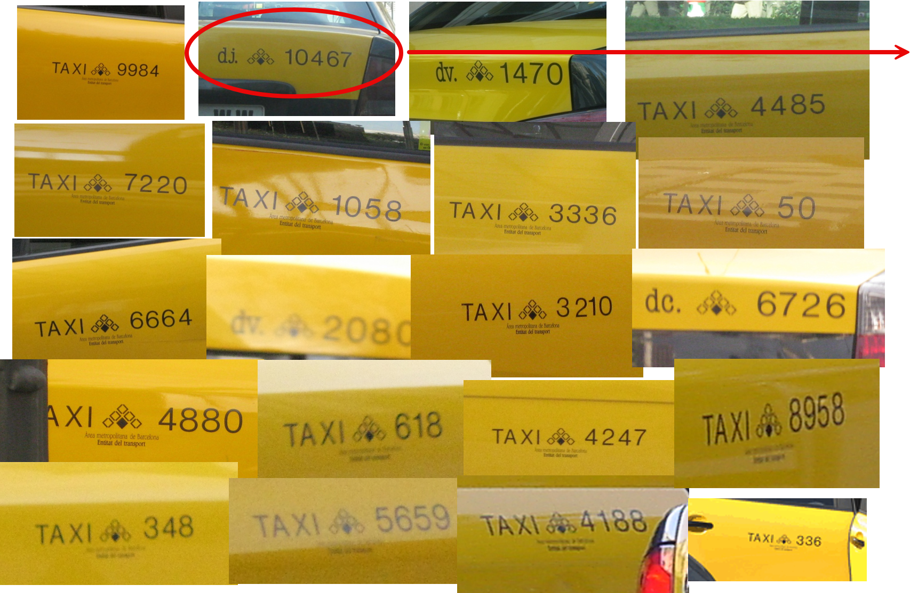
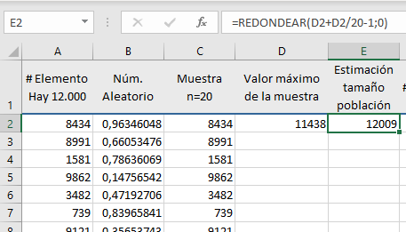
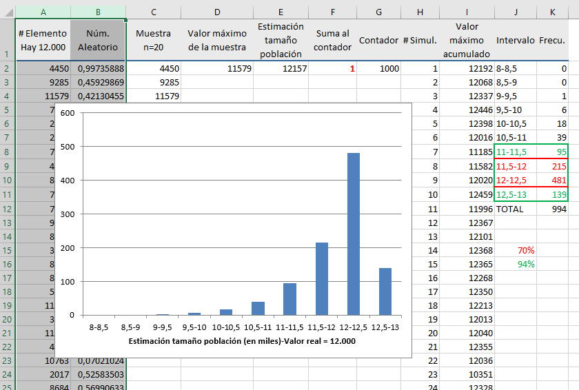

# Estimación de características de la población

Rara vez es posible conocer con exactitud las características de una población. Esto puede deberse a que resulta inviable observar todos sus elementos —como en el caso de los sondeos electorales— o a que la población es, en realidad, un modelo teórico. Por ejemplo, cuando se pone en marcha una máquina y se fabrican algunas unidades para evaluar su funcionamiento, tenemos una muestra con la que valoramos si serán adecuadas las características de todas las unidades que se podrían fabricar en esas condiciones. Todas esas unidades son la población, pero es una población teórica, no existe físicamente.

En cualquier caso, sea la población real o teórica, lo que hacemos es "estimar" (hacernos una idea de) las características de interés de esa población a partir de los valores obtenidos en la muestra.

## Estimador puntual

Un estimador puntual, o simplemente estimador, es un número que se calcula a partir de los valores de una muestra y que nos sirve para hacernos una idea de una determinada característica de la población. Si queremos estimar el valor de la media de la población, la media de una muestra representativa de esa población es un buen estimador. Pero no siempre es tan fácil, hemos visto que la varianza de una muestra --aplicando la fórmula "natural" de dividir por $n$ la suma de cuadrados--, es un estimador sesgado de la varianza de la población.

Las cualidades de un estimador se valoran por el cumplimiento de unas determinadas propiedades. Las más importantes son:

-   Que sea insesgado, es decir, que no dé errores sistemáticos ni por exceso ni por defecto. Si tomamos muchas muestras y con cada una de ellas calculamos el valor del estimador, como los elementos en las muestras serán distintos (serán los que hayan caído por azar en cada muestra) los valores de ese estimador también serán distintos, pero si es insesgado se situarán en torno al verdadero valor que tiene en la población. Si existe un error sistemático, por exceso o por defecto, a ese error se le denomina ([@fig-dianas]).

-   Que sea preciso. Significa que si calculamos muchos valores de ese estimador, cada uno a partir de una muestra distinta, esos valores presentarán poca variabilidad. Si además el estimador es insesgado esa poca variabilidad estará distribuida en torno al verdadero valor de la magnitud estimada.

{#fig-dianas .fig-normal_0701 fig-align="center"}

::: callout-note
## ¿Por qué nos creemos el resultado obtenido de una muestra sabiendo que si tomáramos otra sería distinto?

Porque sería distinto pero no "muy distinto". Para informar sobre la variabilidad que cabe esperar se da el intervalo de confianza.
:::

## Intervalo de confianza

El estimador puntual apuesta por un valor concreto y sabemos que el verdadero valor andará por ahí, pero no informa sobre si estará muy cerca o si también podría estar bastante lejos.

Un intervalo de confianza ofrece una información más rica, nos dice que el valor que estamos estimando se encuentra --con una probabilidad conocida y que nosotros podemos elegir-- dentro de ese intervalo. Típicamente, en un intervalo de confianza intervienen tres valores:

-   [**Estimación! puntual**]{style="color: #0038CF;"}: Siempre está dentro del intervalo. Cuando las desviaciones por encima y por debajo de ese valor son igualmente probables se encuentra justo en el centro del intervalo.

-   [**Margen de error**]{style="color: #0038CF;"}: Es el valor que se suma y se resta al estimador puntual para construir el intervalo. En algunos casos, puede ocurrir que el margen de error no sea el mismo por encima y por debajo del estimador puntual.

-   [**Nivel de confianza**]{style="color: #0038CF;"}: Es la probabilidad[^07_estimacion-1] de que el intervalo incluya el verdadero valor del parámetro estimado.

[^07_estimacion-1]: Es controvertido usar la palabra "probabilidad" en este contexto, pero a nosotros nos parece que ayuda a entender lo que representa y no es ningún disparate conceptual.

Que el nivel de confianza sea del 95 % significa que el intervalo se ha construido con un procedimiento que "acierta" (incluye el verdadero valor del parámetro estimado) el 95 % de las veces.

::: callout-note
## ¿Qué es un intervalo de confianza?

Es un intervalo construido a partir de los valores de una muestra. En la práctica solo tenemos una muestra y un intervalo, pero si pudiéramos construir muchos intervalos, cada uno a partir de una muestra distinta, un porcentaje de ellos igual al nivel de confianza incluiría el verdadero valor del parámetro estimado.
:::

Si generamos muestras aleatorias de una población Normal y, a partir de cada una de ellas, calculamos un intervalo de confianza del 95 % para la media de la población ($\mu$) resultará que alrededor del 95 % de esos intervalos incluirá el verdadero valor de $\mu$. Si el intervalo de confianza fuera del 50 %, solo la incluirían aproximadamente la mitad.

Nosotros tendremos una sola muestra y nos será imposible saber si el intervalo de confianza construido a partir de sus valores incluye el valor estimado o si lo deja fuera. Si supiéramos que está dentro, podríamos decir que es un intervalo de confianza del 100 %, y si supiéramos que está fuera sería del 0 %. Pero no lo sabemos. Un intervalo de confianza del 95 % es como recibir información de una persona que dice la verdad el 95 % de las veces: sabemos que su fiabilidad global es alta, pero nunca podemos estar seguros de si una afirmación concreta es correcta ([@fig-diceLaVerdad]).

{#fig-diceLaVerdad .fig-normal_0702 fig-align="center"}

Hemos dicho que el nivel de confianza lo elegimos nosotros, entonces ¿por qué nos conformamos con el 95 % si podemos establecer el 99 % o incluso el 99,99 %? La respuesta es sencilla: cuanto mayor es el nivel de confianza --cuanto más seguros queremos estar de que el intervalo contiene el valor del parámetro estimado-- más ancho será el intervalo. Esto es lógico, dada una cantidad de información (tamaño de la muestra) la mayor seguridad solo se consigue aumentando la anchura del intervalo, el problema es que si queremos mucha seguridad el intervalo sale tan ancho que la información que aporta es irrelevante.

Supongamos que para estimar la proporción de celíacos en una comunidad se toma una muestra de 100 individuos y que entre ellos se encuentra un celíaco. El estimador puntual es igual al valor en la muestra, en nuestro caso el 1 %. Los intervalos de confianza del 50, 95 y 99,99 % son los que se indican en la [@fig-anchuraIntervalos]. El intervalo de confianza del 99,99 % es tan ancho que no aporta información relevante. No hacía falta realizar ningún estudio para saber que el porcentaje está entre 0,00 % (exactamente 0,00005 %) y el 11,8 %.

{#fig-anchuraIntervalos .fig-normal_0703 fig-align="center"}

Los intervalos de confianza del 95 % son una buena solución de compromiso entre el nivel de confianza y la anchura del intervalo. Si se desea aumentar el nivel de confianza manteniendo la anchura del intervalo no hay más remedio que aumentar el tamaño de la muestra.

## Estimación de la media

Pesamos 6 paquetes de café a la salida de la línea de envasado. Esos paquetes se pueden considerar representativos de la producción general y sus pesos, en gramos, son: 995, 987, 1008, 995, 991 y 1007. ¿Qué podemos decir sobre el valor medio con que se están llenando?

### Estimación puntual {.unnumbered}

Si tenemos que dar un valor para el peso medio con que están saliendo los paquetes de café, nuestra mejor apuesta es el peso medio de la muestra obtenida: $\bar{x} = 997.17 \text{g}$. Así de fácil.

Para justificarlo podemos plantear que si $X \sim N(\mu; \sigma)$ y $X_1, X_2, \cdots, X_n$ es una muestra aleatoria de esa población, cada valor de la muestra está tomado de esa misma población y, por tanto, tendrá una esperanza matemática $\text{E}(X_i) = \mu$. Designando la media de la muestra como $\bar{X}$ y usando las propiedades de la esperanza matemática, tenemos:

```{=tex}
\begin{equation*} 
    \begin{split}
        \text{E}(\bar{X}) &=\text{E} \left( \frac{X_1+X_2+ \cdots + X_n}{n}\right) =\\[5pt]
        & = \frac{1}{n} \left[\text{E}(X_1)+\text{E}(X_2)+ \cdots +  \text{E}(X_n) \right] =\\[5pt]
        & = \frac{1}{n} \cdot n \cdot \mu= \mu
    \end{split}
\end{equation*}
```
También podemos comprobar que esto es así usando una población "de prueba" como hicimos en el Apéndice 2.D. Supongamos que la población está formada por solo 5 elementos, cada uno de ellos con el valor que se indica:

```{=html}
<div class="tabla-wrapper_T0700">
<table class="tabla-02Ape2D_1">

<tr>
<td>(A)</td>
<td>(B)</td>
<td>(C)</td>
<td>(D)</td>
<td>(E)</td>

</tr>

<tr>
<td>3</td>
<td>6</td>
<td>9</td>
<td>12</td>
<td>15</td>
</tr>

 </table>
</div>
```
El valor medio de esos 5 elementos --la media de la población-- es: $$\mu = \frac{3 + 6 + 9 + 12 + 15}{5} = 9$$ Existen 10 maneras de seleccionar una muestra de 3 elementos de esta población (combinaciones de 5 elementos tomados de 3 en 3). Por tanto, si tomamos una muestra con toda seguridad será una de las que se incluyen en la [Tabla 7.1](#tbl-Medias), puesto que están todas.

```{=html}
<div id="tbl-Medias"; class="tabla-wrapper_T0701">
<table class="tabla-0701">

<caption>Tabla 7.1: Medias de las 10 muestras de 3 observaciones que se pueden obtener de una población con 5 elementos.</caption>

<colgroup>
<col style="width: 25%";>
<col style="width: 5.5%";>
<col style="width: 5.5%";>
<col style="width: 5.5%";>
<col style="width: 5.5%";>
<col style="width: 5.5%";>
<col style="width: 5.5%";>
<col style="width: 5.5%";>
<col style="width: 5.5%";>
<col style="width: 5.5%";>
<col style="width: 5.5%";>
</colgroup>

<tbody>
<tr>
<td style="text-align: left;">Muestra nº</td>
<td>1</td>
<td>2</td>
<td>3</td>
<td>4</td>
<td>5</td>
<td>6</td>
<td>7</td>
<td>8</td>
<td>9</td>
<td>10</td>
</tr>

<tr>
<td>Unidades de la muestra</td>
<td>A<br>B<br>C</td>
<td>A<br>B<br>D</td>
<td>A<br>B<br>E</td>
<td>A<br>C<br>D</td>
<td>A<br>C<br>E</td>
<td>A<br>D<br>E</td>
<td>B<br>C<br>D</td>
<td>B<br>C<br>E</td>
<td>B<br>D<br>E</td>
<td>C<br>D<br>E</td></tr>

<tr>
<td>Valores en la muestra</td>
<td>3<br>6<br>9</td>
<td>3<br>6<br>12</td>
<td>3<br>6<br>15</td>
<td>3<br>9<br>12</td>
<td>3<br>9<br>15</td>
<td>3<br>12<br>15</td>
<td>6<br>9<br>12</td>
<td>6<br>9<br>15</td>
<td>6<br>12<br>15</td>
<td>9<br>12<br>15</td>
</tr>

<tr>
<td>Media muestral</td>
<td>6</td>
<td>7</td>
<td>8</td>
<td>8</td>
<td>9</td>
<td>10</td>
<td>9</td>
<td>10</td>
<td>11</td>
<td>12</td>
</tr>

</tbody>
</table>
</div
```
Podemos comprobar que la media de la media muestral $\bar{\bar{x}}$ (parece una redundancia pero es así como hay que decirlo) coincide con la media de la población: $$\bar{\bar{x}} = \frac{6+7+8+8+9+10+9+10+11+12}{10} = 9$$ Si al tomar una muestra de 3 elementos resulta ser la nº 1 tendremos una media $\bar{x}=6$ y si es la nº 10 tendremos $\bar{x}=12$, valores alejados de la media de la población, mientras que si nuestra muestra es la nº 5 o la nº 7 el valor estimado coincidirá con el real. Cuando usamos la media de una muestra como estimador de la media de la población no podemos saber si hemos tenido suerte y el valor obtenido queda cerca del valor real o si queda lejos, pero podemos tener la seguridad de que si lo calculamos varias veces --cada vez con una muestra distinta-- los valores obtenidos estarán en torno a la media de la población.

::: {style="height: 1px;"}
:::

::: callout-note
## Ejemplo de estimador sesgado para la media de la población

Si descartamos los tres valores más bajos y calculamos la media del resto de la muestra, tendremos un estimador sesgado de la media de la población.
:::

::: {style="height: 1px;"}
:::

### Intervalo de confianza para la media {.unnumbered}

Al igual que los estimadores puntuales, los intervalos de confianza se construyen a partir de la información obtenida de una muestra. Nosotros --a efectos didácticos-- vamos a empezar deduciendo su expresión en torno a una sola observación y a continuación la adaptaremos para construirlos en torno a la media de una muestra.

#### En torno a una sola observación {.unnumbered}

En la [@fig-ICmedia] tenemos representada la distribución cuya media $\mu$ se desea estimar. Se han sombreado las colas de forma que la probabilidad de que una observación tomada al azar caiga en esa zona sea igual a $\alpha$ ($\alpha$/2 en cada lado). Por tanto, la probabilidad de que caiga en la zona interior es $1-\alpha$.

{#fig-ICmedia .fig-normal_0704 fig-align="center"}

Veamos cuánto vale la distancia desde la media $\mu$ al punto $x_{\alpha/2}$ en el que empieza la zona sombreada. Resulta que si $X \sim \text{N}(\mu; \sigma)$, la nueva variable aleatoria:
$$Z = \frac{X-\mu}{\sigma}$$ 
sigue una distribución $\text{N}(0; 1)$ y tiene unas características que nos resultan muy útiles, en particular (ver Apéndice 5.A): $$ \text{P}(X > x_{\alpha/2}) = \text{P} \left ( Z > \frac{x_{\alpha/2} - \mu}{\sigma} \right) $$ Por tanto, podemos escribir: $$ z_{\alpha/2} = \frac{x_{\alpha/2} - \mu}{\sigma} $$

y despejando $x_{\alpha/2}$: $$ x_{\alpha/2} = \mu + z_{\alpha/2} \cdot \sigma $$ Como el valor de $\alpha/2$ es conocido (lo hemos elegido nosotros) podemos identificar el valor de $Z$ que deja esa área de cola. Por ejemplo, si $\alpha=0.05$, $\alpha/2 = 0.025$ y $z_{0.025}=1.96$. Ya es inmediato deducir que la distancia entre $x_{\alpha/2}$ y $\mu$ es igual a $z_{\alpha/2}\sigma$. Sumando y restando esa distancia a un valor ($x$) obtenido al azar, tenemos el intervalo: $$x \pm z_{\alpha/2}\sigma $$ Observe que si el valor de $x$ está en la zona de probabilidad $1 - \alpha$, tal como ocurre con $x_1$ y $x_2$, el intervalo obtenido incluye el valor de $\mu$. Sin embargo, si $x$ cae en la zona de las colas, como ocurre con $x_3$, el intervalo no llega a alcanzar el valor de $\mu$. Por tanto, los intervalos calculados con este procedimiento aciertan si el valor obtenido al azar cae entre las dos colas de la distribución, y esto ocurre con una probabilidad $1 - \alpha$. Por esta razón se denominan intervalos de confianza $1 - \alpha$. Este nivel de confianza se da normalmente en porcentaje y si $\alpha = 0.05$ hablamos de intervalo de confianza del 95 %.

#### En torno a la media de una muestra {.unnumbered}

La estimación es más precisa --el intervalo de confianza es más estrecho-- si en vez de construirlo en torno a una observación individual lo construimos en torno a la media de una muestra. Veamos algunas características de la media muestral que nos serán útiles para construir el intervalo de confianza.

1.  La media muestral es una variable aleatoria.

    Parece que tenemos metido en la cabeza que la media es un número concreto y, efectivamente, así es si nos referimos a una muestra concreta. Por ejemplo, la media de 2, 4, 6 y 8 es igual a 5, un número concreto, de la misma forma que la estatura de Juan, una persona concreta, es de 172 cm. Pero la estatura de una persona genérica es una variable aleatoria de un distribución que podría ser $\text{N}(170\, \text{cm}; 7 \, \text{cm})$. De la misma forma, la media de una muestra aleatoria genérica --no nos referimos a unos valores concretos-- también es una variable aleatoria.

2.  En general, podemos considerar que la media muestral tiene distribución Normal.

    Si las observaciones provienen de una distribución Normal, la media es una combinación lineal de Normales y, por tanto, también es Normal. Si la población no es exactamente Normal, pero el tamaño de muestra no es muy pequeño, una consecuencia del teorema central del límite[^07_estimacion-2] es que --a efectos prácticos-- se puede considerar que la media muestral también sigue una distribución Normal.

[^07_estimacion-2]: Se menciona en el capítulo 5. Dice que la suma y, por tanto, también el valor medio, de un conjunto de $n$ variables aleatorias tiende a una distribución Normal a medida que aumenta el valor de $n$. Incluso con datos de distribuciones discretas muy diferentes de la Normal, como el resultado de lanzar un dado, la distribución del valor medio se aproxima a la Normal con valores relativamente pequeños de $n$ (figura 5.1).

<!-- -->

3.  Si los valores de la muestra provienen de una distribución $X \sim N(\mu; \sigma)$ la media de muestras de tamaño $n$ sigue una distribución $N(\mu; \frac{\sigma}{\sqrt{n}})$.

    Al tratar las propiedades del estimador puntual, ya vimos que si $X \sim N(\mu; \sigma)$ y $\bar{X} = \frac{1}{n} (X_1 + X_2 + \cdots + X_n)$ tenemos que $E(\bar{X}) = \mu$.

    Ahora podemos añadir que:

    \begin{equation*} \label{eq2}
            \begin{split}
                V(\bar{X}) &=V \left( \frac{X_1+X_2+ \cdots + X_n}{n}\right) =\\[5pt]
                & = \frac{1}{n^2} \left[V(X_1)+V(X_2)+ \cdots +  V(X_n) \right] =\\[5pt]
              & = \frac{1}{n^2} \cdot n  \sigma^2 = \frac{\sigma^2}{n}
            \end{split}
      \end{equation*} Por tanto, la desviación típica de la distribución de la media muestral es igual a $\sigma\sqrt{n}$.

En la [@fig-mediaICmedia] hemos representado la distribución de la población (campana gris) y la correspondiente a la media muestral, que tiene menos variabilidad y por tanto es más estrecha y también más alta ya que si están en la misma escala el área debe ser la misma (igual a 1). La media de una muestra es un valor de la distribución de la media muestral, es decir, de la campana estrecha. Su desviación típica es $\sigma/\sqrt{n}$, por tanto: $$z_{\alpha/2} = \frac{x_{\alpha/2} - \mu} {\frac{\sigma}{\sqrt{n}}} $$ Y ya es inmediato deducir que en este caso la distancia entre $x_{\alpha/2}$ y $\mu$ será: $$z_{\alpha/2}\frac{\sigma}{\sqrt{n}}$$

{#fig-mediaICmedia .fig-normal_0705 fig-align="center"}

Siguiendo el mismo razonamiento que para construir el intervalo en torno a una observación individual, en torno a la media de una muestra obtenemos: $$\bar{x} \pm z_{\alpha/2} \frac{\sigma}{\sqrt{n}} $$ Observe que cuanto mayor es el tamaño de la muestra (mayor valor de $n$) menor es la desviación típica de la distribución de la media muestral y, por tanto, menor es la anchura del intervalo de confianza.

#### ¿Y si no conocemos el valor de $\sigma$? {.unnumbered}

No conocer el valor de $\sigma$ es lo más habitual, y también lo más lógico, ya que sería extraño conocer el valor de la desviación típica de la población y no conocer el valor de la media. En la expresión del intervalo de confianza lo que hacemos es sustituir el valor de $\sigma$ por su estimador $s$ (desviación típica de la muestra) y esto tiene consecuencias prácticas si la muestra es pequeña.

Conociendo el valor de $\sigma$ teníamos: $$\frac{X - \mu} {\sigma} = Z \sim \text{N(0; 1)}$$ Al colocar $s$ en el denominador estamos cambiando una constante (el valor de $\sigma$) por una variable aleatoria. Esto provoca que la variable representada por esta nueva expresión tenga mayor variabilidad y ya no siga una distribución N(0; 1) sino otra similar con algo más de variabilidad. A esta nueva distribución se le denomina $t$ de Student[^07_estimacion-3].

[^07_estimacion-3]: Esta es una de las distribuciones que más aparecen en los análisis estadísticos. Volverá a tener protagonismo el el capítulo 9 (test de la $t$ de Student) y se describe con más detalle en el Apéndice 9.C.

$$ \frac{X - \mu} {s} \sim t-\text{Student}$$ La distribución $t$ de Student siempre está relacionada con una estimación del valor de $\sigma$ y su forma depende del tamaño de la muestra utilizada para realizar esa estimación. Si la muestra es grande, pongamos $n>30$, el valor de $s$ tendrá poca variabilidad --cambiará poco si tomamos otra muestra-- y estará próximo a $\sigma$, de manera que la distribución de $t$ no será muy distinta de la de $Z$. Sin embargo, si la muestra es pequeña el valor de $s$ tendrá mayor variabilidad y las distribuciones de $t$ y de $Z$ tendrán mayor diferencia.

Por tanto, la distribución $t$ de Student no es única, sino que depende del tamaño de la muestra con que se calcula la $s$ con la que está asociada. Para identificar a cual nos estamos refiriendo le añadimos un valor que llamamos "grados de libertad" y al que asignamos la letra griega $\nu$ (nu) que colocamos como subíndice de $t$. Los grados de libertad tienen una relación inmediata con el tamaño de muestra: $\nu = n-1$.

Ya hemos llegado al final. Cambiamos el valor de $\sigma$ por el de $s$ y el de $z$ por el de $t$ con sus grados de libertad y nos queda: $$ \bar{x} \pm t_{\nu;\alpha/2} \frac{s}{\sqrt{n}} $$

#### Intervalo de confianza para el peso medio de los paquetes de café {.unnumbered}

Recordemos que los valores de nuestra muestra son (en gramos): 995, 987, 1008, 995, 991 y 1007. Necesitamos conocer:

::: columns
::: {.column width="12%"}
$\bar{x}$:
:::

::: {.column width="88%"}
Ya lo hemos calculado. Es igual a 997,17 g.
:::
:::

::: columns
::: {.column width="12%"}
$t_{5; \, 0.025}$:
:::

::: {.column width="88%"}
Es el valor de una $t$ de Student con 5 grados de libertad ($=n-1$) que deja un área de cola de 0,025. Lo podemos obtener usando una hoja de cálculo o las típicas tablas que se incluyen (o incluían) en los libros de estadística. En nuestro caso, $t_{5; \, 0{,}025} = 2{,}571$
:::
:::

::: columns
::: {.column width="12%"}
$s$:
:::

::: {.column width="88%"}
Desviación típica de los valores de la muestra. $s=8{,}542$.
:::
:::

::: columns
::: {.column width="12%"}
$n$:
:::

::: {.column width="88%"}
Tamaño de la muestra. $n=6$
:::
:::

Aplicando esta fórmula obtenemos que el intervalo de confianza del 95 % para la media de la población es: $997{,}17 \pm 8{,}97$.

Los cálculos son muy fáciles de realizar. Lo importante es entender bien qué significa la información que da el intervalo y --como siempre-- asegurarse de que la muestra utilizada es representativa de la población de interés.

## Estimación de una proporción

Deseamos estimar el porcentaje de estudiantes de una universidad que tiene cuenta en una determinada red social, les llamaremos *cumplidores*. Como no podemos preguntar a todos, tomamos una muestra de $n=100$ y resulta que 58 tienen cuenta. ¿Qué podemos decir sobre la proporción en la población?

### Estimación puntual {.unnumbered}

En nuestra muestra el número de cumplidores es $X=58$ pero sabemos que si hubiéramos tomado otra, tan buena como la primera, el resultado podría haber sido otro. En realidad, el valor de $X$ es una variable aleatoria que se ajusta al modelo de la distribución binomial[^07_estimacion-4] cuyos parámetros son el tamaño de la muestra $n=100$ y la proporción en la población $p$, de valor desconocido.

[^07_estimacion-4]: En realidad, como el muestreo se hace sin reposición, la proporción $p$ no se mantiene exactamente constante, ya que va variando según el tipo de elementos que se extraen. Sin embargo, si el tamaño de la población es mucho mayor que el de la muestra, esta diferencia es irrelevante a efectos prácticos.

Hemos visto que la esperanza matemática de una variable aleatoria $X$ con distribución binomial y parámetros $n$ y $p$ es: $$\text{E}(X) = np $$ La proporción en la muestra $\frac{X}{n}$ también es una variable aleatoria, y recordando las propiedades de la esperanza matemática podemos escribir: $$\text{E} \left(\frac{X}{n}\right) = \frac{1}{n}\text{E}(X) = \frac{1}{n} np = p$$ Por tanto, la esperanza matemática de la proporción en la muestra es igual a la proporción en la población. Dicho en otras palabras, la proporción en la muestra es un estimador insesgado de la proporción en la población.

Por otro lado, también podemos entender la proporción como una media. Podemos asignar el valor 1 a los que tienen cuenta en esa red social y 0 a los que no la tienen. El promedio de esos valores es la proporción a que nos estamos refiriendo. Si la proporción es una caso particular de valor medio, tiene también las propiedades que ya hemos comentado sobre la media de la muestra como estimador de la media de la población.

Claro que si decimos que la proporción en la población está en torno al 58 % no está claro si está entre el 56 y el 60 o entre el 50 y el 66. Para informar sobre la precisión de la estimación recurrimos a los intervalos de confianza.

### Intervalo de confianza {.unnumbered}

Existen varios métodos para calcular intervalos de confianza para una proporción[^07_estimacion-5]. El más habitual se basa en la aproximación de la distribución binomial a la Normal pero vamos a empezar viendo otro denominado "exacto" que se puede usar siempre y que nos parece interesante a efectos didácticos.

[^07_estimacion-5]: Puede dar un vistazo a "Binomial proportion confidence interval" en la Wikipedia.

#### Método exacto {.unnumbered}

Empezamos identificando el valor de la proporción $p_1$ de cumplidores en la población que da una probabilidad de 0,025 de tener 58 o más cumplidores en una muestra de $n\,$=100 individuos. Observe que si $p$ es grande --pongamos 90 %-- será muy probable tener 58 o más cumplidores, mientras que si $p$ es bajo --pongamos del 10 %-- esa probabilidad será prácticamente nula.

En la [Tabla 7.2](#tbl-0702) hemos realizado un barrido de valores de $p$ calculando para cada uno de ellos la probabilidad buscada, el uso de una hoja de cálculo facilita mucho esta tarea. En la tabla de la izquierda vemos que esa proporción está entre 0,4 y 0,5. Realizando barridos cada vez más finos llegamos a que el valor de $p_1$ con tres decimales es igual a 0,477.

De manera análoga podemos calcular el valor de $p_2$ que da una probabilidad de 0,025 de tener 58 o menos cumplidores. La [Tabla 7.3](#tbl-0703) muestra el barrido realizado para llegar a que el valor de $p_2$ es igual a 0,678.

{#fig-intervaloExacto .fig-normal_0706 fig-align="center"}

Por tanto, dadas las evidencias que tenemos ($n$=100; $X$=58) podemos afirmar que es poco probable que la proporción en la población sea menor del 44,7% y también es poco probable que supere el 67,8%. Concretamente, ese \`\`poco probable'' significa una probabilidad del 2,5%. Luego la probabilidad de que se encuentre entre el 47,7 y el 67,8% es del 95%. Ese es el intervalo de confianza del 95%.

```{=html}
<div id="tbl-0702">
<table class="tabla-0702_Titulo">
<caption>Tabla 7.2: Determinación de la proporción en la población (p) que da una probabilidad de 0,025 de tener un número de cumplidores <strong>igual o mayor</strong> que los obtenidos en la muestra.</caption>
<tr style="height:0;"><td style="padding:0;"></td></tr>
</table>
</div>
```
::: columns
::: {.column width="50%"}
```{=html}
<div class="tabla-wrapper_T0702">
<table class="tabla-0702">

<colgroup>
<col style="width: 25%;">
<col style="width: 75%;">
</colgroup>

<tbody>
<tr> <td><em>p</em></td> <td>P(X &ge; 58) = <br> 1 - B(57; 100; <em>p</em>)</td> </tr>

<tr> <td>0,2</td> <td>0,0000</td> </tr>
<tr> <td>0,3</td> <td>0,0000</td> </tr>
<tr> <td><strong>0,4</strong></td> <td><strong>0,0002</strong></td> </tr>
<tr> <td><strong>0,5</strong></td> <td><strong>0,0666</strong></td> </tr>
<tr> <td>0,2</td> <td>0,6967</td> </tr>
<tr> <td>0,2</td> <td>0,9960</td> </tr>

</tbody>
</table>
</div>
```
:::

::: {.column width="50%"}
```{=html}
<div class="tabla-wrapper_T0702">
<table class="tabla-0702">

<colgroup>
<col style="width: 25%;">
<col style="width: 75%;">
</colgroup>

<tbody>
<tr> <td><em>p</em></td> <td>P(X &ge; 58) = <br> 1 - B(57; 100; <em>p</em>)</td> </tr>

<tr> <td>0,470</td> <td>0,0177</td> </tr>
<tr> <td>0,471</td> <td>0,0186</td> </tr>
<tr> <td>0,472</td> <td>0,0196</td> </tr>
<tr> <td>0,473</td> <td>0,0205</td> </tr>
<tr> <td>0,474</td> <td>0,0216</td> </tr>
<tr> <td>0,475</td> <td>0,0226</td> </tr>
<tr> <td>0,476</td> <td>0,0237</td> </tr>
<tr> <td><strong>0,477</strong></td> <td><strong>0,0249</strong></td> </tr>
<tr> <td>0,478</td> <td>0,0261</td> </tr>
<tr> <td>0,479</td> <td>0,0273</td> </tr>
<tr> <td>0,480</td> <td>0,0286</td> </tr>

</tbody>
</table>
</div>
```
:::
:::


```{=html}
<div id="tbl-0703">
<table class="tabla-0702_Titulo">
<caption>Tabla 7.3: Determinación de la proporción en la población (p) que da una probabilidad de 0,025 de tener un número de cumplidores <strong>menor o igual</strong> que los obtenidos en la muestra.</caption>
<tr style="height:0;"><td style="padding:0;"></td></tr>
</table>
</div>
```
::: columns
::: {.column width="50%"}
```{=html}
<div class="tabla-wrapper_T0703">
<table class="tabla-0702">

<colgroup>
<col style="width: 25%;">
<col style="width: 75%;">
</colgroup>

<tbody>
<tr> <td><em>p</em></td> <td>P(X &le; 58) = <br> 1 - B(58; 100; <em>p</em>)</td> </tr>

<tr> <td>0,1</td> <td>1,0000</td> </tr>
<tr> <td>0,3</td> <td>1,0000</td> </tr>
<tr> <td><strong>0,5</strong></td> <td><strong>0,9557</strong></td> </tr>
<tr> <td><strong>0,7</strong></td> <td><strong>0,0072</strong></td> </tr>
<tr> <td>0,9</td> <td>1,0000</td> </tr>

</tbody>
</table>
</div>
```
:::

::: {.column width="50%"}
```{=html}
<div class="tabla-wrapper_T0703">
<table class="tabla-0702">

<colgroup>
<col style="width: 25%;">
<col style="width: 75%;">
</colgroup>

<tbody>
<tr> <td><em>p</em></td> <td>P(X &le; 58) = <br> 1 - B(58; 100; <em>p</em>)</td> </tr>

<tr> <td>0,670</td> <td>0,0371</td> </tr>
<tr> <td>0,671</td> <td>0,0354</td> </tr>
<tr> <td>0,672</td> <td>0,0337</td> </tr>
<tr> <td>0,673</td> <td>0,0321</td> </tr>
<tr> <td>0,674</td> <td>0,0306</td> </tr>
<tr> <td>0,675</td> <td>0,0291</td> </tr>
<tr> <td>0,676</td> <td>0,0277</td> </tr>
<tr> <td>0,677</td> <td>0,0263</td> </tr>
<tr> <td><strong>0,678</strong></td> <td>0,0250</strong></td> </tr>
<tr> <td>0,679</td> <td>0,0238</td> </tr>
<tr> <td>0,680</td> <td>0,0226</td> </tr>

</tbody>
</table>
</div>
```
:::
:::


#### Usando la distribución Normal como aproximación a la binomial {.unnumbered}

Al final de capítulo 5 ("La distribución Normal como aproximación a la binomial") vimos que una variable aleatoria con distribución binomial y $p=0,5$ presenta una distribución simétrica en torno a su valor medio, y a medida que aumenta el valor de $n$ su forma se parece cada vez más a la de una distribución Normal. Si $p \neq 0.5$ la distribución también puede considerarse simétrica si el valor de $n$ es "grande". Lo que significa "grande" depende de lo alejado que esté $p$ de 0,5. Una regla empírica es considerar que la distribución Normal es una buena aproximación a la binomial cuando se cumple que $np>5$ y $n(1-p)>5$.

Recordadas las condiciones en que se puede realizar la aproximación, volvamos a nuestros datos. Se ha realizado una encuesta entre los estudiantes de una universidad y en una muestra de $n=100$ estudiantes hay 58 con cuenta en una determinada red social. Queremos dar un intervalo de confianza para la proporción de estudiantes de esa universidad que tienen cuenta. El número de cumplidores, $X$, que aparecen en la muestra es una variable aleatoria con distribución binomial, por tanto:

```{=tex}
\begin{equation*} 
    \begin{split}
        \text{E}(X) &=np\\
        \text{V}(X) & = np(1-p)
    \end{split}
\end{equation*}
```
En nuestro caso se cumplen sobradamente las condiciones para poder aproximar la distribución de $X$ a través de una Normal, por tanto, podemos considerar que: $$X \sim \text{N} \left (np; \sqrt{np(1-p)} \right )$$ Si en vez del número de cumplidores consideramos su proporción $\frac{X}{n}$, recordando las reglas para operar con variables aleatorias, tenemos:

```{=tex}
\begin{equation*} 
    \begin{split}
        \text{E} \left ( \frac{X}{n} \right ) &= \frac{1}{n} E(X) = p\\[5pt]
        \text{V} \left ( \frac{X}{n} \right) & =\frac{1}{n^2} V(X) = \frac{p(1-p)}{n}\\
    \end{split}
\end{equation*}
```
Si $X$ sigue una distribución Normal, también seguirá esa distribución la variable $\frac{X}{n}$. Llamando $\hat{p}$ a la proporción en la muestra, tenemos: $$\hat{p} \sim N \left ( p; \sqrt{\frac{p(1-p)}{n}} \right ) $$

Siguiendo el razonamiento que ya habíamos realizado para deducir la expresión del intervalo de confianza para la media, el intervalo de confianza $1-\alpha$ para el valor de $p$ será: $$\hat{p} \pm z_{\alpha/2} \sqrt{\frac{\hat{p}(1-\hat{p})}{n}}  $$

Algunas consideraciones sobre este intervalo:

-   En la expresión de la desviación típica sustituimos el valor de $p$ (valor real en la población) por su estimación $\hat{p}$. La razón es que no hay más remedio, puesto que el valor de $p$ no lo conocemos.

-   Consideramos que: $$\frac{p\; - \;\hat{p}}{\sqrt{\frac{\hat{p}(1-\hat{p})}{n}}}$$ sigue una distribución $\text{N}(0; 1)$ aunque los valores de $\hat{p}$ que usamos para estimar la desviación típica son estimados. Es una aproximación razonable si el tamaño de muestra es grande, y seguramente así será si se está usando la aproximación Normal. Si se trabaja con tamaños de muestra pequeños es mejor usar el método exacto.

-   El tamaño de la población, $N$, no aparece en la fórmula ya que se considera infinito. Esto no es una exageración. Lo habitual es que la población sea grande, y los resultados apenas cambian si la población es grande, muy grande o enorme. Más adelante lo comentamos con detalle.

Con nuestros valores y para una confianza del 95 %, recordando que $z_{0{,}025} = 1{,}96$, tenemos: 
$$0{,}58 \pm 1{,}96 \sqrt{\frac{0.58 \cdot 0{,}42}{100}} = 0{,}58 \pm  0{,}098 = (0{,}483;\; 0{,}677)$$ 
Este intervalo es prácticamente el mismo que el obtenido con el método exacto. La anchura del intervalo no es proporcional a su nivel de confianza. Es más probable que el verdadero valor se encuentre dentro del intervalo de confianza del 50 % que en las «extensiones» que añadimos para pasar de una confianza del 99 % al 99,99 %, aunque estas últimas sean mucho más anchas ([@fig-anchuraIntervalos_2]).

{#fig-anchuraIntervalos_2 .fig-normal_0707 fig-align="center"}

::: callout-note
## El intervalo de confianza no es homogéneo

Un intervalo de confianza lo podemos imaginar como muchos pequeños intervalos puestos uno a continuación de otro. La probabilidad de incluir el valor estimado no es la misma para todos esos intervalos. Será más probable en los más cercanos al estimador puntual y menos en los pegados a los extremos.
:::

## Cálculo del tamaño de muestra

Cuando se calcula el tamaño que debe tener una muestra para poder estimar el valor de interés con el nivel de confianza y el margen de error deseados, lo habitual es considerar que el tamaño de la población es infinito. Salvo raras excepciones, el tamaño de la población será muy grande respecto al de la muestra y en este caso no hay diferencia entre considerar que la población es de un millón de individuos, de cien millones o infinita. También suele ocurrir que cuando nos referimos a la población no nos estamos refiriendo al "conjunto de individuos o elementos objeto de estudio" sino a modelos teóricos que caracterizan el comportamiento de los datos. Las expresiones de los intervalos de confianza que hemos deducido consideran que la población es infinita o --lo que sería equivalente a efectos prácticos-- mucho mayor que el tamaño de muestra utilizado.

Vamos a calcular las expresiones del tamaño de muestra para el caso más habitual de considerar que la población es infinita. Para el caso de la estimación de una proporción planteamos también el caso de población finita para poder analizar la relación entre el tamaño de la muestra y el de la población, tema sobre el que existen algunos malentendidos.

### Para estimar la media {.unnumbered}

Partiendo de la expresión del intervalo de confianza para la media de la población, vamos a determinar el tamaño de muestra necesario para estimar el peso medio de los paquetes de café (ejemplo del apartado 7.3) con una confianza del 95 % y un margen de error de 2 g. Considerando que el tamaño de muestra resultante será mayor de 30 unidades[^07_estimacion-6], podemos usar la distribución Normal estandarizada igualando el margen de error al valor deseado. Tenemos:

[^07_estimacion-6]: Si, finalmente, el tamaño de muestra resulta ser menor de 30 se pueden recalcular los valores del margen de error o del nivel de confianza usando una $t$ de Student con un número de grados de libertad en relación con el tamaño de muestra obtenido. Este puede ser un proceso iterativo aunque no es necesario hilar muy fino porque las diferencias no suelen ser relevantes a efectos prácticos.

$$z_{0{,}025} \frac{\sigma}{\sqrt{n}} =2$$ 
El valor de $\sigma$ se puede conocer a partir de datos históricos, o se puede establecer un valor razonable intentando pecar más bien por exceso. Otra opción es estimarlo a partir de los valores de una primera muestra piloto tomada con este objetivo[^7-7]. En nuestro caso, considerando que la muestra piloto son las 6 unidades del ejemplo ($s = 8{,}542$), llamando $E$ al margen de error y despejando $n$ de la expresión anterior: $$n = \left ( \frac{z_{\alpha/2}\sigma}{E} \right )^2 = \left ( \frac{1{,}96 \cdot 8{,}542}{2} \right )^2 = 70{,}1 $$ El tamaño de muestra siempre se redondea por exceso para que el margen de error no supere el valor establecido, de manera que el resultado final es $n=71$. A la vista de la desviación típica obtenida en las 71 observaciones se puede actualizar el margen de error o, si es necesario, realizar nuevas observaciones para llegar al margen de error previamente establecido.

[^7-7]: Una opción conservadora puede ser calcular un intervalo de confianza para el valor de $s$ y quedarnos con el extremo superior. Otra opción es replantearse el valor de $s$ a la vista de los valores de la muestra obtenida.

Observe que --como es lógico-- el tamaño de muestra requerido aumenta si se desea un mayor nivel de confianza (aumenta el valor de $z_{\alpha/2}$) o un menor margen de error (está en el denominador). También aumenta al aumentar la variabilidad de los datos, ya que mayor variabilidad significa también una mayor incertidumbre que solo se compensa con una mayor cantidad de datos.

### Para estimar una proporción {.unnumbered}

Despejando el valor de $n$ en la expresión del margen de error de su intervalo de confianza: $$n = \frac{p(1-p) \cdot z_{\alpha/2}^2}{E^2} $$ El valor de $p$ no lo conocemos cuando nos planteamos qué tamaño debe tener la muestra, puesto que ese es el valor que queremos estimar. Lo habitual es ponerse en el caso más desfavorable y considerar $p=0{,}5$ de manera que $p(1-p) = 0{,}25$ que es el valor máximo que puede tomar ese producto. Si finalmente el valor de $p$ es distinto de 0,5, el margen de error será menor que el previamente considerado, pero nunca mayor. Si estamos seguros que la proporción que buscamos es como máximo del 20 %, podemos poner $p=0{,}2$.

En el ejemplo de la estimación de la proporción de estudiantes que tienen cuenta en una determinada red social, si queremos realizar esa estimación con un nivel de confianza del 95 % y un margen de error del 5 %, considerando[^07_estimacion-7] $p=0{,}5$ se obtiene $n=384{,}1 \rightarrow 385$.

[^07_estimacion-7]: A $1-p$ se le denomina $q$, y este supuesto se encuentra muchas veces planteado de la forma $p=q=50 %$.

#### Población finita {.unnumbered}

La peculiaridad de las poblaciones finitas tiene que ver con que el muestreo se realiza sin reposición. Una vez elegido un elemento de la población ese ya no forma parte de los elegibles y, en consecuencia, las probabilidades de incorporar a la muestra elementos de un cierto tipo depende de cuantos hayan salido ya de ese tipo. Este problema se resuelve aplicando un factor de corrección a la desviación típica del estimador puntual, es lo que llamamos "factor de corrección por población finita". Siendo $N$ el tamaño de la población y $n$ el de la muestra, tiene la expresión[^07_estimacion-8]:

[^07_estimacion-8]: La deducción de este factor de corrección no es trivial. Los lectores interesados pueden consultar, por ejemplo: Steven K. Thompson: "Sampling", Wiley, 2012, pp: 20-22, o el clásico: William G. Cochran: Sampling Techniques, Wiley, 1977, pp: 21-27.

$$f = \sqrt{\frac{N-n}{N-1}}$$ Si lo población es infinita no importa cuantos elementos hayan salido de un tipo, su proporción se mantiene constante. Si es finita pero $N \gg n$ en la expresión anterior se ve que el valor de $f$ es prácticamente igual a 1.

Incluyendo este factor de corrección, la expresión del intervalo de confianza para una proporción queda: $$\hat{p} \pm z_{\alpha/2} \sqrt{\frac{N-n}{N-1}} \cdot \sqrt{\frac{\hat{p}(1-\hat{p})}{n}}  $$

y despejando el valor de $n$: $$n = \frac{z_{\alpha/2}^2 \, N \, p(1 - p)}{E^2 (N - 1) + z_{\alpha/2}^2 \, p(1 - p)}$$ Esta es una fórmula cerrada que no tiene ningún misterio. El nivel de confianza está relacionado con el valor de $z_{\alpha/2}$. Para un nivel de confianza del 95 % ($1-\alpha = 0{,}95$ y, por tanto, $\alpha/2 = 0{,}025$) tenemos que $z_{0.025} = 1{,}96$. Observe también que si $N$ es muy grande en el denominador se puede ignorar el valor del segundo término frente al primero y considerando $N \thickapprox N-1$ nos queda la expresión que ya habíamos obtenido: $$n = \frac{p(1-p) \cdot z_{\alpha/2}^2}{E^2}$$ Con la ayuda de una hoja de cálculo se puede construir una tabla como la [7.4](#tbl-tamañoMuestra) donde se indica el tamaño de muestra necesario para estimar una proporción en función del tamaño de la población y el margen de error que se está dispuesto a asumir. Los valores que figuran son para un nivel de confianza del 95 %, pero la tabla se puede construir de manera que ese valor se pueda cambiar fácilmente.

```{=html}
<div id="tbl-tamañoMuestra" class="tabla-wrapper_T0704">

  <div class="tabla-caption">
    Tabla 7.4: Tamaño de la muestra para estimar una proporción con un nivel de confianza del 95 % y el margen de error indicado según sea el tamaño de la población.
  </div>

  <table class="tabla-0704">

<colgroup>
<col style="width: 20%;">
<col style="width: 10%;">
<col style="width: 10%;">
<col style="width: 10%;">
<col style="width: 10%;">
<col style="width: 10%;">
<col style="width: 10%;">
</colgroup>
<thead>
<tr>
<th rowspan="2">Tamaño de la población</th>
<th colspan="7">Margen de error</th>
</tr>
<tr>
<th>&plusmn; 1 %</th>
<th>&plusmn; 2 %</th>
<th>&plusmn; 3 %</th>
<th>&plusmn; 4 %</th>
<th>&plusmn; 5 %</th>
<th>&plusmn; 10 %</th>
</tr>
 </thead>

<tbody>
<tr> <td>500</td> <td>476</td> <td>414</td> <td>341</td> <td>273</td> <td>218</td> <td>81</td> </tr>
<tr> <td> 1,000   </td> <td>  906 </td> <td>  707 </td> <td>  517 </td> <td>  376 </td> <td>  278 </td> <td>  88 </td></tr>
<tr> <td>	1.500   </td> <td> 1.298 </td> <td> 924 </td> <td> 624 </td> <td> 429 </td> <td> 306 </td> <td> 91 </td></tr>
<tr> <td>	2.000   </td> <td> 1.656 </td> <td> 1.092 </td> <td> 697 </td> <td> 462 </td> <td> 323 </td> <td> 92 </td></tr>
<tr> <td>	2.500   </td> <td> 1.984 </td> <td> 1.225 </td> <td> 749 </td> <td> 485 </td> <td> 334 </td> <td> 93 </td></tr>
<tr> <td>	3.000   </td> <td> 2.287 </td> <td> 1.334 </td> <td> 788 </td> <td> 501 </td> <td> 341 </td> <td> 94 </td></tr>
<tr> <td>	3.500   </td> <td> 2.566 </td> <td> 1.425 </td> <td> 818 </td> <td> 513 </td> <td> 347 </td> <td> 94 </td></tr>
<tr> <td>	4.000   </td> <td> 2.825 </td> <td> 1.501 </td> <td> 843 </td> <td> 523 </td> <td> 351 </td> <td> 94 </td></tr>
<tr> <td>	4.500   </td> <td> 3.065 </td> <td> 1.566 </td> <td> 863 </td> <td> 530 </td> <td> 355 </td> <td> 95 </td></tr>
<tr> <td>	5.000   </td> <td> 3.289 </td> <td> 1.623 </td> <td> 880 </td> <td> 536 </td> <td> 357 </td> <td> 95 </td></tr>
<tr> <td>	6.000   </td> <td> 3.694 </td> <td> 1.715 </td> <td> 907 </td> <td> 546 </td> <td> 362 </td> <td> 95 </td></tr>
<tr> <td>	7.000   </td> <td> 4.050 </td> <td> 1.788 </td> <td> 927 </td> <td> 553 </td> <td> 365 </td> <td> 95 </td></tr>
<tr> <td>	8.000   </td> <td> 4.365 </td> <td> 1.847 </td> <td> 942 </td> <td> 559 </td> <td> 367 </td> <td> 95 </td></tr>
<tr> <td>	9.000   </td> <td> 4.647 </td> <td> 1.896 </td> <td> 955 </td> <td> 563 </td> <td> 369 </td> <td> 96 </td></tr>
<tr> <td>	10.000  </td> <td> 4.900 </td> <td> 1.937 </td> <td> 965 </td> <td> 567 </td> <td> 370 </td> <td> 96 </td></tr>
<tr> <td>	15.000  </td> <td> 5.856 </td> <td> 2.070 </td> <td> 997 </td> <td> 578 </td> <td> 375 </td> <td> 96 </td></tr>
<tr> <td>	20.000  </td> <td> 6.489 </td> <td> 2.144 </td> <td> 1.014 </td> <td> 583 </td> <td> 377 </td> <td> 96 </td></tr>
<tr> <td>	25.000      </td> <td> 6.939 </td> <td> 2.191 </td> <td> 1.024 </td> <td> 587 </td> <td> 379 </td> <td> 96 </td></tr>
<tr> <td>	50.000      </td> <td> 8.057 </td> <td> 2.291 </td> <td> 1.045 </td> <td> 594 </td> <td> 382 </td> <td> 96 </td></tr>
<tr> <td>	100.000     </td> <td> 8.763 </td> <td> 2.345 </td> <td> 1.056 </td> <td> 597 </td> <td> 383 </td> <td> 96 </td></tr>
<tr> <td>	500.000     </td> <td> 9.423 </td> <td> 2.390 </td> <td> 1.065 </td> <td> 600 </td> <td> 384 </td> <td> 97 </td></tr>
<tr> <td>	1.000.000   </td> <td> 9.513 </td> <td> 2.396 </td> <td> 1.066 </td> <td> 600 </td> <td> 384 </td> <td> 97 </td></tr>
<tr> <td>	1.500.000   </td> <td> 9.543 </td> <td> 2.398 </td> <td> 1.067 </td> <td> 600 </td> <td> 384 </td> <td> 97 </td></tr>
<tr> <td>	2.000.000   </td> <td> 9.558 </td> <td> 2.399 </td> <td> 1.067 </td> <td> 601 </td> <td> 385 </td> <td> 97 </td></tr>
<tr> <td>	50.000.000  </td> <td> 9.602 </td> <td> 2.401 </td> <td> 1.068 </td> <td> 601 </td> <td> 385 </td> <td> 97 </td></tr> 
</tbody>
</table>
</div>
```
#### Relación entre el tamaño de la muestra y el tamaño de la población {.unnumbered}

Guiándonos solo por la intuición parece lógico pensar que el tamaño de la muestra debe estar muy relacionado con el de la población. Nos parece que para un país con 50 millones de habitantes hará falta una muestra mucho mayor que para una ciudad con 50 mil. Incluso hay quien desconfía de un estudio porque "la muestra no llega ni al 10 % de la población". Pero lo cierto es que esa idea de proporcionalidad entre tamaño de muestra y de población, por muy razonable que parezca, es errónea.

::: callout-note
## ¿Para saber mi grupo sanguineo se necesita una muestra del 10 % de mi sangre?

No, basta una gota, porque todas las gotas son iguales. La misma cantidad de sangre se requiere para un recién nacido que pesa 3 kg que para su padre de 85 kg.
:::

En la [Tabla 7.4](#tbl-tamañoMuestra) fijándonos, por ejemplo, en la columna que corresponde a un margen de error del 3 % vemos que el tamaño de muestra aumenta con el tamaño de la población, pero a partir de cierto tamaño de la población aumenta muy lentamente. Para una población de 50.000 individuos hace falta una muestra de 1.045, pero si multiplicamos por 10 el tamaño de la población (pasamos de 50 a 500 mil) el tamaño de muestra apenas cambia (pasa de 1.045 a 1.065) y a partir de ahí se mantiene prácticamente constante.

{#fig-grafTamañoMuestra .fig-normal_0708 fig-align="center"}

Una analogía muy eficaz para convencernos de que el tamaño de la muestra no debe crecer proporcionalmente con el de la población es el de la cuchara para catar la sopa. Cuando tenemos invitados y usamos una olla mucho mayor que la habitual, tamaño de la cuchara para probarla (el tamaño de la muestra) sigue siendo el mismo, y a nadie le extraña que esto sea así.

{#fig-cucharillaOlla .fig-normal_0709 fig-align="center"}

#### Lo más importante es que la muestra sea REPRESENTATIVA {.unnumbered}

Los razonamientos y las fórmulas a que hemos llegado se basan en la hipótesis de que las muestras son representativas. Si no lo son, los cálculos pueden aparentar mucho rigor pero ser totalmente inútiles. Con tamaños de muestra relativamente pequeños se puede extraer información valiosa si la muestra es representativa, pero si no lo es, por grande que sea, las conclusiones pueden estar totalmente alejadas de la realidad. En la analogía de la olla todos sabemos que es mucho más importante remover antes de tomar la muestra que aumentar el tamaño de la cuchara y, por supuesto, los problemas derivados de no remover bien no se resuelven con el uso de una cuchara más grande.

La representatividad de la muestra no se justifica con fórmulas sino con argumentos, y ahí parece que todo el mundo se siente con capacidad para argumentar que se ha hecho lo que se ha podido. El tamaño de la muestra se justifica con fórmulas y cálculos de manera que ese puede parecer un terreno "más serio" y se toma con mayor interés pero, en realidad, el tamaño de la muestra es irrelevante si no estamos seguros de su representatividad.

::: callout-note
## La olla y la cuchara: Lo más importante

Lo más importante es remover bien para que la muestra sea representativa. El pecado de no remover no se perdona usando una cuchara más grande.
:::

## Otras estimaciones: Tamaño de la población

Hay casos en que el objetivo es conocer el tamaño de la población, como cuando se quiere estimar la abundancia de un cierto tipo de animal en un territorio, ya sea porque es una especie en peligro de extinción o una especie invasora o dañina. Una forma habitual de hacerlo es mediante la técnica denominada "captura y recaptura".

### ¿Cuántos peces hay en un lago? {.unnumbered}

La idea es capturar un cierto número de peces sin dañarlos, marcarlos y volverlos a soltar[^7-10]. Pasado un cierto tiempo se realiza otra captura y se cuenta el número de los que aparecen marcados. Un método habitual de captura de peces es el llamado electropesca que consiste en aplicar una descarga eléctrica que los aturde temporalmente y los deja flotando de manera que se pueden capturar fácilmente. Tanto las capturas como las recapturas se pueden realizar en distintos puntos del lago y la forma de hacerlas dependerá del tipo de peces que lo habitan o, si interesa contar solo los de una especie, de los hábitos que tenga esa especie.

[^7-10]: El cómo capturarlos y marcarlos de manera que no les afecte a la movilidad ni se pierdan marcas son aspectos relevantes que se tratan con detalle en libros especializados como el editado por W.J. Sutherland: "Ecological Census Techniques". 2nd Edition, 2006. Ed.: Cambridge University Press. o el de G.A.F. Seber: "The Estimation of Animal Abundance and Related Parameters" 2nd Edition, 2002, Ed. Blackburn Press.

#### Estimación puntual {.unnumbered}

Sea $N$ el número total de peces en el lago y $M$ el número de los capturados y marcados en la primera pesca; la proporción de peces marcados en el lago será igual a $M/N$. En la repesca capturamos una muestra de $n$ peces y aparecen $m$ marcados. Entendiendo que esta segunda muestra es representativa de los peces que hay en el lago, la proporción de los que aparecen marcados $m/n$ será un estimador de la proporción de peces marcados en el lago. Es decir: $$\frac{m}{n}~~ \text {es un estimador de:}~~ \frac{M}{N}$$ 
Así pues, si consideramos que: 
$$\frac{m}{n} \approx \frac{M}{N}$$ 
Podemos despejar $N$ y tenemos: $$\hat{N} = \frac{M \cdot n}{m}$$ Con los datos de la [@fig-pescaRepesca] nuestra estimación para el número total de peces es $\hat{N} = (15\cdot15)/3=75$. No se trata de un método exacto, en realidad en el dibujo hay 67 peces y, por tanto, cometeríamos un error del 12 %, pero permite tener un orden de magnitud que puede ser útil a efectos prácticos.

{#fig-pescaRepesca .fig-normal_0710 fig-align="center"}

#### Intervalo de confianza {.unnumbered}

Supongamos que se realiza una primera captura de $M=100$ peces y una recaptura, $n$, del mismo número en la que aparecen $m=10$ marcados. El estimador puntual del número de peces en el lago es:

$$N = \frac{M \cdot n}{m} = \frac{100 \cdot 100}{10} = 1000$$
Para construir un intervalo de confianza podemos considerar que el número de peces que aparecen marcados es una variable aleatoria con distribución binomial y parámetros $n=100$ (número de peces que se inspeccionan en la repesca) y un valor de $p$ igual a la proporción de peces marcados en el lago (proporción en la población[^07_estimacion-9]).

[^07_estimacion-9]: Como el muestreo se realiza sin reposición, en rigor el valor de p no es constante para todos los peces, pero considerando que el número de peces en el lago es mucho mayor que el número de la repesca, consideramos que esa proporción apenas cambia.

En primer lugar vamos a determinar el valor de $p$ que hace que la probabilidad de que aparezcan 10 o más peces marcados sea igual a 0,025, es decir, el valor $p_1$ que hace que se cumpla la igualdad: 
$$0.025 = 1-\text{B}(9; 100; p_1)$$ 
donde $\text{B}(x; n; p)$ se refiere a $\text{P}(X \leq x)$ siendo $X$ una variable aleatoria con distribución binomial y parámetros $n$ y $p$.

Una forma fácil de encontrar el valor de $p_1$ es tanteando con la ayuda de una hoja de cálculo. Se obtiene $p_1 = 0{,}0490$.

A continuación determinamos el valor de $p$ que hace que la probabilidad de que aparezcan 10 o menos peces marcados sea también igual a 0,025, es decir, el valor de $p_2$ que cumple la expresión: 
$$0{,}025 = \text{B}(10; \; 100; \; p_2) $$ 
y tenemos que $p_2 = 0{,}1762$. Si $p$ fuera menor de 0,049 la probabilidad de tener 10 o menos peces marcados sería menor de 0,025, y si fuera mayor de 0,1762 la probabilidad de tener 10 o más también sería menor de 0,025. Por tanto, podemos decir que existe una probabilidad del 95 % de que el valor de $p$ esté entre 0,0490 y 0,1762.

Si la proporción de peces marcados es igual a 0,049, como hay $M=100$ marcados tenemos que $0{,}049 = 100/N$ y, por tanto $N = 100/0{,}049 = 2\;\!041$. Si la proporción de marcados es 0,1762 resulta $N = 568$. Por tanto, podemos decir que con una probabilidad de aproximadamente el 95 % en el lago habrá entre 568 y $2\;\!041$ peces[^07_estimacion-10].

[^07_estimacion-10]: Existen otros procedimientos para transformar el número de peces que aparecen marcados en número de peces total que dan una estimación más precisa y con menos sesgo. Para profundizar en este tema pueden consultarse textos especializados como el de Charles J. Krebs: "Ecological Methodology". 1999, Ed. Addison Wesley.

### ¿Cuántos taxis hay en una ciudad? {.unnumbered}

Si los taxis llevan a la vista un número de licencia que pertenece a un conjunto de números consecutivos del 1 al total de licencias existentes, estamos ante una población numerada. En este caso, podemos estimar su tamaño, es decir, cuántos taxis hay en la ciudad, sin necesidad de aplicar el método de captura y recaptura

Si $\mu$ es el valor medio de los elementos numerados siempre se cumple que el número total, $N$, es igual a $2\mu-1$ . Por ejemplo, si los elementos numerados van del 1 al 10 su valor medio es $\mu = 5{,}5$ y $N=2 \cdot 5{,}5-1 = 10$. Utilizando la media de la muestra $\bar{x}$ como estimador de $\mu$ podemos proponer $2\bar{x}-1$ como estimador del tamaño de la población Si los valores que se han recogido son: 8, 14, 22, 27 y 35, como $\bar{x}=21{,}2$, nuestra estimación será: $\hat{N}=2 \cdot 21{,}2-1 = 41$ (redondeado).

Parece un buen método pero tiene un claro punto débil: si los valores de la muestra son 3, 4, 6 y 15, la media es 7 y por tanto nuestra estimación será igual a 13, un valor claramente incorrecto ya que como mínimo hay 15.

En realidad, la única incógnita es saber cuántos elementos hay a continuación del que tiene el número más alto en la muestra. Una opción que no presenta este problema es considerar que, por simetría, el número de valores que irán a continuación del último será similar al de los que hay antes del primero. En nuestro ejemplo, con los valores: 8, 14, 22, 27 y 35, la estimación será $35+7=42$. Esta estrategia nunca dará resultados evidentemente falsos, pero tiene el inconveniente de que no aprovecha toda la información disponible.

Una buena idea es añadirle el promedio que se calcula con los que hay antes del primero, entre el primero y el segundo, entre el segundo y el tercero, etc. ([@fig-estimacionTaxis]). En nuestro ejemplo este promedio es igual a 6 y, por tanto, la estimación será $35+6=41$, el mismo valor que con el primer método considerado pero este seguro que no da estimaciones claramente incorrectas.

{#fig-estimacionTaxis .fig-normal_0711 fig-align="center"}

En general, si $n$ es el número de observaciones y $x_i$ representa el valor de la observación $i$-ésima, este promedio será: $$\frac{(x_1-1)+(x_2-x_1-1)+(x_3-x_2-1)+ \cdots +(x_n-x_{n-1}-1)}{n} = \frac{x_n}{n}-1$$ Observe que solo es necesario saber cuantos elementos se han mirado ($n$) y cual es su valor máximo ($x_n$). No es necesario recordar los valores que han ido saliendo. Aplicado a la estimación del número de taxis que hay en Barcelona, mirando el número de licencia de 20 de ellos obtuvimos una estimación de $10\;\!989$. En realidad en esa época había $10\;\!523$ ([@fig-taxisNumLicencia]).

{#fig-taxisNumLicencia .fig-normal_0712 fig-align="center"}

::: callout-note
## Estimando la cantidad de armamento que tiene el enemigo.

En la segunda guerra mundial el número de serie de los tanques alemanes capturados --o los de alguno de sus componentes-- sirvió a los ejércitos aliados para estimar el número total de que disponía el ejército alemán. Más información en la Wikipedia: El problema de los tanques alemanes".
:::

#### Intervalo de confianza para el tamaño de una población numerada {.unnumbered}

Si de una población numerada de $N$ elementos tomamos uno al azar, la probabilidad de que su valor sea menor que $k$, siendo $k \leq N$, es igual a $k/N$, ya que en la población hay $k$ casos favorables frente a $N$ posibles y equiprobables. Si tomamos una muestra --sin reposición-- de $n=2$ observaciones, la probabilidad de que ambas sean menores que $k$ será igual a la probabilidad de que lo sea la primera (ya hemos visto que es $k/N$) **y** también la segunda, pero ahora los casos favorables son solo $k-1$ y los posibles $N-1$. Por tanto: 
$$P\left(\max(x_1, x_2) \leq k \right) = \frac{k}{N} \cdot \frac{k-1}{N-1}$$ 
Generalizando a muestras de tamaño $n$: 
$$P\left(\max(x_1, x_2, \cdots, x_n) \leq k \right) = \prod_{i=0}^{n-1}\frac{k-i}{N-i}$$ 
Para aligerar la notación, al valor máximo de una muestra de $n$ elementos le vamos a llamar $M_n$. Con la fórmula que acabamos de ver podemos calcular $P \left(M_n \leq k \right)$ dados los valores de $N$, $n$ y $k$. Por ejemplo, si $N = 12\;\!000$, $n=20$ y $k=11\:\!500$, se obtiene (una hoja de cálculo facilita el cálculo): 
$$P \left(M_{20} \leq 11\:\!500 \right) = 0{,}4266$$ 
También es posible calcular esta probabilidad en función de $N$. La [@fig-taxisIC] muestra esa relación en nuestro caso de $n=20$ y $k=11\:\!500$. Hemos señalado dos valores de $N$ que tienen una probabilidad de ser sobrepasados, por arriba y por abajo, de 0,025. La probabilidad de que $N$ esté entre esos valores es del 95 %. Por tanto, podemos considerar que esos son los extremos de su intervalo de confianza del 95 %.

{#fig-taxisIC .fig-normal_0713 fig-align="center"}

Vemos que el extremo inferior del intervalo de confianza queda muy cerca del valor máximo de la muestra. En vez de repartir la probabilidad de equivocarnos entre los dos extremos, podemos concentrarla en el extremo superior, que con nuestros valores es igual a 13356. En este caso, diremos que el intervalo está entre 11:!500 (por ese lado seguro que no nos equivocamos) y 13356 (la probabilidad de que sea superior es del 5 %).

## APÉNDICE 7.A: Distribución de la media muestral: Visión intuitiva {.unnumbered}

Vamos a echar mano del socorrido ejemplo de la distribución de las estaturas, que supondremos $\text{N} (170\,\text{cm}; \; 7 \text{cm})$. Si tomamos una muestra de 25 personas, sus estaturas pueden ser los valores representados para la muestra 1 en la [@fig-distribucionMedia]. Estos valores van de 158 a 183 y su valor medio --representado con un recuadro rojo-- es igual a 169,8. Si vamos generando muestras aleatorias de esa población, cada una tendrá sus propios valores y, por tanto, también una media distinta. En la misma [@fig-distribucionMedia] se han representado los valores de 10 muestras aleatorias de esa misma población, marcando también sus valores medios. En la parte inferior se han representado solo esos valores medios y está claro que tienen variabilidad --la media muestral es una variable aleatoria-- pero menos que las observaciones individuales.

{#fig-distribucionMedia .fig-normal_0714 fig-align="center"}

## APÉNDICE 7.B: Número de taxis: Análisis de la calidad de la estimación usando una hoja de cálculo {.unnumbered}

Supongamos que en una ciudad hay $12\;\!000$ taxis. ¿Cuál sería nuestra estimación observando el número de licencia de solo 20 de ellos?

Lo vamos a ver simulando con una hoja de cálculo, primero de una forma muy sencilla, sin acumular los resultados y a continuación veremos como los podemos acumular para observar la distribución.

#### Sin acumular resultados {.unnumbered}

En la primera columna colocamos valores del 1 al $12\;\!000$ (número total --que queremos estimar-- de elementos en la población) y en la segunda $12\;\!000$ números aleatorios [=aleatorio()]{style="font-family: monospace;"}. Si ordenamos los números aleatorios arrastrando los de la primera columna lo que hacemos es desordenar al azar los de esa primera columna, de manera que los 20 primeros se pueden considerar una muestra aleatoria del total. Solo hace falta identificar el máximo de esos 20 [=max(a1:a20)]{style="font-family: monospace;"} y aplicar la fórmula que ya sabemos.

En la [@fig-hojaExcel_1] se muestran las primeras filas. En la columna C se tiene una copia de los 20 primeros valores de la columna A para que se vea claro cuales son los valores de la muestra. Si se vuelven a desordenar los valores de la primera columna se tendrá otra muestra, otro valor máximo y otra estimación. Para ir teniendo nuevos valores basta con pulsar la tecla F4 ya que de esta forma se repite la última operación realizada, en este caso ordenación de los números aleatorios arrastrando los de la primera columna.

{#fig-hojaExcel_1 .fig-normal_0715 fig-align="center"}

#### Acumulando resultados {.unnumbered}

Para que los resultados no se vayan superponiendo sino que se vayan acumulando de manera que se pueda observar su distribución podemos completar la tabla de la siguiente forma:

```{=html}
<div class="tabla-wrapper_T07_Ape_B">
<table class="tabla-Ape7B">

<colgroup>
  <col style="width: 15%;">
  <col style="width: 85%;">
</colgroup>

<tr>
<td>Columna</td>
<td>Contenido</td>
</tr>

<tr>
<td>F</td>
<td>Primera celda: colocar un 0. Después lo sustituiremos por un 1 <br> para que vaya sumando al contador.</td>
</tr>

<tr>
<td>G</td>
<td>Primera celda: Escribimos: <span style="font-family: monospace;">=G2+F2</span>. Es el contador.</td>
</tr>

<tr>
<td>H</td>
<td>Primera celda: colocar un 0. Colocar en las celdas valores del 1 al 1000, o hasta el número de <br>valores que queremos acumular.</td>
</tr>

<tr>
<td>I</td>
<td>Primera celda: Poner <span style="font-family: monospace;">=SI(G\$2=H2;E\$2;I2)</span> y copiarlo tantas veces <br> como número de valores queremos acumular (tantos valores como <br>haya en la columna H).</td>
</tr>

</table>
</div>
```
A continuación seguimos el siguiente procedimiento:

-   Activar la opción de cálculo iterativo. Depende de la versión que se esté usando. En general hay que ir a Archivo \> Opciones \> Fórmulas y marcar la opción correspondiente

-   Sustituir el 0 de la primera celda de la columna F por un 1.

-   Ordenar los números aleatorios arrastrando en la ordenación a los de la primera columna (igual que cuando no se acumulaban).

-   Pulsar F4 para repetir la simulación. Los valores obtenidos se irán acumulando en la columna I.

Se puede completar la hoja tabulando los resultados obtenidos y construyendo un gráfico que muestre su distribución ([@fig-excelSimulaTaxis]).

{#fig-excelSimulaTaxis .fig-normal_0716 fig-align="center"}

::: {style="text-align: center; font-size: 1.1em;"}
\_\_\_\_\_\_\_\_\_\_\_\_\_\_\_\_\_\_\_\_\_\_\_\_ [◇]{style="margin: 0 0.4em;"} \_\_\_\_\_\_\_\_\_\_\_\_\_\_\_\_\_\_\_\_\_\_\_\_
:::

<br>
