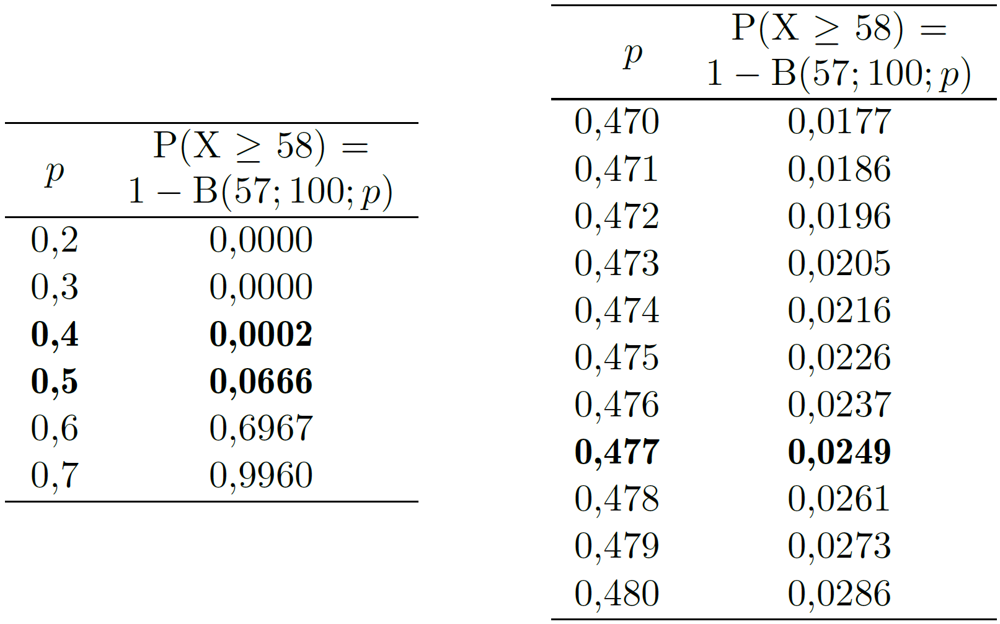
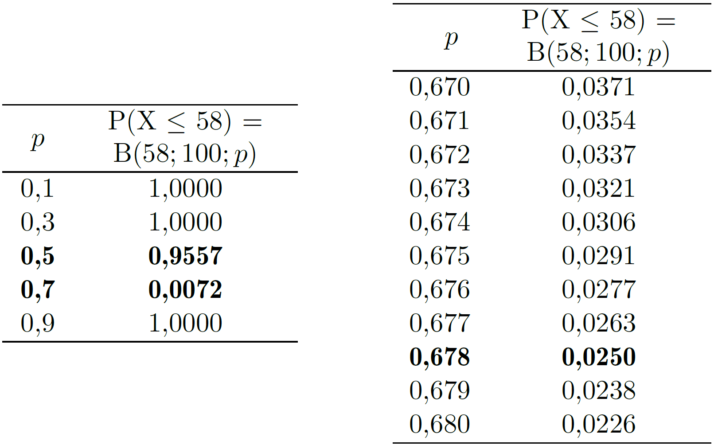

# Estimación de características de la población

Rara vez es posible conocer con exactitud las características de una población. Esto puede deberse a que resulta inviable observar todos sus elementos —como en el caso de los sondeos electorales— o a que la población es, en realidad, un modelo teórico. Por ejemplo, cuando se pone en marcha una máquina y se fabrican algunas unidades para evaluar su funcionamiento, tenemos una muestra con la que valoramos si serán adecuadas las características de todas las unidades que se podrían fabricar en esas condiciones. Todas esas unidades son la población, pero es una población teórica, no existe físicamente.

En cualquier caso, sea la población real o teórica, lo que hacemos es <<estimar>> (hacernos una idea de) las características de interés de esa población a partir de los valores obtenidos en la muestra.

## Estimador puntual

Un estimador puntual, o simplemente estimador, es un número que se calcula a partir de los valores de una muestra y que nos sirve para hacernos una idea de una determinada característica de la población. Si queremos estimar el valor de la media de la población, la media de una muestra representativa de esa población es un buen estimador. Pero no siempre es tan fácil, hemos visto que la varianza de una muestra --aplicando la fórmula <<natural>> de dividir por $n$ la suma de cuadrados--, es un estimador sesgado de la varianza de la población.

Las cualidades de un estimador se valoran por el cumplimiento de unas determinadas propiedades. Las más importantes son:

-   Que sea insesgado, es decir, que no dé errores sistemáticos ni por exceso ni por defecto. Si tomamos muchas muestras y con cada una de ellas calculamos el valor del estimador, como los elementos en las muestras serán distintos (serán los que hayan caído por azar en cada muestra) los valores de ese estimador también serán distintos, pero si  es insesgado se situarán en torno al verdadero valor que tiene en la población. Si existe un error sistemático, por exceso o por defecto, a ese error se le denomina ([@fig-dianas]).
	
-   Que sea preciso. Significa que si calculamos muchos valores de ese estimador, cada uno a partir de una muestra distinta, esos valores presentarán poca variabilidad. Si además el estimador es insesgado esa poca variabilidad estará distribuida en torno al verdadero valor de la magnitud estimada.

{#fig-dianas .fig-normal3 fig-align="center" width="95%"}

::: callout-note
## ¿Por qué nos creemos el resultado obtenido de una muestra sabiendo que si tomáramos otra sería distinto?

Porque sería distinto pero no "muy distinto". Para informar sobre la variabilidad que cabe esperar se da el intervalo de confianza.
:::

## Intervalo de confianza

El estimador puntual apuesta por un valor concreto y sabemos que el verdadero valor andará por ahí, pero no informa sobre si estará muy cerca o si también podría estar bastante lejos.

Un intervalo de confianza ofrece una información más rica, nos dice que el valor que estamos estimando se encuentra --con una probabilidad conocida y que nosotros podemos elegir-- dentro de ese intervalo. Típicamente, en un intervalo de confianza intervienen tres valores:

-   [**Estimación! puntual**]{style="color: #0038CF;"}:	Siempre está dentro del intervalo. Cuando las desviaciones por encima y por debajo de ese valor son igualmente probables se encuentra justo en el centro del intervalo.

-   [**Margen de error**]{style="color: #0038CF;"}: Es el valor que se suma y se resta al estimador puntual para construir el intervalo. En algunos casos, puede ocurrir que el margen de error no sea el mismo por encima y por debajo del estimador puntual.

-   [**Nivel de confianza**]{style="color: #0038CF;"}: Es la probabilidad[^7-1] de que el intervalo incluya el verdadero valor del parámetro estimado.

[^7-1]: Es controvertido usar la palabra "probabilidad" en este contexto, pero a nosotros nos parece que ayuda a entender lo que representa y no es ningún disparate conceptual} 

Que el nivel de confianza sea del 95 % significa que el intervalo se ha construido con un procedimiento que "acierta" (incluye el verdadero valor del parámetro estimado) el 95 % de las veces.

::: callout-note
## ¿Qué es un intervalo de confianza?

Es un intervalo construido a partir de los valores de una muestra. En la práctica solo tenemos una muestra y un intervalo, pero si pudiéramos construir muchos intervalos, cada uno a partir de una muestra distinta, un porcentaje de ellos igual al nivel de confianza incluiría el verdadero valor del parámetro estimado.
:::

Si generamos muestras aleatorias de una población Normal y, a partir de cada una de ellas, calculamos un intervalo de confianza del 95 % para la media de la población ($\mu$) resultará que alrededor del 95 % de esos intervalos incluirá el verdadero valor de $\mu$. Si el intervalo de confianza fuera del 50 %, solo la incluirían aproximadamente la mitad. 

Nosotros tendremos una sola muestra y nos será imposible saber si el intervalo de confianza construido a partir de sus valores incluye el valor estimado o si lo deja fuera. Si supiéramos que está dentro, podríamos decir que es un intervalo de confianza del 100 %, y si supiéramos que está fuera sería del 0 %. Pero no lo sabemos. Un intervalo de confianza del 95 % es como recibir información de una persona que dice la verdad el 95 % de las veces: sabemos que su fiabilidad global es alta, pero nunca podemos estar seguros de si una afirmación concreta es correcta ([@fig-diceLaVerdad]).

{#fig-diceLaVerdad .fig-normal3 fig-align="center" width="95%"}

Hemos dicho que el nivel de confianza lo elegimos nosotros, entonces ¿por qué nos conformamos con el 95 % si podemos establecer el 99 % o incluso el 99,99 %? La respuesta es sencilla: cuanto mayor es el nivel de confianza --cuanto más seguros queremos estar de que el intervalo contiene el valor del parámetro estimado-- más ancho será el intervalo. Esto es lógico, dada una cantidad de información (tamaño de la muestra) la mayor seguridad solo se consigue aumentando la anchura del intervalo, el problema es que si queremos mucha seguridad el intervalo sale tan ancho que la información que aporta es irrelevante.

Supongamos que para estimar la proporción de celíacos en una comunidad se toma una muestra de 100 individuos y que entre ellos se encuentra un celíaco. El estimador puntual es igual al valor en la muestra, en nuestro caso el 1 %. Los intervalos de confianza del 50, 95 y 99,99 % son los que se indican en la [@fig-anchuraIntervalos]. El intervalo de confianza del 99,99 % es tan ancho que no aporta información relevante. No hacía falta realizar ningún estudio para saber que el porcentaje está entre 0,00 % (exactamente 0,00005 %) y el 11,8 %. 

{#fig-anchuraIntervalos .fig-normal3 fig-align="center" width="95%"}

Los intervalos de confianza del 95 % son una buena solución de compromiso entre el nivel de confianza y la anchura del intervalo. Si se desea aumentar el nivel de confianza manteniendo la anchura del intervalo no hay más remedio que aumentar el tamaño de la muestra. 

## Estimación de la media

Pesamos 6 paquetes de café a la salida de la línea de envasado. Esos paquetes se pueden considerar representativos de la producción general y sus pesos, en gramos, son: 995, 987, 1008, 995, 991 y 1007. ¿Qué podemos decir sobre el valor medio con que se están llenando?

### Estimación puntual {.unnumbered}

Si tenemos que dar un valor para el peso medio con que están saliendo los paquetes de café, nuestra mejor apuesta es el peso medio de la muestra obtenida: $\bar{x} = 997.17 \text{g}$. Así de fácil.

Para justificarlo podemos plantear que si $X \sim N(\mu; \sigma)$ y $X_1, X_2, \cdots, X_n$ es una muestra aleatoria de esa población, cada valor de la muestra está tomado de esa misma población y, por tanto, tendrá una esperanza matemática $\text{E}(X_i) = \mu$. Designando la media de la muestra como $\bar{X}$ y usando las propiedades de la esperanza matemática, tenemos:

\begin{equation*} 
	\begin{split}
		\text{E}(\bar{X}) &=\text{E} \left( \frac{X_1+X_2+ \cdots + X_n}{n}\right) =\\[5pt]
		& = \frac{1}{n} \left[\text{E}(X_1)+\text{E}(X_2)+ \cdots +  \text{E}(X_n) \right] =\\[5pt]
		& = \frac{1}{n} \cdot n \cdot \mu= \mu
	\end{split}
\end{equation*}

También podemos comprobar que esto es así usando una población "de prueba" como hicimos en el Apéndice 2.D.
Supongamos que la población está formada por solo 5 elementos, cada uno de ellos con el valor que se indica:

```{=html}
<div class="tabla-wrapper_T0700">
<table class="tabla-02Ape2D_1">

<tr>
<td>(A)</td>
<td>(B)</td>
<td>(C)</td>
<td>(D)</td>
<td>(E)</td>

</tr>

<tr>
<td>3</td>
<td>6</td>
<td>9</td>
<td>12</td>
<td>15</td>
</tr>

 </table>
</div>
```

El valor medio de esos 5 elementos --la media de la población-- es:
$$\mu = \frac{3 + 6 + 9 + 12 + 15}{5} = 9$$
Existen 10 maneras de seleccionar una muestra de 3 elementos de esta población (combinaciones de 5 elementos tomados de 3 en 3). Por tanto, si tomamos una muestra con toda seguridad será una de las que se incluyen en la  tabla \ref{tablaMedias}, puesto que están todas.

```{=html}
<div id="tbl-Dividir_n-1"; class="tabla-wrapper_T0701">
<table class="tabla-0701">

<caption>Tabla 7.1: Medias de las 10 muestras de 3 observaciones que se pueden obtener de una población con 5 elementos.</caption>

<colgroup>
<col style="width: 25%";>
<col style="width: 5.5%";>
<col style="width: 5.5%";>
<col style="width: 5.5%";>
<col style="width: 5.5%";>
<col style="width: 5.5%";>
<col style="width: 5.5%";>
<col style="width: 5.5%";>
<col style="width: 5.5%";>
<col style="width: 5.5%";>
<col style="width: 5.5%";>
</colgroup>

<tbody>
<tr>
<td style="text-align: left;">Muestra nº</td>
<td>1</td>
<td>2</td>
<td>3</td>
<td>4</td>
<td>5</td>
<td>6</td>
<td>7</td>
<td>8</td>
<td>9</td>
<td>10</td>
</tr>

<tr>
<td>Unidades de la muestra</td>
<td>A<br>B<br>C</td>
<td>A<br>B<br>D</td>
<td>A<br>B<br>E</td>
<td>A<br>C<br>D</td>
<td>A<br>C<br>E</td>
<td>A<br>D<br>E</td>
<td>B<br>C<br>D</td>
<td>B<br>C<br>E</td>
<td>B<br>D<br>E</td>
<td>C<br>D<br>E</td></tr>

<tr>
<td>Valores en la muestra</td>
<td>3<br>6<br>9</td>
<td>3<br>6<br>12</td>
<td>3<br>6<br>15</td>
<td>3<br>9<br>12</td>
<td>3<br>9<br>15</td>
<td>3<br>12<br>15</td>
<td>6<br>9<br>12</td>
<td>6<br>9<br>15</td>
<td>6<br>12<br>15</td>
<td>9<br>12<br>15</td>
</tr>

<tr>
<td>Media muestral</td>
<td>6</td>
<td>7</td>
<td>8</td>
<td>8</td>
<td>9</td>
<td>10</td>
<td>9</td>
<td>10</td>
<td>11</td>
<td>12</td>
</tr>

</tbody>
</table>
</div
```

Podemos comprobar que la media de la media muestral $\bar{\bar{x}}$ (parece una redundancia pero es así como hay que decirlo) coincide con la media de la población:
$$\bar{\bar{x}} = \frac{6+7+8+8+9+10+9+10+11+12}{10} = 9$$
Si al tomar una muestra de 3 elementos resulta ser la nº 1 tendremos una media $\bar{x}=6$ y si es la nº 10 tendremos $\bar{x}=12$, valores alejados de la media de la población, mientras que si nuestra muestra es la nº 5 o la nº 7 el valor estimado coincidirá con el real. Cuando usamos la media de una muestra como estimador de la media de la población no podemos saber si hemos tenido suerte y el valor obtenido queda cerca del valor real o si queda lejos, pero podemos tener la seguridad de que si lo calculamos varias veces --cada vez con una muestra distinta-- los valores obtenidos estarán en torno a la media de la población.

::: callout-note
## Ejemplo de estimador sesgado para la media de la población

Si descartamos los tres valores más bajos y calculamos la media del resto de la muestra, tendremos un estimador sesgado de la media de la población.
:::

### Intervalo de confianza para la media {.unnumbered}

Al igual que los estimadores puntuales, los intervalos de confianza se construyen a partir de la información obtenida de una muestra. Nosotros --a efectos didácticos-- vamos a empezar deduciendo su expresión en torno a una sola observación y a continuación la adaptaremos para construirlos en torno a la media de una muestra.

#### En torno a una sola observación {.unnumbered}
En la [@fig-ICmedia] tenemos representada la distribución cuya media $\mu$ se desea estimar. Se han sombreado las colas de forma que la probabilidad de que una observación tomada al azar caiga en esa zona sea igual a $\alpha$ ($\alpha$/2 en cada lado). Por tanto, la probabilidad de que caiga en la zona interior es $1-\alpha$.

{#fig-ICmedia .fig-normal3 fig-align="center" width="95%"}

Veamos cuánto vale la distancia desde la media $\mu$ al punto  $x_{\alpha/2}$ en el que empieza la zona sombreada. Resulta que si $ X \sim \text{N}(\mu; \sigma) $, la nueva variable aleatoria:
$$Z = \frac{X-\mu}{\sigma}$$
sigue una distribución $\text{N}(0; 1)$ y tiene unas características que nos resultan muy útiles, en particular (ver Apéndice 5.A):
$$ \text{P}(X > x_{\alpha/2}) = \text{P} \left ( Z > \frac{x_{\alpha/2} - \mu}{\sigma} \right) $$ 
Por tanto, podemos escribir:
$$ z_{\alpha/2} = \frac{x_{\alpha/2} - \mu}{\sigma} $$

y despejando $x_{\alpha/2}$:
$$ x_{\alpha/2} = \mu + z_{\alpha/2} \cdot \sigma $$
Como el valor de $\alpha/2$ es conocido (lo hemos elegido nosotros) podemos identificar el valor de $Z$ que deja esa área de cola. Por ejemplo, si $\alpha=0.05$, $\alpha/2 = 0.025$ y $z_{0.025}=1.96$. Ya es inmediato deducir que la distancia entre $x_{\alpha/2}$ y $\mu$ es igual a $z_{\alpha/2}\sigma$. Sumando y restando esa distancia a un valor ($x$) obtenido al azar, tenemos el intervalo:
$$x \pm z_{\alpha/2}\sigma $$ 
Observe que si el valor de $x$ está en la zona de probabilidad $1 - \alpha$, tal como ocurre con $x_1$ y $x_2$, el intervalo obtenido incluye el valor de $\mu$. Sin embargo, si $x$ cae en la zona de las colas, como ocurre con $x_3$, el intervalo no llega a alcanzar el valor de $\mu$. Por tanto, los intervalos calculados con este procedimiento aciertan si el valor obtenido al azar cae entre las dos colas de la distribución, y esto ocurre con una probabilidad $1 - \alpha$. Por esta razón se denominan intervalos de confianza $1 - \alpha$. Este nivel de confianza se da normalmente en porcentaje y si $\alpha = 0.05$ hablamos de intervalo de confianza del 95 %.

#### En torno a la media de una muestra {.unnumbered}

La estimación es más precisa --el intervalo de confianza es más estrecho-- si en vez de construirlo en torno a una observación individual lo construimos en torno a la media de una muestra. Veamos algunas características de la media muestral que nos serán útiles para construir el intervalo de confianza.

1.    La media muestral es una variable aleatoria.
	
      Parece que tenemos metido en la cabeza que la media es un número concreto y, efectivamente, así es si nos referimos a una muestra concreta. Por ejemplo, la media de 2, 4, 6 y 8 es igual a 5, un número concreto, de la misma forma que la estatura de Juan, una persona concreta, es de 172 cm. Pero la estatura de una persona genérica es una variable aleatoria de un distribución que podría ser $\text{N}(170\, \text{cm}; 7 \, \text{cm})$. De la misma forma, la media de una muestra aleatoria genérica --no nos referimos a unos valores concretos-- también es una variable aleatoria.
	
2.    En general, podemos considerar que la media muestral tiene distribución Normal.
	
      Si las observaciones provienen de una distribución Normal, la media es una combinación lineal de Normales y, por tanto, también es Normal. Si la población no es exactamente Normal, pero el tamaño de muestra no es muy pequeño, una consecuencia del teorema central del límite\endnote{Se menciona en el capítulo 5. Dice que la suma y, por tanto, también el valor medio, de un conjunto de $n$ variables aleatorias tiende a una distribución Normal a medida que aumenta el valor de $n$. Incluso con datos de distribuciones discretas muy diferentes de la Normal, como el resultado de lanzar un dado, la distribución del valor medio se aproxima a la Normal con valores relativamente pequeños de $n$ (figura 5.1).} es que --a efectos prácticos-- se puede considerar que la media muestral también sigue una distribución Normal.
	
3.    Si los valores de la muestra provienen de una distribución $ X \sim N(\mu; \sigma) $ la media de muestras de tamaño $n$ sigue una distribución $  N(\mu; \frac{\sigma}{\sqrt{n}}) $. 
	
      Al tratar las propiedades del estimador puntual, ya vimos que si $ X \sim N(\mu; \sigma) $ y $\bar{X} = \frac{1}{n} (X_1 + X_2 + \cdots + X_n)$ tenemos que $E(\bar{X}) = \mu$.
	
      Ahora podemos añadir que:
	
      \begin{equation*} \label{eq2}
		      \begin{split}
			      V(\bar{X}) &=V \left( \frac{X_1+X_2+ \cdots + X_n}{n}\right) =\\[5pt]
			      & = \frac{1}{n^2} \left[V(X_1)+V(X_2)+ \cdots +  V(X_n) \right] =\\[5pt]
		      	& = \frac{1}{n^2} \cdot n  \sigma^2 = \frac{\sigma^2}{n}
		      \end{split}
      	\end{equation*}
      Por tanto, la desviación típica de la distribución de la media muestral es igual a $\sigma\sqrt{n}$.
	
En la [@fig-mediaICmedia] hemos representado la distribución de la población (campana gris) y la correspondiente a la media muestral, que tiene menos variabilidad y por tanto es más estrecha y también más alta ya que si están en la misma escala el área debe ser la misma (igual a 1). La media de una muestra es un valor de la distribución de la media muestral, es decir, de la campana estrecha. Su desviación típica es $\sigma/\sqrt{n}$, por tanto:
$$z_{\alpha/2} = \frac{x_{\alpha/2} - \mu} {\frac{\sigma}{\sqrt{n}}} $$
Y ya es inmediato deducir que en este caso la distancia entre $x_{\alpha/2}$ y $\mu$ será: 
$$z_{\alpha/2}\frac{\sigma}{\sqrt{n}}$$

{#fig-mediaICmedia .fig-normal3 fig-align="center" width="95%"}

Siguiendo el mismo razonamiento que para construir el intervalo en torno a una observación individual, en torno a la media de una muestra obtenemos:
$$\bar{x} \pm z_{\alpha/2} \frac{\sigma}{\sqrt{n}} $$
Observe que cuanto mayor es el tamaño de la muestra (mayor valor de $n$) menor es la desviación típica de la distribución de la media muestral y, por tanto, menor es la anchura del intervalo de confianza.

#### ¿Y si no conocemos el valor de $ \sigma $? {.unnumbered}

No conocer el valor de $\sigma$ es lo más habitual, y también lo más lógico, ya que sería extraño conocer el valor de la desviación típica de la población y no conocer el valor de la media. En la expresión del intervalo de confianza lo que hacemos es sustituir el valor de $\sigma$ por su estimador $s$ (desviación típica de la muestra) y esto tiene consecuencias prácticas si la muestra es pequeña.

Conociendo el valor de $\sigma$ teníamos:
$$\frac{X - \mu} {\sigma} = Z \sim \text{N(0; 1)}$$
Al colocar $s$ en el denominador estamos cambiando una constante (el valor de $\sigma$) por una variable aleatoria. Esto provoca que la variable representada por esta nueva expresión tenga mayor variabilidad y ya no siga una distribución N(0; 1) sino otra similar con algo más de variabilidad. A esta nueva distribución se le denomina $t$ de Student[^7-3].

[^7-3]: Esta es una de las distribuciones que más aparecen en los análisis estadísticos. Volverá a tener protagonismo el el capítulo 9 (test de la $t$ de Student) y se describe con más detalle en el Apéndice 9.C}.

$$ \frac{X - \mu} {s} \sim t-\text{Student}$$
La distribución $t$ de Student siempre está relacionada con una estimación del valor de $\sigma$ y su forma depende del tamaño de la muestra utilizada para realizar esa estimación. Si la muestra es grande, pongamos $n>30$, el valor de $s$ tendrá poca variabilidad --cambiará poco si tomamos otra muestra-- y estará próximo a $\sigma$, de manera que la distribución de $t$ no será muy distinta de la de $Z$. Sin embargo, si la muestra es pequeña el valor de $s$ tendrá mayor variabilidad y las distribuciones de $t$ y de $Z$ tendrán mayor diferencia.

Por tanto, la distribución $t$ de Student no es única, sino que depende del tamaño de la muestra con que se calcula la $s$ con la que está asociada. Para identificar a cual nos estamos refiriendo le añadimos un valor que llamamos <<grados de libertad>> y al que asignamos la letra griega $\nu$ (nu) que colocamos como subíndice de $t$. Los grados de libertad tienen una relación inmediata con el tamaño de muestra: $\nu = n-1$.

Ya hemos llegado al final. Cambiamos el valor de $\sigma$ por el de $s$ y el de $z$ por el de $t$ con sus grados de libertad y nos queda:
$$ \bar{x} \pm t_{\nu;\alpha/2} \frac{s}{\sqrt{n}} $$

#### Intervalo de confianza para el peso medio de los paquetes de café {.unnumbered}

Recordemos que los valores de nuestra muestra son (en gramos): 995, 987, 1008, 995, 991 y 1007. Necesitamos conocer:

::: {.columns}

::: {.column width="12%"}
$\bar{x}$:
:::

::: {.column width="88%"}
Ya lo hemos calculado. Es igual a 997,17 g.
:::

:::

::: {.columns}

::: {.column width="12%"}
$t_{5; \, 0.025}$:
:::

::: {.column width="88%"}
Es el valor de una $t$ de Student con 5 grados de libertad ($=n-1$) que deja un área de cola de 0,025. Lo podemos obtener usando una hoja de cálculo o las típicas tablas que se incluyen (o incluían) en los libros de estadística. En nuestro caso, $t_{5; \, 0.025} = 2.571$
:::

:::

::: {.columns}

::: {.column width="12%"}
$s$:
:::

::: {.column width="88%"}
Desviación típica de los valores de la muestra. $s=8.542$.
:::

:::

::: {.columns}

::: {.column width="12%"}
$n$:
:::

::: {.column width="88%"}
Tamaño de la muestra. $n=6$
:::

:::

Aplicando esta fórmula obtenemos que el intervalo de confianza del 95 % para la media de la población es: $997.17 \pm 8.97$.

Los cálculos son muy fáciles de realizar. Lo importante es entender bien qué significa la información que da el intervalo y --como siempre-- asegurarse de que la muestra utilizada es representativa de la población de interés.

## Estimación de una proporción

Deseamos estimar el porcentaje de estudiantes de una universidad que tiene cuenta en una determinada red social, les llamaremos *cumplidores*. Como no podemos preguntar a todos, tomamos una muestra de $n=100$ y resulta que 58 tienen cuenta. ¿Qué podemos decir sobre la proporción en la población?

### Estimación puntual {.unnumbered}

En nuestra muestra el número de cumplidores es $X=58$ pero sabemos que si hubiéramos tomado otra, tan buena como la primera, el resultado podría haber sido otro. En realidad, el valor de $X$ es una variable aleatoria que se ajusta al modelo de la distribución binomial[^7-4] cuyos parámetros son el tamaño de la muestra $n=100$ y la proporción en la población $p$, de valor desconocido.

[^7-4]: En realidad, como el muestreo se hace sin reposición, la proporción $p$ no se mantiene exactamente constante, ya que va variando según el tipo de elementos que se extraen. Sin embargo, si el tamaño de la población es mucho mayor que el de la muestra, esta diferencia es irrelevante a efectos prácticos. 

Hemos visto que la esperanza matemática de una variable aleatoria $X$ con distribución binomial y parámetros $n$ y $p$ es:
$$\text{E}(X) = np $$
La proporción en la muestra $\frac{X}{n}$ también es una variable aleatoria, y recordando las propiedades de la esperanza matemática podemos escribir:
$$\text{E} \left(\frac{X}{n}\right) = \frac{1}{n}\text{E}(X) = \frac{1}{n} np = p$$
Por tanto, la esperanza matemática de la proporción en la muestra es igual a la proporción en la población. Dicho en otras palabras, la proporción en la muestra es un estimador insesgado de la proporción en la población.

Por otro lado, también podemos entender la proporción como una media. Podemos asignar el valor 1 a los que tienen cuenta en esa red social y 0 a los que no la tienen. El promedio de esos valores es la proporción a que nos estamos refiriendo. Si la proporción es una caso particular de valor medio, tiene también las propiedades que ya hemos comentado sobre la media de la muestra como estimador de la media de la población. 

Claro que si decimos que la proporción en la población está en torno al 58 % no está claro si está entre el 56 y el 60 o entre el 50 y el 66. Para informar sobre la precisión de la estimación recurrimos a los intervalos de confianza.

### Intervalo de confianza {.unnumbered}

Existen varios métodos para calcular intervalos de confianza para una proporción[^7-5]. El más habitual se basa en la aproximación de la distribución binomial a la Normal pero vamos a empezar viendo otro denominado "exacto" que se puede usar siempre y que nos parece interesante a efectos didácticos.

[^7-5]: Puede dar un vistazo a "Binomial proportion confidence interval" en la Wikipedia.

#### Método exacto {.unnumbered}

Empezamos identificando el valor de la proporción $p_1$ de cumplidores en la población que da una probabilidad de 0,025 de tener 58 o más cumplidores en una muestra de $n\,$=100 individuos. Observe que si $p$ es grande --pongamos 90 %-- será muy probable tener 58 o más cumplidores, mientras que si $p$ es bajo --pongamos del 10 %-- esa probabilidad será prácticamente nula.

En la tabla \ref{extInfIC} hemos realizado un barrido de valores de $p$ calculando para cada uno de ellos la probabilidad buscada, el uso de una hoja de cálculo facilita mucho esta tarea. En la tabla de la izquierda vemos que esa proporción está entre 0,4 y 0,5. Realizando barridos cada vez más finos llegamos a que el valor de $p_1$ con tres decimales es igual a 0,477.

De manera análoga podemos calcular  el valor de $p_2$ que da una probabilidad de 0,025 de tener 58 o menos cumplidores. La tabla \ref{extSupIC} muestra el barrido realizado para llegar a que el valor de $p_2$ es igual a 0,678.

{#fig-intervaloExacto .fig-normal3 fig-align="center" width="95%"}

Por tanto, dadas las evidencias que tenemos ($n$=100; $X$=58) podemos afirmar que es poco probable que la proporción en la población sea menor del 44,7\% y también es poco probable que supere el 67,8\%. Concretamente, ese ``poco probable'' significa una probabilidad del 2,5\%. Luego la probabilidad de que se encuentre entre el 47,7 y el 67,8\% es del 95\%. Ese es el intervalo de confianza del 95\%.

<div style="width: 100%;">
  <table style="width: 100%;">
    <caption style="caption-side: bottom; text-align: center; line-height: 1.2;">
      Tabla 7.2: Determinación de la proporción en la población (p) que da una probabilidad de 0,025 de tener un número de cumplidores <strong>igual o mayor</strong> que los obtenidos en la muestra.
    </caption>
  </table>
</div>


{fig-align="center" width="70%"}

<div style="width: 100%;">
  <table style="width: 100%;">
    <caption style="caption-side: bottom; text-align: center; line-height: 1.2;">
      Tabla 7.3: Determinación de la proporción en la población (p) que da una probabilidad de 0,025 de tener un número de cumplidores <strong>menor o igual</strong> que los obtenidos en la muestra.
    </caption>
  </table>
</div>


{fig-align="center" width="70%"}


