# Contraste de hipótesis

Los test estadísticos se basan en un esquema de razonamiento llamado *contraste de hipótesis*. Consiste en plantear una hipótesis conservadora (hipótesis nula), por ejemplo: <"os resultados en el grupo tratado con el nuevo fármaco no son mejores que los del grupo tratado con un placebo". Frente a ella, se plantea una hipótesis alternativa, que corresponde a lo que asumimos si los datos --la evidencia empírica-- están en contradicción con la hipótesis inicial. Entendemos que existe contradicción cuando, de ser cierta la hipótesis conservadora, resultaría muy poco probable obtener unos datos como los observados.

Típicamente, este análisis consiste en realizar ciertos cálculos con los datos para obtener un número que luego se compara con los que aparecen en una tabla para llegar a lo que llamamos "$p$-valor", una especie de número mágico que indica la decisión que se debe tomar. Ese $p$-valor también se puede obtener directamente mediante un programa informático, pero tanto si se calcula a mano o con ordenador, con frecuencia no se llega a comprender la lógica que hay detrás del proceso seguido.

En este capítulo, de una forma quizá un poco heterodoxa, vamos a ver en qué consiste esto del contraste de hipótesis. 

## Empezamos con un reto: Los dados de Wolf

Rudolf Wolf (1816-1893) fue un astrónomo suizo conocido por sus investigaciones sobre las manchas solares. También tenía interés --los científicos de la época solían tener una amplia gama de intereses-- en el cálculo de probabilidades. Algunas fuentes[^8-1] indican que, para verificar el cumplimiento de las leyes del cálculo de probabilidades, lanzó 20\;\!000 veces un par de dados --uno blanco y otro rojo-- obteniendo los resultados que se muestran en la [@fig-tablaDadosWolf].

[^8-1]: Nosotros descubrimos estos datos en el libro de M. G. Bulner: Principles of Statistics, Ed. Dover, 1979. La publicación original que se cita (Czuber, 1903) puede consultarse [aquí](https://archive.org/details/wahrscheinlichk01czubgoog), pág. 118).

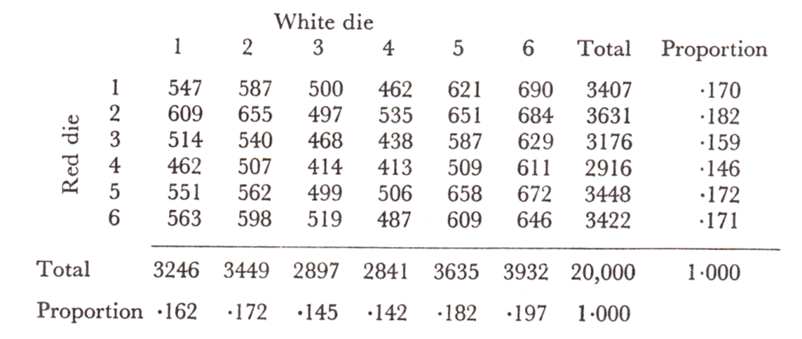{#fig-tablaDadosWolf .fig-normal0 fig-align="center" width="90%"}

Vamos a fijarnos en los resultados obtenidos con cada dado de forma independiente. No esperamos que todos los resultados aparezcan el mismo número de veces; sabemos que si, por ejemplo, lanzamos 60 veces un dado, no necesariamente va a salir 10 veces cada uno de los resultados posibles, sino que existirá una cierta variabilidad en torno a ese 10, que es el valor teórico esperado. De la misma forma, en nuestro caso, el número de veces que saldrá cada valor estará en torno a $3\;\!333.33$ ($=20\;\!000/6$). Sin embargo, al observar los totales que aparecen en la tabla, podría dar la impresión de que la variabilidad es demasiado grande. 

El reto que nos planteamos es responder a la pregunta: ¿podemos afirmar que esos dados no estaban bien equilibrados?

::: callout-note
## ¿Qué entendemos por "dados equilibrados"?

Consideramos que los dados están equilibrados, a menos que los resultados obtenidos al lanzarlos contradigan esa suposición. Desde una perspectiva puramente matemática, es seguro que un dado real no está perfectamente equilibrado —no todos los resultados tienen ***exactamente*** la misma probabilidad de ocurrir--, pero nosotros nos situamos en el terreno de la práctica, no de los modelos teóricos.
:::

Suponemos que el proceso de lanzamiento de los dados es correcto y que la anotación de los resultados se ha realizado sin errores. Seguramente esto es fácil si se realizan unos pocos lanzamientos, pero si se realizan $20\;\!000$ ya no lo es tanto. En cualquier caso, si los resultados no son los esperados, vamos a atribuir esa desviación a los dados y no al proceso de lanzamiento. 

### Representación gráfica de los datos

Aunque en este caso tenemos pocos datos, siempre es una buena idea representarlos gráficamente ([@fig-grafDadosWolf]).

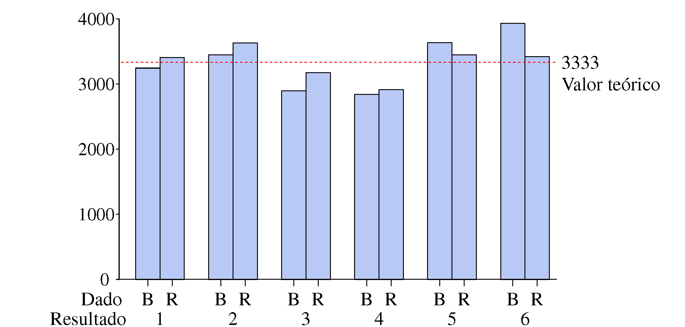{#fig-grafDadosWolf .fig-normal0 fig-align="center" width="90%"}

Vemos que los valores 3 y 4 --especialmente el 4-- aparecen claramente menos de lo previsto en ambos dados. También destaca el valor 6 del dado blanco, que aparece bastante más. El quid de la cuestión está en dilucidar si esas diferencias son fruto del azar y, por tanto, perfectamente normales o si es muy poco probable que se den por casualidad, en cuyo caso sería más razonable considerar que los dados no están equilibrados.

::: callout-note
## ¡Gráficos!

Aunque pueda parecer innecesario, una adecuada representación gráfica de los datos siempre ayuda a ver más claramente la información que contienen, y permiten detectar patrones o anomalías que podrían pasar desapercibidos en una tabla.
:::

Unos opinarán una cosa y otros otra, pero ya sabemos que no necesariamente tendrá razón el que defienda su punto de vista con más vehemencia. Lo que nos interesa son argumentos --seguramente usando el lenguaje de la probabilidad-- que sean convincentes. Vamos a ver como encontrar esos argumentos. 

### Medida de discrepancia entre resultados teóricos y observados {.unnumbered}

La [Tabla 8.1](#tbl-dadosWolf) resume los valores obtenidos con cada dado y su diferencia con el valor teórico ($=3\;\!333$) en valor absoluto.

```{=html}
<div id="tbl-dadosWolf"; class="tabla-wrapper_T0801">
<table class="tabla-0801">

<caption>Tabla 8.1: Discrepancia entre los resultados obtenidos y los teóricos (=20.000/6).</caption>

<colgroup>
<col style="width: 10%";>
<col style="width: 25%";>
<col style="width: 10%";>
<col style="width: 10%";>
<col style="width: 10%";>
<col style="width: 10%";>
<col style="width: 10%";>
<col style="width: 10%";>
</colgroup>

<tbody>
<tr>
  <td class="sin-borde"></td>
  <td class="sin-borde"></td>
  <td colspan="6">Resultados</td>
</tr>

<tr>
  <td class="sin-borde"></td>
  <td class="sin-borde"></td>
  <td>1</td>
  <td>2</td>
  <td>3</td>
  <td>4</td>
  <td>5</td>
  <td>6</td>
</tr>

<tr>
  <td rowspan="3">Dado <br> Blanco</td>
  <td class="sin-inf"> Valor obtenido </td>
  <td class="sin-inf"> 3.246 </td>
  <td class="sin-inf"> 3.449 </td>
  <td class="sin-inf"> 2.897 </td>
  <td class="sin-inf"> 2.841 </td>
  <td class="sin-inf"> 3.635 </td>
  <td class="sin-inf"> 3.932 </td>
</tr>

<tr>
  <td class="sin-borde"> Discrepancia </td>
  <td rowspan="2" class="sin-sup">87</td>
  <td rowspan="2" class="sin-sup">116</td>
  <td rowspan="2" class="sin-sup">436</td>
  <td rowspan="2" class="sin-sup">492</td>
  <td rowspan="2" class="sin-sup">302</td>
  <td rowspan="2" class="sin-sup">599</td>
</tr>

<tr>
  <td class="sin-borde"> |Obtenido - Teórico| </td>
</tr>

<tr>
  <td rowspan="3">Dado <br> Rojo</td>
  <td class="sin-inf"> Valor obtenido </td>
  <td class="sin-inf"> 3.407 </td>
  <td class="sin-inf"> 3.631 </td>
  <td class="sin-inf"> 3.176 </td>
  <td class="sin-inf"> 2.916 </td>
  <td class="sin-inf"> 3.448 </td>
  <td class="sin-inf"> 3.422 </td>
</tr>

<tr>
  <td class="sin-borde"> Discrepancia </td>
  <td rowspan="2" class="sin-sup">74</td>
  <td rowspan="2" class="sin-sup">298</td>
  <td rowspan="2" class="sin-sup">157</td>
  <td rowspan="2" class="sin-sup">417</td>
  <td rowspan="2" class="sin-sup">115</td>
  <td rowspan="2" class="sin-sup">89</td>
</tr>

<tr>
  <td class="sin-sup"> |Obtenido - Teórico| </td>
</tr>


</tbody>
</table>
</div
```

Ahora se trata de resumir en un solo número la discrepancia entre los valores esperados y los observados. Algunas opciones son:

-   Suma de las discrepancias en valor absoluto. En el caso del dado rojo tendremos: $74+298+157+417+115+89 = 1\;\!150$. Es necesario realizar la suma de los valores absolutos porque si mantenemos los signos siempre dará igual a cero.
	
-   Suma de los cuadrados de las discrepancias. Elevar al cuadrado el valor de la discrepancia es otra forma de evitar que los valores positivos y negativos se anulen entre sí.. 
	
-   La discrepancia máxima. No hay que hacer cálculos. Para el dado rojo es 417 y para el blanco 599.

Cualquiera nos valdría, y también podemos pensar en otras que requieren más cálculos. Vamos a optar por la más sencilla: la discrepancia máxima. A esta medida le llamamos **estadístico de prueba**.

### ¿Qué valor cabe esperar del estadístico de prueba? {.unnumbered}

La discrepancia máxima es una variable aleatoria. Si lanzamos $20\;\!000$ veces un dado perfectamente equilibrado, obtendremos un valor de esa discrepancia, pero si repetimos el experimento realizando otros $20\;\!000$ lanzamientos, el valor será otro.

No vamos a repetir el experimento poniéndonos a lanzar dados, podemos simular los resultados que se obtendrían utilizando una hoja de cálculo como la que se muestra en la [@fig-excelDados]. En la primera columna colocamos los resultados obtenidos al lanzar $20\;\!000$ veces un dado [=aleatorio.entre(1;6)]{style="font-family: monospace;"}. En la segunda tenemos la frecuencia de cada uno de los valores que pueden salir [=CONTAR.SI(A\$2:A\$20001;1)]{style="font-family: monospace;"}. En la tercera columna calculamos la diferencia --en valor absoluto-- entre la frecuencia observada y la esperada [para 1: [=ABS(3333-B2)]{style="font-family: monospace;"}. Finalmente, en la cuarta columna, determinamos el valor máximo de la discrepancia [=MAX(C2:C7)]{style="font-family: monospace;"}.

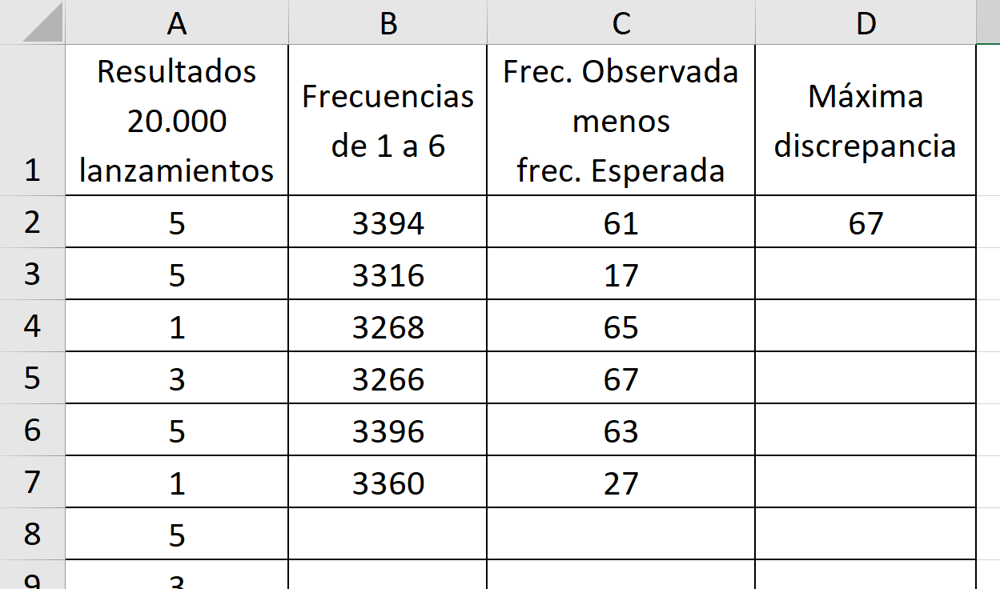{#fig-excelDados .fig-normal3 fig-align="center" width="60%"}

Para repetir la simulación y obtener otro valor de la discrepancia máxima, basta con pulsar [F9]{style="font-family: monospace;"} si se usa Excel o [Ctr+R]{style="font-family: monospace;"} en Google Sheets. Podemos ir anotando los valores que van saliendo[^8-2]. La [Tabla 8.2](#tbl-excelDados) contiene los resultados obtenidos en tres simulaciones destacando en negrita el valor de la discrepancia máxima en cada caso.

[^8-2]: Tal como se ha hecho en el Apéndice 7.B para simular el proceso de estimación del número de taxis que hay en una ciudad. 

```{=html}
<div id="tbl-Encima">
<table class="tabla-0802_Titulo">
<caption>Tabla 8.2: Tres simulaciones de los resultados obtenidos al lanzar 20000 veces un dado. (Res.: Resultados, Frec.: Frecuencia, Discrep.: Discrepancia).</caption>
<tr style="height:0;"><td style="padding:0;"></td></tr>
</table>
</div>
```

::: columns
::: {.column width="33%"}
```{=html}
<div class="tabla-wrapper_T0802">
<table class="tabla-0802">

<colgroup>
<col style="width: 8%;">
<col style="width: 11%;">
<col style="width: 11%;">
</colgroup>

<tbody>
<tr>
  <td colspan="3">Simulación 1</td>
</tr>

<tr>
  <td>Res.</td>
  <td>Frec.</td>
  <td>Discrep.</td>
</tr>

<tr>
  <td>1</td>
  <td>3362</td>
  <td>29</td>
</tr>

<tr>
  <td>2</td>
  <td>3318</td>
  <td>15</td>
</tr>

<tr>
  <td>3</td>
  <td>3326</td>
  <td>7</td>
</tr>

<tr>
  <td>4</td>
  <td>3368</td>
  <td><strong>35</strong></td>
</tr>

<tr>
  <td>5</td>
  <td>3302</td>
  <td>31</td>
</tr>

<tr>
  <td>6</td>
  <td>3324</td>
  <td>9</td>
</tr>

</tbody>
</table>
</div>
```
:::

::: {.column width="33%"}
```{=html}
<div class="tabla-wrapper_T0802">
<table class="tabla-0802">

<colgroup>
<col style="width: 8%;">
<col style="width: 11%;">
<col style="width: 11%;">
</colgroup>

<tbody>
<tr>
  <td colspan="3">Simulación 2</td>
</tr>

<tr>
  <td>Res.</td>
  <td>Frec.</td>
  <td>Discrep.</td>
</tr>

<tr>
  <td>1</td>
  <td>3335</td>
  <td>2</td>
</tr>

<tr>
  <td>2</td>
  <td>3388</td>
  <td>55</td>
</tr>

<tr>
  <td>3</td>
  <td>3230</td>
  <td><strong>103</strong></td>
</tr>

<tr>
  <td>4</td>
  <td>3316</td>
  <td>17</td>
</tr>

<tr>
  <td>5</td>
  <td>3394</td>
  <td>61</td>
</tr>

<tr>
  <td>6</td>
  <td>3337</td>
  <td>4</td>
</tr>

</tbody>
</table>
</div>
```
:::

::: {.column width="33%"}
```{=html}
<div class="tabla-wrapper_T0802">
<table class="tabla-0802">

<colgroup>
<col style="width: 8%;">
<col style="width: 11%;">
<col style="width: 11%;">
</colgroup>

<tbody>
<tr>
  <td colspan="3">Simulación 3</td>
</tr>

<tr>
  <td>Res.</td>
  <td>Frec.</td>
  <td>Discrep.</td>
</tr>

<tr>
  <td>1</td>
  <td>3340</td>
  <td>7</td>
</tr>

<tr>
  <td>2</td>
  <td>3329</td>
  <td>4</td>
</tr>

<tr>
  <td>3</td>
  <td>3393</td>
  <td><strong>60</strong></td>
</tr>

<tr>
  <td>4</td>
  <td>3374</td>
  <td>41</td>
</tr>

<tr>
  <td>5</td>
  <td>3273</td>
  <td><strong>60</strong></td>
</tr>

<tr>
  <td>6</td>
  <td>3291</td>
  <td>42</td>
</tr>

</tbody>
</table>
</div>
```
:::
:::

Pero lo más efectivo es realizar un pequeño programa que repita este proceso muchas veces guardando cada vez el valor de la discrepancia máxima. La [@fig-tablaDadosWolf] muestra la distribución de los $100\;\!000$ valores obtenidos al repetir la simulación ese número de veces. Valores como 65, 120 o 97 son perfectamente normales. Si la discrepancia máxima obtenida en el experimento realizado por Wolf fuera de ese orden de magnitud no habría nada que decir sobre la calidad del dado. Si hubiera salido del orden de 200 diríamos que es muy poco probable que la discrepancia tenga un valor tan grande, no sería un valor imposible pero sí tan poco probable que lo más razonable sería considerar que el dado no está equilibrado.

"La rareza" de un resultado lo medimos por la probabilidad de tener un valor como ese o mayor . La [Tabla 8.3](#tbl-Proporcion) muestra la proporción de veces (que asimilamos a la probabilidad) que la discrepancia máxima da un valor igual o mayor a los indicados.

```{=html}
<div id="tbl-Proporcion" class="tabla-wrapper_T0803">
<div class="tabla-caption">
  Tabla 8.3: Proporción de veces que son superados los valores que se indican.
</div>

<table class="tabla-0803">

<colgroup>
<col style="width: 8%;">
<col style="width: 19%;">
</colgroup>

<tbody>
<tr>
  <td>Valor</td>
  <td> Proporción de <br> veces que es <br> superado </td>
</tr>

<tr>
  <td>138</td>
  <td>0,04879</td>
</tr>

<tr>
  <td>164</td>
  <td>0,01013</td>
</tr>

<tr>
  <td>165</td>
  <td>0,00961</td>
</tr>

<tr>
  <td>198</td>
  <td>0,00089</td>
</tr>

</tbody>
</table>
</div>
```

Podríamos haber fijado un valor frontera --ligado a la probabilidad de ser superado-- y considerar que los dados están desequilibrados si nuestro resultado supera ese valor. De cualquier forma, en nuestro caso la discrepancia está tan claramente alejada de los valores ``normales'' que --suponiendo que el proceso de lanzamiento era correcto-- podemos asegurar que los dados no estaban equilibrados. Sin ninguna duda. ([@fig-simulaDadosWolf])

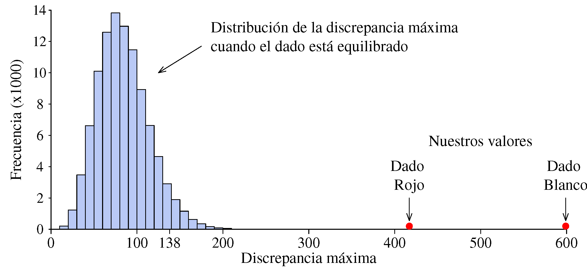{#fig-simulaDadosWolf .fig-normal5 fig-align="center" width="100%"}

### ¿Cómo hemos razonado? {.unnumbered}

Podemos resumir el proceso seguido en los siguientes pasos:

-   De entrada hemos supuesto que los dados estaban equilibrados ya que entendemos que eso es lo normal. La carga de la prueba la tienen los que afirman algo singular, especial, excepcional. En este caso que los dados no estaban equilibrados.
	
    En la jerga estadística, a la hipótesis que se supone cierta a no ser que las evidencias --los datos-- estén en contradicción con ella, se denomina **hipótesis nula**, $\text{H}_0$. A lo que ocurre si se rechaza la hipótesis nula se denomina **hipótesis alternativa**, $\text{H}_1$.

-   A partir de los datos hemos calculado un valor relevante respecto al tema en discusión, en nuestro caso una medida de la discrepancia entre la frecuencia observada y la frecuencia esperada (le podríamos llamar "teóricamente esperada"). A este valor que, de alguna manera, refleja la discrepancia de los datos con la hipótesis nula le llamamos **estadístico de prueba**.
	
-   Hemos construido la distribución a la que debe pertenecer el estadístico de prueba si la hipótesis nula es cierta. A esta distribución le llamamos **distribución de referencia**.
	
-   Nos preguntamos si es razonable considerar que el estadístico de prueba pertenece a la distribución de referencia. Un forma de hacerlo es calcular la probabilidad de que en la distribución de referencia se dé un valor como el del estadístico de prueba o mayor. A esa probabilidad se le denomina **$p$-valor**. Si el $p$-valor es muy pequeño consideramos que los datos no son coherentes con la hipótesis nula y nos quedamos con la alternativa.  

Vamos a seguir con otros ejemplos porque hay más aspectos que observar en esta forma de razonamiento.

## Paquetes de café: ¿Salen con el peso correcto?

Una máquina automática llena paquetes de café y, cada cierto tiempo se pesa un paquete para verificar que se están llenando con el peso previsto. Si la desviación respecto al objetivo sobrepasa un cierto valor se para la máquina y se reajusta. La pregunta que nos hacemos es: ¿cuál debe ser el valor de la desviación a partir del cual  se debe parar y reajustar la máquina?

"Ajustar" la máquina cuando en realidad ya está ajustada, no solo hace perder el tiempo sino que también aumenta la variabilidad final. Si el objetivo es llenar los paquetes con 1000 g, tomamos uno y pesa 1015, este puede ser un valor perfectamente compatible con que la máquina está bien ajustada, siendo la diferencia de 15 g debida a la variabilidad intrínseca del proceso de llenado. Sin embargo, si ignoramos esa variabilidad y entendemos esa desviación como una señal de que los paquetes se están llenando con 15 g de más, intentaremos "corregirla" centrándolo en 15 g menos y el resultado será que lo centraremos en 985 g. A continuación seguramente ocurrirá que tomaremos otro paquete y pesará 980 g con lo que subiremos 20 g el peso medio centrándolo en 1005 g. Así, lo que se irá haciendo es ir moviendo la "campana" de la distribución de los pesos y acabaremos teniendo mayor variabilidad que si no hubiéramos tocado nada ([@fig-sobreAjuste]).

{#fig-sobreAjuste .fig-normal3 fig-align="center" width="100%"}

::: callout-note
## Si no hubiera variabilidad sería muy fácil

Si a la salida de la máquina todos los paquetes pesaran exactamente lo mismo sería muy fácil saber si se ha producido un desajuste. Pero la realidad no es así, siempre hay variabilidad. Por eso hay que echar mano de la estadística para tomar una decisión.
:::

Necesitamos aplicar un criterio que tenga en cuenta la variabilidad natural del peso de los paquetes. No será un criterio infalible; podrá ocurrir que el proceso se desajuste y, en una primera observación, no seamos capaces de detectarlo o que, por el contrario, consideremos que se ha desajustado cuando en realidad no lo está. No obstante, con la estadística podremos calcular los riesgos de que estos errores ocurran y veremos también cómo podemos reducirlos.

### A partir del peso de un solo paquete {.unnumbered}

Para saber si el peso de un paquete está dentro de lo esperado es necesario conocer cómo se distribuyen los pesos cuando todo funciona correctamente.

Vamos a suponer que tenemos muchos datos históricos. Podemos construir un histograma con esos datos y sobre la misma escala situar el valor obtenido. Pueden darse situaciones como las que se muestran en la [@fig-pesosCafe_1]. 

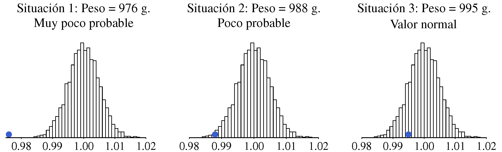{#fig-pesosCafe_1 .fig-normal5 fig-align="center" width="100%"}

Las conclusiones en cada caso serán:

-   Situación 1: Es muy poco probable que el peso de un paquete sea tan bajo si se están llenando en torno al valor objetivo. Entre los $5\;\!000$ valores con que se ha construido el histograma, no hay ninguno igual o inferior al que hemos obtenido. Lo más razonable es parar y revisar la máquina.
	
-   Situación 2: Es poco probable que el peso de un paquete sea tan bajo. Entre los $5\;\!000$ valores históricos solo hay 35 con un peso igual o inferior. Lo más razonable también es parar y revisar la máquina.
	
-   Situación 3: Un peso como el obtenido es perfectamente normal cuando los paquetes se están llenando de forma correcta. No hay ninguna razón para parar la máquina.
	
Si en la variabilidad del peso influyen muchas pequeñas causas y son igualmente probables las desviaciones por exceso que por defecto, esa variabilidad seguirá el patrón de la distribución Normal. En nuestro caso también lo podemos confirmar por la forma que tiene el histograma. 

A partir de los datos históricos se pueden estimar la media y la desviación típica, que resultan ser: $\mu = 1000$ y $\sigma = 5$. Como tenemos muchos datos, casi no habrá diferencia entre los valores estimados y los reales.

Utilizando esa distribución Normal como distribución de referencia y dado el peso de un paquete, $X$, podemos calcular la probabilidad de tener un valor como ese o más alejado del objetivo. En las situaciones que hemos comentado tenemos:

-   Situación 1: $P(X < 976) = 8 \cdot 10^{-7}$: Probabilidad muy pequeña. Es necesario ajustar la máquina.

-   Situación 2: $P(X < 988) = 0.0082$. Es muy poco probable tener ese valor si la máquina está bien ajustada. Lo más razonable es considerar que no lo está.

-   Situación 3: $P(X < 995) = 0.16$: No hay ninguna razón para considerar que no está bien ajustada.
	
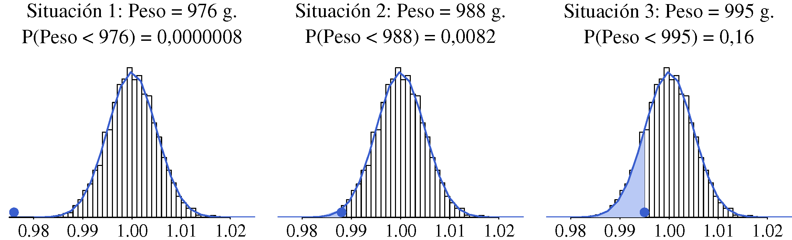{#fig-pesosCafe_2 .fig-normal5 fig-align="center" width="100%"}

Vamos a repasar el razonamiento realizado en este caso, que será el mismo que en el ejemplo anterior, insistiendo en los conceptos que ya hemos visto e introduciendo alguno nuevo.

-   De entrada suponemos que la máquina se mantiene ajustada (hipótesis nula). Eso es lo normal. Solo consideraremos que se ha desajustado (hipótesis alternativa) si los datos disponibles ("el dato" en este caso) están en contradicción con ese supuesto.
	
-   Tomamos un valor (estadístico de prueba) que servirá para valorar el desajuste. En general hay que calcularlo a partir de los datos disponibles, pero en este caso es el mismo dato, tal cual. Sabemos como se distribuye ese valor cuando la hipótesis nula es cierta.
	
-   Calculamos la probabilidad ($p$-valor) de que si todo marcha bien se dé una distancia como la observada --o mayor-- respecto al valor objetivo. Si esa probabilidad es pequeña se rechaza la hipótesis nula y nos quedamos con la alternativa.
	
Para automatizar la toma de decisiones, podemos fijar un valor frontera para el $p$-valor. Por ejemplo, si $p$-valor $\leq$ 0,05 se rechaza la hipótesis nula. Esta probabilidad que fijamos como frontera entre lo "raro" y lo "normal" se llama **nivel de significación** y al valor de la variable que corresponde a esa probabilidad le llamamos **valor crítico**.

::: callout-note
## ¿Por qué el 5 % es el valor habitual para el nivel de significación?

Porque cuando se construyeron las primeras tablas estadísticas, con medios de cálculo rudimentarios, se eligieron valores críticos para probabilidades que eran números redondos en nuestro sistema decimal: 0,5 %, 1 %, 5 %, 10 %. Si tuviéramos 4 dedos en cada mano, seguramente la frontera se hubiera puesto en el 4 % 
:::

Observe que, si la hipótesis nula es cierta, existe una probabilidad igual al nivel de significación de que sea "injustamente" rechazada ([@fig-errorTipoII], parte superior). Por esta razón en algunos contextos se le llama probabilidad de falsa alarma o de falso positivo; o, de una manera más general pero también más críptica: probabilidad de error tipo I. Lo bueno de todo esto es que nosotros decidimos qué probabilidad de error de este tipo estamos dispuestos a asumir.

También puede ocurrir  que el proceso se haya desajustado pero el valor obtenido no llegue a la zona de rechazo (falso negativo o error tipo II). No encontrar evidencias de incumplimiento de la hipótesis nula no significa que se haya demostrado que es cierta.

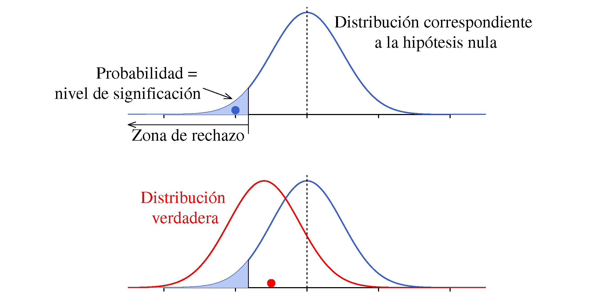{#fig-errorTipoII .fig-normal6 fig-align="center" width="100%"}

Es habitual usar la analogía de un juicio para explicar el tipo de razonamiento que realizamos en el contraste de hipótesis. En un juicio, la hipótesis nula es que el acusado es inocente. Solo se le declara culpable si las pruebas o evidencias disponibles contradicen de manera clara la hipótesis de inocencia. Se le considera inocente a menos que se demuestre lo contrario, pero nunca se demuestra que es inocente. Del mismo modo, en estadística nunca demostramos que la hipótesis nula es verdadera; únicamente evaluamos si la evidencia es lo suficientemente fuerte como para rechazarla.

```{=html}
<div id="tbl-Analogia" class="tabla-wrapper_T0803">
<table  margin: auto class="tabla-0804">

<caption>Tabla 8.4: Analogía entre juicio y contraste de hipótesis.</caption>

<colgroup>
<col style="width: 14%;">
<col style="width: 10%;">
<col style="width: 25%;">
<col style="width: 25%;">
</colgroup>

<tbody>
<tr>
  <td colspan="2"></td>
   <td colspan="2">Tribunal declara al acusado...<br> [<em>lo que decidimos</em>]</td>
</tr>

<tr>
  <td colspan="2"></td>
   <td>No culpable</td>
   <td>Culpable</td>
</tr>

<tr>
  <td rowspan="2">El acusado es: <br> [<em>la realidad</em>]</td>
  <td>Inocente</td>
  <td style="background-color: #ccffcc;">Decisión correcta</td>
  <td style="background-color: #ffcccc;">Error tipo I</td>
</tr>

<tr>
  <td>Culpable</td>
  <td style="background-color: #ffcccc;">Error tipo II</td>
  <td style="background-color: #ccffcc;">Decisión correcta</td>
</tr>

</tbody>
</table>
</div>
```

Si solo estamos interesados en las desviaciones hacia un lado, por ejemplo, solo nos preocupa dar menos peso del anunciado, esa probabilidad de error se concentra en un solo lado de la distribución (una sola *cola* en el argot habitual). Si nos preocupan las desviaciones tanto por exceso como por defecto debemos repartir el riesgo entre los dos extremos (las dos colas). En este caso también el $p$-valor se multiplica por dos para compararlo con el nivel de significación, ya que entendemos que la desviación que observamos hacia un lado también se podría haber dado hacia el otro.

### A partir del valor medio de una muestra {.unnumbered}

No hay que confundir una media con una observación individual. Las medias tienen menos variabilidad y concentran más información que las observaciones individuales, de manera que siempre es preferible decidir en base al valor de una media. 

 En la [@fig-distMedia] hemos representado la distribución de los pesos de los paquetes de café con la distribución Normal que mejor se adapta al histograma de los datos históricos ($\mu = 1$ kg; $\sigma = 0.005$ kg) con un valor (punto azul) que tiene una probabilidad de 0,008 de ser superado. También hemos representado la distribución que siguen las medias de muestras de $n=4$ observaciones ($\mu=1$; $\sigma = 0.005/\sqrt{4}$) con un punto rojo "igual de raro" (con la misma probabilidad de ser superado) que la observación individual. El punto rojo aparece como un valor normal en la distribución de las observaciones individuales, pero no lo es en la distribución a la que verdaderamente pertenece. 
 
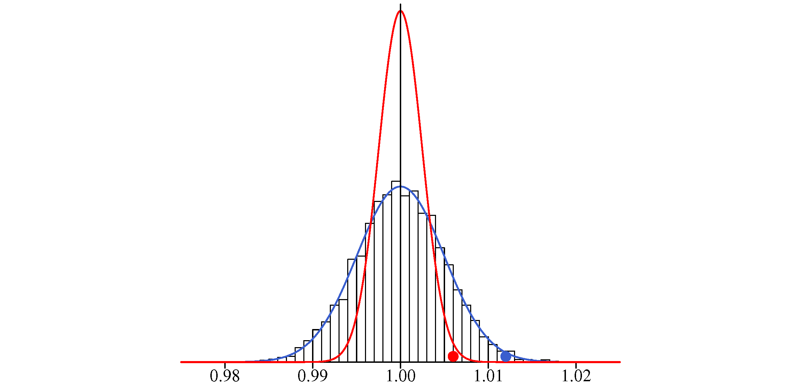{#fig-distMedia .fig-normal6 fig-align="center" width="100%"}

::: callout-note
## Media de una muestra frente a observación individual: No son lo mismo

El valor de una media y el de una observación individual no se distinguen en nada. Son del mismo orden de magnitud y tienen el mismo aspecto y las mismas unidades, pero no son lo mismo. No tienen la misma variabilidad ni pertenecen a la misma distribución. Hay que tener cuidado de no confundirse. 
:::

Es mejor decidir en base al valor de una media, no tanto para disminuir la probabilidad de error Tipo I (rechazar la hipótesis nula cuando en realidad es cierta) que siempre podemos fijar en el valor que nos interesa, sino para --una vez fijada esa probabilidad-- disminuir la probabilidad de error Tipo II, es decir, de no rechazar la hipótesis nula cuando es falsa. 

En la [@fig-errorTipoIImedias] tenemos la distribución de los valores individuales y la correspondiente a las medias de 4 observaciones. En ambas distribuciones podemos fijar el valor que tiene una probabilidad de 0,05 de ser sobrepasado (hacia los valores bajos en nuestro caso).

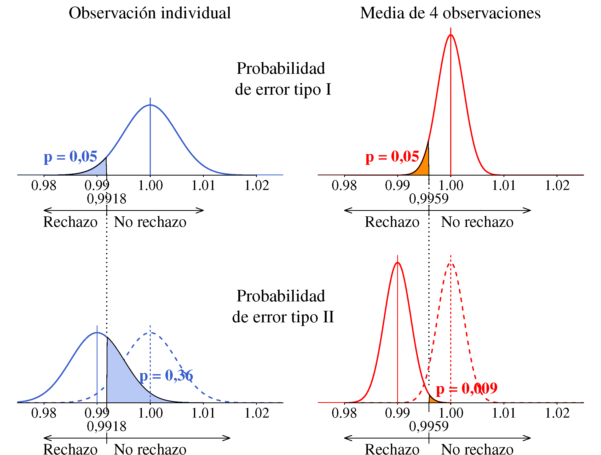{#fig-errorTipoIImedias .fig-normal6 fig-align="center" width="100%"}

Los valores críticos se han calculado haciendo:

-   Observación individual: 

    $z_{0.05} = \dfrac{x-\mu}{\sigma}  \rightarrow 1.645 = \dfrac{x-1}{0.005}  \rightarrow x = 0.9918$

-   Media de 4 observaciones: 

    $z_{0.05} = \dfrac{\bar{x}_4 - \mu}{\sigma/\sqrt{n}} \rightarrow  1.645 = \dfrac{\bar{x}_4-1}{0.005/\sqrt{4}} \rightarrow \bar{x}_4 = 0.9959$

De manera que si un paquete pesa menos de 0,9918 g o la media de 4 no llega a 0,9959, con una probabilidad de error de 0,05 consideraremos que se están llenando los paquetes con menos peso del que es debido ($\mu$ < 1).

Esa probabilidad de error (error tipo I) es la misma tanto si se controlan observaciones individuales como medias, pero si el proceso se descentra y pasa a llenar los paquetes con 0,990 kg la probabilidad de que no nos enteremos al tomar una unidad individual es:
$$P(X > 0.9918 \; | \; \mu=0.99; \sigma = 0.005) = 0.36 $$
Mientras que si controlamos medias de 4 observaciones, tenemos:
$$P(X > 0.9959 \; | \; \mu=0.99; \sigma = 0.0025) = 0.009 $$

### Nuevo enfoque en base a los valores de una muestra {.unnumbered}

Una forma sencilla de hacernos una idea de como van las cosas es considerar que si los paquetes se están llenando en torno al valor objetivo, aproximadamente la mitad tendrán un peso por encima y la otra mitad  por debajo. Si el proceso está centrado en 1000 g, tomar 10 paquetes y que todos tengan un peso por debajo de 1000 es un suceso tan raro como lanzar 10 veces una moneda al aire y que las 10 veces salga cara. La [Tabla 8.5](#tbl-tablaSimulaMonedas) muestra las probabilidades asociadas al número de caras que se pueden obtener cuando se realizan 10 y 20 lanzamientos (aplicación directa de la distribución binomial).


```{=html}
<div id="tbl-tablaSimulaMonedas">
<table class="tabla-0802_Titulo">
<caption>Tabla 8.5: Probabilidades asociadas a la obtención de un determinado número de caras al realizar 10 y 20 lanzamientos de una moneda.).</caption>
<tr style="height:0;"><td style="padding:0;"></td></tr>
</table>
</div>
```

::: columns
::: {.column width="50%"}
```{=html}
<div class="tabla-wrapper_T0805a">
<table class="tabla-0805">

<colgroup>
<col style="width: 8%;">
<col style="width: 11%;">
<col style="width: 11%;">
</colgroup>

<tbody>
<tr>
  <td colspan="3">10 lanzamientos</td>
</tr>

<tr>
  <td>Num. <br> caras</td>
  <td>Prob. <br> individual</td>
  <td>Prob. <br> acumulada</td>
</tr>

<tr> <td>0 </td> <td> 0,001 </td> <td> 0,001</td> </tr>
<tr> <td>1 </td> <td> 0,010 </td> <td> 0,011</td> </tr>
<tr> <td>2 </td> <td> 0,044 </td> <td> 0,055</td> </tr> 
<tr> <td>3 </td> <td> 0,117 </td> <td> 0,172</td> </tr> 
<tr> <td>4 </td> <td> 0,205 </td> <td> 0,377</td> </tr> 
<tr> <td>5 </td> <td> 0,246 </td> <td> 0,623</td> </tr> 
<tr> <td>6 </td> <td> 0,205 </td> <td> 0,828</td> </tr> 
<tr> <td>7 </td> <td> 0,117 </td> <td> 0,945</td> </tr> 
<tr> <td>8 </td> <td> 0,044 </td> <td> 0,989</td> </tr> 
<tr> <td>9 </td> <td> 0,010 </td> <td> 0,999</td> </tr> 
<tr> <td>10 </td> <td> 0,001 </td> <td> 1,000</td> </tr>

</tbody>
</table>
</div>
```
:::

::: {.column width="50%"}
```{=html}
<div class="tabla-wrapper_T0805b">
<table class="tabla-0805">

<colgroup>
<col style="width: 8%;">
<col style="width: 11%;">
<col style="width: 11%;">
</colgroup>

<tbody>
<tr>
  <td colspan="3">10 lanzamientos</td>
</tr>

<tr>
  <td>Num. <br> caras</td>
  <td>Prob. <br> individual</td>
  <td>Prob. <br> acumulada</td>
</tr>

<tr> <td>0 </td> <td> 0,000 </td> <td> 0,000 </td> </tr>
<tr> <td>1 </td> <td> 0,000 </td> <td> 0,000 </td> </tr>
<tr> <td>2 </td> <td> 0,000 </td> <td> 0,000 </td> </tr>
<tr> <td>3 </td> <td> 0,001 </td> <td> 0,001 </td> </tr>
<tr> <td>4 </td> <td> 0,005 </td> <td> 0,006 </td> </tr>
<tr> <td>5 </td> <td> 0,015 </td> <td> 0,021 </td> </tr>
<tr> <td>6 </td> <td> 0,037 </td> <td> 0,058 </td> </tr>
<tr> <td>7 </td> <td> 0,074 </td> <td> 0,132 </td> </tr>
<tr> <td>8 </td> <td> 0,120 </td> <td> 0,252 </td> </tr>
<tr> <td>9 </td> <td> 0,160 </td> <td> 0,412 </td> </tr>
<tr> <td>10 </td> <td> 0,176 </td> <td> 0,588 </td> </tr>
<tr> <td>11 </td> <td> 0,160 </td> <td> 0,748 </td> </tr>
<tr> <td>12 </td> <td> 0,120 </td> <td> 0,868 </td> </tr>
<tr> <td>13 </td> <td> 0,074 </td> <td> 0,942 </td> </tr>
<tr> <td>14 </td> <td> 0,037 </td> <td> 0,979 </td> </tr>
<tr> <td>15 </td> <td> 0,015 </td> <td> 0,994 </td> </tr>
<tr> <td>16 </td> <td> 0,005 </td> <td> 0,999 </td> </tr>
<tr> <td>17 </td> <td> 0,001 </td> <td> 1,000 </td> </tr>
<tr> <td>18 </td> <td> 0,000 </td> <td> 1,000 </td> </tr>
<tr> <td>19 </td> <td> 0,000 </td> <td> 1,000 </td> </tr>
<tr> <td>20 </td> <td> 0,000 </td> <td> 1,000 </td> </tr>

</tbody>
</table>
</div>
```
:::
:::

Si lo que nos preocupa es dar menos peso del anunciado, podemos tomar como estadístico de prueba el número de paquetes que tienen un peso por debajo del nominal en una muestra de $n$, y como distribución de referencia una binomial con parámetros $n$ (tamaño de muestra) y $p=0.5$. La hipótesis nula es que el proceso está centrado (es lo normal) y solo la rechazaremos si los datos la contradicen. En este caso no podemos elegir la probabilidad exacta que define la zona de rechazo porque el número de caras es una variable discreta y a cada uno de los valores que puede tomar le corresponde una probabilidad concreta, pero a la vista de los valores que aparecen en la [Tabla 8.5](#tbl-tablaSimulaMonedas) podemos decir que si en una muestra de 10 unidades solo 0 o 1 tienen un peso por encima del valor nominal (probabilidad de equivocarnos --error tipo I-- del orden del 1%), seguramente el proceso estará descentrado. Igual si en una muestra de 20 unidades solo tenemos 5 o menos por encima del valor nominal (probabilidad de equivocarnos del orden del 2%).

## ¿Es eficaz un nuevo abono?

Supongamos que nos dedicamos al cultivo de tomates y queremos analizar si el uso de un nuevo fertilizante aumenta la producción de las plantas.

Lo primero --y lo más laborioso y delicado-- será planificar cómo se van a obtener los resultados de la cosecha y vigilar que todo el proceso se realice de la forma prevista hasta pesar los tomates. En principio, habrá que utilizar cuantas más plantas mejor[^8-3], pero siempre hay limitaciones (de espacio, de tiempo que podemos dedicar,...) y es mejor tener pocos datos recogidos con cuidado que tener muchos que no son fiables. Pongamos que podemos usar 20 plantas y las repartimos en dos grupos de 10. A las de un grupo no le pondremos abono, será el grupo de control, y al otro sí, será el grupo tratado. 

[^8-3]: Veremos que se puede calcular el número de plantas necesario suponiendo una cierta variabilidad en los resultados y de acuerdo con unas probabilidades de error tipo I y tipo II previamente fijadas.

Sin ser nosotros agricultores (habría que contar con un asesor que conozca bien todos los aspectos a considerar) habrá que estar seguros de que:

-   Las 20 plántulas son "idénticas" (indistinguibles) con el mismo origen y las mismas características. La asignación de las plantas a cada grupo se debe realizar aleatoriamente, por ejemplo, escribiendo los números del 1 al 20 en 20 papeletas y asignando al azar una papeleta a cada planta. Las numeradas del 1 al 10 forman un grupo y el resto el otro.
		
-   El terreno en que se planten debe ser homogéneo, tanto en relación al tipo de tierra como al de la cantidad de agua y de sol (y otros factores que puedan influir) que recibe cada planta.
	
-   El fertilizante que se echa a las plantas del grupo tratado no debe llegar a las del grupo de control. Esto implica una cierta separación entre unas y otras que puede perjudicar la homogeneidad de las condiciones de cultivo.
	
-   No haya bichos ni plagas que afecten a algún grupo de plantas. Si así fuera quizá habría que eliminar la producción de alguna planta e incluso podría inutilizar todo el plan de recogida de datos.

Ya han crecido las plantas y hemos recogido y pesado la producción de cada una. Los resultados, en kg, son:

```{=html}
<div class="tabla-wrapper_T0800">
<table class="tabla-0800">

<colgroup>
<col style="width: 15%;">
<col style="width: 8.5%;">
<col style="width: 8.5%;">
<col style="width: 8.5%;">
<col style="width: 8.5%;">
<col style="width: 8.5%;">
<col style="width: 8.5%;">
<col style="width: 8.5%;">
<col style="width: 8.5%;">
<col style="width: 8.5%;">
<col style="width: 8.5%;">
</colgroup>

<tr>
  <td>Control:</td>
  <td>5,16</td>
  <td>6,17</td>
  <td>4,17</td>
  <td>3,97</td>
  <td>5,49</td>
  <td>4,08</td>
  <td>4,39</td>
  <td>6,50</td>
  <td>4,78</td>
  <td>6,33</td>
</tr>

<tr>
  <td>Tratado:</td>
  <td>7,18</td>
  <td>4,80</td>
  <td>7,58</td>
  <td>6,57</td>
  <td>5,46</td>
  <td>5,75</td>
  <td>6,99</td>
  <td>4,19</td>
  <td>6,20</td>
  <td>6,78</td>
</tr>

 </table>
</div>
```

::: callout-note
## ¿Por qué hace falta grupo de control?

"Un estudio estadístico demuestra que un medicamento cura el resfriado en 4 días" ¿hay que recomendarlo? Si sin tomarlo se cura en 3 días no parece un gran avance. La bondad de un nuevo tratamiento --en el ámbito que sea-- siempre conviene analizarla comparándolo con el tratamiento habitual (grupo de control).
:::

A estas alturas ya hemos realizado casi todo el trabajo. ¿Ahora qué?

### Análisis gráfico de los resultados obtenidos {.unnumbered}

Antes de ponernos a realizar análisis más sofisticados siempre conviene representar los datos gráficamente, con dos objetivos:

1. Detectar posibles valores anómalos que quizá conviene descartar, o errores de escritura o de transcripción. Si esos valores nos pasan desapercibidos las conclusiones pueden ser muy distintas y el ridículo mayúsculo.
	
2. Tener unas primeras conclusiones, que pueden ser definitivas si son muy claras. En caso de duda un test estadístico cuantifica el nivel de duda y ayudar a tomar una decisión.
	
En una situación como la que estamos analizando basta con realizar diagramas de puntos como los de la [@fig-dotplot]. La línea roja representa el valor medio de cada grupo.

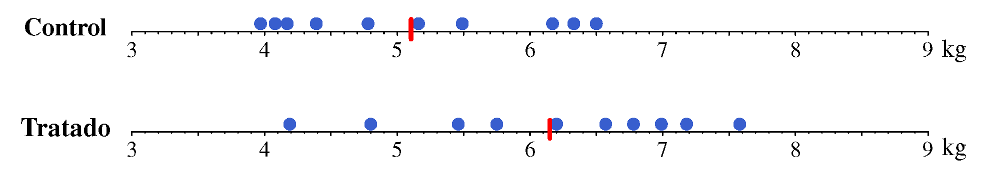{#fig-dotplot .fig-normal6 fig-align="center" width="100%"}

El gráfico da la sensación de que las plantas con abono (representadas por el grupo tratado) tienen --en promedio-- más producción que las no abonadas (representadas por el grupo de control[^8-4]). La situación estaría mucho más clara si nos encontráramos en una de las situaciones que se muestran en la [@fig-dotplot2]. Si los datos del grupo tratado son los que corresponden a la situación A no podremos afirmar que el abono aumenta la cosecha, aunque la media de la producción es ligeramente superior que en el grupo tratado (5,2 frente a 5,1 kg). Por el contrario, si los resultados fueran los representados en la situación B, podríamos afirmar sin temor a equivocarnos que la producción es mayor con abono. 

[^8-4]: Los datos que tenemos son solo los representantes de los grupos de interés, que son las producciones "en general" de las plantas con y sin abono.

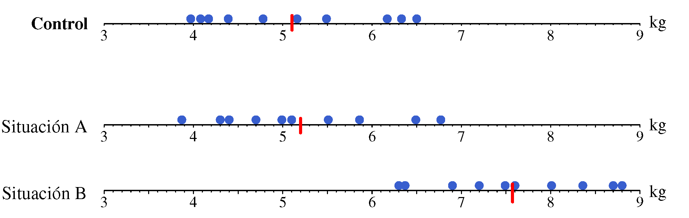{#fig-dotplot2 .fig-normal6 fig-align="center" width="100%"}

Volviendo a nuestros resultados, estamos "bastante seguros" de que el abono mejora la cosecha, pero no parece imposible que la diferencia observada se haya dado por casualidad. Si los dos valores del grupo tratado que están por encima de 7 kg estuvieran en torno a 5 kg, la impresión --solo cambiando dos números-- sería muy distinta.

En una situación como esta, un test estadístico es útil para ayudarnos a tomar la decisión más adecuada.

::: callout-note
## ¿Qué aporta un test estadístico y qué no debemos esperar de él?

Si a la vista de la representación gráfica de los resultados es un caso dudoso, lo seguirá siendo después de realizar un test. El test simplemente cuantifica la duda de forma objetiva y ayuda a tomar una decisión con probabilidad de error conocida.
:::

### ¿El azar explica la diferencia observada? {.unnumbered}

Si no hubiera variabilidad aleatoria --si una planta, en igualdad de condiciones, siempre produjera la misma cantidad de tomates--, este problema sería trivial: bastaría con comparar una planta en las condiciones habituales y otra en esas mismas condiciones pero con abono. Si la planta abonada diera mayor cosecha, consideraríamos que el abono es eficaz y asunto resuelto. Pero sabemos que las cosas no son tan simples. Dos plantas que crecen en "igualdad de condiciones" (entre comillas, porque las condiciones nunca son idénticas) no dan exactamente la misma cosecha. Aunque el abono utilizado sea totalmente ineficaz, existe una probabilidad del 50\% de que, por simple azar, la planta con abono dé mayor cosecha.

Realizar un test estadístico consiste en analizar si la diferencia observada entre el grupo de control y el grupo tratado puede atribuirse únicamente a la variabilidad aleatoria de los resultados, o si esa diferencia es demasiado grande para explicarse solo por el azar y debe existir algún factor que la provoque. Si el plan de recogida de datos se ha llevado a cabo correctamente, todos los factores que podrían influir en el resultado habrán afectado por igual a ambos grupos, salvo el que queremos evaluar. En ese caso, lo razonable es atribuir la diferencia a ese factor, que en nuestro caso es el uso de abono.

Vamos a seguir el procedimiento habitual del contraste de hipótesis.

#### Hipótesis nula frente a hipótesis alternativa {.unnumbered}

La hipótesis nula será que el abono no es eficaz, es decir, que no aumenta la cosecha. La carga de la prueba la tiene el que afirma que sí afecta y esa será la alternativa. A efectos de tomar la decisión de utilizar el abono no importa si no aumenta la producción o si la disminuye. No hay peligro de que decidamos usar abono cuando su influencia es negativa. El riesgo lo concentramos en la posibilidad de considerar que el abono es eficaz cuando en realidad no lo es (error tipo I).

#### Estadístico de prueba {.unnumbered}

Existen varias opciones, vamos a usar una fácil de entender y que no tiene ningún misterio. Colocamos los pesos de las 20 plantas ordenados de menor a mayor y sumamos los números de orden de los que corresponden a cada tratamiento tal como se realiza en la [Tabla 7.1](#tbl-textDSNO). Si los valores del grupo tratado tienden a ser mayores que los del grupo de control, estos aparecerán al final de la lista y la suma de sus números de orden será mayor que la correspondiente al grupo de control. Por el contrario, si tanto el grupo de control como el tratado dan pesos similares sus valores aparecerán entremezclados en la lista ordenada y en ambos casos la suma de sus números de orden será similar.
	
Por tanto, la diferencia en la suma de los números de orden (vamos a llamarle $\Delta$) es una medida de la diferencia de pesos entre el grupo de control y el grupo tratado. Su valor máximo se da cuando todos los valores de un grupo aparecen primero y, a continuación, vienen los del otro grupo. En ese caso tenemos $\Delta_{max} = 20+19+18+ \cdots +11 - (10 +9+ \cdots +1) = 155-55 = 100$. En nuestro caso: $\Delta = 134-76 = 58$.

```{=html}
<div class="tabla-wrapper_T0806">
<table class="tabla-0806">

<caption>Tabla 8.6: Suma de los números de orden que corresponden a cada tratamiento.</caption>

<colgroup>
<col style="width: 10%;">
<col style="width: 10%;">
<col style="width: 15%;">
<col style="width: 25%;">
<col style="width: 25%;">
</colgroup>

<tbody>
<tr>
  <td>Número <br> de orden</td>
  <td>Peso</td>
  <td>Tratamiento</td>
  <td>Número de orden <br> Grupo Control</td>
  <td>Número de orden <br> Grupo tratado</td>
</tr>

<tr> <td>1</td> <td>3,97</td> <td>Control</td> <td>1</td> <td></td> </tr>
<tr> <td>2</td> <td>4,08</td> <td>Control</td> <td>2</td> <td></td> </tr>
<tr> <td>3</td> <td>4,17</td> <td>Control</td> <td>3</td> <td></td> </tr>
<tr> <td>4</td> <td>4,19</td> <td>Tratado</td> <td></td> <td>4</td> </tr>
<tr> <td>5</td> <td>4,39</td> <td>Control</td> <td>5</td> <td></td> </tr>

<tr> <td>6</td> <td>4,78</td> <td>Control</td> <td>6</td> <td></td> </tr>
<tr> <td>7</td> <td>4,80</td> <td>Tratado</td> <td></td> <td>7</td> </tr>
<tr> <td>8</td> <td>5,16</td> <td>Control</td> <td>8</td> <td></td> </tr>
<tr> <td>9</td> <td>5,46</td> <td>Tratado</td> <td></td> <td>9</td> </tr>
<tr> <td>10</td> <td>5,49</td> <td>Control</td> <td>10</td> <td></td> </tr>

<tr> <td>11</td> <td>5,75</td> <td>Tratado</td> <td></td> <td>11</td> </tr>
<tr> <td>12</td> <td>6,17</td> <td>Control</td> <td>12</td> <td></td> </tr>
<tr> <td>13</td> <td>6,20</td> <td>Tratado</td> <td></td> <td>13</td> </tr>
<tr> <td>14</td> <td>6,33</td> <td>Control</td> <td>14</td> <td></td> </tr>
<tr> <td>15</td> <td>6,50</td> <td>Control</td> <td>15</td> <td></td> </tr>

<tr> <td>16</td> <td>6,57</td> <td>Tratado</td> <td></td> <td>16</td> </tr>
<tr> <td>17</td> <td>6,78</td> <td>Tratado</td> <td></td> <td>17</td> </tr>
<tr> <td>18</td> <td>6,99</td> <td>Tratado</td> <td></td> <td>18</td> </tr>
<tr> <td>19</td> <td>7,18</td> <td>Tratado</td> <td></td> <td>19</td> </tr>
<tr> <td>20</td> <td>7,58</td> <td>Tratado</td> <td></td> <td>20</td> </tr>

<tr> 
<td colspan="3">Suma de los números de orden:</td>
<td>76</td> 
<td>134</td>
</tr>
</tbody>
</table>
</div>
```

#### Distribución de referencia {.unnumbered}
	
Se trata de ver qué distribución sigue el valor de $\Delta$ cuando no hay diferencia entre tratamientos. Si se tienen 10 observaciones en cada grupo el número de ordenaciones posibles (permutaciones) de todo el conjunto es igual a $20!$. Sin embargo, dada una ordenación global, las reordenaciones dentro de un mismo tratamiento no cambian el valor del estadístico de prueba por lo que el número de ordenaciones total habrá que dividirlo por el número de ordenaciones dentro de cada grupo. 

En nuestro ejemplo, la distribución de referencia estará compuesta por $\frac{20!}{10! \cdot 10!} = 184\;\!756$ valores que se pueden obtener mediante un programa que plantee todos los casos y determine el valor de $\Delta$ para cada uno de ellos. Si el programa se realiza con el paquete de software estadístico R o con Python existen librerías que realizan las permutaciones y facilitan mucho la tarea[^8-5]. El aspecto de la distribución de referencia calculada de esta forma es el que se muestra en la [@fig-distRefReal].

[^8-5]: Nosotros hemos usado la librería [iterpc]{style="font-family: monospace;"} para R. Observe que basta calcular la suma $S$ correspondiente a los números de orden de un tratamiento ya que: $\Delta = 2S-210$

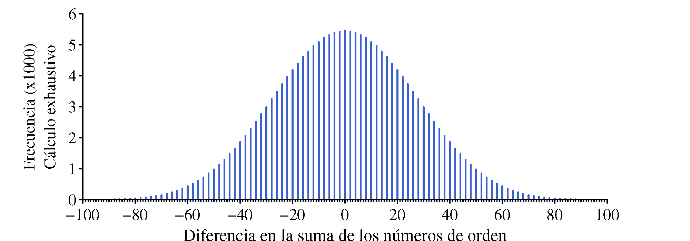{#fig-distRefReal .fig-normal6 fig-align="center" width="100%"}

#### Cálculo del $p$-valor {.unnumbered}

Es posible que, sin haber diferencia entre los dos tratamientos, una vez ordenados los resultados resulte que los del grupo de control ocupen las posiciones del 1 al 10 y los del tratado del 11 al 20, obteniendo $\Delta = 100$. Este es un valor posible pero la probabilidad de que esto ocurra por azar es $1/184\;\!756$, tan baja que lo más razonable es suponer que existe diferencia en el nivel de respuesta de ambos tratamientos. La probabilidad de tener, por ejemplo, $\Delta \geq 80$ es igual a $139/184\;\!756 = 0,075\%$, también un valor muy bajo.

Con los datos de nuestro ejemplo tenemos $\Delta = 58$ y $P(\Delta \geq 58) = 2\;\!661 /184\;\!756 = 1.44\%$
	
La distribución de referencia también se puede construir calculando los valores de $\Delta$ que corresponden a asignaciones al azar de 10 valores a cada grupo. La distribución que aparece en la [@fig-distRefAlea] --prácticamente igual a la que habíamos obtenido anteriormente-- se ha realizado de esta forma calculando el valor de $\Delta$ un millón de veces. Valores iguales a nuestro estadístico de prueba $\Delta = 58$ o mayores se han obtenido $14\;\!356$ veces por lo que el $p$-valor es igual a $14\;\!356 / 1\;\!000\;\!000 = 1.44\%$, igual que con la distribución en que se han calculado todos sus valores de forma exhaustiva.

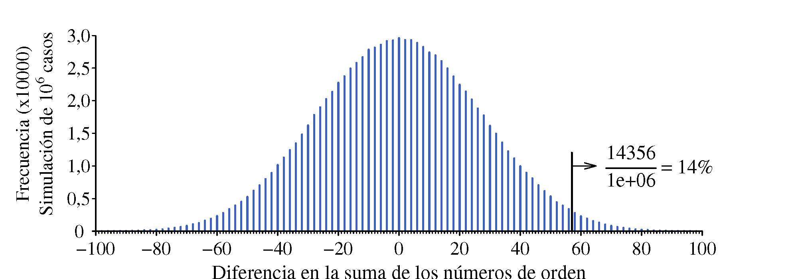{#fig-distRefAlea .fig-normal6 fig-align="center" width="100%"}

::: callout-note
## ¿Qué decisión hay que tomar?

El test estadístico **no dice** qué decisión hay que tomar, solo informa sobre la probabilidad de que una diferencia como la observada sea debida al azar. Cómo se valora esa probabilidad depende de qué riesgos se está dispuesto a asumir.
:::

### Otro estadístico de prueba con su distribución de referencia {.unnumbered}

Usando como estadístico de prueba la diferencia entre las medias de los dos grupos. Tenemos:

```{=html}
<div class="tabla-wrapper_T0800b">
<table class="tabla-0800b">

<colgroup>
<col style="width: 50%;">
<col style="width: 50%;">
</colgroup>

<tbody>
<tr>
  <td>Grupo de control:</td>
  <td> $$\bar{y}_C = 5,104$$ </td>
</tr>

<tr>
  <td>Grupo tratado:</td>
  <td>$$\bar{y}_T = 6,150$$</td>
</tr>

<tr>
  <td>Estadístico de prueba:</td>
  <td>$$\bar{y}_T - \bar{y}_C = 6,150$$</td>
</tr>

</tbody>
</table>
</div>
```
Considerar que el abono no afecta es lo mismo que suponer que la única diferencia entre ambos grupos es la etiqueta que se les pone. Bajo esta hipótesis, la diferencia de medias observada en nuestro caso será simplemente una de las muchas que se pueden obtener asignando a 10 resultados tomados al azar la etiqueta que los identifica como pertenecientes al grupo de control, y a los otros 10 la etiqueta del grupo tratado.

En la tabla [Tabla 8.7](#tbl-cincoValores) tenemos cinco posibles asignaciones de etiquetas (C: Control, T: Tratado) con el valor de la diferencia de medias obtenido en cada caso. 


```{=html}
<div id="tbl-cincoValores" class="tabla-wrapper_T0807">
<div class="tabla-caption">
  Tabla 8.7: Cálculo de 5 valores de una distribución de referencia para la diferencia de medias.
</div>

<table class="tabla-0807">

<colgroup>
<col style="width: 7%;">
<col style="width: 7%;">
<col style="width: 7%;">
<col style="width: 7%;">
<col style="width: 7%;">
<col style="width: 7%;">
</colgroup>

<tbody>
<tr>
  <td rowspan="3">Peso</td>
  <td colspan="5">Tratamiento (etiqueta)</td>
</tr>

<tr>
  <td colspan="5">Cinco posibles permutaciones</td>
</tr>

<tr>
  <td>1</td> <td>2</td> <td>3</td> <td>4</td> <td>5</td>
</tr>

<tr> <td>3,97</td> <td>T</td> <td>C</td> <td>T</td> <td>T</td>  <td>T</td> </tr>
<tr> <td>4,08</td> <td>C</td> <td>T</td> <td>C</td> <td>C</td>  <td>T</td> </tr>
<tr> <td>4,17</td> <td>C</td> <td>C</td> <td>T</td> <td>T</td>  <td>C</td> </tr>
<tr> <td>4,19</td> <td>C</td> <td>C</td> <td>T</td> <td>C</td>  <td>T</td> </tr>
<tr> <td>4,39</td> <td>T</td> <td>C</td> <td>T</td> <td>C</td>  <td>C</td> </tr>

<tr> <td>4,78</td> <td>T</td> <td>C</td> <td>C</td> <td>T</td>  <td>T</td> </tr>
<tr> <td>4,80</td> <td>C</td> <td>C</td> <td>T</td> <td>T</td>  <td>T</td> </tr>
<tr> <td>5,16</td> <td>T</td> <td>T</td> <td>C</td> <td>T</td>  <td>C</td> </tr>
<tr> <td>5,46</td> <td>C</td> <td>T</td> <td>C</td> <td>T</td>  <td>C</td> </tr>
<tr> <td>5,49</td> <td>T</td> <td>T</td> <td>C</td> <td>T</td>  <td>T</td> </tr>

<tr> <td>5,75</td> <td>C</td> <td>T</td> <td>T</td> <td>C</td>  <td>C</td> </tr>
<tr> <td>6,17</td> <td>C</td> <td>T</td> <td>T</td> <td>C</td>  <td>C</td> </tr>
<tr> <td>6,20</td> <td>T</td> <td>T</td> <td>C</td> <td>C</td>  <td>C</td> </tr>
<tr> <td>6,33</td> <td>T</td> <td>C</td> <td>T</td> <td>C</td>  <td>C</td> </tr>
<tr> <td>6,50</td> <td>T</td> <td>C</td> <td>C</td> <td>C</td>  <td>T</td> </tr>

<tr> <td>6,57</td> <td>C</td> <td>T</td> <td>T</td> <td>T</td>  <td>T</td> </tr>
<tr> <td>6,78</td> <td>T</td> <td>T</td> <td>C</td> <td>T</td>  <td>T</td> </tr>
<tr> <td>6,99</td> <td>C</td> <td>T</td> <td>C</td> <td>C</td>  <td>T</td> </tr>
<tr> <td>7,18</td> <td>T</td> <td>C</td> <td>T</td> <td>T</td>  <td>C</td> </tr>
<tr> <td>7,58</td> <td>C</td> <td>C</td> <td>C</td> <td>C</td>  <td>C</td> </tr>

<tr> <td>$$\bar{y}_C$$</td> <td>5,576</td> <td>5,389</td> <td>5,902</td> <td>5,818</td>  <td>5,839</td> </tr>
<tr> <td>$$\bar{y}_T$$</td> <td>5,678</td> <td>5,865</td> <td>5,352</td> <td>5,436</td>  <td>5,415</td> </tr>
<tr> <td>$$\bar{y}_T - \bar{y}_C$$</td> <td>0,102</td> <td>0,476</td> <td>-0,550</td> <td>-0,382</td>  <td>-0,424</td> </tr>

</tbody>
</table>
</div>
```

La distribución de referencia estará formada por el conjunto de todas las diferencias que se pueden obtener de esta forma, que como en el caso anterior es igual a $\frac{20!}{10! \cdot 10!}$ (permutaciones de 20 elementos con 10 y 10 repetidos). También en este caso los valores de la distribución de referencia hay que obtenerlos mediante un pequeño programa que calcule la diferencia de medias para cada una de las ordenaciones posibles de forma exhaustiva, o bien calcularla para una gran cantidad de ordenaciones tomadas al azar. 

La [@fig-distRefPermu] se ha construido con valores obtenidos  generando un millón de ordenaciones al azar. Han aparecido $194\;\!123$ valores[^8-6] mayores o iguales al estadístico de prueba (1,046). El $p$-valor resultante es en este caso del 1,9 %. 

[^8-6]: En otra simulación este número no sería idéntico pero sí muy similar.

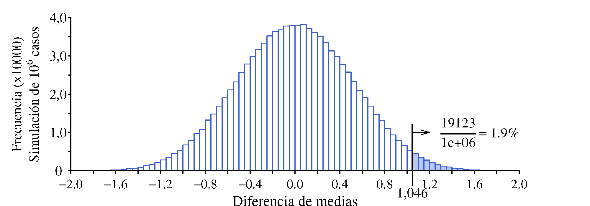{#fig-distRefPermu .fig-normal6 fig-align="center" width="100%"}

El $p$-valor que ahora hemos obtenido no es idéntico al anterior, no todos los test que es razonable realizar dan exactamente el mismo resultado, pero sí es similar y conduce a las mismas conclusiones.

## ¿Es más probable llegar a futbolista profesional si se ha nacido en los primeros meses del año?

Se dice que los nacidos en los primeros meses del año tienen más opciones de llegar a ser futbolistas profesionales que los nacidos más tarde[^8-7]. Se argumenta por el hecho de que las categorías infantiles se organizan por año de nacimiento, y a los 8 o 10 años casi un año de diferencia se nota mucho. Los nacidos a principios de año son los mayores del grupo, suelen ser más fuertes y tener más experiencia, lo que les permite destacar. Esto alimenta su confianza y sus ganas de convertirse en grandes jugadores, algo que no suele pasar con los más pequeños, que, en comparación, rinden menos. Además, los ojeadores tienden a fijarse más en los mayores —los que sobresalen— y les ofrecen jugar en equipos de mayor nivel, mientras que es más difícil que eso ocurra con los más pequeños.

[^8-7]: Una detallada explicación de este fenómeno centrada en Canadá y en el hockey sobre hielo se encuentra en el libro de Malcolm Gladwell: "Outliers. The Story of Success", capítulo 1: "The Matthew Effect" (2008). Existe traducción al español con el título: "Fuera de serie: Por qué unas personas tienen éxito y otras no".

En la temporada 2021-2022, de los 516 jugadores en las plantillas de la Primera División española, 308 (el 59,7\%) habían nacido en la primera mitad del año y el resto en la segunda[^8-8]. ¿Avalan estos datos la teoría de que nacer en la primera mitad del año aumenta las posibilidades de llegar a profesional?

[^8-8]: Datos obtenidos en [https://www.transfermarkt.es](https://www.transfermarkt.es). 

En principio, no es evidente si esa diferencia puede ser atribuida al azar, ya que no esperamos que exactamente la mitad de los jugadores haya nacido en la primera mitad del año; de la misma forma que no esperamos que, al lanzar 100 veces una moneda al aire, aparezcan exactamente 50 caras y 50 cruces.

Si de los 516 tuviéramos que 260 (el 50,4 %) hubieran nacido en la primera mitad del año y 256 en la segunda, estaría claro que los datos no avalan la teoría planteada, mientras que si tuviéramos 482 (el 93,4 %) nacidos en los primeros meses y solo 26 en los últimos diríamos que claramente los nacidos en la primera mitad del año tienen más posibilidades de llegar a profesionales, ¿qué podemos decir con nuestros datos?

Una vez más, vamos a seguir el proceso de razonamiento del contraste de hipótesis.

#### 1. Hipótesis nula frente a alternativa {.unnumbered}

En este caso la hipótesis nula es que la probabilidad de que un futbolista profesional haya nacido en la primera mitad del año es del 50 %. Esto es lo que --en principio-- sería normal. La carga de la prueba la tienen los que afirman que esa probabilidad es mayor.

#### 2. Estadístico de prueba {.unnumbered}

No hay muchas opciones donde elegir. Usaremos el número de futbolistas que en los datos disponibles han nacido en la primera mitad del año. Otra opción, que en el fondo es la misma, sería la proporción de los que han nacido en ese periodo.

#### 3. Distribución de referencia {.unnumbered}

Será la distribución del número de nacidos en la primera mitad del año de un total de 516 personas, suponiendo que la probabilidad de nacer en esa primera mitad es del 50 %. Esta es la que corresponde a una variable aleatoria con distribución binomial y parámetros: $n=516$ y $p=0.5$.

#### 4. Cálculo del $p$-valor {.unnumbered}

Se trata de analizar si nuestro valor (308) es normal en la distribución de referencia. Vemos ([@fig-distRefFutbol]) que queda prácticamente fuera de la distribución y podemos calcular que la probabilidad de tener un valor como ese o mayor es del orden de 6 entre 1 millón. Por tanto, el estadístico de prueba no parece formar parte de la distribución a que debería pertenecer si la hipótesis nula fuese cierta. Lo más razonable es rechazar la hipótesis nula y considerar que el azar no explica ese desequilibrio en el número de nacimientos en la primera y segunda mitad del año.

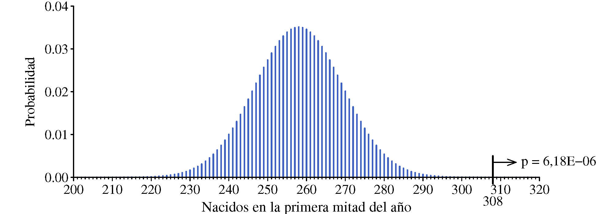{#fig-distRefFutbol .fig-normal6 fig-align="center" width="100%"}

El cálculo de esta probabilidad se puede realizar fácilmente dado que se trata de una variable aleatoria con distribución binomial:
$$\text{P}(X \geq 308) = 1 - \text{B}(x=307; n=516; p = 0.5) = 6.18 \cdot 10^{-6}$$

::: callout-note
## El "por qué" no forma parte de nuestro análisis

Lo único que podemos decir es que es muy poco probable que el valor obtenido sea debido al azar y que, por tanto, debe haber una causa que lo provoca. Hay causas que parecen muy razonables, pero nuestro análisis no las confirma, únicamente ratifica la existencia de un fenómeno que requiere explicación.
:::

### Ojo con los detalles {.unnumbered}

Siempre conviene reflexionar sobre el origen de los datos, sobre su calidad y sobre el cumplimiento de las hipótesis realizadas.

#### Solo tenemos los datos de una temporada {.unnumbered}

Casi siempre tenemos menos datos de los que nos gustaría tener, pero hay que decidir con la información disponible. Si solo aceptamos sacar conclusiones cuando contamos con todos los datos que queremos, casi nunca podremos concluir nada. Por otra parte, los análisis que hacemos ya tienen en cuenta la cantidad de datos disponibles y si tenemos muy pocos será difícil poder rechazar la hipótesis nula aunque la diferencia sea importante.

Por otro lado, reunir datos de dos temporadas puede significar duplicar el esfuerzo, pero solo aporta un 15–20 % más de información, ya que la mayoría de jugadores se repite en temporadas consecutivas. En fin, no es ninguna sorpresa que nos gustaría disponer de más datos, pero la realidad es que debemos decidir con los que tenemos.

#### Proporción de nacimientos en la población en general

Hemos supuesto que en la población general el 50 % de los nacimientos se produce en la primera mitad del año. Aunque ese valor puede ser una aproximación razonable, es sencillo obtener una estimación más precisa. En la página web del Instituto Nacional de Estadística (INE) pueden consultarse los nacimientos en España mes a mes desde enero de 2016. En el periodo 2016–2023 el 51,4 % de los nacimientos tuvo lugar en la primera mitad del año. Al sustituir este valor en la fórmula anterior obtenemos:
$$P(X \geq 308) = 1 - B(x=307; n=516; p = 0.514) = 9.32 \cdot 10^{-5}$$
Esta es también una probabilidad muy pequeña y refleja mejor la probabilidad que nos interesa.

#### País de origen con organización desconocida de las categorías infantiles {.unnumbered}

Muchos jugadores de la liga española han crecido en otros países y han venido a jugar a España cuando ya eran jugadores profesionales. No sabemos cómo se organizan las categorías infantiles en esos países, siendo también frecuente que la asignación a una categoría se realice por curso académico en vez de por año natural. 

Si solo consideramos los jugadores cuya primera nacionalidad es la española tenemos un total de 292 de los cuales 170 (el 58,2\%) nacieron en la primera mitad del año. Con estos nuevos datos, la probabilidad de que se dé ese desequilibrio entre los nacidos entre el primer y el segundo semestre del año es:
$$P(X \geq 170) = 1 - B(x=169; n=292; p = 0.514) = 0,011$$
Si la teoría es correcta y en las categorías infantiles los mayores son los que tienden a triunfar, la presencia de jugadores formados en sistemas donde los mayores corresponden a nacidos en la segunda mitad del año distorsiona nuestros datos y dificulta observar con claridad el efecto buscado. Sin embargo, en la temporada analizada, al excluir a esos futbolistas del estudio, la proporción de nacidos en la primera mitad del año disminuye en lugar de aumentar, como cabría esperar.

Esta disminución de la proporción de nacidos en la primera mitad del año, junto con la menor cantidad de datos disponible, hace que el $p$-valor aumente hasta el 0,01. Este valor también sugiere un rechazo de la hipótesis nula pero no de una forma tan clara como en los casos anteriores.

Si tuviéramos más datos --y en este caso es relativamente fácil conseguirlos-- veríamos cómo se consolidan los resultados.

## ¿Vale la pena tomar aspirina para prevenir el infarto?

En la década de 1980 se llevó a cabo en Estados Unidos un estudio de gran envergadura para evaluar si una dosis baja de aspirina (325 mg en días alternos) podía reducir el riesgo de infarto de miocardio. Se invitó a participar a 261.248 médicos varones de entre 40 y 84 años; 59.285 aceptaron, pero muchos fueron excluidos por antecedentes médicos, por estar tomando aspirina de forma habitual o por haber presentado reacciones adversas a este medicamento. Finalmente, 22.071 participantes fueron asignados aleatoriamente a uno de dos grupos: uno recibió un placebo y el otro la dosis establecida de aspirina. El estudio se diseñó como un ensayo doble ciego, de modo que ni los participantes ni los investigadores encargados del seguimiento sabían a qué grupo pertenecía cada individuo. Tras un seguimiento de aproximadamente cinco años, los resultados obtenidos fueron los siguientes[^8-9]:

[^8-9]: Estos son los resultados del estudio preliminar: "Preliminary Report: Findings from the Aspirin Component of the Ongoing Physicians' Health Study" publicado en *The New England Journal of Medicine* el 28 de enero de 1988. En el estudio definitivo, publicado en la misma revista el 20 de julio de 1989, la diferencia es todavía más clara.

```{=html}
<div class="tabla-wrapper_T0800c">
<table class="tabla-0800c">

<colgroup>
<col style="width: 50%;">
<col style="width: 25%;">
<col style="width: 25%;">
</colgroup>

<tbody>
<tr>
  <td></td>
  <td>Grupo</td>
  <td>Grupo</td>
</tr>

<tr>
  <td></td>
  <td>Aspirina</td>
  <td>Placebo</td>
</tr>

<tr>
  <td>Tamaño de la muestra</td>
  <td>11.037</td>
  <td>11.034</td>
</tr>

<tr>
  <td>Infarto de miocardio</td>
  <td>104</td>
  <td>189</td>
</tr>

</tbody>
</table>
</div>
```

Efectivamente, aparecen menos infartos en el grupo que toma aspirina, pero es necesario analizar si esa diferencia se puede explicar por la variabilidad aleatoria en los resultados (no esperábamos que hubiera exactamente el mismo número de infartos en los dos grupos aunque la aspirina fuera ineficaz) o si es demasiado grande para que sea explicada solo por azar.

Seguimos, una vez más, nuestro proceso de razonamiento basado en el contraste de hipótesis.

#### 1. Hipótesis nula frente a alternativa {.unnumbered}

La hipótesis nula debe ser que la aspirina no tiene ningún efecto en el riesgo de padecer un infarto, mientras que la alternativa será que sí reduce ese riesgo. Como siempre, la carga de la prueba la tiene el que afirma lo nuevo, lo no conocido, en este caso que la aspirina es eficaz para reducir el riesgo de infarto.

#### 2. Estadístico de prueba {.unnumbered}

Una medida de la diferencia de los resultados obtenidos en ambos grupos es, simplemente, la diferencia en el número de infartos que se producen en cada grupo: $189 - 104 = 85$.

#### 3. Distribución de referencia {.unnumbered}

Suponer que la toma de aspirina no influye sobre los resultados equivale a considerar que tenemos un solo grupo de 22.071 personas de las cuales 293 han sufrido un infarto. Bajo esta hipótesis, la probabilidad de infarto en nuestra población sería de $p=$ 293/22.071.

A partir de ahí, podemos generar un número aleatorio, $a_{11}$ de una distribución binomial con parámetros $n=$ 11.037 y $p=$ 293/22.071 y otro número, $a_{12}$ con la misma distribución pero con $n=$ 11.034, aunque esa diferencia se podría ignorar. La diferencia $a_1 = a_{12} - a_{11}$ pertenece a la distribución de la diferencia en el número de infartos de ambos grupos cuando la aspirina no afecta (hipótesis nula).

Repitiendo este proceso un millón de veces --algo prácticamente instantáneo con un pequeño programa en R o Python-- se obtiene la distribución de referencia con la que comparar nuestro estadístico de prueba ([@fig-destRef_aspirina]}).

#### 4. Cálculo del $p$-valor {.unnumbered}

La [@fig-destRef_aspirina] muestra la situación del estadístico de prueba en su distribución de referencia. La conclusión está clara: no es un valor normal en la distribución a la que debería pertenecer si la aspirina no afectara. Es muy raro que una diferencia tan grande como la observada en el número de infartos en ambos grupos sea solo debida al azar.

¿Qué significa "muy raro"? El $p$-valor nos ayuda a cuantificarlo. En nuestra simulación de un millón casos el valor máximo obtenido entre ambos grupos ha sido 83, es decir, ningún valor en la distribución de referencia iguala o sobrepasa el valor del estadístico de prueba. En otra simulación el resultado podría ser ligeramente distinto, pero las conclusiones serían las mismas. Hemos repetido 10 veces la simulación con 10 millones de casos cada una (también da un resultado prácticamente inmediato) y en cada simulación han aparecido entre 2 y 5  valores iguales o mayores a 85. Podemos decir, por tanto, que la probabilidad de que la diferencia obtenida se haya dado por azar es menor de 1 entre un millón.

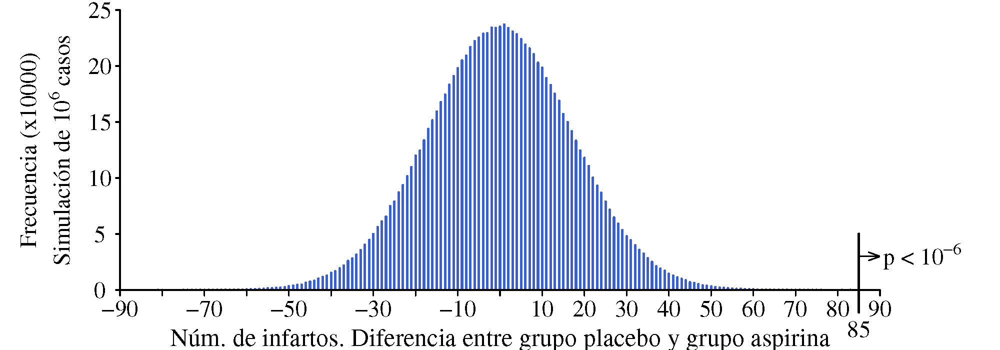{#fig-destRef_aspirina .fig-normal6 fig-align="center" width="100%"}

La diferencia observada era tan evidente que el comité encargado de supervisar el ensayo recomendó interrumpirlo antes de concluir el periodo inicialmente previsto. Se consideró poco ético mantener en secreto una evidencia tan contundente a favor del grupo tratado con aspirina y por ello se informó a los participantes tanto de los resultados obtenidos hasta ese momento como del grupo al que habían sido asignados. La información también se hizo pública y tuvo un gran eco mediático, llegando a ocupar la portada del *New York Times* el 27 de enero de 1988.

### ¿Vale la pena tomar aspirina? No estaba todo dicho {.unnumbered}

Los estudios científicos no proporcionan verdades absolutas. A partir de la observación de la realidad —con frecuencia mediante una organizada recogida de datos— se formulan teorías que, al ser contrastadas, pueden mostrar limitaciones para explicar lo que está ocurriendo o para predecir lo que ocurrirá. Cuando esto sucede, las teorías deben revisarse y ajustarse a la luz de las nuevas evidencias.

En el estudio que comentamos se observó un mayor número de hemorragias internas graves entre el grupo que tomaba aspirina, aunque la diferencia con el grupo de control no era estadísticamente significativa. Investigaciones posteriores han confirmado que la aspirina sí aumenta el riesgo de este tipo de hemorragias y que, en personas sanas sin antecedentes de infarto, ese riesgo supera los beneficios relacionados con la reducción de infartos. En cambio, en quienes ya han sufrido un infarto u otros problemas cardiovasculares, el efecto preventivo de la aspirina resulta beneficioso y compensa el aumento del riesgo de sangrado.

En definitiva, la decisión de recomendar este tratamiento se basa en una evaluación individualizada de los riesgos y beneficios, considerando el perfil y las características de cada persona.

## APÉNDICE 8.A: Fisher y la catadora de te {.unnumbered}

Ronald A. Fisher (1890–1962) fue un pionero en la aplicación del contraste de hipótesis como método de razonamiento en el análisis de datos para la toma de decisiones. Se cuenta una anécdota ocurrida cuando Fisher tomaba el té a media tarde junto con otros profesores de la Universidad de Cambridge y algunos invitados. Una señora comentó que apreciaba un sabor distinto según se sirviera primero el té o la leche. De inmediato surgió una discusión con argumentos procedentes de la química y la física: la composición final del producto debía ser la misma independientemente del orden en que se vertieran el té y la leche; las partículas disueltas acabarían distribuyéndose igual; el gradiente de temperaturas no podía influir… 

Fisher propuso salir de dudas aplicando un procedimiento "revolucionario": hacer la prueba. Claro que no se podía hacer con una sola taza de cada tipo, porque la probabilidad de acertar al azar sería de ½ y si acertaba no sabrían si había sido por casualidad o si realmente sabía distinguir las dos situaciones. Había que pensar cómo hacer la prueba.

### Razonamiento ante la catadora de té {.unnumbered}

De entrada se supone que no sabe distinguir un caso de otro, eso es lo que nos parece normal, y sólo creeremos en su habilidad si los datos recogidos en un experimento bien diseñado y controlado están en contra de esa hipótesis inicial. Estar en contra significa que sus resultados sean muy poco probables en el caso de que sea cierta, y lo que significa poco probable lo decidimos nosotros mismos: que ocurra menos del 5 % de las veces, menos del 1 %, o cualquier otro valor.

Si sólo estamos dispuestos a creerla cuando el resultado del experimento pueda ocurrir por azar (sin que sea mérito de la señora) menos del 5 % de las veces, no servirá un experimento dándole a probar tres tazas de cada tipo, ya que hay 20 formas de elegir tres objetos entre seis y solo una es la forma correcta de hacerlo, luego la probabilidad de acertar por azar es exactamente de 1 entre 20, o sea del 5 %. No es difícil deducirlo: La primera taza se puede elegir entre 6, la segunda entre 5 y la tercera entre 4, por lo que tenemos 6×5×4=120 maneras de elegir 3 tazas, pero en este cómputo hemos tenido en cuenta el orden en que se han elegido, es decir, suponiendo que las tazas las hemos etiquetado con las letras de la A a la F, hemos contado como casos distintos el sacar ADF que FDA. Para descontar los casos repetidos tenemos que dividir por el número de ordenaciones que se pueden dar con tres tazas (3×2×1=6) por tanto, el número de maneras de elegir 3 tazas de un grupo de 6 es igual a 120/6=20. Si tenemos 4 y 4 de cada tipo el número de maneras de seleccionar 4 será:   (8×7×6×5)/(4×3×2×1)=70 y como solo hay un conjunto de cuatro en que se ha puesto primero el té y después la leche,  la probabilidad de acertar por azar es de 1 entre 70, es decir, del 1,4 %. Si de las 4 tazas que elige se equivoca en una, ya no será razonable considerar que sabe distinguir, ya que la probabilidad de que esto ocurra por azar es casi del 23 %.

Pero no se nos tienen que ir todas las energías tras los razonamientos matemáticos. También hay que estar muy atentos a todos los detalles en la realización del experimento y en no dar pistas a la catadora. Fisher lo describe claramente insistiendo en que las tazas se le deben presentar en orden aleatorio:

<blockquote>
Nuestro experimento consistirá en preparar ocho tés con leche, cuatro de un modo y otros cuatro del otro, y llevar las tazas (en un orden escogido al azar) a la catadora para que indique su opinión. Se le habrá explicado antes en qué va a consistir la prueba: se le darán a probar ocho tazas, cuatro de cada tipo, en un orden elegido al azar (por dados, ruleta, cartas etc., o simplemente por números publicados en alguna forma); su tarea consiste en separar las tazas en dos grupos de cuatro clasificándolos, si puede, según se haya puesto primero el té o la leche.
</blockquote>

Fisher no cuenta en su libro cuál fue el resultado del experimento, pero entre los presentes se encontraba el profesor Hugh Smith, que contó esta historia a David Salsburg, autor de un libro excelente sobre la explosión de la estadística en el siglo XX, muy ameno y que empieza contando esta historia que, además, da título al libro. 


## APÉNDICE 8.B: Controversias en torno al contraste de hipótesis {.unnumbered}

El contraste de hipótesis también tiene puntos débiles de los que conviene ser consciente. Veamos algunas pegas que se le pueden poner:

#### Si todos buscamos la diferencia, alguien la encontrará {.unnumbered}

Si en un estudio para analizar la eficacia de un medicamento se trabaja con un nivel de significación del 5 %, la probabilidad de concluir erróneamente que es eficaz cuando en realidad no lo es será justamente ese 5 % fijado de antemano. El problema aparece cuando muchos investigadores sospechan de su posible eficacia y realizan estudios similares con esa misma probabilidad de error. No será raro que alguno de los estudios muestre una diferencia “significativa” por puro azar. De hecho, basta con realizar 10 estudios para que la probabilidad de que al menos uno arroje una diferencia significativa sea del 40 % ($1 - 0{,}95^{10}$), una cifra nada despreciable

Si los que han obtenido resultados negativos no informan de su trabajo (no han encontrado nada nuevo) y los que sí han visto que el medicamento es eficaz (por casualidad, pero ellos no lo saben) publican su investigación en una revista científica, se dará validez a unos resultados que en realidad se han obtenido por azar.

#### Si se ponen muchos recursos para encontrar una diferencia, se encontrará {.unnumbered}

Cuando se comparan dos tratamientos es prácticamente seguro que sus resultados no serán idénticos. Si los estudios se realizan con muestras lo bastante grandes, se pueden detectar diferencias que resulten estadísticamente significativas —es decir, que no se expliquen por el azar— pero que, aun así, sean irrelevantes desde el punto de vista práctico.

#### Todos los que ganan la lotería han hecho trampa {.unnumbered}

A su vecino le ha tocado el primer premio de un sorteo realizado con fines benéficos y, como alguien sospecha que quizá ha hecho trampa, usted decide analizar la situación mediante un contraste de hipótesis[^8-10]. Plantea como hipótesis nula que el premio se ha otorgado de forma justa y como alternativa que ha habido trampa. Dado que en el sorteo había 10.000 boletos, la probabilidad de que gane el primer premio —suponiendo que no haya hecho trampa— es de 1/10.000. Este sería el $p$-valor de la prueba, tan pequeño que invita a pensar lo peor.

[^8-10]: También es verdad que ese contraste habría que plantearlo antes de que se realice el sorteo. El contraste de hipótesis pierde su sentido si se construye a medida del dato ya conocido.

Sin embargo, si su vecino es una persona honrada y usted no cree que tuviera intención alguna de hacer trampa, esa conclusión no resulta muy razonable. En el ámbito de la llamada Estadística Bayesiana se incorpora esa información previa sobre su honestidad. Si consideramos que la probabilidad *a priori* —antes de conocerse el ganador— de que haya hecho trampa es de uno entre un millón, podemos construir el esquema de la [@fig-Bayes], donde el valor que aparece junto a cada rama indica su probabilidad de ocurrencia.

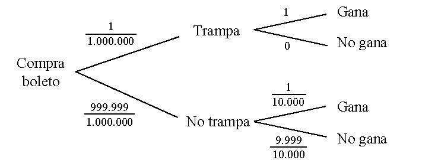{#fig-Bayes .fig-normal6 fig-align="center" width="90%"}

Ahora, aplicando el teorema de Bayes, podemos volver a calcular la probabilidad de que haya hecho trampa sabiendo que ha ganado. La fórmula es la siguiente (G: Gana, T: hace trampa; N: No hace trampa):

\begin{equation*}
		\begin{split}
			P(\text{T} |\text{G}) &= \frac{P(\text{G}| \text{T}) \cdot P(\text{T})}{P(\text{G}| \text{T}) \cdot P(\text{T})+P(\text{G}| \text{N}) \cdot P(\text{N})} \\[10pt]
			&=\frac{1 \cdot \frac{1}{\text{1\;\!000\;\!000}}} {1 \cdot \frac{1}{\text{1\;\!000\;\!000}} + \frac{\text{1}}{\text{10\;\!000}} \cdot \frac{\text{999\;\!999}} {\text{1\;\!000\;\!000}}} = \text{0,009901}
		\end{split}
\end{equation*}	

Con las suposiciones que hemos realizado llegamos a la conclusión de que la probabilidad de que nuestro vecino sea un tramposo es del orden del 1 %. Si hubiéramos supuesto que la probabilidad *a priori* era de uno entre 10 millones, el resultado *a posteriori* sería de uno entre mil.

A algunos investigadores les parece "poco científico" dar un valor puramente especulativo a una variable que influirá en el resultado obtenido. Pero es evidente que no es lo mismo que el comprador del boleto sea una persona de conducta ejemplar o que haya sido condenado varias veces por estafa y además haya organizado él mismo el sorteo. Enfrentarse a un problema ignorando una información tan evidente y a la vez tan relevante, no parece que sea la mejor forma de aprovechar los recursos disponibles. Los que se adentren en este terrero tendrán ocasión de elegir en cada caso la alternativa que les parezca más razonable.

::: {style="text-align: center; font-size: 1.1em;"}
\_\_\_\_\_\_\_\_\_\_\_\_\_\_\_\_\_\_\_\_\_\_\_\_ [◇]{style="margin: 0 0.4em;"} \_\_\_\_\_\_\_\_\_\_\_\_\_\_\_\_\_\_\_\_\_\_\_\_
:::

<br>
