# Algunos test clásicos

Cuando se desarrollaron los primeros test estadísticos no existía la posibilidad de construir distribuciones de referencia realizando simulaciones en un ordenador. Estas distribuciones debían responder a modelos matemáticos bien definidos y, a partir de los datos, había que construir estadísticos de prueba cuya distribución coincidiera con esos modelos. Esas distribuciones son la $t$-Student, la Chi-cuadrado o la $F$ de Snedecor, que se han convertido en clásicos de los cursos de estadística.

Cuando se aplican estos test, se supone que los datos pertenecen a una cierta distribución --en general, la distribución Normal-- y basándose en las propiedades de las variables aleatorias se deduce el estadístico cuya distribución --si la hipótesis nula es cierta-- es una de las mencionadas. El hecho de trabajar siempre con las mismas distribuciones de referencia permite tabularlas y emplear esas tablas con independencia del contexto del test o de la magnitud concreta de los resultados obtenidos.

## Test de la $t$ de Student

Bajo el nombre genérico de *test de la t de Student* se encuentran los test que tienen esta distribución como distribución de referencia. Casos clásicos son el contraste sobre el valor de la media de una población o el test para la comparación de dos medias.

### Contraste sobre el valor de la media de la población {.unnumbered}

Volvemos a la línea de envasado de paquetes de café que vimos en el capítulo anterior. Deben contener un peso de 1 kg pero a veces la máquina de llenado se desajusta y los llena con un peso medio distinto al objetivo. Tomamos una muestra de 10 paquetes y sus pesos, en gramos, son:

<center>916,   940,   975,   969,   996,   1020,   1036,   1009,   990,   999</center>

Como siempre, lo primero que hacemos es representar estos datos gráficamente; en rojo se ha marcado la media de la muestra.

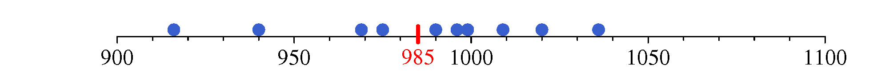{#fig-dotplotPesoCafe .fig-normal6 fig-align="center" width="100%"}

La media está por debajo del valor objetivo y las desviaciones hacia los valores bajos son mayores que hacia los altos (en realidad, si la media de la muestra está por debajo del objetivo, las desviaciones hacia los valores bajos seguro que son mayores que hacia los altos). Lo que no está claro es si esa diferencia es o no es estadísticamente significativa.

Vamos a suponer que los pesos de los paquetes presentan una variabilidad que sigue el patrón de la distribución Normal. Es razonable que sea así ya que en situaciones como esta, cuando la variable tiene la misma libertad para ir hacia los valores altos como hacia los bajos, sigue ese patrón de variabilidad. Es más, en rigor lo que vamos a suponer es que la distribución de las medias muestrales es una distribución Normal, y sabemos que --a efectos prácticos-- esto es cierto aunque los valores de la población no sigan estrictamente esa distribución. En definitiva, no debemos preocuparnos por este supuesto, estamos bien cubiertos.

La desviación típica de la población puede considerarse conocida si se tienen muchos datos históricos y se puede estimar con precisión, o si disponemos solo de los valores de la muestra deberemos conformarnos con su estimación.

Supongamos que tenemos muchos pesos de esos paquetes de manera que podemos considerar $\sigma = 30$,g. Cuando todo marcha correctamente el peso de un paquete será un valor de la distribución: \$X \sim \$ N(1000,g; 30,g) y la distribución de la media de 10 paquetes será: $$\bar{x}_{10} \sim \text{N} \left( 1000; \frac{30}{\sqrt{10}} \right) $$ Ya solo falta ver si la media de nuestra muestra es un valor normal en esta distribución. El gráfico de la figura \ref{contrasteNormal} --construido a escala-- muestra que es un caso dudoso.

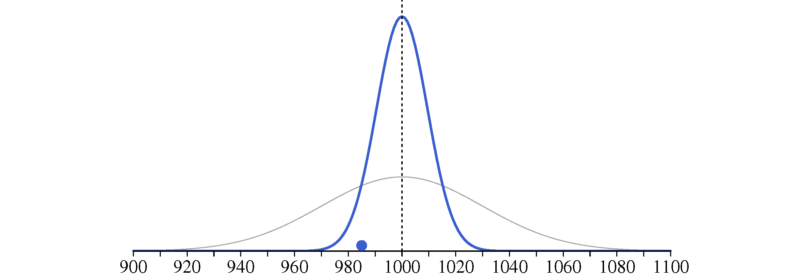{#fig-contrasteNormal .fig-normal6 fig-align="center" width="75%"}

Siguiendo los pasos habituales vamos a contrastar la hipótesis nula de que el proceso se mantiene centrado frente a la alternativa de que se ha descentrado:

#### 1. Hipótesis nula ($\text{H}_0$) frente a hipótesis alternativa ($\text{H}_1$) {.unnumbered}

Planteamos como hipótesis nula lo que es habitual: que el proceso se mantiene centrado. Solo consideraremos que se ha descentrado --está llenando los paquetes con un valor distinto del objetivo-- si los datos están en contradicción con esa hipótesis. Por tanto:

```{=tex}
\begin{equation*}
    \begin{split}
        \text{H}_0\!\!\!\:: \mu= 1000\, \text{g} \\[0pt]
        \text{H}_1\!\!\!\:: \mu \neq 1000\, \text{g} 
    \end{split}
\end{equation*}
```
#### 2. Estadístico de prueba {.unnumbered}

Transformamos el valor de la media en un valor de la distribución Normal estandarizada. De esta forma, la distribución de referencia siempre será la misma. Recordemos que si $X \sim \text{N}(\mu; \sigma)$, entonces $\frac{x-\mu}{\sigma} \sim \text{N}(0; 1)$. En nuestro caso tenemos: $$\bar{X}_{10} \sim \text{N} \left( \mu; \frac{\sigma}{\sqrt{n}} \right) $$ Por tanto: $$z = \frac{\bar{x}_{10} - \mu} {\frac{\sigma}{\sqrt{n}}} \sim \text{N}(0; 1)$$

Sustituyendo por los valores correspondientes obtenemos nuestro estadístico de prueba: $$z = \frac{985 - 1000} {\frac{30}{\sqrt{10}}} = -1.58$$ \#### 3. Distribución de referencia. {.unnumbered}

Si la hipótesis nula es cierta ($\mu = 1000$ g), el estadístico de prueba pertenecerá a una distribución N(0; 1) que será --por tanto-- nuestra distribución de referencia.

#### 4. Cálculo del $p$-valor. {.unnumbered}

Se trata de determinar la probabilidad de que en la distribución de referencia se den valores como el del estadístico de prueba o más alejados. La probabilidad hacia un lado es igual a 0.057. Hacia los dos lados será $2 \cdot 0.057 = 0.114$.

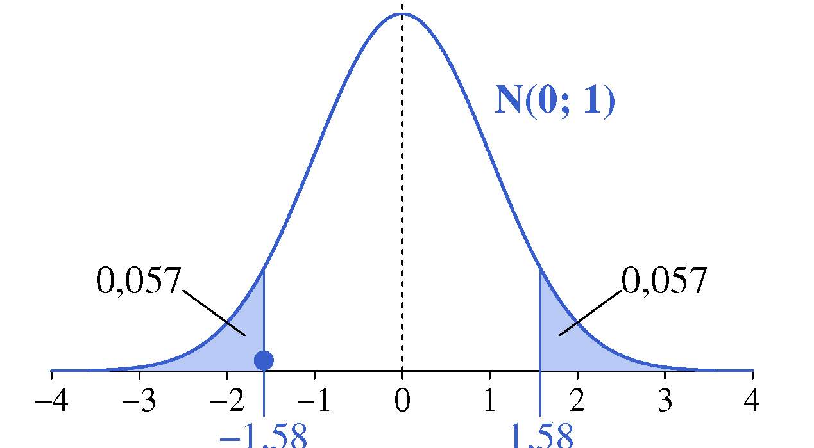{#fig-pValorNormal .fig-normal6 fig-align="center" width="100%"}

Si se ha elegido un nivel de significación del 5 % no hay razones para rechazar la hipótesis nula.

#### Pero... ¿y si no conocemos la desviación típica de la población? {.unnumbered}

Lo que hacemos es estimarla a partir de los datos de la muestra --no hay otra forma de hacerlo-- y en la expresión del estadístico de prueba: $$z = \frac{\bar{x} - \mu} {\frac{\sigma}{\sqrt{n}}}$$ sustituimos el valor de $\sigma$ por su estimación $s$.

Tal como vimos al deducir la expresión del intervalo de confianza para la media (apartado 7.3), este cambio tiene consecuencias: cuando usamos $\sigma$, en el denominador tenemos una constante, mientras que si usamos $s$ tenemos una variable aleatoria y esto provoca que el cociente tenga mayor variabilidad y, por tanto, una distribución de probabilidad distinta. A ese cociente le llamamos $t$: $$t = \frac{\bar{x} - \mu} {\frac{s}{\sqrt{n}}} $$ y su distribución es la $t$ de Student, que será la que usaremos como distribución de referencia.

Recordemos que una dificultad añadida es que la $t$ de Student no es una distribución única, como sí lo es la N(0; 1). Cuando se trabaja con muestras pequeñas, el valor de $s$ presenta mayor variabilidad que cuando se usan muestras grandes, y esa variabilidad se transmite al estadístico $t$, modificando la forma de su distribución. Para precisar a cuál nos estamos refiriendo, hablamos de una distribución $t$ de Student con un determinado número de grados de libertad.

Los grados de libertad ($\nu$) son aquellos con los que se ha calculado el valor de $s$ y es igual a $n-1$, siendo $n$ el tamaño de la muestra. A partir de un cierto número de grados de libertad (pongamos $n \geq 30$) la forma de la distribución apenas cambia y prácticamente ya no hay diferencia entre la $t$ de Student y la N(0; 1).

Volviendo a nuestros datos tenemos que $s=36.34$, por tanto: $$t = \frac{985 - 1000} {\frac{36{,}34}{\sqrt{10}}} = -1{,}305$$ Colocando este valor en su distribución de referencia, una $t$ de Student con 9 grados de libertad, tenemos un $p$-valor igual a 0,224 (0,112+0,112). Observe que en la diferencia respecto al valor obtenido anteriormente influye más la diferencia entre el valor real de $\sigma$ y su valor estimado que en el cambio de la distribución de referencia.

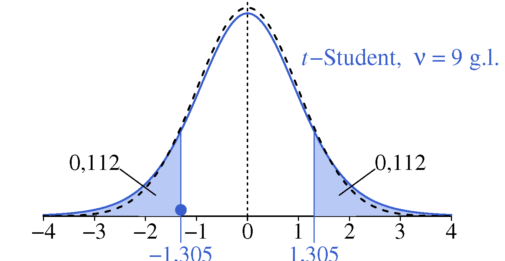{#fig-pValort .fig-normal6 fig-align="center" width="100%"}

Volvamos a los datos obtenidos en el experimento realizado para analizar si un nuevo fertilizante produce más cosecha que el utilizado habitualmente. Los datos eran:

```{=html}
<div class="tabla-wrapper_T0800">
<table class="tabla-0800">

<colgroup>
<col style="width: 15%;">
<col style="width: 8.5%;">
<col style="width: 8.5%;">
<col style="width: 8.5%;">
<col style="width: 8.5%;">
<col style="width: 8.5%;">
<col style="width: 8.5%;">
<col style="width: 8.5%;">
<col style="width: 8.5%;">
<col style="width: 8.5%;">
<col style="width: 8.5%;">
</colgroup>

<tr>
  <td>Control:</td>
  <td>5,16</td>
  <td>6,17</td>
  <td>4,17</td>
  <td>3,97</td>
  <td>5,49</td>
  <td>4,08</td>
  <td>4,39</td>
  <td>6,50</td>
  <td>4,78</td>
  <td>6,33</td>
</tr>

<tr>
  <td>Tratado:</td>
  <td>7,18</td>
  <td>4,80</td>
  <td>7,58</td>
  <td>6,57</td>
  <td>5,46</td>
  <td>5,75</td>
  <td>6,99</td>
  <td>4,19</td>
  <td>6,20</td>
  <td>6,78</td>
</tr>

 </table>
</div>
```
Y su representación gráfica tenía el siguiente aspecto:

{#fig-dotplot .fig-normal6 fig-align="center" width="100%"}

Realizamos las siguientes suposiciones sobre el comportamiento de estos datos:

1.  **El patrón de variabilidad que caracteriza cada tratamiento es la distribución Normal.**

    Respecto a la producción de cada planta es razonable considerar que cuanto más nos alejemos de su valor medio, más escasas serán las observaciones. En realidad, lo que necesitamos que sea Normal es la distribución de la diferencia de medias, y sabemos que las medias --y también su diferencia-- siguen una distribución Normal aunque los datos originales no lo sean. Podemos estar tranquilos asumiendo la certeza de esta suposición.

2.  **Las varianzas poblacionales son iguales.**

    Consideramos que el nuevo abono puede dar una mayor cosecha --es lo que queremos analizar--, pero suponemos que la variabilidad que presenten los resultados seguirá siendo la misma. Si esas variabilidades no son exactamente iguales pero tampoco muy distintas (nos estamos refiriendo a las varianzas poblacionales, no a las muestrales que es prácticamente seguro que serán distintas) las conclusiones apenas cambian. Si son claramente distintas existe una variante del proceso que tiene en cuenta este aspecto. La mayoría de programas de software estadístico no hacen uso de esta hipótesis\endnote{Existen varias formas de abordar este tema y no todos los paquetes de software lo hacen de la misma, pero a efectos prácticos las diferencias son irrelevantes}, pero usándola es mucho más fácil justificar la expresión del estadístico de prueba que vamos a usar.

3.  **Los datos son representativos de sus respectivas poblaciones y el único factor que afecta de forma distinta a ambos grupos es el tipo de abono.**

    Este es el supuesto verdaderamente crítico. Los datos siempre deben ser representativos si las conclusiones van a ser sobre sus respectivas poblaciones. En una comparación de tratamientos todos los factores deben influir igual en los dos grupos excepto el factor cuyo efecto se desea estudiar.

Suponiendo que se cumplen estos tres supuestos, la diferencia de medias de los dos grupos (A: actual, B: nuevo) es una variable aleatoria con la siguiente distribución de probabilidad: $$\bar{y}_B - \bar{y}_A \sim \text{N} \left( \mu_B - \mu_A,\; \sqrt{\frac{2 \sigma^2}{n}}\right) $$

Siendo $\bar{y}_A$ e $\bar{y}_B$ las medias de cada muestra, $\mu_A$ y $\mu_B$ las medias poblacionales, $\sigma^2$ la varianza, que consideramos igual para las dos poblaciones, y $n$ el tamaño de las muestras, en nuestro caso el mismo para ambas. (ver [Tabla 8.1](#tbl-distDifMedias)})

```{=html}
<div id="tbl-distDifMedias" class="tabla-wrapper_T0901">
<table class="tabla-0901">

<caption>Tabla 9.1: Distribución de la diferencia de medias muestrales.</caption>

<colgroup>
<col style="width: 28%;">
<col style="width: 28%;">
<col style="width: 44%;">
</colgroup>

<tbody>
<tr>
  <td>Abono actual (A)</td>
  <td>Nuevo abono (B)</td>
  <td>Comentario</td>  
</tr>

<tr>  
  <td> $$y_A \sim \text{N}(\mu_A,\, \sigma)$$ </td>
  <td> $$y_B \sim \text{N}(\mu_B,\, \sigma)$$ </td>
  <td>Los resultados de cada tratamiento pertenecen a distribuciones Normales con la misma desviación típica. La duda que nos plantearemos es si &mu;<sub>A</sub> = &mu;<sub>B</sub></td>
</tr>

<tr>  
  <td> $$\bar{y}_A \sim \text{N}(\mu_A,\, \frac{\sigma}{\sqrt{n_A}})$$ </td>
  <td> $$\bar{y}_B \sim \text{N}(\mu_B,\, \frac{\sigma}{\sqrt{n_B}})$$ </td>
  <td>Distribución de las medias muestrales. No hace falta suponer que los tamaños de las muestras n<sub>A</sub> y n<sub>B</sub> sean iguales.</td>
</tr>

<tr>  
  <td colspan="2"> Diferencia de medias </td>
  <td></td> 
</tr>

<tr>  
  <td colspan="2"> $$\bar{y}_B - \bar{y}_A \sim \text{N} \left( \mu_B - \mu_A, \sqrt{\frac{\sigma^2}{n_A}+\frac{\sigma^2}{n_B}}\right)$$ </td>
  <td>Recordemos que: <br> E(X-Y) = E(X) - E(Y) <br> V(X-Y) = V(X)+V(Y) -2Cov(X,Y) <br> y si X e Y son independientes: <br> V(X-Y) = V(X)+V(Y)</td> 
</tr>

<tr>  
  <td colspan="2"> $$\bar{y}_B - \bar{y}_A \sim \text{N} \left( \mu_B - \mu_A, \sqrt{\frac{2 \sigma^2}{n}}\right) $$ </td>
  <td>Expresión más compacta de la desviación típica si los tamaños de las dos muestras, n<sub>A</sub> y n<sub>B</sub>, son iguales.</td> 
</tr>


</tbody>
</table>
</div>
```
<br> Recordemos que si una variable aleatoria $X$ sigue una distribución $\text{N}(\mu, \sigma)$, entonces $z = \frac{x-\mu}{\sigma}$ sigue una $\text{N}(0; 1)$. Aplicado a nuestra variable $\bar{y}_B - \bar{y}_A$, tenemos: $$\frac{\bar{y}_B - \bar{y}_A - (\mu_B -\mu_A) }  {\sqrt{\frac{2 \sigma^2}{n}}} \sim \text{N}(0; 1) $$ Si la hipótesis nula es cierta tenemos que $\mu_A = \mu_B$, de manera que en el numerador solo nos queda $\bar{y}_B - \bar{y}_A$. Ya tenemos estadístico de prueba y distribución de referencia suponiendo conocida la varianza de la población.

```{=tex}
\begin{gather*} 
    \frac{\bar{y}_B - \bar{y}_A}{\sqrt{\frac{2 \sigma^2}{n}}} \quad  \sim \quad \; \text{N}(0; 1) \\[3pt] 
    \small{\text{\qquad  \;\; Estadístico   \qquad      Distribución de }}  \\[-4pt]
    \small{\text{\quad \;\; de prueba    \qquad  \quad   referencia}} 
\end{gather*}
```
Si no conocemos el valor de $\sigma^2$ --que es lo habitual-- lo podemos estimar a partir de los valores de las muestras. La varianza de una cualquiera de ellas es un buen estimador de $\sigma^2$, pero la varianza de la otra también lo es, entonces, ¿con cuál nos quedamos? La solución es sencilla: con la media de las dos. Claro que como nos fiamos más de las estimaciones obtenidas de muestras grandes que de las de muestras pequeñas, la regla general es realizar una media ponderada. Lo inmediato sería ponderar por el tamaño (número de observaciones) de cada muestra, pero como lo que realmente aporta información son los grados de libertad, ponderamos según esos valores, que es el tamaño de la muestra menos una unidad. Ese estimador conjunto será, por tanto: $$s^2 = \frac{(n_A-1)s_A^2 + (n_B-1)s_B^2}{n_A + n_B -2} $$ Si las dos muestras tienen el mismo tamaño no hace falta ponderación, y si la hacemos nos acaba quedando la media aritmética.

Con nuestros valores: $$n_A = n_B = 10; \qquad s_A^2 = 0.951; \qquad  s_B^2 = 1{,}187 $$ tenemos: $$ s^2 = \frac{9 \cdot 0.951 + 9 \cdot 1{,}187}{18} = \frac{0{,}951 + 1{,}187}{2} = 1.069$$

::: callout-note
## La varianza del conjunto de los datos de las dos muestras ¿es un buen estimador de la varianza poblacional?

Lo sería si las medias poblacionales fueran iguales (serían dos muestras de una misma población si las dos son Normales, con la misma varianza y la misma media) pero no estamos seguros de que las medias sean iguales --es justo lo que estamos analizando-- por lo que no podemos usar ese método.
:::

El estadístico de prueba y la distribución de referencia son ahora: $$\frac{\bar{y}_B - \bar{y}_A}{\sqrt{\frac{2s^2}{n}}} \quad \;\sim \quad \; t-\text{Student con } \nu = 2n -2 \text{ g.l.}$$ Todos los valores que intervienen en el cálculo del estadístico de prueba --le llamamos $t$-- se obtienen a partir de los datos de las muestras: $$t = \frac{\bar{y}_B - \bar{y}_A}{\sqrt{\frac{2s^2}{n}}} = \frac{6.150 - 5.104}{\sqrt{\frac{2\cdot 1.069}{10}}} = 2.26 $$ y los grados de libertad de la $t$-Student son la suma de los que aporta cada muestra, en nuestro caso $9+9=18$. Ahora toca valorar si el estadístico de prueba es un valor "normal" en la distribución de referencia.

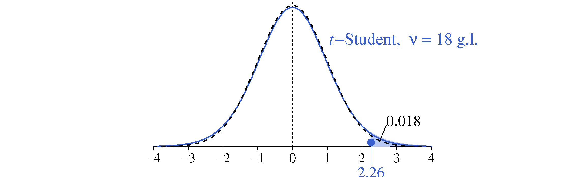{#fig-pValorDifMed .fig-normal6 fig-align="center" width="100%"}

En nuestro caso, la probabilidad de tener un valor como el que hemos obtenido, o mayor que ese, es del orden del 2 %. Si el criterio de decisión fuera rechazar la hipótesis nula si esa probabilidad está por debajo del 5 % habría que considerar que el nuevo abono da una mayor cosecha.

::: callout-note
## ¿Cómo saber si las varianzas se pueden considerar iguales?

Si tenemos dos muestras, A y B, de sendas poblaciones Normales con la misma varianza $\sigma^2$, el cociente de las varianzas muestrales $s_A^2/s_B^2$ sigue una distribución conocida llamada $F$ de Snedecor (o también $F$ de Fisher). Ya tenemos estadístico de prueba y distribución de referencia.
:::

## Test de comparación de proporciones

Volvamos al estudio visto en el apartado 8.5 sobre si tomar cierta dosis de aspirina de manera regular reduce el riesgo de padecer infarto de miocardio. En el estudio participaron $22.071$ individuos que fueron asignados aleatoriamente a uno de los dos grupos: el grupo de control que tomó un placebo, y el que tomó aspirina. Los resultados obtenidos fueron los que se indican en la tabla \ref{tablaResultadosAspirina} donde escribimos $\hat{p}_1$ y $\hat{p}_2$ para las proporciones en las muestras, con \<<sombrero>\> para distinguirlas de $p_1$ y $p_2$ que serán las proporciones en las poblaciones y son sobre las que nos planteamos saber si son diferentes.

\*\*\*\*TABLA 9.2\*\*\*\*

Vamos a plantear un test que tiene como estadístico de prueba un valor que se puede calcular fácilmente a partir de los resultados del estudio y que siempre tiene la distribución Normal estandarizada como distribución de referencia.

En primer lugar a la variable aleatoria \<<número de infartos en cada grupo>\>, que en realidad sigue una distribución binomial con parámetros $n$, $p$, la vamos a aproximar a través de una distribución Normal. La regla general para poder realizar esta aproximación es que se cumpla que $np > 5$ y $n(1-p) > 5$, que en nuestro caso se cumple sobradamente tanto para el grupo tratado como para el de control.

Considerando que las proporciones en cada grupo son las probabilidades ligadas a las ocurrencias, podemos representar la distribución binomial junto con la Normal con la que la vamos a identificar y podemos ver que la aproximación es razonable ([@fig-aproxNormal]).

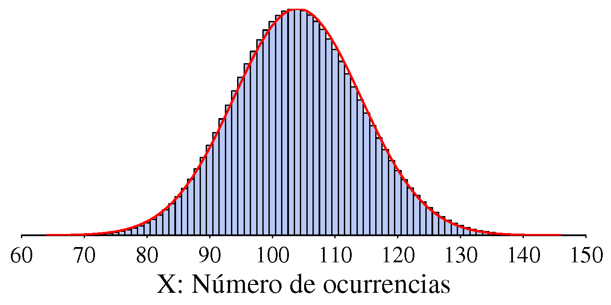{#fig-aproxNormal .fig-normal6 fig-align="center" width="100%"}

Seguimos el proceso habitual:

#### Hipótesis nula frente a hipótesis alternativa {.unnumbered}

```{=tex}
\begin{equation*}
    \begin{split}
        \text{H}_0 &: p_1 = p_2  {\small\text{     (La probabilidad de infarto es la misma en los dos grupos)}} \\[-1pt]
        \text{H}_1 &: p_1 > p_2  {\small\text{     (...es menor en el grupo que toma aspirina)}} \\
    \end{split}
\end{equation*}
```
#### Estadístico de prueba - Distribución de referencia {.unnumbered}

Recordemos que si $X$ es una variable aleatoria con distribución binomial y parámetros $n$, $p$, tenemos que: $\text{E}(X) = np$ y $V(X)=np(1-p)$. Además, si se cumplen las condiciones para poder aproximar la distribución de $X$ a través de una Normal: $$X \sim \text{N} \left(np; \sqrt{np(1-p)}\right)$$

Lo aproximado es la forma de la distribución, los valores de la esperanza matemática y de la desviación típica son esos exactamente.

Aplicando las propiedades que hemos visto para las variables aleatorias, podemos deducir rápidamente que la esperanza matemática y la varianza de la proporción $\hat{p} = X/n$ son: \begin{equation*}
    \begin{split}
        \text{E}(\hat{p}) &= \text{E} \left (\frac{X}{n} \right) = \frac{1}{n} \text{E}(X) = \frac{1}{n} np = p \\[4pt]
        \text{V}(\hat{p}) &= \text{V} \left (\frac{X}{n} \right) = \frac{1}{n^2} \text{V}(X) =  \frac{1}{n^2} np(1-p) =  \frac{p(1-p)}{n} \\
    \end{split}
\end{equation*}

Por otra parte, si hemos considerado que la distribución de $X$ se puede aproximar con una distribución Normal, también se puede aproximar la de $\hat{p}$, ya que es una variable con distribución Normal dividida por una constante, es como un cambio de escala en el eje de abscisas pero manteniendo la forma de la distribución: $$\hat{p} \sim \text{N}  \left( p; \sqrt{\frac{p(1-p)}{n}}\right) $$ Y si tenemos dos muestras, recordando que si $p_1$ y $p_2$ son variables aleatorias con distribuciones Normales, la distribución de $p_1 - p_2$ (caso particular de combinación lineal) también será Normal, que $E(p_1-p_2) = E(p_1) - E(p_2)$ y que si son independientes --que lo son, porque conocer el valor de $p_1$ no aporta ninguna pista sobre el valor de $p_2$ y viceversa-- tenemos que $V(p_1-p_2) = V(p_1) + V(p_2)$, tendremos que la distribución de su diferencia será: $$\hat{p}_1 - \hat{p}_2 \sim \text{N} \left ( p_1-p_2; \sqrt{\frac{p_1(1-p_1)}{n_1}+ \frac{p_2(1-p_2)}{n_2}}\right ) $$ En el caso de que la hipótesis nula sea cierta y $p_1 = p_2 = p$ tendremos: $$\hat{p}_1 - \hat{p}_2 \sim \text{N} \left (0; \;\; \sqrt{\frac{p(1-p)}{n_1}+ \frac{p(1-p)}{n_2}}\right ) $$ El problema es que no conocemos el valor de $p$. Siendo $x_1$ y $x_2$ el número de ocurrencias en cada muestra, una forma razonable de estimarlo es haciendo: $$\hat{p} = \frac{x_1+x_2}{n_1+n_2} $$ Ya tenemos estadístico de prueba y distribución de referencia. Podemos elegir una de las siguientes opciones:

\small $$\text{Estadístico de prueba} \quad \qquad \qquad   \text{Distribución de referencia} \quad $$ \begin{equation*}
    \begin{split}
         \hat{p}_1 - \hat{p}_2 \quad \qquad &\sim \;\; \text{N} \left (0; \;\; \sqrt{\frac{\hat{p}(1-\hat{p})}{n_1}+ \frac{\hat{p}(1-\hat{p})}{n_2}}\right ) \\[5pt]
         \frac{\hat{p}_1 - \hat{p}_2}{\sqrt{\frac{\hat{p}(1-\hat{p})}{n_1}+ \frac{\hat{p}(1-\hat{p})}{n_2}}} \quad  &\sim \qquad \qquad \;\;\text{N}(0;\,1)
    \end{split}
\end{equation*}

La ventaja de este último es que la distribución de referencia siempre es la misma y es también la que aparece tabulada en los libros.

#### Cálculo del $p$-valor {.unnumbered}

Vamos a usar la $\text{N}(0;\,1)$ como distribución de referencia. Tenemos: $$\hat{p} = \frac{x_1+x_2}{n_1+n_2} = \frac{189 + 104}{11\;\!034 + 11\;\!037} = 0.01328 $$ El valor del estadístico de prueba es:

```{=tex}
\begin{equation*}
    \begin{split}
        z &= \frac{\hat{p}_1 - \hat{p}_2}{\sqrt{\frac{\hat{p}(1-\hat{p})}{n_1}+ \frac{\hat{p}(1-\hat{p})}{n_2}}} = \\[5pt]
        &= \frac{0.01713 - 0.00942}{\sqrt{\frac{0.01328(1-0.01328)}{11\;\!034}+ \frac{0.01328(1-0.01328)}{11\;\!037}}} = \\[5pt]
        &= 5.0014
    \end{split}
\end{equation*}
```
Si $p_1 = p_2$ el estadístico de prueba pertenecerá a la distribución de referencia. Veamos si es razonable considerar que esto es así.

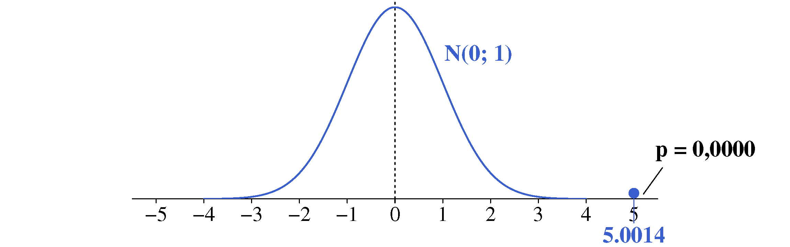{#fig-pValorPropor .fig-normal6 fig-align="center" width="100%"}

No, no lo es, ya que $P(z>5.0014) < 10^{-6}$. Si $p_1$ fuera igual a $p_2$ una diferencia como la observada se daría al azar menos de una vez en cada millón de estudios como el que se realizó.

## Pruebas de ajuste. Test de Chi-cuadrado

### Preámbulo: Las distribuciones multinomial y chi-cuadrado {.unnumbered}

La distribución multinomial es una generalización de la binomial. Mientras que en la binomial cada experimento tiene solo dos resultados posibles (lanzar una moneda: cara y cruz), la distribución multinomial puede tener $k$ resultados: $X_1, X_2, \dots , X_k$, cada uno con una cierta probabilidad de ocurrir: $p_1, p_2, \dots , p_k$. Naturalmente, $p_1 + p_2 + \dots + p_k = 1$.

Si ejecutamos el experimento $n$ veces, cada uno de los resultados posibles tendrá una frecuencia observada $O_i$, con $i = 1, 2, \dots, k$ y una frecuencia esperada $E_i = n p_i$. Un ejemplo típico son los resultados obtenidos al lanzar $n$ veces un dado: tenemos $k=6$ resultados posibles, en este caso todos con la misma probabilidad de ocurrir.

Recuperando los resultados del experimento de los dados de Wolf, para el dado rojo tenemos:

------------------------------------------------------------------------

\*\*\*\* TABLA SIN NÚMERO \*\*\*\* \*\*\*\*\*\*\*\*\*\*\*\*\*\*\*\*\*\*\*\*\*\*\*\*\*\*

En general, si el tamaño de la muestra es grande y se tiene un mínimo de 5 observaciones para cada uno de los valores posibles, el estadístico:

$$Q = \sum_{i=1}^{k} \frac{(O_i-E_i)^2}{E_i}$$ Sigue una distribución conocida y tabulada llamada distribución chi-cuadrado, también escrito $\chi^2$.

A diferencia de la Normal o la $t$-Student, la distribución $\chi^2$ es asimétrica (cola larga hacia la derecha) y al igual que la $t$-Student no es una distribución única sino que hay que indicar cuáles son sus grados de libertad. En el caso de $Q$, sigue una distribución chi-cuadrado con $k-1$ grados de libertad[^09_algunostest-1].

[^09_algunostest-1]: De forma similar al cálculo de la varianza, aunque tenemos $k$ sumandos, solo aportan información $k-1$. El $k$-ésimo se puede deducir si te tiene el resto ya que $\sum_{i=1}^k x_i = k\,\bar{x}$.

### Otro análisis de los resultados obtenidos con los dados de Wolf {.unnumbered}

En nuestro primer análisis usamos la diferencia máxima en valor absoluto como medida de la discrepancia entre los valores esperados y los observados. Con la notación que estamos usando sería: $$W = \text{Max} \left( | O_i - E_i | \right) \quad \text{para} \;\; i = 1,2,\dots,  k $$ Otra medida de discrepancia podría ser: $$T = \sum_{i=1}^{k} |O_i - E_i | $$ o también: $$V =  \sum_{i=1}^{k} (O_i - E_i)^2 $$

Cualquiera de estas nos podría servir como estadístico de prueba para contrastar la hipótesis nula de que el dado está equilibrado frente a la alternativa de que no lo está. La distribución de referencia adaptada a cada una de ellas podríamos construirla fácilmente por simulación.

Decimos "fácilmente" ahora, pero cuando se empezó a plantear esta forma de razonamiento no existía la posibilidad de la simulación y había que echar mano de argumentos matemáticos para identificar un estadístico de prueba con una distribución de referencia que se pudiera describir matemáticamente. En el caso que nos ocupa la solución está clara. El estadístico de prueba es $Q$ y la distribución de referencia una chi-cuadrado con $k-1$ grados de libertad.

Observe que $Q$ es la suma de una medida de discrepancia para cada uno de los resultados posibles. Parece innecesariamente complicado. pero tiene la gran ventaja de que la distribución de referencia es conocida y está tabulada. Tenemos:

```{=tex}
\begin{equation*} 
    \begin{split}
        Q &= \frac{(3407-3333.33)^2}{3333.33} + \frac{(3631-3333.33)^2}{3333.33} + \dots + \frac{(3422-3333.33)^2}{3333.33} = \\[5pt]
        &= 94.189
    \end{split}
\end{equation*}
```
Llevando este valor a la distribución de referencia, una $\chi^2$ con 5 grados de libertad, vemos que claramente no pertenece a esa distribución ([@fig-pValorChi2]).

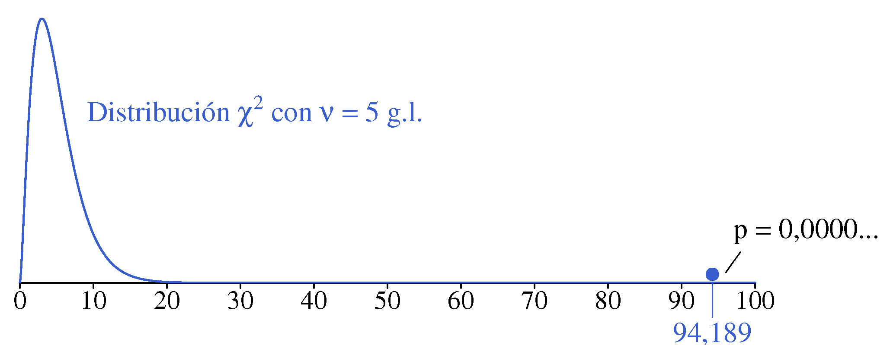{#fig-pValorChi2 .fig-normal6 fig-align="center" width="100%"}

[**¿Seguro que la distribución de referencia es una** $\chi^2$ con 5 grados de libertad?]{style="color: #0038CF;"}

No hemos demostrado --ni justificado-- que para el estadístico de prueba que hemos definido la distribución de referencia es una $\chi^2$ con 5 grados de libertad, pero podemos comprobar que, al menos en este caso concreto, así es.

Hemos repetido 100.000 veces el cálculo del estadístico de prueba $Q$, cada uno de ellos a partir de los resultados obtenidos por simulación al lanzar $20\;\!000$ veces un dado equilibrado ($\text{H}_0$ cierta: $p_1 = \dots = p_6 = 1/6$). La [@fig-histoChi2] muestra el histograma de los $100\;\!000$ valores obtenidos y se ha superpuesto la función densidad de probabilidad (ajustando la escala del eje de ordenadas) de una distribución $\chi^2$ con 5 grados de libertad. La coincidencia es evidente. El lector desconfiado (sana desconfianza) y con algunos conocimientos de programación, puede comprobarlo en cualquier otra situación.

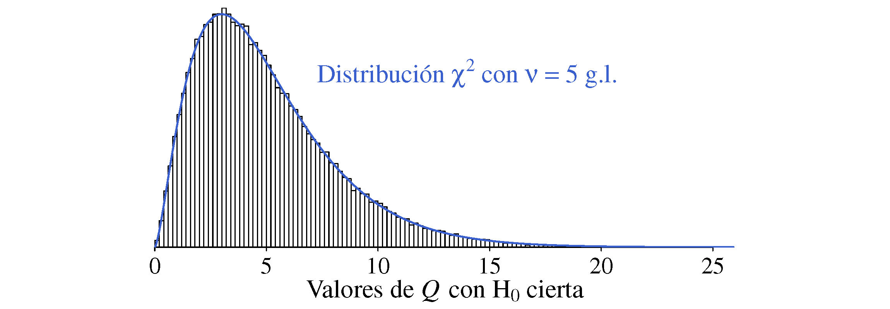{#fig-histoChi2 .fig-normal6 fig-align="center" width="100%"}

### Otros resultados, no tan exagerados {.unnumbered}

Supongamos que con otros dos dados, uno verde y otro azul, los resultados al realizar 20;!000 lanzamientos son los que se indican en la tabla \ref{tablaNuevosDados}.

------------------------------------------------------------------------

\*\*\*\* TABLA 9.3 \*\*\*\* \*\*\*\*\*\*\*\*\*\*\*\*\*\*\*\*\*\*\*\*\*\*\*\*\*\*

Solo a la vista de esos números resulta difícil opinar sobre si las diferencias respecto a los valores teóricos esperados (20.000/6 = 3.333,33) son normales o son mayores de lo que cabría esperar. La representación gráfica de los datos ([@fig-nuevosDados]) tampoco ayuda mucho en este caso.

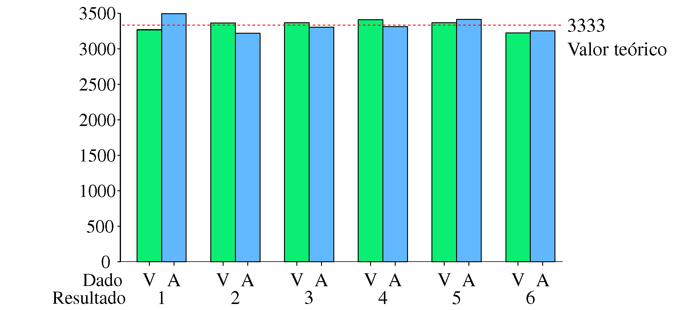{#fig-nuevosDados .fig-normal6 fig-align="center" width="100%"}

Un test estadístico aportará información relevante para valorar esta situación. Elegimos el estadístico de prueba que tiene como distribución de referencia una $\chi^2$ con 5 grados de libertad, los valores obtenidos son 7,65 para el dado verde y 15,91 para el azul. Los cálculos se encuentran en la tabla \ref{estPruebaNuevosDados} y en la figura \ref{pValorChi2NuevosDados} se han colocado esos valores en la distribución de referencia.

------------------------------------------------------------------------

\*\*\*\* TABLA 9.4 \*\*\*\* \*\*\*\*\*\*\*\*\*\*\*\*\*\*\*\*\*\*\*\*\*\*\*\*\*\*

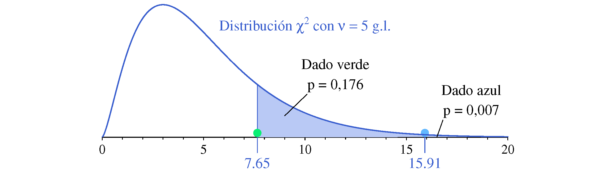{#fig-pValorChi2NuevosDados .fig-normal6 fig-align="center" width="100%"}

En un dado equilibrado, la probabilidad de tener una discrepancia como la observada en el dado verde, o mayor que esa, es del orden del 18 %, no hay pruebas para acusarlo. Sin embargo la probabilidad de tener una discrepancia como la observada en el dado azul es solo del orden del 7 por mil. Si existían sospechas previas, o había razones para pensar que podría estar trucado, este resultado avala esa teoría.

#### Elección del estadístico de prueba {.unnumbered}

Aunque, en general, los $p$-valores obtenidos son similares para cualquier estadístico de prueba razonable, en algunos casos pueden ser muy distintos. Por ejemplo, si lanzamos un dado 6000 veces y las frecuencias obtenidas son 950 para un resultado, 1050 para otro y 1000 para el resto, los $p$-valores obtenidos usando el estadístico de prueba que tiene como distribución de referencia la $\chi^2$ con 5 grados de libertad es muy parecido al obtenido usando la diferencia máxima en valor absoluto (ambos en torno a 0,4). Sin embargo, si las frecuencias son 950 para tres resultados y 1050 para los otros tres, el primero recoge esa diferencia y el $p$-valor disminuye mucho colocándose en torno a 0,01 mientras que el segundo no cambia y el $p$-valor se queda como estaba.

El primer estadístico de prueba sería como la varianza para medir la variabilidad mientras que el segundo sería el equivalente al rango, con sus ventajas (facilidad) y sus inconvenientes (no recoge bien toda la información que contienen los datos).

::: callout-note
## Distribución Chi-cuadrado: Para un barrido y para un fregado.

La distribución de $\chi^2$ no solo se usa como distribución de referencia en test como el que acabamos de ver. También sirve para explicar la variabilidad que presentan las varianzas muestrales $s^2$ de muestras de tamaño $n$ de una población Normal con varianza $\sigma^2$. Concretamente: $$s^2 \sim \frac{\sigma^2}{n-1} \chi_{n-1}^2 $$ El subíndice $n-1$ indica los grados de libertad de la distribución.

```         
    No podemos tener una distribución para cada variable aleatoria de interés. Tener distribuciones que sirven en distintos contextos nos ayuda a simplificar el conjunto de herramientas a utilizar.
```
:::

#### No todo son dados {.unnumbered}

En un contexto industrial, supongamos que cuando todo funciona de la forma habitual el 85 % de las unidades producidas son correctas, el 10 % tienen algún defecto que se puede corregir y el 5 % restante son defectuosas sin arreglo. En la última semana se han fabricado 5.000 unidades, consideremos las situaciones, A y B, que se indican en la tabla \ref{ejemploIndustrial}.

------------------------------------------------------------------------

\*\*\*\* TABLA 9.5 \*\*\*\* \*\*\*\*\*\*\*\*\*\*\*\*\*\*\*\*\*\*\*\*\*\*\*\*\*\*

Nos preguntamos si alguna de estas situaciones muestra un cambio significativo (no lo explica el azar) en la proporción de unidades de cada tipo. La representación gráfica de los resultados no despeja la duda planteada.

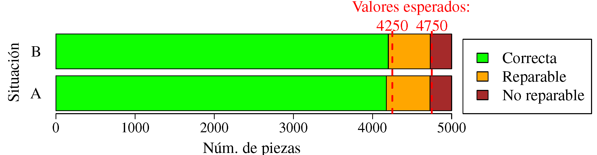{#fig-industrialChi2 .fig-normal6 fig-align="center" width="100%"}

Realizando el test de Chi-cuadrado \index{Test! de chi-cuadrado} los estadísticos de prueba son 8,82 para la situación A y 3,99 para la B (tabla \ref{testChiEjeIndustrial}).

------------------------------------------------------------------------

\*\*\*\* TABLA 9.6 \*\*\*\* \*\*\*\*\*\*\*\*\*\*\*\*\*\*\*\*\*\*\*\*\*\*\*\*\*\*

Situando esos valores en su distribución de referencia, en este caso una $\chi^2$ con 2 grados de libertad, observamos que para la situación A el $p$-valor es 0,136 mientras que para la B es igual a 0,012.

Por tanto, suponiendo que el proceso se mantiene estable y que el porcentaje de defectos de cada tipo no ha cambiado, una discrepancia respecto a los valores teóricamente esperados se da del orden del 14 % de las veces en la situación A mientras que solo un 1 % en la B. Si colocamos la frontera de lo razonablemente sospechoso en el 5 % deberíamos seguir sin preocuparnos si estamos en la situación A mientras que convendría revisar el proceso en busca de algún problema si nos encontramos en la situación B.

## Un caso especial: los test de Normalidad

La Normalidad de los datos suele estar sobrevalorada, aunque sigue siendo una de las principales preocupaciones de quienes se inician en el análisis estadístico. Muchos tests que, en teoría, exigen que los datos sean normales, en realidad solo requieren la normalidad de las medias muestrales, un supuesto que, en la práctica, casi siempre se cumple.

Para comparar las medias de dos poblaciones A y B mediante el test de la $t$ de Student formalmente se requiere que: $$y_A \sim \text{N}(\mu_A; \;\sigma) \qquad y_B \sim \text{N}(\mu_B; \;\sigma) $$ Vamos a ver qué pasa cuando $\mu_A = 3.0$, $\mu_B = 3.6$, $\sigma = \sqrt{3}$ y se contrasta $\text{H}_0: \mu_A = \mu_B$ frente a $\text{H}_1: \mu_A \neq \mu_B$ con muestras de tamaño $n_A = n_B = 10$. Generamos 10 números aleatorios de una distribución \text{N}(3,0; ;$\sqrt{3})$ y otros 10 de una \text{N}(3,6; ;$\sqrt{3})$, realizamos el test de la $t$-Student y obtenemos un $p$-valor. Si ejecutamos esta operación un millón de veces tendremos un millón de $p$-valores. A continuación repetimos exactamente el mismo procedimiento pero generando los datos de las distribuciones que se indican en la tabla \ref{parametrosDistribuciones}.

------------------------------------------------------------------------

\*\*\*\* TABLA 9.7 \*\*\*\* \*\*\*\*\*\*\*\*\*\*\*\*\*\*\*\*\*\*\*\*\*\*\*\*\*\*

Los resultados obtenidos se encuentran en la [@fig-pValorNoNormal]. Se han representado los histogramas de los $p$-valores según sea la distribución origen de los datos. Podemos observar que son muy parecidos. Cuando los datos provienen de una distribución Normal el 11,1% de las veces se rechaza la hipótesis nula, valor similar a cuando los datos provienen de las otras distribuciones, incluso de la exponencial, que es muy distinta de la Normal. Por tanto, al menos en este caso, la Normalidad no es tan importante.

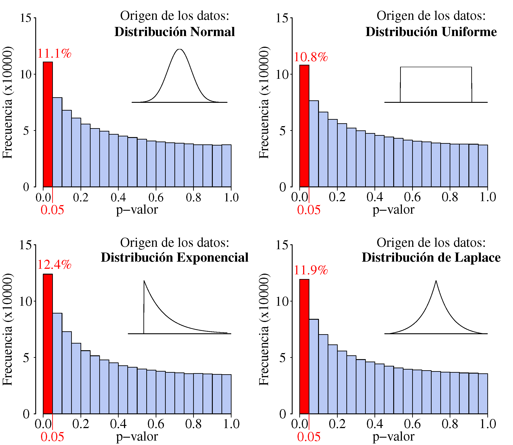{#fig-pValorNoNormal .fig-normal6 fig-align="center" width="100%"}

::: callout-note
## Para analizar, para aprender... ¡Simular!

Simular no solo sirve para analizar datos construyendo --por ejemplo-- distribuciones de referencia. También sirve para aprender, para comprobar, para descubrir, para ver que pasa si...
:::

### Un ejemplo de test de Normalidad: Kolmogorov-Smirnov {.unnumbered}

Existen muchos test de Normalidad (la abundancia es otra de sus peculiaridades). Vamos a comentar el de Kolmogorov-Smirnov, seguramente el que más suena a los que han realizado algún curso de estadística. También es el más sencillo de explicar, aunque no está entre los mejores.

En primer lugar debemos definir lo que es la **función de distribución, *F(X)***. Cuando se representa la función densidad de probabilidad $f(x)$ --la que tiene forma de campana en la distribución Normal-- las ordenadas son "densidades de probabilidad" mientras que las probabilidades corresponden a áreas bajo la curva. Cuando hablamos de función de distribución el eje de ordenadas ya indica probabilidades. No pueden ser probabilidades de valores concretos, puesto que estas siempre son iguales a cero, sino probabilidades acumuladas hasta el valor para el que se define $F(X)$. En una distribución Normal la forma de su función de distribución es una especie de S inclinada alargando los extremos.

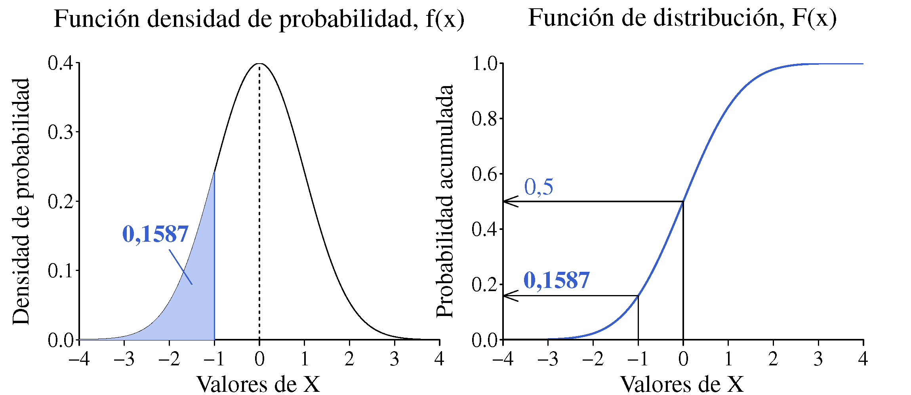{#fig-funcionDistribucion .fig-normal6 fig-align="center" width="100%"}

\noindent Por otra parte, dada una muestra podemos definir su función de \index{Distribución! empírica} distribución empírica, $F_n(x)$, sustituyendo probabilidades por proporciones. Hemos generado 5 números aleatorios de una distribución N(0; 1) que, una vez ordenados de menor a mayor, son los que se indican a continuación, junto con sus proporciones acumuladas.

------------------------------------------------------------------------

\*\*\*\* TABLA sín número \*\*\*\* \*\*\*\*\*\*\*\*\*\*\*\*\*\*\*\*\*\*\*\*\*\*\*\*\*\*

Como el menor, o por debajo de ese, hay 1 entre 5 (proporción: 0,2), como el que viene a continuación o menor que ese hay 2 entre 5 (0,4) y así sucesivamente. Finalmente, menor que el mayor ($x_{max}$) lo son todos, por tanto $F_n(x_{max}) = 1$.

El estadístico de prueba es la distancia máxima, $D_{max}$ entre la función de distribución teórica --la que figura en la hipótesis nula-- y la empírica correspondiente a los datos disponibles. Si con los datos de nuestro ejemplo contrastamos la hipótesis nula de que pertenecen a una N(0; 1) tendremos los valores de $F(X)$ que se indican en la tabla \ref{ejemploKS}, donde también vemos que la distancia máxima entre ambas funciones de distribución corresponde al valor $x = -0.34$ y es igual a 0,233.

------------------------------------------------------------------------

\*\*\*\* TABLA 9.8 \*\*\*\* \*\*\*\*\*\*\*\*\*\*\*\*\*\*\*\*\*\*\*\*\*\*\*\*\*\*

La [@fig-pruebaKSNormal5] muestra la obtención del estadístico de prueba con los datos del ejemplo para contrastar la hipótesis nula de que provienen de una N(0;1).

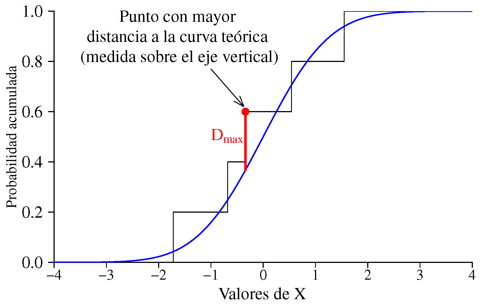{#fig-pruebaKSNormal5 .fig-normal6 fig-align="center" width="100%"}

La distribución de referencia puede calcularse por simulación y es la misma con independencia de cuál sea la distribución continua considerada en la hipótesis nula[^09_algunostest-2]. Lo que sí cambia --obviamente-- es la función de distribución teórica y, por tanto, la distancia máxima. Aunque este test sirve para contrastar la pertenencia de un conjunto de datos a cualquier distribución continua, como test de Normalidad es muy poco exigente y es muy fácil que los datos lo pasen aunque provengan de distribuciones muy alejadas de la Normal. Otro problema es que hemos supuesto conocidos los parámetros que definen la población, lo cual es poco razonable si dudamos del tipo de población al que pertenecen.

[^09_algunostest-2]: Puede verse una explicación detallada en el libro de Daniel Peña: "Fundamentos de Estadística". Alianza Editoria, 2001.

Existe una variante de este test, solo para contrastar la Normalidad (test de Lilliefords), que utiliza los valores estimados de los parámetros a partir de los valores de la muestra. Entre los test de Normalidad que mejor discriminan las distribuciones alejadas de la Normal se encuentran el de Shapiro-Wilk y el de Anderson-Darling[^09_algunostest-3].

[^09_algunostest-3]: Si está interesado en la comparación de test de Normalidad le puede resultar útil el siguiente artículo de JA Sáncez-Espigares et al: "Graphical comparison of normality tests for unimodal distribution data". Journal of Statistical Computation and Simulation, Vol. 89, 2019 - Issue 1.

::: callout-note
## El pecado original de los test de Normalidad

En un contraste de hipótesis la carga de la prueba la tiene el que afirma aquello que interesa que ocurra. Si se prueba una nueva vacuna la hipótesis nula es que no inmuniza y solo si los resultados están en contradicción con esa hipótesis se considera que sí es efectiva. Cuando se realiza un test de Normalidad e interesa que los datos sean Normales se traiciona ese espíritu al considerar que lo son a no ser que se demuestre lo contrario.
:::

### Pasar el test ¿garantiza la Normalidad? {.unnumbered}

No, en absoluto, y menos si el tamaño de muestra es pequeño. De nuevo hemos usado la simulación para ponerlo de manifiesto. Hemos generado 10;!000 muestras de tamaño $n=10$ de una distribución uniforme y a cada una de ellas le hemos aplicado el test de Shapiro-Wilk, uno de los que mejor discrimina cuando los datos no son Normales. En más del 90 % de los casos el $p$-valor resultado del test es superior a 0,05, es decir, que con el nivel de significación habitual del 5 % no se rechazaría la hipótesis de Normalidad. El poder de discriminación es mayor a medida que aumenta el tamaño de la muestra, pero con $n=20$ esa proporción sigue siendo alta, en torno al 80 %.

Si generamos los números de una distribución exponencial --muy distinta de la Normal-- con $n=10$ más de la mitad de las veces no se rechaza la hipótesis de Normalidad y si $n=20$ esa proporción está en torno al 16 %. Si la distribución origen de los datos es la de Laplace las proporciones de no rechazo están en torno al 85 % si $n=10$ y del 74 % si $n=20$.

La [@fig-normalErrorTipoII_SW] muestra los histogramas de los $p$-valores obtenidos en cada caso[^09_algunostest-4]. La proporción de veces que se rechaza la hipótesis nula puede variar ligeramente si se repite la simulación.

[^09_algunostest-4]: Para la simulación hemos usado los parámetros de las poblaciones identificadas como A en la tabla \ref{parametrosDistribuciones}, pero el valor de los parámetros no cambia los resultados obtenidos.

{#fig-normalErrorTipoII_SW .fig-normal6 fig-align="center" width="100%"}

::: callout-note
## ¿Cómo se justifica la Normalidad de los datos?

Razonando en base a su origen y características. Pasar el test de Normalidad solo pone de manifiesto que los datos no contradicen ese supuesto, pero no demuestran ni justifican que sea cierto.
:::

## APÉNDICE 9.A: Reflexiones en torno al p-valor {.unnumbered}

Con frecuencia el $p$-valor es visto como una especie de "número mágico" que sintetiza el resultado de un test estadístico y que puede marcar la diferencia entre el éxito o el fracaso de una investigación. En muchas ocasiones, la recogida de datos para llegar a plantear el contraste de hipótesis es larga y laboriosa por lo que obtener un $p$-valor u otro puede significar que los esfuerzos realizados tengan o no recompensa.

Quizá por esta razón, a veces se magnifica su significado y conviene tener claros los aspectos que a continuación comentamos.

####El $p$-valor también es una variable aleatoria {.unnumbered}

Consideremos un test de comparación de las medias de dos tratamientos. Las medias de las muestras son variables aleatorias, ya que dependen de los valores que tengamos en las muestras. Si repetimos un estudio realizado con todo el rigor y la meticulosidad exigidas, los valores obtenidos serán otros y, por tanto, también lo serán sus medias y el $p$-valor resultado del test de comparación.

Es verdad que no esperamos que el nuevo $p$-valor sea muy distinto del primero (dependerá del número de datos y de su variabilidad) pero sí que sea distinto. Por tanto, no podemos tomarnos el $p$-valor obtenido como un valor de referencia exacto e indiscutible que nos conduce a una determinada decisión. En realidad el $p$-valor es una variable aleatoria, y decidimos a la vista de un solo valor de esa variable.

Si realizamos el test usando dos muestras de la misma población (no hay diferencia en las medias), el $p$-valor obtenido es un valor de una distribución uniforme definida entre 0 y 1. Cualquier valor dentro de ese intervalo tiene la misma probabilidad de ser obtenido. En particular, si el nivel de significación lo situamos en 0,05, existe una probabilidad del 5 % de rechazar la hipótesis nula de igualdad de medias. Si la diferencia de medias realmente existe, la distribución del $p$-valor se va volviendo asimétrica aumentando la probabilidad de los valores bajos y disminuyendo la de los altos, y esa asimetría es cada vez más acentuada cuanto mayor es la diferencia.

Una vez más la simulación nos ayudará a ver lo que ocurre. Cada uno de los gráficos de la [@fig-reflexionesPvalor_SW] representa el histograma de los $p$-valores obtenidos al realizar 100.000 veces el test de comparación de medias de la $t$ de Student a muestras de tamaño $n = 10$ obtenidas aleatoriamente de una distribución Normal con desviación típica $\sigma = 3$ y la diferencia de medias que se indica en cada gráfico (el valor concreto de las medias es irrelevante). Vemos que la distribución de $p$-valor es uniforme si la diferencia de medias es igual a cero, y como la probabilidad de que ese $p$-valor sea inferior a 0.05 va aumentando a medida que aumenta la diferencia de las medias poblaciones. Dependiendo de cuál sea esa diferencia, el $p$-valor que se obtendrá será un valor de la distribución correspondiente. Eso es el $p$-valor, un valor de una distribución de probabilidad.

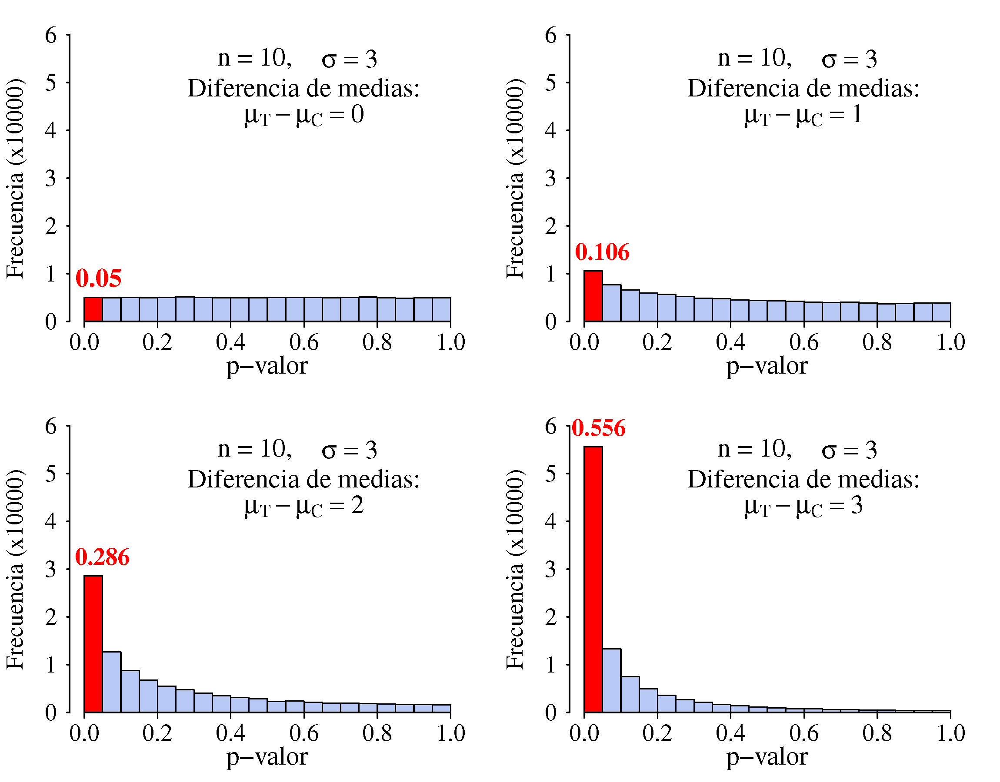{#fig-reflexionesPvalor_SW .fig-normal6 fig-align="center" width="100%"}

#### La frontera del 0,05 es arbitraria {.unnumbered}

Cuando se construyeron las primeras tablas estadísticas, con métodos de cálculo todavía rudimentarios, para las distribuciones más habituales se determinaron los valores que correspondían a probabilidades que eran números redondos, en general: 0,001, 0,0025, 0,01, 0,025, 0,05, 0,10, 0,25. De todos estos, el que se consideró que marca la diferencia entre lo normal y lo raro es 0,05, pero también se podría usar 0,03 o 0,06. Seguramente usamos 0,05 porque tenemos 5 dedos en cada mano y ese es un número redondo en nuestro sistema decimal. Si tuviéramos seis dedos es muy posible que el valor frontera fuera 0,06.

#### El $p$-valor aporta información relevante {.unnumbered}

Es cierto que, si una representación gráfica de los resultados no despeja nuestras dudas, difícilmente lo hará un test estadístico. Sin embargo, mientras que una gráfica puede generar impresiones distintas según quién la observe, el test --a través del $p$-valor-- proporciona una medida objetiva del grado de duda o de incertidumbre.

Usando el $p$-valor se puede establecer una regla de decisión sin necesidad de deliberaciones basadas en criterios subjetivos: basta con fijar de antemano qué nivel de error se está dispuesto a aceptar y compararlo con el $p$-valor.

## APÉNDICE 9.B: Intervalos de confianza como alternativa al \textit{p}-valor {.unnumbered}

Otra manera de plantearse lo razonable que es un valor para un parámetro poblacional evitando la sensación de \<<blanco o negro>\> que se tiene comparando el $p$-valor con el nivel de significación es dar un intervalo de confianza del parámetro de interés. Si a partir de la siguiente muestra:

```{=html}
<div class="tabla-wrapper_T0900a">
<table class="tabla-0900a">

<colgroup>
<col style="width: 6%;">
<col style="width: 6%;">
<col style="width: 6%;">
<col style="width: 6%;">
<col style="width: 6%;">
<col style="width: 6%;">
<col style="width: 6%;">
<col style="width: 6%;">
<col style="width: 6%;">
<col style="width: 6%;">
</colgroup>

<tbody>
<tr>
  <td>11,5</td> <td>8,0</td> <td>11,7</td> <td>9,9</td> <td>11,2</td> <td>10,4</td> <td>11,0</td> <td>11,7</td> <td>9,6</td> <td>9,6</td>
</tr>
</tbody>
</table>
</div>
```
contrastamos $\text{H}_0$: $\mu = 10$ frente a $\text{H}_1$: $\mu \neq 10$ mediante el test de la $t$ de Student, obtenemos un $p$-valor de 0,254. Por tanto, con el nivel de significación habitual del 5 %, no rechazaremos $\text{H}_0$. También podemos calcular un intervalo de confianza del 95 % para $\mu$ y obtenemos (9,605; 11,315). Vemos que 10 está dentro del intervalo, luego está dentro del rango de valores razonables con una confianza del 95 % y la conclusión es que no hay evidencia para rechazar que el valor de $\mu$ sea igual a 10.

Existe una relación directa entre el $p$-valor obtenido al realizar el test de la $t$ de Student y el hecho de que el valor contrastado esté dentro o fuera del intervalo de confianza. Si $p$-valor,\>$\,\alpha$ seguro que el valor contrastado estará dentro del intervalo de confianza $1-\alpha$, y si es menor que $\alpha$ seguro que estará fuera. Si el $p$-valor es igual a $\alpha$ el valor contrastado estará justo en un extremo del intervalo $1-\alpha$, tal como ocurre con los siguientes valores:

```{=html}
<div class="tabla-wrapper_T0900a">
<table class="tabla-0900a">

<colgroup>
<col style="width: 6%;">
<col style="width: 6%;">
<col style="width: 6%;">
<col style="width: 6%;">
<col style="width: 6%;">
<col style="width: 6%;">
<col style="width: 6%;">
<col style="width: 6%;">
<col style="width: 6%;">
<col style="width: 6%;">
</colgroup>

<tbody>
<tr>
  <td>8,0</td> <td>10,3</td> <td>10,0</td> <td>10,8</td> <td>9,3</td> <td>8,2</td> <td>9,1</td> <td>9,7</td> <td>9,5</td> <td>8,7</td>
</tr>
</tbody>
</table>
</div>
```
Naturalmente, lo anterior también vale cuando se contrasta una diferencia de medias o de proporciones. Supongamos que tenemos dos muestras:

```{=html}
<div class="tabla-wrapper_T0900b">
<table class="tabla-0900b">

<colgroup>
<col style="width: 6%;">
<col style="width: 6%;">
<col style="width: 6%;">
<col style="width: 6%;">
<col style="width: 6%;">
<col style="width: 6%;">
<col style="width: 6%;">
<col style="width: 6%;">
<col style="width: 6%;">
<col style="width: 6%;">
<col style="width: 6%;">
</colgroup>

<tbody>
<tr>
  <td>A:</td> <td>11,5</td> <td>8,0</td> <td>11,7</td> <td>9,9</td> <td>11,2</td> <td>10,4</td> <td>11,0</td> <td>11,7</td> <td>9,6</td> <td>9,6</td>
</tr>
<tr>
  <td>B:</td> <td>8,0</td> <td>10,3</td> <td>10,0</td> <td>10,8</td> <td>9,3</td> <td>8,2</td> <td>9,1</td> <td>9,7</td> <td>9,5</td> <td>8,7</td>
</tr>
</tbody>
</table>
</div>
```
Contrastamos $\mu_A = \mu_B$ frente a $\mu_A \neq \mu_B$, el $p$-valor es 0,033 y el intervalo de confianza del 95 % para $\mu_A - \mu_B$ es (0,099; 2,101); el cero queda fuera de este intervalo, luego no es un valor razonable para la diferencia de medias con ese nivel de confianza. Los intervalos que estamos calculando son simétricos respecto a la estimación puntual y son equivalentes al contraste de hipótesis cuando la alternativa es del tipo "distinto de".

## APÉNDICE 9.C: Más sobre las distribuciones \textit{t}-Student y Chi-cuadrado {.unnumbered}

Ambas aparecen con frecuencia en los análisis estadísticos. Intervienen en la construcción de intervalos de confianza —la $t$-Student en el caso de las medias y la chi-cuadrado en el de las varianzas— y se utilizan como distribuciones de referencia en test estadísticos muy habituales.

#### Distribución $t$-Student {.unnumbered}

Sabemos que si $X \sim \text{N}(\mu; \sigma)$ entonces $z = (x - \mu)/ \sigma$ es un valor de una distribución N(0; 1) con independencia de los valores de $\mu$ y de $\sigma$. El problema es que no podemos calcular el valor de $z$ si, tal como ocurre en la práctica, no se conocen los valores de $\mu$ ni de $\sigma$. El valor de $\mu$ no da problemas, ya que desaparece de las expresiones del intervalo de confianza o se considera conocido cuando se realiza un contraste de hipótesis, siendo el valor especificado en la hipótesis nula. Sin embargo, no conocer $\sigma$ sí cambia las cosas porque si usamos su estimador $s$ --lo más razonable si no se conoce el valor real--, tenemos $(x - \mu)/ s$, que no es igual que $(x - \mu)/ \sigma$ porque no es lo mismo tener en el denominador una variable aleatoria que tener una constante. Tiene más variabilidad la expresión que contiene la variable aleatoria.

Si se trabaja con una muestra grande este problema tiene poca relevancia porque el valor de $s$ tendrá poca variabilidad y será muy parecido al de $\sigma$, de manera que las dos expresiones tendrán distribuciones muy parecidas. Sin embargo, si la muestra es pequeña la diferencia puede ser importante y la mayor variabilidad al dividir por $s$ se traduce en una distribución más ancha, donde los valores que dejan las probabilidades establecidas quedan más lejos. Si se trata de un contraste de hipótesis se tenderá a rechazar la hipótesis nula con una probabilidad de error mayor de la que se ha establecido.

El primero en proponer el uso de una nueva distribución de referencia cuando se utiliza el valor de $s$ para estandarizar la distribución Normal fue William S. Gosset (1876-1937), un científico con formación en matemáticas y química que trabajaba en la cervecería Guinness de Dublín. Parece que en el marco de sus investigaciones sobre la producción de cerveza se enfrentó a los desafíos de obtener conclusiones válidas a partir del análisis de muestras pequeñas. Una anécdota muy comentada es que la empresa no permitía que los trabajadores publicaran resultados de sus investigaciones por lo que Gosset firmó el artículo con su propuesta de nueva distribución con el seudónimo de *Student*. Por esta razón le llamamos $t$ de Student y no $t$ de Gosset como seguramente se llamaría si el artículo lo hubiera firmado con su nombre.

La $t$ de Student no es una sola distribución, como sí lo es la N(0; 1) sino una familia de distribuciones donde cada una de ellas está caracterizada por los llamados \<<grados de libertad>\> que notamos $\nu$. Esos grados de libertad están relacionados con el tamaño de la muestra $n$: $\nu = n-1$. A medida que $n$ aumenta, la distribución de $t$ va teniendo más grados de libertad y se va pareciendo a la N(0; 1).

La figura \ref{tStudent} muestra en la parte izquierda una $t$-Student con 4 grados de libertad (el valor de $s$ se estima con una muestra de 5 observaciones) junto con una N(0; 1). No parecen muy distintas pero si nos fijamos en las colas --que es la zona que más interesa-- sí lo son. En una N(0; 1) el intervalo donde la probabilidad de ocurrencia es del 95% es $0 \pm 1.96$, mientras que en la $t_4$ es $0 \pm 2.78$, claramente más ancho en este caso. Cuando la $t$-Student tiene 10 grados de libertad (gráfico de la derecha) la diferencia es menor. A partir de 30 grados de libertad, a efectos prácticos, se pueden considerar iguales.

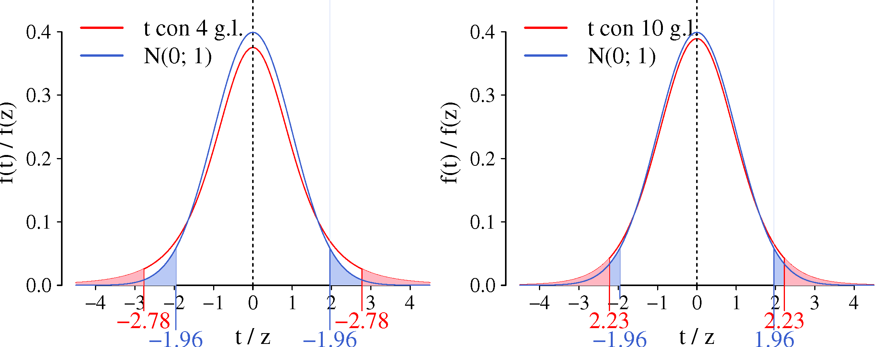{#fig-tStudent .fig-normal6 fig-align="center" width="100%"}

Observe que si se trabaja con una muestra de tamaño $n=5$ y al contrastar el valor de la media de la población se obtiene un estadístico de prueba $t = 2.5$, si usamos como distribución de referencia una N(0; 1) rechazaremos la hipótesis nula, mientras que con la distribución adecuada ($t_{\nu=4}$) no se rechaza.

#### Distribución $\chi^2$ {.unnumbered}

Al igual que la $t$-Student se trata de una familia de distribuciones, de manera que para identificar a cuál nos estamos refiriendo hay que concretar sus grados de libertad. Se define como una suma de normales estandarizas al cuadrado, siendo sus grados de libertad igual al número de sumandos. Si $X \sim \text{N}(\mu; \sigma)$:

$$\sum_{i=1}^{\nu} \left ( \frac{x_i - \mu}{\sigma} \right )^2 \sim \chi_{\nu}^2 $$ Tanto su media como su varianza están relacionadas con sus grados de libertad, concretamente $E(\chi_{\nu}^2)= \nu$ y $V(\chi_{\nu}^2)= 2\nu$. A diferencia de la $t$-Student, esta es una distribución asimétrica, pero a medida que aumentan los grados de libertad se va haciendo simétrica y pareciéndose cada vez más a una distribución Normal[^09_algunostest-5] (figura \ref{Chi2}).

[^09_algunostest-5]: Aunque necesita bastantes más grados de libertad que la $t$-Student para poder ser tratada como una Normal. Este era un tema importante cuando los medios de cálculo eran escasos, ahora no tiene ninguna relevancia.

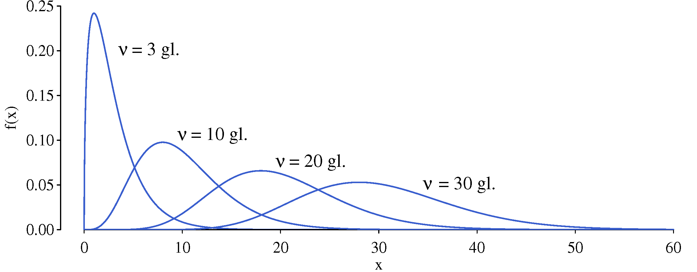{#fig-Chi2 .fig-normal6 fig-align="center" width="100%"}

Curiosamente esta distribución aparece en contextos muy distintos; por ejemplo, es la que explica la variabilidad de las varianzas muestrales. Del mismo modo que sucede con las medias, cada muestra extraída posee su propia varianza, por lo que la varianza muestral también presenta cierta variabilidad. Sin embargo, a diferencia de la media muestral, cuya variabilidad se describe mediante la distribución Normal, en este caso se explica mediante la distribución $\chi^2$. Concretamente tenemos:

$$s^2 \, \frac{n-1}{\sigma^2} \sim \chi_{n-1}^2$$ Cuando el tamaño de muestra es pequeño, es de esperar que la distribución de la varianza muestral sea asimétrica. En ese caso pueden obtenerse muestras con muy poca o con mucha variabilidad, pero las desviaciones no tienen la misma libertad hacia valores pequeños que hacia valores grandes. Hacia los valores grandes no existe límite, por lo que pueden darse varianzas elevadas; en cambio, los valores bajos están restringidos por el cero, que actúa como una frontera que no se puede sobrepasar. Esta libertad de desplazamiento en un sentido y limitación en el otro genera la asimetría de la distribución. A medida que el tamaño de la muestra aumenta, la variabilidad se reduce, los valores excepcionalmente grandes tienden a desaparecer y la cola hacia los valores pequeños se aleja del origen.

Respecto al uso de la distribución $\chi^2$ en los test de bondad de ajuste, como en el caso de los dados de Wolf, si la hipótesis nula es cierta, podemos considerar que las frecuencias de aparición para cada uno de los resultados posibles son variables aleatorias con distribución binomial[^09_algunostest-6]. Por otro lado, la distribución binomial se puede aproximar --si se cumplen ciertas condiciones-- a una distribución de Poisson, que, como vimos, está caracterizada por un solo parámetro $\lambda$ que es a la vez su media y su varianza. Además, a partir de un cierto valor de $\lambda$ la distribución de Poisson se puede aproximar a la Normal, de manera que si $X \sim \text{Pois}(\lambda)$ y se cumplen las condiciones para la aproximación, podemos considerar que: $X \sim \text{N}(\lambda; \sqrt{\lambda})$.

[^09_algunostest-6]: En realidad lo son de una distribución *multinomial*, que es una generalización de la binomial cuando se tienen más de dos resultados posibles. Si fueran un conjunto de binomiales, los resultados serían independientes, pero evidentemente no lo son.

Si asimilamos la frecuencia observada ($x$) de cada uno de los posibles resultados al lanzar el dado con una distribución de Poisson, tendremos que su media ($np$) será igual a su varianza, por tanto: $$\frac{x - np}{\sqrt{np}} \sim \text{N}(0; 1) $$ Por tanto, $$\frac{(x - np)^2}{np} \sim \chi_1^2 $$ La frecuencia observada es $x$ y $np$ es la esperada. La suma de esta expresión para cada valor posible de la respuesta seguirá una distribución $\chi^2$ con un número de grados de libertad igual a $n-1$. El restar 1 tiene que ver --una vez más-- con que los valores no son independientes.

## Apéndice 9.D: Test de *\[aquí su nombre\]* {.unnumbered}

Aunque existen muchos test de Normalidad, no es difícil crear uno nuevo en plan "casero". Seguramente no estará entre los mejores, pero será un buen ejercicio para entender el funcionamiento de los contrastes de hipótesis.

### Diseño del test {.unnumbered}

La idea será dividir los datos en intervalos y definir un estadístico de prueba que mida la diferencia entre las frecuencias esperadas y las observadas. La distribución de referencia la crearemos por simulación. Seguimos los siguientes pasos:

#### 1. Definir los intervalos {.unnumbered}

Podemos decidir que el número de intervalos, $k$, sea igual a un tercio del número total de observaciones, $n$, redondeado por exceso. Siendo 'int' la parte entera, tendremos: $$k = \text{int} \left ( \frac{n}{3} + 0.5 \right )$$ También hay que definir el punto en el que empieza el primer intervalo. Si a la anchura de los intervalos le llamamos $a$ y al valor mínimo de la muestra min($x$), podemos empezar el primer intervalo en $\text{min}(x) - a/2$ y su anchura debe ser $a = R/(k-1)$, siendo $R$ el rango de los valores de la muestra.

De esta forma nos aseguramos de que todas las observaciones caen dentro de algún intervalo, aunque cuando se calcula la frecuencia teórica sí podemos tener algún valor fuera. Para evitar que esto ocurra podemos añadir un cierto número de intervalos, $t$, a cada lado de los que ya hemos definido. Podemos establecer $t=3$ y sustituir el extremo inferior del primer intervalo por un número muy pequeño (por ejemplo: -9999) y el extremo superior del último por un número muy grande (9999) para que la suma de las probabilidades en los intervalos sea igual a 1. La frecuencia observada en los intervalos añadidos será evidentemente igual a cero, no hace falta contar.

Por supuesto, se puede aplicar cualquier otro criterio para determinar tanto el número de intervalos como su anchura y el origen del primero ¿y si la anchura varía según su distancia al centro de los datos?

#### 2. Definir el estadístico de prueba {.unnumbered}

Sea $f_o$ la frecuencia observada y $f_t$ la frecuencia teórica suponiendo que los datos provienen de una distribución Normal con la media y la desviación típica de la muestra. El estadístico de prueba puede ser: $$m = \sum_{i=1}^{k} ({f_o}_i - {f_t}_i)^2 $$ Claro que en vez del cuadrado de la diferencia podríamos usar su valor absoluto, la diferencia máxima o algún otro valor que refleje la discrepancia entre $f_o$ y $f_t$. También se podría ponderar la diferencia correspondiente a cada intervalo según esté en el centro o hacia los extremos.

#### 3. Construcción de la distribución de referencia {.unnumbered}

Generamos muestras aleatorias de tamaño $n$ de una distribución Normal con la media y la desviación típica que se suponen. Para cada una de ellas calculamos el estadístico de prueba con los criterios establecidos. Con 10.000 valores en la distribución de referencia ya podemos obtener $p$-valores suficientemente aproximados.

### Ejemplo {.unnumbered}

Para obtener la muestra cuyo origen Normal vamos a contrastar generamos 20 números aleatorios de una distribución chi-cuadrado con 3 grados de libertad, una distribución asimétrica con cola larga hacia la derecha, bastante alejada de la Normal (figura \ref{ejemploTestMio}).

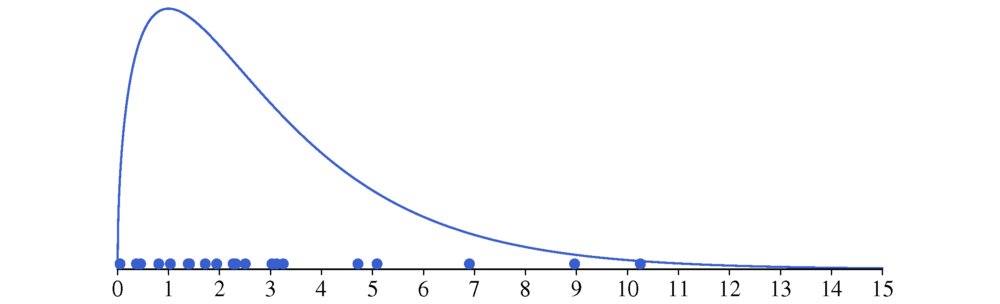{#fig-ejemploMiTesto .fig-normal6 fig-align="center" width="70%"}

En primer lugar identificamos los intervalos con el criterio establecido. Para cada uno de esos intervalos contamos la frecuencia observada ($f_o$) y la probabilidad de tener una observación en el caso de que los datos provengan de una distribución Normal con la media y la desviación típica de la muestra, en nuestro caso 3,079 y 2,814 respectivamente. Una vez tenemos los valores de $f_o$ y $f_t$ para cada intervalo, podemos calcular el cuadrado de su diferencia. La suma de esos cuadrados es el estadístico de prueba (tabla \ref{ejemploMio}).

------------------------------------------------------------------------

\*\*\*\* TABLA 9.9 \*\*\*\* \*\*\*\*\*\*\*\*\*\*\*\*\*\*\*\*\*\*\*\*\*\*\*\*\*\*

Ya solo falta obtener los valores de la distribución de referencia y calcular el $p$-valor. Para hacerlo generamos 10.000 muestras con el mismo tamaño, media y desviación típica que la sometida a prueba, pero en este caso provenientes de una distribución Normal. Para cada una de ellas se calcula el estadístico de prueba con el procedimiento descrito (naturalmente, deberemos crear un pequeño programa que lo haga de forma automática). Los 10.000 valores obtenidos constituyen una aproximación razonable a la distribución de referencia.

Para determinar el $p$-valor solo hay que contar cuántos valores en la distribución de referencia son iguales o mayores que nuestro estadístico de prueba. Tenemos 1010, por tanto, el $p$-valor será: 1010/10000 = 0,101. Con el nivel de significación habitual (0,05) no podemos rechazar la hipótesis nula.

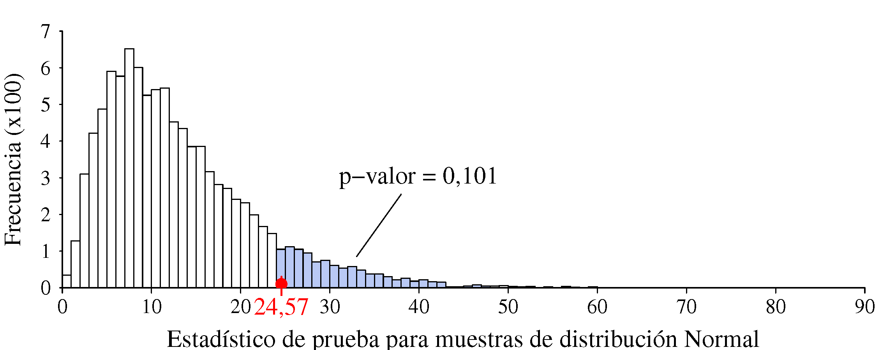{#fig-ejemploMio .fig-normal6 fig-align="center" width="70%"}

### Comparando con el mejor {.unnumbered}

Hemos aplicado este nuevo test a muestras de tamaños $n$ = 20, 35, 50 y 100 de la misma distribución usada en el ejemplo anterior, una $\chi^2$ con $\nu = 3$ grados de libertad.

Para cada valor de $n$ hemos repetido el test 100 veces con otras tantas muestras. Para cada una de ellas hemos calculado el $p$-valor realizando nuestro test (le llamamos "improvisado") y también el de Shapiro-Wilk. La figura \ref{comparaSW_Mio} muestra diagramas bivariantes del $p$-valor obtenido con nuestro test frente al obtenido con el de S-W (cada punto corresponde a una muestra test). También se indica el número de veces que se rechaza la hipótesis de normalidad (% \< 0,05), es decir, que acertamos, puesto que la muestra no proviene de una distribución Normal.

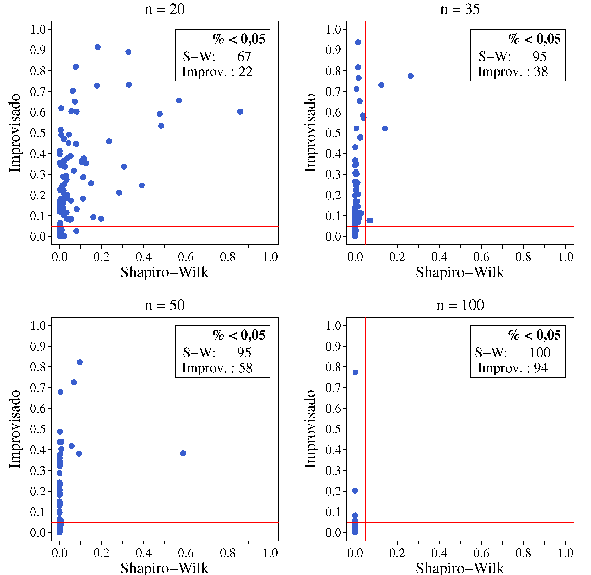{#fig-comparaSW_Mio .fig-normal6 fig-align="center" width="70%"}

El test de Shapiro-Wilk nos gana por goleada, aunque con $n=20$ tampoco hace un gran papel ya que falla 33 veces de las 100 que se han probado. Si en vez de elegir compararnos con el mejor lo hubiéramos hecho con el de Kolmogorov-Smirnov las diferencias no serían tan grandes. En cualquier caso, nuestro test tiene margen de mejora, el lector interesado lo puede explorar.

::: {style="text-align: center; font-size: 1.1em;"}
\_\_\_\_\_\_\_\_\_\_\_\_\_\_\_\_\_\_\_\_\_\_\_\_ [◇]{style="margin: 0 0.4em;"} \_\_\_\_\_\_\_\_\_\_\_\_\_\_\_\_\_\_\_\_\_\_\_\_
:::

<br>

