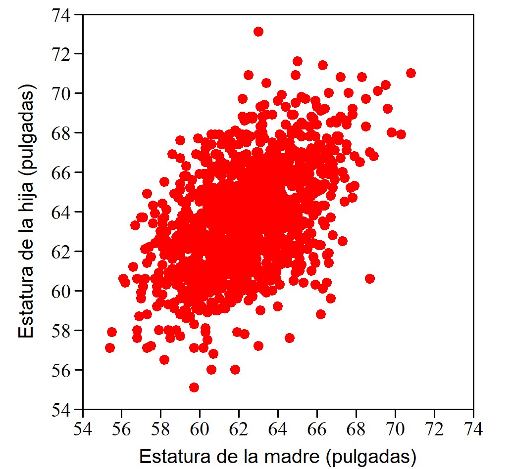
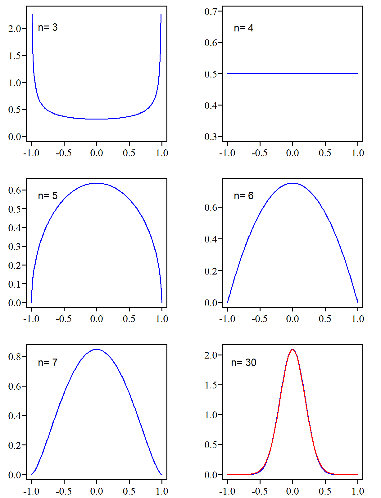

# Medidas de relación lineal

La forma más sencilla de analizar la posible relación entre dos variables es representar sus valores en un diagrama bivariante. Cada punto es una observación y sus coordenadas $(x; y)$ corresponden a los valores de las variables consideradas.

::: callout-note
## ¿Qué variable se asigna a cada eje?

No es arbitrario. En el eje de las $x$ colocamos la variable independiente (la que viene dada) y en el de las $y$ la variable respuesta. Si analizamos la relación entre el peso y la estatura, en el eje de las $x$ debemos colocar la estatura y en el eje de las $y$ el peso. Queremos ver si la estatura influye en el valor del peso.
:::

El diagrama de la [@fig-bivaDatosPearson] se ha construido con unos datos que fueron obtenidos por Karl Pearson (1857-1936) para estudiar la influencia de la herencia en la estatura. Cada punto representa la estatura de una mujer y la de una de sus hijas mayores de 18 años[^10_relacionlineal-1]. La nube de puntos resultante muestra una clara relación estadística: cuanto más alta es la madre, más alta tiende a ser la hija.

[^10_relacionlineal-1]: Más detalles en: Weisberg, S. (2004): \`\`Applied Linear Regression''. Ed. Wiley, 4a ed., pág. 2.

{#fig-bivaDatosPearson .fig-normal6 fig-align="center" width="100%"}

A la vista de este diagrama surge el interés por medir la intensidad de la relación. La expresión "clara relación" que hemos usado anteriormente puede aplicarse a situaciones muy diferentes y conviene poder diferenciarlas con una medida cuantitativa. También tiene interés conocer la ecuación de la recta que refleja esa relación.

## Observación y cuantificación de la relación

Veamos los cuatro casos de la [@fig-medidaRelacion]. El primero muestra la relación entre la presión atmosférica (en pulgadas de Hg) y la temperatura de ebullición del agua (en $^\circ$F). Los datos[^10_relacionlineal-2] fueron tomados por el botánico y explorador británico Joseph D. Hooker en distintos puntos de la cordillera del Himalaya a mediados del siglo XIX. Si la presión atmosférica --y a partir de ella la altitud-- podía evaluarse a partir de la temperatura de ebullición del agua, que es muy fácil de medir, se evitaba el uso de los frágiles y difíciles de transportar barómetros de la época. El método fue un éxito, ya que entre ambas variables se observa una relación casi perfecta.

[^10_relacionlineal-2]: Fuente: Página personal del prof. Weisberg en [<https://cla.umn.edu/statistics>]{style="font-family: monospace;"} \> Other Resources \> data files \> Hooker.csv

{#fig-medidaRelacion .fig-normal6 fig-align="center" width="100%"}

El diagrama 2 muestra la relación entre la longitud de la circunferencia de los troncos de un determinado tipo de árbol y el volumen de madera que se puede obtener de ellos[^10_relacionlineal-3]. Se observa una estrecha relación entre ambas variables. El diagrama 3 se ha obtenido con datos de esos mismos árboles pero representando el volumen de madera en función de la altura del árbol. También se observa una relación, pero no tan clara como en el caso anterior.

[^10_relacionlineal-3]: Fuente: Wolfram Research, ["Sample Data: Black Cherry Trees"](https://doi.org/10.24097/wolfram.76288.data) en Wolfram Data Repository (2016).

Finalmente, el diagrama 4 se ha realizado con los datos de un estudio[^10_relacionlineal-4] donde se analiza la relación entre la edad al morir y la longitud de cierta línea de la mano a partir de una muestra de 50 personas fallecidas. A la vista del diagrama queda claro que no hay ninguna relación entre ambas variables.

[^10_relacionlineal-4]: Fuente: Draper, N. D. y Smith, H (1998): \`\`Applied Regression Analysis'' Ed. Wiley, 3a edic. pág. 105, citando un trabajo publicado por L. E. Mather y M. E. Wilson.

Aunque la información fundamental queda reflejada en el diagrama bivariante, cuando a la vista del gráfico la relación es dudosa, o cuando interesa cuantificarla, disponemos de medidas de relación lineal. Las dos de uso más habitual son la covarianza y el coeficiente de correlación, especialmente esta última por las razones que veremos a continuación.

## Covarianza

Aparece en las calculadoras con funciones estadísticas, en los paquetes de software y también en las hojas de cálculo, aunque en la práctica resulta poco útil como medida de relación lineal entre dos conjuntos de valores. Aquí la incluimos porque su expresión es fácil de justificar y ayuda a entender la fórmula del coeficiente de correlación.

::: callout-note
## Notación usada

Para la covarianza no tenemos un símbolo específico. Cuando nos referimos a modelos teóricos, o a nivel poblacional, escribimos $\text{Cov}(x,y)$. Para el valor calculado a partir de unos datos concretos (una muestra) escribimos $\widehat{\text{Cov}}(x,y)$ colocando un “sombrero” encima de $\text{Cov}$ para indicar que se trata de un estimador.
:::

### Deducción de la fórmula {.unnumbered}

La [@fig-covarianza] muestra la relación entre dos variables $X$ e $Y$. El diagrama se ha dividido en cuatro cuadrantes trazando una línea vertical que pasa por la media de los valores de $X$ y una horizontal por la media de los valores de $Y$. A estos valores medios los designamos $\bar{x}$ e $\bar{y}$ respectivamente. Los cuadrantes van del I al IV en el sentido de las agujas del reloj.

{#fig-covarianza .fig-normal6 fig-align="center" width="100%"}

En todos los puntos del primer cuadrante la distancia $x - \bar{x}$ es positiva, ya que todos se encuentran a la derecha de $\bar{x}$. También será positiva la distancia $y - \bar{y}$ ya que todos están por encima de $\bar{y}$. Por tanto, el producto de ambas distancias $(x - \bar{x}) (y - \bar{y})$ será positivo para todos los puntos que se hallan en el primer cuadrante.

Para los del segundo cuadrante este producto es negativo ya que la distancia $x - \bar{x}$ sigue siendo positiva (todos los puntos se encuentran a la derecha de $\bar{x}$), pero $y - \bar{y}$ será negativo (todos están por debajo de $\bar{y}$).

En el tercer cuadrante el producto de las distancias es positivo porque ambas distancias son negativas y en el cuarto vuelve a ser negativo ya que $y - \bar{y}$ es positivo pero $x - \bar{x}$ es negativo.

Con $n$ puntos, la suma de todos estos productos será $\sum_{i=1}^n (x - \bar{x}) (y - \bar{y})$. Si la mayoría se encuentra en los cuadrantes I y III, tal como ocurre en la [@fig-covarianza], el resultado del sumatorio será un valor positivo, mientras que si están en los cuadrantes II y IV el resultado será negativo. Si no existe ninguna relación entre $X$ e $Y$ los puntos se repartirán de forma más o menos equilibrada, tendiendo a compensarse los productos positivos con los negativos y dando un resultado alrededor de cero.

La covarianza es el valor de ese sumatorio dividido por el número de puntos que intervienen en su cálculo, algo así como el promedio de los productos $(x - \bar{x}) (y - \bar{y})$. Si nuestro interés no es conocer la covarianza de los datos disponibles, sino estimar su valor en la población, dividimos por $n-1$ en vez de por $n$, por la misma razón que lo hacemos cuando estimamos el valor de la varianza. Como lo habitual es esto último, escribimos la fórmula de la forma: $$\widehat{\text{Cov}}(x,y) = \frac{\sum_{i=1}^n (x - \bar{x}) (y - \bar{y})}{n-1} $$ \### Propiedades {.unnumbered}

La covarianza tiene un gran protagonismo en el terreno de los modelos teóricos pero apenas se usa para valorar la relación lineal entre dos conjuntos de datos. Para este menester tiene el inconveniente de que su valor depende de las unidades utilizadas.

Si se calcula la covarianza entre la estatura de madres e hijas con los datos representados en la [@fig-bivaDatosPearson], cuyas unidades son pulgadas (in), se obtiene un valor de 3,005$\,\text{in}^{2}$. Sin embargo, si cambiamos las unidades a cm (1 in = 2,54,cm) el gráfico tiene el mismo aspecto y el grado de relación sigue siendo el mismo, pero ahora el valor obtenido es 19,39$\,\text{cm}^{2}$, y si las estaturas se expresan en metros tenemos que la covarianza es igual a 0,0019$\,\text{m}^{2}$.

Por otra parte, para su valoración no tenemos ningún marco de referencia que nos permita evaluar si el valor obtenido es grande o pequeño. Todos estos problemas quedan resueltos con el uso del coeficiente de correlación.

::: callout-note
## Malas noticias para la covarianza

Dados unos valores de $X$, la máxima covarianza no se obtiene cuando los valores de $Y$ hacen que los puntos se alineen según una recta. Por ejemplo, sean los valores de $X$ = 1, 2, 3, 4 y 5, si los de $Y$ son: 2, 4, 6, 8, y 10 (relación lineal perfecta) la covarianza entre $X$ e $Y$ es igual a 5 pero si sustituimos el último 10 por 15, la covarianza aumenta y pasa a valer 7,5. Esto no deja en muy buen lugar a la covarianza como medida de relación lineal.
:::

```{=html}
<div id="tbl-ProsCons"; class="tabla-wrapper34">
<table class="tabla-ProsCons">

<caption>Tabla 2.2: Media aritmética. Pros y contras</caption>

  <colgroup>
    <col style="width: 10%;">
    <col style="width: 90%;">
  </colgroup>
  <tbody>
    <tr style="border-top: 1px solid #dee2e6; border-bottom: 1px solid #dee2e6;">
      <!-- ✅ PRIMERA CELDA -->
      <td style="padding: 8px 0px 8px 0px; vertical-align: top; text-align: center;">
      <!-- top right bottom left -->
        <div style="display: flex; flex-direction: column; align-items: center; gap: 12px;">
          <strong>PROS</strong>
          <span class="fa-solid fa-thumbs-up fa-xl" style="color: #0ca701;"></span>
        </div>
      </td>

      <!-- ✅ SEGUNDA CELDA -->
      <td style="padding: 12px 15px 8px 0px; vertical-align: top;">
        <ul style="margin: 0; padding-left: 6px; line-height: 1.2;">
          <li>Relación directa con la varianza y con excelentes propiedades cuando se trata con variables aleatorias a nivel teórico.</li>
          <li>Fórmula con una lógica clara, fácil de entender.</li>
        </ul>
      </td>
    </tr>

    <tr style="border-top: 1px solid #dee2e6; border-bottom: 1px solid #dee2e6;">
      <!-- ✅ PRIMERA CELDA -->
      <td style="padding: 8px 0px 8px 0px; vertical-align: top; text-align: center;">
        <div style="display: flex; flex-direction: column; align-items: center; gap: 12px;">
          <strong>CONS</strong>
          <span class="fa-solid fa-thumbs-down fa-xl" style="color: #f03333; "></span>
        </div>
      </td>
      
       <!-- ✅ SEGUNDA CELDA -->
      <td style="padding: 12px 15px 8px 0px; vertical-align: top;">
        <ul style="margin: 0; padding-left: 18px; line-height: 1.2;">
          <li>Depende de las unidades de medida.</li>
          <li>No hay referencia fácil para saber si es grande o pequeña.</li>
        </ul>
      </td>
    </tr>
  </tbody>
</table>
</div>
```
## Coeficiente de correlación

Para calcular el coeficiente de correlación, $r$, entre los valores de dos variables $X$ e $Y$ basta con calcular su covarianza y dividirla por el producto de las desviaciones típicas de $X$ e $Y$, es decir:

$$r  = \frac{\frac{\sum_{i=1}^{n} (x_i -\bar{x})(y_i -\bar {y})}{n-1}} 
{\sqrt \frac {{\sum_{i=1}^n \left ( x_i - \bar{x} \right )^2}}{n-1} 
\sqrt{ \frac {\sum_{i=1}^n \left ( y_i - \bar{y} \right )^2 }{n-1}}}$$

Es fácil comprobar que desaparecen los denominadores tanto de la covarianza como de las desviaciones típicas, quedando:

$$r  = \frac{\sum_{i=1}^n \left ( x_i - \bar{x} \right ) \left ( y_i - \bar{y} \right ) } 
{\sqrt {\sum_{i=1}^n \left ( x_i - \bar{x} \right )^2}  \sqrt{\sum_{i=1}^n \left ( y_i - \bar{y} \right )^2 }} $$ Con esta sencilla transformación se resuelven los problemas de la covarianza puesto que $r$:

-   Es un valor adimensional y, por tanto, no depende de las unidades utilizadas.
-   Su valor está acotado entre -1 y 1 (correlación perfecta negativa y positiva respectivamente).

Que es adimensional es evidente, puesto que el numerador tiene las mismas unidades que el denominador. Que es igual a 1 o -1 cuando la relación lineal es perfecta lo demostramos en un apéndice de este capítulo usando álgebra elemental. Que está acotado entre -1 y 1 no es trivial, pero lo demostramos en un apéndice del siguiente capítulo usando el concepto de coeficiente de determinación de la recta ajustada.

::: callout-note
## Coeficiente de correlación "*de Pearson*" {.unnumbered}

A la denominación del coeficiente de correlación a veces se le añade "de Pearson" porque este fue el estadístico que lo desarrolló. Aunque existen otros coeficientes de correlación de mucho menor uso, no es necesario el añadido. Si no se dice de que tipo es siempre entendemos que se refiere al de Pearson.
:::

### Coeficiente de correlación y diagrama bivariante

El valor del coeficiente de correlación no sustituye la información que proporciona el diagrama bivariante. Un mismo coeficiente de correlación puede corresponder a situaciones muy distintas y, si solo nos dan el valor de $r$, es imposible saber a cuál de ellas corresponde.

Una demostración de la importancia de no descuidar el análisis gráfico de los datos lo constituye el llamado "cuarteto de Anscombe", formado por cuatro conjuntos de datos que presentan el mismo coeficiente de correlación y la misma recta ajustada pero que al analizarlos gráficamente muestran situaciones claramente distintas ([@fig-anscombe]).

{#fig-anscombe .fig-normal6 fig-align="center" width="100%"}

::: callout-note
## Medidas de relación LINEAL

Tanto la covarianza como el coeficiente de correlación solo miden relación lineal entre variables. Dos variables pueden estar muy relacionadas mediante una función no lineal y tener una medida de relación \textbf{lineal} muy próxima o igual a cero.
:::

### Correlación estadísticamente significativa {.unnumbered}

El diagrama bivariante significación estadística} de la [@fig-tiempoPeso] está construido con los datos de 22 plantas y muestra la relación entre el peso de los frutos obtenidos y el tiempo transcurrido entre la plantación y la recolección. Se ha añadido la recta de regresión ajustada a estos puntos.

{#fig-tiempoPeso .fig-normal6 fig-align="center" width="100%"}

Parece dar la sensación de que cuanto más se tarda en recoger los frutos mayor peso se obtiene. El coeficiente de correlación es positivo y está bastante alejado de cero, $r = 0.323$. ¿Quiere esto decir que para maximizar el peso de la cosecha vale la pena esperar a los 150 días?

Si dos variables son totalmente independientes, como dos conjuntos de números aleatorios, no por ello hay que esperar que su coeficiente de correlación sea exactamente igual a cero. Para que esto ocurra, la covarianza también debe ser cero, lo cual exige un equilibrio perfecto en los puntos de cada cuadrante para que se compensen los productos de las distancias a las medias. Este equilibrio es muy difícil que se dé en la práctica.

Por tanto, cuando tenemos dos conjuntos de datos que provienen de poblaciones independientes, no hay que esperar que su coeficiente de correlación sea **exactamente igual** a cero. Estará **en torno a** cero.

¿Qué significa "en torno a"? La distancia que exigimos respecto a cero para tomarnos en serio la correlación depende del número de datos que tengamos. Si solo tenemos dos puntos sobre el diagrama el coeficiente de correlación valdrá -1 o 1 con independencia de la relación que haya entre esas variables, por tanto, ese resultado no tiene ningún valor. Si se tienen pocos datos se exige mayor distancia al cero que si se tienen muchos porque con pocos datos es más fácil que --por casualidad-- se obtengan valores extremos.

En nuestro caso de 22 datos ¿cuál es la distancia exigida? Vamos a generar 22 números aleatorios de una distribución Normal con media $\mu = 137$ y $\sigma =6.5$ que podemos considerar que son los parámetros de la población de la que provienen los valores de los pesos, y otros 22 números aleatorios, independientes de los anteriores, en este caso también de una distribución Normal, pero con parámetros $\mu = 6$ y $\sigma =0.5$ para simular los valores del tiempo hasta la recogida. Cuando se calcula el coeficiente de correlación con ese conjunto de datos simulados se obtiene un valor que corresponde a muestras de poblaciones independientes. Este proceso se puede repetir muchas veces y cada una de ellas se obtiene un valor del coeficiente de correlación que corresponde a una situación de variables independientes.

Lo hemos repetido 100.000 veces, de manera que hemos obtenido 100.000 valores del coeficiente de correlación entre dos conjuntos de datos de origen similar a los nuestros y que son absolutamente independientes. Los resultados obtenidos se resumen en el histograma de la [@fig-simulaCorre].

{#fig-simulaCorre .fig-normal6 fig-align="center" width="100%"}

A la vista de este histograma, podemos afirmar que si nos hubiera salido un coeficiente de correlación de, por ejemplo, 0,8, podríamos afirmar que nuestras dos variables están correlacionadas, ya que si fueran independientes un valor como ese --o mayor-- prácticamente nunca aparece. Sin embargo, si nuestro valor fuera $r=0.2$ no podríamos concluir que existe correlación, puesto que valores como ese, e incluso mayores, son muy habituales entre variables independientes cuando la correlación se calcula con muestras de $n = 22$ observaciones.

En nuestro caso tenemos $r = 0.323$. Una distancia al cero como esta o mayor se da el 14 % de las veces (7 % hacia valores positivos y otro 7 % hacia los negativos) en conjuntos de 22 observaciones cuando las variables son independientes. Algo que por azar ocurre el 14 % de las veces no es tan raro, de manera que si trabajamos con el nivel de significación habitual del 5 % no podemos afirmar que nuestras variables están correlacionadas.

Para $n=22$ podemos determinar las distancias que tienen una probabilidad de ser superadas de --por ejemplo-- el 1, el 5 y el 10 %. Si lo repetimos para valores de $n$ entre 3 y 100 podemos construir tablas para determinar si un coeficiente de correlación es estadísticamente significativo con esos niveles de significación.

Las tablas que se publican no se han creado simulando, puesto que existe una función densidad de probabilidad conocida para $r$, una función que también está relacionada con la $t$ de Student, pero nuestros valores obtenidos por simulación no serán muy distintos de los "oficiales".

### Correlación no implica relación causa-efecto {.unnumbered}

En 1994 se publicaron unos datos que sugerían que el consumo moderado de vino disminuye el riesgo de padecer alguna enfermedad cardíaca. Países como Francia, Italia o España tenían un consumo de vino per cápita relativamente alto y eran también los que presentaban un menor ratio de muertes por enfermedad cardíaca. El caso era especialmente singular en Francia, país con una dieta rica en grasas saturadas (mantequilla, queso) y, sin embargo, con bajas tasas de enfermedades coronarias, lo cual se atribuía al efecto benefactor del vino.

Los datos publicados están representados en la [@fig-vino] ¿Ponen de manifiesto que el consumo de vino reduce el riesgo de enfermedad cardíaca? La respuesta es **no**. Entre esas dos variables existe una correlación muy clara ($r=-0.84$, $p$-valor $= 6 \cdot 10^{-6}$) pero eso no implica que entre ellas haya una relación causa-efecto. En los países donde se consume más vino es donde más se produce y en esos países existe un clima y unos hábitos de alimentación o unas costumbres que podrían ser la variable que reduce ese riesgo[^10_relacionlineal-5].

[^10_relacionlineal-5]: La teoría del efecto benefactor del vino ya fue abandonada. El cardiólogo Valentín Fuster dice en uno de sus libros (V. Fuster (2008): "La Ciencia de la Salud", Ed. Planeta - Booket, pág. 184): "A medida que hemos ido investigando cómo afectan las bebidas alcohólicas a la salud cardiovascular, hemos descubierto que los beneficios más importantes no se deben a componentes selectos del vino tinto como los taninos o el resveratrol sino al propio alcohol". O sea, que no era el vino. Parece que a estos efectos da lo mismo vino tinto que vino blanco, o que un poquito de whisky.

{#fig-vino .fig-normal6 fig-align="center" width="100%"}

Hay que ser prudentes y evitar extraer conclusiones precipitadas sobre la relación causa-efecto entre dos variables. Existen numerosos ejemplos ilustrativos de este tipo de confusiones, como el que sugiere que, para que un incendio no provoque grandes daños, deberían enviarse pocos bomberos, basándose en que las estadísticas muestran una clara correlación entre el número de bomberos que acuden y los daños provocados. Es evidente que existe una tercera variable que sí mantiene una relación causal con ambas: la magnitud del incendio.

::: callout-note
## Correlación no implica relación causa-efecto

Que dos variables $X$ e $Y$ estén correlacionadas no implica que cambiar el valor de $X$ provocará un cambio en $Y$. Si exploramos muchos pares de variables, seguro que algunas aparecerán con una relación estrecha, aunque en realidad no tengan nada que ver. La web [<https://www.tylervigen.com/spurious-correlations>]{style="font-family: monospace;"} contiene muchos ejemplos de este tipo.
:::

### Curiosidad sobre el coeficiente de correlación {.unnumbered}

Si solo tenemos $n = 2$ puntos sobre el diagrama bivariante, el coeficiente de correlación solo puede tomar los valores -1 y 1, ambos con la misma probabilidad. Si tenemos $n = 3$ aparece una distribución muy rara tanto para explicar la variabilidad ligada a fenómenos naturales como en los modelos teóricos que usamos habitualmente: los valores más frecuentes están en los extremos (-1 y 1) mientras que en torno al valor central se dan los de menor probabilidad. Para $n = 4$ todos los valores son igualmente probables, para $n = 5$ la distribución de probabilidad tiene forma de semielipse, y a medida que aumenta el valor de $n$ va apareciendo la típica forma de campana ([@fig-contrarioNormal])[^10_relacionlineal-6].

[^10_relacionlineal-6]: Las distribuciones de la [@fig-contrarioNormal] se puede reproducir por simulación o directamente usando la función densidad de probabilidad de coeficiente de correlación, aunque su expresión es un poco aparatosa: $$f(r \mid \rho =0) = \frac{ \Gamma \left [\frac{1}{2} (n-1) \right ]} 
    { \Gamma \left [\frac{1}{2} (n-2) \right ] \sqrt{\pi}} (1-r^2)^{\frac{1}{2}(n-4)}$$ El símbolo $\Gamma$ representa la función $\Gamma$ de Euler.}

{#fig-contrarioNormal .fig-normal6 fig-align="center" width="100%"}

Esta función no converge a la distribución Normal cuando $n$ se hace grande, ya que está definida solo entre -1 y 1 mientras que el dominio de la distribución Normal no está acotado.

```{=html}
<div id="tbl-ProsCons"; class="tabla-wrapper34">
<table class="tabla-ProsCons">

<caption>Tabla 2.2: Media aritmética. Pros y contras</caption>

  <colgroup>
    <col style="width: 10%;">
    <col style="width: 90%;">
  </colgroup>
  <tbody>
    <tr style="border-top: 1px solid #dee2e6; border-bottom: 1px solid #dee2e6;">
      <!-- ✅ PRIMERA CELDA -->
      <td style="padding: 8px 0px 8px 0px; vertical-align: top; text-align: center;">
      <!-- top right bottom left -->
        <div style="display: flex; flex-direction: column; align-items: center; gap: 12px;">
          <strong>PROS</strong>
          <span class="fa-solid fa-thumbs-up fa-xl" style="color: #0ca701;"></span>
        </div>
      </td>

      <!-- ✅ SEGUNDA CELDA -->
      <td style="padding: 12px 15px 8px 0px; vertical-align: top;">
        <ul style="margin: 0; padding-left: 6px; line-height: 1.2;">
          <li>No depende de las unidades de los datos.</li>
          <li>Siempre varía entre -1 y 1 (relaciones perfectamente lineales).</li>
        </ul>
      </td>
    </tr>

    <tr style="border-top: 1px solid #dee2e6; border-bottom: 1px solid #dee2e6;">
      <!-- ✅ PRIMERA CELDA -->
      <td style="padding: 8px 0px 8px 0px; vertical-align: top; text-align: center;">
        <div style="display: flex; flex-direction: column; align-items: center; gap: 12px;">
          <strong>CONS</strong>
          <span class="fa-solid fa-thumbs-down fa-xl" style="color: #f03333; "></span>
        </div>
      </td>
      
       <!-- ✅ SEGUNDA CELDA -->
      <td style="padding: 12px 15px 8px 0px; vertical-align: top;">
        <ul style="margin: 0; padding-left: 18px; line-height: 1.2;">
          <li>Solo mide relación lineal.</li>
          <li>Siempre conviene complementarlo con la representación gráfica de los datos.</li>
        </ul>
      </td>
    </tr>
  </tbody>
</table>
</div>
```
## APÉNDICE 10.A: Coeficiente de correlación cuando la relación lineal es perfecta {.unnumbered}

Si todos los puntos están alineados tenemos que: $y_i =a+bx_i$ y también: $\sum y_i = \sum (a+bx_i)$, de donde $n\bar{y} = na + bn \bar{x}$, es decir: $\bar {y} =a+b \bar{x}$. Así pues, podemos escribir el numerador de la expresión de $r$ de la forma:

```{=tex}
\begin{equation*}
    \begin{split}
        \sum_{i=1}^n \left ( x_i - \bar{x} \right ) \left ( y_i - \bar{y} \right ) &= \sum_{i=1}^n \left ( x_i - \bar{x} \right ) \left ( a+bx_i - (a+b\bar{x}) \right ) \\
        &= \sum_{i=1}^n \left ( x_i - \bar{x} \right )   b \left ( x_i - \bar{x} \right ) = b \sum_{i=1}^n \left ( x_i - \bar{x} \right )^2
    \end{split}
\end{equation*}
```
Con un razonamiento similar, en el denominador podemos escribir el término en que aparecen los valores $y_i$ de la forma:

```{=tex}
\begin{equation*}
    \begin{split}
        \sqrt{\sum_{i=1}^n \left ( y_i - \bar{y} \right )^2 } &= \; \sqrt{\sum_{i=1}^n \left ( a+bx_i - ( a+b \bar{x} ) \right )^2 } = \\ 
        &=\; \sqrt{ \sum_{i=1}^n \left (b x_i - b \bar{x}  \right )^2 } \; = \;|b| \, \sqrt{ \sum_{i=1}^n \left ( x_i -  \bar{x}  \right )^2 } \\
    \end{split}
\end{equation*}
```
Recuperando la expresión completa del coeficiente de correlación $r$: $$r = \frac{b \displaystyle\sum (x_i - \bar{x})^2}{\displaystyle \sqrt{\sum (x_i - \bar{x})^2} \cdot |b| \sqrt{\displaystyle \sum (x_i - \bar{x})^2}} = \frac{b \displaystyle \sum (x_i - \bar{x})^2}{|b| \displaystyle \sum (x_i - \bar{x})^2} = \frac{b}{|b|}$$ Por tanto, si los puntos se alinean según una recta, el coeficiente de correlación solo puede ser 1, si la pendiente de la recta es positiva, y -1 si es negativa

::: {style="text-align: center; font-size: 1.1em;"}
\_\_\_\_\_\_\_\_\_\_\_\_\_\_\_\_\_\_\_\_\_\_\_\_ [◇]{style="margin: 0 0.4em;"} \_\_\_\_\_\_\_\_\_\_\_\_\_\_\_\_\_\_\_\_\_\_\_\_
:::

<br>
