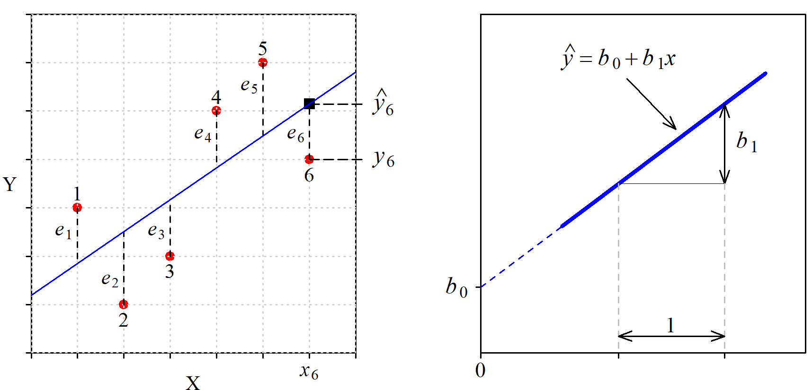
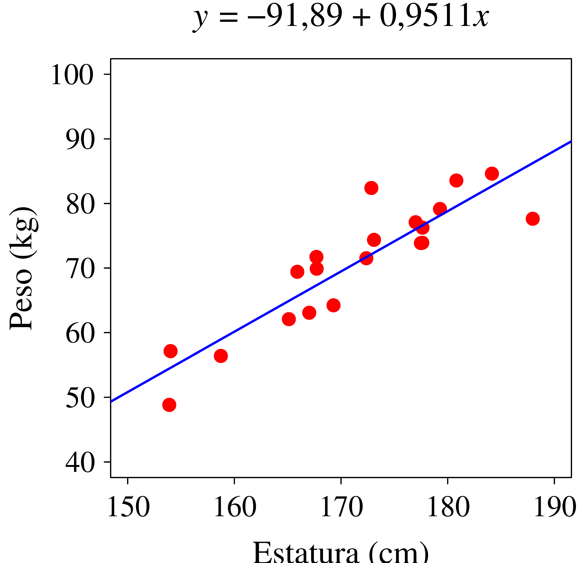
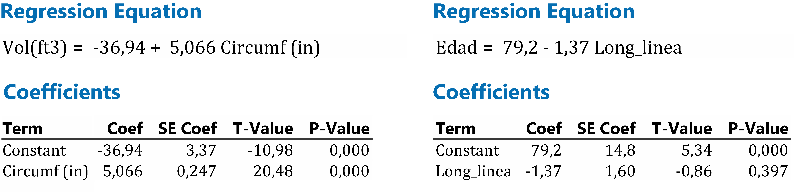
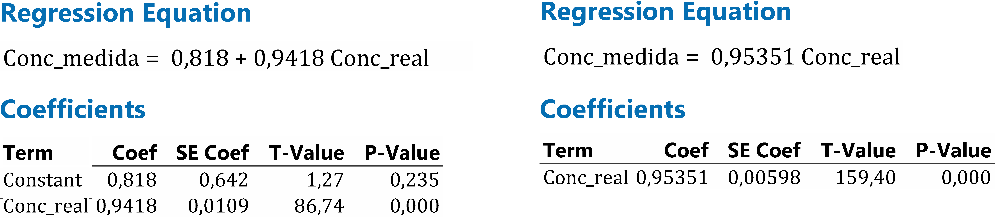

# Regresión simple

Cuando se observa algún tipo de relación entre dos variables, $x$ e $y$, puede interesar explicarla a través de una función del tipo $y =f(x)$, donde a $y$ le llamamos variable dependiente o respuesta y a $x$ variable explicativa o regresora. Esta función sirve para entender qué tipo de influencia tiene $x$ sobre $y$, y también para realizar estimaciones sobre el valor que tomará $y$ dado un valor de $x$.

Si la relación es lineal, la ecuación que la describe es la de una recta, que escribimos de la forma: $y = b_0 + b_1x$. El coeficiente $b_1$ es la pendiente y a $b_0$ a veces se le denomina "constante" (aunque no lo es) o "intercepto" porque es el valor en que la recta "intercepta" al eje de ordenadas. Nosotros le llamaremos "ordenada en el origen", un nombre más largo pero que no necesita explicación.

## Modelo determinista frente a modelo estadístico

La fórmula que aparece en los libros de física sobre el alcance de un tiro parabólico es un modelo determinista. Dando valores a las variables que intervienen (ángulo, velocidad inicial) se obtiene el valor exacto del alcance. Estos modelos pertenecen al ámbito de la teoría o son una simplificación de la realidad. En la práctica intervienen otras variables no controladas, o no somos capaces de fijar las variables que intervienen en el valor exacto que deben tener, por lo que el resultado siempre está afectado por una cierta incertidumbre.

En los modelos estadísticos esa incertidumbre está explícita. Sabemos que el volumen de madera que se puede obtener de un árbol depende de su altura y del diámetro del tronco, pero dados los valores de estas variables no podemos determinar "exactamente" el volumen de madera que se va a obtener. A partir de los volúmenes y de las características de otros árboles similares podemos crear un modelo estadístico.

En un modelo estadístico entendemos que la ecuación obtenida indica --con mayor o menor precisión-- la zona en que se encuentra la respuesta para un determinado valor de la variable regresora. Si tenemos $n$ puntos, el modelo de regresión lineal simple lo escribimos de la forma: $$y_i = b_0 + b_1 x_i + e_i \quad \text{para} \quad i = 1, 2, \dots, n$$ Donde el verdadero valor de la respuesta, $y_i$, es igual al punto sobre la recta más un valor $e_i$ que llamamos residuo y que no podemos prever. Al punto sobre la recta le llamamos "valor estimado" y para distinguirlo del valor real le colocamos una especie de gorro encima: $\hat{y}_i$. Por tanto, también podemos escribir: $$\hat{y}_i = b_0 + b_1 x_i \quad \text{para} \quad i = 1, 2, \cdots, n$$ La [@fig-resiRecta] (izquierda) contiene un diagrama bivariante con 6 puntos y su recta ajustada, mostrando el residuo correspondiente a cada punto. A la derecha tenemos la ecuación de la recta y la identificación de sus parámetros.

{#fig-resiRecta .fig-normal6 fig-align="center" width="100%"}

Los residuos tienen un papel protagonista cuando se ajusta un modelo de regresión. El método de ajuste habitual consiste en elegir la ecuación que minimiza la suma de los cuadrados de los residuos. Trataremos este método con detalle pero vamos a empezar explorando otras posibles alternativas.

## Ajuste a una recta

Si entre la respuesta y la variable regresora se observa una relación lineal, se determina la ecuación de la recta que mejor se adapta a los puntos disponibles. Lo que significa "mejor" es discutible. Veamos algunas formas de hacerlo.

### A ojo {.unnumbered}

Se traza la recta directamente sobre el papel o se identifican dos puntos de paso y a partir de ellos se calculan los coeficientes del modelo.

A pesar de sus evidentes limitaciones, si solo se trata de tener la recta no es un método tan malo como parece. Con un poco de práctica el ajuste no será muy distinto del "perfecto" y no se cometerán errores de bulto debido a la presencia de valores anómalos, cosa que sí puede ocurrir si se tratan los datos de forma automática sin mirarlos.

{#fig-regresionAOjo .fig-normal6 fig-align="center" width="100%"}

```{=html}
<div id="tbl-ProsCons" class="tabla-wrapper04">
<table class="tabla-ProsCons">

<caption>Tabla 11.1: Ajuste a ojo. Ventajas e inconvenientes.</caption>

  <colgroup>
    <col style="width: 10%;">
    <col style="width: 90%;">
  </colgroup>
  <tbody>
    <tr style="border-top: 1px solid #dee2e6; border-bottom: 1px solid #dee2e6;">
      <!-- ✅ PRIMERA CELDA -->
      <td style="padding: 8px 0px 8px 0px; vertical-align: top; text-align: center;">
      <!-- top right bottom left -->
        <div style="display: flex; flex-direction: column; align-items: center; gap: 12px;">
          <strong>PROS</strong>
          <span class="fa-solid fa-thumbs-up fa-xl" style="color: #0ca701;"></span>
        </div>
      </td>

      <!-- ✅ SEGUNDA CELDA -->
      <td style="padding: 12px 15px 8px 0px; vertical-align: top;">
        <ul style="margin: 0; padding-left: 6px; line-height: 1.2;">
          <li>Intuitivo. Muy fácil de entender.</li>
          <li>No se cometen errores de mucho bulto.</li>
        </ul>
      </td>
    </tr>

    <tr style="border-top: 1px solid #dee2e6; border-bottom: 1px solid #dee2e6;">
      <!-- ✅ PRIMERA CELDA -->
      <td style="padding: 8px 0px 8px 0px; vertical-align: top; text-align: center;">
        <div style="display: flex; flex-direction: column; align-items: center; gap: 12px;">
          <strong>CONS</strong>
          <span class="fa-solid fa-thumbs-down fa-xl" style="color: #f03333; "></span>
        </div>
      </td>
      
       <!-- ✅ SEGUNDA CELDA -->
      <td style="padding: 12px 15px 8px 0px; vertical-align: top;">
        <ul style="margin: 0; padding-left: 18px; line-height: 1.2;">
          <li>No se logra el ajuste "perfecto"</li>
          <li>No se tienen medidas de calidad del ajuste.</li>
          <li>Solo sirve para regresión simple.</li>
        </ul>
      </td>
    </tr>
  </tbody>
</table>
</div>
```
### Método de Ishikawa {.unnumbered}

Se identifica el primer y el tercer cuartil de los valores de $X$ $(X_{Q1}$ y $X_{Q3})$, e igual para los valores de $Y$ $(Y_{Q1}$ y $Y_{Q3})$. Se traza la recta por los puntos $(X_{Q1}$,;$Y_{Q1})$ y $(X_{Q3}$,;$Y_{Q3})$. Se obtiene una recta muy razonable sin necesidad de realizar cálculos ni de aplicar fórmulas de las que se desconoce su lógica.

{#fig-regresionIshikawa .fig-normal6 fig-align="center" width="100%"}

```{=html}
<div id="tbl-ProsCons" class="tabla-wrapper04">
<table class="tabla-ProsCons">

<caption>Tabla 11.2: Método de Ishikawa. Ventajas e inconvenientes.</caption>

  <colgroup>
    <col style="width: 10%;">
    <col style="width: 90%;">
  </colgroup>
  <tbody>
    <tr style="border-top: 1px solid #dee2e6; border-bottom: 1px solid #dee2e6;">
      <!-- ✅ PRIMERA CELDA -->
      <td style="padding: 8px 0px 8px 0px; vertical-align: top; text-align: center;">
      <!-- top right bottom left -->
        <div style="display: flex; flex-direction: column; align-items: center; gap: 12px;">
          <strong>PROS</strong>
          <span class="fa-solid fa-thumbs-up fa-xl" style="color: #0ca701;"></span>
        </div>
      </td>

      <!-- ✅ SEGUNDA CELDA -->
      <td style="padding: 12px 15px 8px 0px; vertical-align: top;">
        <ul style="margin: 0; padding-left: 6px; line-height: 1.1;">
          <li>Fácil de entender.</li>
          <li>Robusto frente a la presencia de valores anómalos o con excesiva influencia.</li>
        </ul>
      </td>
    </tr>

    <tr style="border-top: 1px solid #dee2e6; border-bottom: 1px solid #dee2e6;">
      <!-- ✅ PRIMERA CELDA -->
      <td style="padding: 8px 0px 8px 0px; vertical-align: top; text-align: center;">
        <div style="display: flex; flex-direction: column; align-items: center; gap: 12px;">
          <strong>CONS</strong>
          <span class="fa-solid fa-thumbs-down fa-xl" style="color: #f03333; "></span>
        </div>
      </td>
      
       <!-- ✅ SEGUNDA CELDA -->
      <td style="padding: 12px 15px 8px 0px; vertical-align: top;">
        <ul style="margin: 0; padding-left: 18px; line-height: 1.2;">
          <li>No se tienen medidas de calidad del ajuste.</li>
          <li>Solo sirve para regresión simple.</li>
        </ul>
      </td>
    </tr>
  </tbody>
</table>
</div>
```
::: callout-note
## Kaoru Ishikawa (1915-1989)

Fue un ingeniero japonés, considerado uno de los artífices del llamado "milagro japonés" que condujo los productos japoneses desde la mediocridad hasta arrasar en los mercados mundiales (electrónica, fotografía, automoción…). Una de las claves del éxito fue el uso intensivo de técnicas estadísticas para el control y la mejora de la calidad. Ishikawa es conocido por proponer el uso de herramientas sencillas, que todos puedan entender y aplicar de forma habitual.
:::

### Haciendo que la suma de los residuos sea igual a cero {.unnumbered}

Se trata de obtener los valores de $b_0$ y $b_1$ que cumplen la expresión: $$\sum_{i=1}^n \left[ Y_i - (b_0 + b_1 X_i) \right]= 0$$ que es equivalente a: $n\bar{Y} - nb_0 - b_1 n \bar{X} = 0$. Por tanto, con cualquier par de valores $b_0$ y $b_1$ que verifiquen la expresión $\bar{Y} = b_0 + b_1 \bar{X}$, es decir, con cualquier recta que pase por ($\bar{X}$, $\bar{Y}$) tendremos una suma de residuos igual a cero.

Que haya infinitas rectas que cumplan esa condición es una mala señal, porque seguro que no todas son adecuadas. Para los valores representados en la [@fig-residuosSuma] tenemos que $\bar{X}= 6$ y $\bar{Y}= 9$. Rectas que hacen que la suma de los residuos sea igual a cero son, por ejemplo, la que tiene coeficientes $b_0=9$ y $b_1=0$, es decir: $Y = 9$, o también $b_0 = 12$ y $b_1 = -0.5$, es decir: $Y = 12 -0.5X$ y ambas son claramente muy malos ajustes. <br>

{#fig-residuosSuma .fig-normal6 fig-align="center" width="100%"}

```{=html}
<div id="tbl-ProsCons" class="tabla-wrapper04">
<table class="tabla-ProsCons">

<caption>Tabla 11.3: Suma de los residuos igual a cero. Ventajas e inconvenientes.</caption>

  <colgroup>
    <col style="width: 10%;">
    <col style="width: 90%;">
  </colgroup>
  <tbody>
    <tr style="border-top: 1px solid #dee2e6; border-bottom: 1px solid #dee2e6;">
      <!-- ✅ PRIMERA CELDA -->
      <td style="padding: 2px 0px 16px 0px; vertical-align: top; text-align: center;">
      <!-- top right bottom left -->
        <div style="display: flex; flex-direction: column; align-items: center; gap: 12px;">
          <strong>PROS</strong>
          <span class="fa-solid fa-thumbs-up fa-xl" style="color: #0ca701;"></span>
        </div>
      </td>

      <!-- ✅ SEGUNDA CELDA -->
      <td style="padding: 8px 15px 8px 0px; vertical-align: top;">
        <ul style="margin: 0; padding-left: 6px; line-height: 1.2;">
          <li>Ninguna.</li>
        </ul>
      </td>
    </tr>

    <tr style="border-top: 1px solid #dee2e6; border-bottom: 1px solid #dee2e6;">
      <!-- ✅ PRIMERA CELDA -->
      <td style="padding: 4px 0px 8px 0px; vertical-align: top; text-align: center;">
        <div style="display: flex; flex-direction: column; align-items: center; gap: 12px;">
          <strong>CONS</strong>
          <span class="fa-solid fa-thumbs-down fa-xl" style="color: #f03333; "></span>
        </div>
      </td>
      
       <!-- ✅ SEGUNDA CELDA -->
      <td style="padding: 12px 15px 8px 0px; vertical-align: top;">
        <ul style="margin: 0; padding-left: 18px; line-height: 1.2;">
          <li>Da un número infinito de soluciones, una de ellas coincide con el ajuste por mínimos cuadrados.</li>
        </ul>
      </td>
    </tr>
  </tbody>
</table>
</div>
```
### Minimizando la suma del valor absoluto de los residuos {.unnumbered}

Se trata de minimizar: $$S=\sum_{i=1}^n \left| Y_i - (b_0 + b_1 X_i) \right|$$

Puede no tener solución única, pero los resultados posibles son mucho más razonables que en el caso anterior. Un problema específico de este caso es que no existen expresiones analíticas para los coeficientes debido a las dificultades en el manejo de la función "valor absoluto".

La [@fig-residuosValorAbsoluto] muestra dos diagramas con los mismos 4 puntos y las rectas que cumplen el criterio establecido, en todas ellas la suma del valor absoluto de los residuos es igual a 2. La línea azul, que es la misma en los dos diagramas, es la que también minimiza la suma de los cuadrados de los residuos.

{#fig-residuosValorAbsoluto .fig-normal6 fig-align="center" width="95%"}

```{=html}
<div id="tbl-ProsCons" class="tabla-wrapper34">
<table class="tabla-ProsCons">

<caption>Tabla 11.4: Minimizando la suma del valor absoluto de los residuos. Ventajas e inconvenientes.</caption>

  <colgroup>
    <col style="width: 10%;">
    <col style="width: 90%;">
  </colgroup>
  <tbody>
    <tr style="border-top: 1px solid #dee2e6; border-bottom: 1px solid #dee2e6;">
      <!-- ✅ PRIMERA CELDA -->
      <td style="padding: 2px 0px 16px 0px; vertical-align: top; text-align: center;">
      <!-- top right bottom left -->
        <div style="display: flex; flex-direction: column; align-items: center; gap: 12px;">
          <strong>PROS</strong>
          <span class="fa-solid fa-thumbs-up fa-xl" style="color: #0ca701;"></span>
        </div>
      </td>

      <!-- ✅ SEGUNDA CELDA -->
      <td style="padding: 12px 15px 8px 0px; vertical-align: top;">
        <ul style="margin: 0; padding-left: 6px; line-height: 1.2;">
          <li>Poco sensible a la presencia de valores anómalos.</li>
        </ul>
      </td>
    </tr>

    <tr style="border-top: 1px solid #dee2e6; border-bottom: 1px solid #dee2e6;">
      <!-- ✅ PRIMERA CELDA -->
      <td style="padding: 8px 0px 8px 0px; vertical-align: top; text-align: center;">
        <div style="display: flex; flex-direction: column; align-items: center; gap: 12px;">
          <strong>CONS</strong>
          <span class="fa-solid fa-thumbs-down fa-xl" style="color: #f03333; "></span>
        </div>
      </td>
      
       <!-- ✅ SEGUNDA CELDA -->
      <td style="padding: 12px 15px 4px 0px; vertical-align: top;">
        <ul style="margin: 0; padding-left: 18px; line-height: 1.2;">
          <li>No da un ajuste equilibrado entre todos los puntos.</li>
          <li>No existe expresión analítica para el cálculo de los coeficientes.</li>
        </ul>
      </td>
    </tr>
  </tbody>
</table>
</div>
```
### Minimizando la suma de los cuadrados de los residuos {.unnumbered}

Elevamos los residuos al cuadrado para evitar que al sumarlos se compensen los positivos y negativos. Ahora se trata de minimizar:

```{=tex}
\begin{equation*}
    S=\sum_{i=1}^n \left[ Y_i - (b_0 + b_1 X_i) \right]^2
\end{equation*}
```
En vez de decir que el criterio de ajuste ha sido "minimizar la suma de los cuadrados de los residuos", simplemente decimos que hemos ajustado por "mínimos cuadrados". Este es el método usado en la inmensa mayoría de los casos, produce un ajuste equilibrado de la nube de puntos y está en perfecta sintonía con otras técnicas y medidas que se construyen con criterios similares. Un inconveniente de este método es que el modelo obtenido es sensible a la presencia de valores anómalos, cosa que no ocurre si se minimiza la suma de valores absolutos.

En la primera fila de la [@fig-residuosMinimosCuadrados] tenemos una situación típica en la que el ajuste por mínimos cuadrados da un mejor resultado que minimizando la suma del valor absoluto. Sin embargo, en la segunda fila tenemos un caso de puntos perfectamente alineados excepto uno que muy probablemente sería un valor anómalo. Si minimizamos el valor absoluto de los residuos, el ajuste ignora el valor anómalo mientras que ajustando por mínimos cuadrados el valor anómalo tiene una notable influencia sobre la recta ajustada.

{#fig-residuosMinimosCuadrados .fig-normal6 fig-align="center" width="95%"}

```{=html}
<div id="tbl-ProsCons" class="tabla-wrapper34">
<table class="tabla-ProsCons">

<caption>Tabla 11.5: Minimizar la suma de los cuadrados de los residuos. Ventajas e inconvenientes.</caption>

  <colgroup>
    <col style="width: 10%;">
    <col style="width: 90%;">
  </colgroup>
  <tbody>
    <tr style="border-top: 1px solid #dee2e6; border-bottom: 1px solid #dee2e6;">
      <!-- ✅ PRIMERA CELDA -->
      <td style="padding: 8px 0px 8px 0px; vertical-align: top; text-align: center;">
      <!-- top right bottom left -->
        <div style="display: flex; flex-direction: column; align-items: center; gap: 12px;">
          <strong>PROS</strong>
          <span class="fa-solid fa-thumbs-up fa-xl" style="color: #0ca701;"></span>
        </div>
      </td>

      <!-- ✅ SEGUNDA CELDA -->
      <td style="padding: 12px 15px 8px 0px; vertical-align: top;">
        <ul style="margin: 0; padding-left: 6px; line-height: 1.2;">
          <li>Proporciona un ajuste muy razonable. El que queremos hacer cuando ajustamos a ojo.</li>
          <li>Encaja perfectamente con el resto de técnicas estadísticas que utilizamos.</li>
        </ul>
      </td>
    </tr>

    <tr style="border-top: 1px solid #dee2e6; border-bottom: 1px solid #dee2e6;">
      <!-- ✅ PRIMERA CELDA -->
      <td style="padding: 8px 0px 8px 0px; vertical-align: top; text-align: center;">
        <div style="display: flex; flex-direction: column; align-items: center; gap: 12px;">
          <strong>CONS</strong>
          <span class="fa-solid fa-thumbs-down fa-xl" style="color: #f03333; "></span>
        </div>
      </td>
      
       <!-- ✅ SEGUNDA CELDA -->
      <td style="padding: 12px 15px 8px 0px; vertical-align: top;">
        <ul style="margin: 0; padding-left: 18px; line-height: 1.2;">
          <li>Los valores anómalos (errores o valores singulares) pueden tener bastante influencia sobre el modelo estimado. Hay que estar atentos para tratar esos puntos adecuadamente.</li>
        </ul>
      </td>
    </tr>
  </tbody>
</table>
</div>
```
## Mínimos cuadrados. Cálculo de los coeficientes

Existe una fórmula cerrada y con solución única para cada coeficiente, pero vamos a empezar identificando el valor de los coeficientes sin hacer uso de las fórmulas. Naturalmente, es mucho más rápido y más práctico usarlas o --mejor todavía-- usar un paquete de software estadístico o una hoja de cálculo, pero hacerlo sin fórmulas permite entender perfectamente qué es lo que se está haciendo, y también descubrir algún detalle interesante.

### Sin fórmulas {.unnumbered}

Realizamos a ojo una primera estimación del valor de los coeficientes. A continuación, mediante un pequeño programa --o también usando una hoja de cálculo--, hacemos un barrido de los valores de $b_0$ y $b_1$ en torno a los estimados, identificando el par que minimiza la suma de los cuadrados de los residuos.

Vayamos al diagrama de la [@fig-coeficientesSinFormulas] (izquierda) que ya habíamos visto en las figuras [@fig-regresionAOjo] y [@fig-regresionIshikawa]. La recta ajustada a ojo pasa por los puntos (-4,75; 0) y (5,75; 60) por lo que sus coeficientes son: $b_1$ = 5,71 y $b_0$ = 27,14. Sería mucha casualidad que esos fueran los valores exactos que estamos buscando, pero no andarán muy lejos. Vamos a crear una malla de valores de $b_0$ y $b_1$. Los valores de $b_1$ variarán de 2 a 8 con incrementos de 0,1 y para cada uno de esos, los de $b_0$ irán de 20 a 35 también en saltos de 0,1. A cada combinación de esos dos valores corresponde una recta, y a cada recta una suma de los cuadrados de los residuos. El par de valores que minimizan esa suma de cuadrados son: $b_0$ = 27,0 y $b_1$ = 4,9.

{#fig-coeficientesSinFormulas .fig-normal6 fig-align="center" width="100%"}

Sin embargo, lo habitual es que las curvas de nivel sean muy elípticas, de modo que la representación gráfica no siempre es tan evidente. En nuestro caso hemos obtenido una forma más regular haciendo que $\bar{x}=0$. De este modo, los coeficientes son independientes y las curvas de nivel aparecen como círculos concéntricos, lo que permite apreciar con mayor claridad la idea que queremos ilustrar.

### Usando fórmulas {.unnumbered}

En el diagrama que representa la relación entre $X$ e $Y$ cada punto $i$ puede ser identificado por sus coordenadas $(x_i, y_i)$ con $1 \leq i \leq n$ siendo $n$ el número total de puntos.

Cada uno de los puntos tiene un residuo asociado $e_i$ y ese residuo es la diferencia entre el valor real de $y$, es decir, $y_i$ y su valor estimado $\hat{y}_i$, que es el que estará sobre la recta y será igual a $b_0 + b_1 x_i$. Por tanto, el valor del residuo asociado al punto $i$ lo podemos escribir de la forma: $$e_i = y_i - \left( b_0 + b_1 x_i \right)$$ y la suma de los cuadrados de los residuos, $S$, será: $$S = \sum_{i=1}^n \left(y_i - b_0 - b_1 x_i \right )^2$$ Tanto los valores de $y_i$ como los de $x_i$ vienen dados. La suma de cuadrados $S$ es función de los valores de $b_0$ y de $b_1$. Se trata de hallar los valores de $b_0$ y de $b_1$ que minimizan esa suma de cuadrados. El mínimo lo tendremos en el punto en que la derivada de $S \left(b_0, b_1 \right )$ respecto a $b_0$ y respecto a $b_1$ es igual a cero. Seguro que es un mínimo porque el máximo no está definido.

$$\frac{\partial S}{\partial b_0} = -2 \sum_{i=1}^n \left(y_i - b_0 - b_1 x_i \right )$$

$$\frac{\partial S}{\partial b_1} = -2 \sum_{i=1}^n \left(y_i - b_0 - b_1 x_i \right ) x_i$$ Igualando a cero estas expresiones:

$$\sum_{i=1}^n y_i - nb_0 - b_1 \sum_{i=1}^n x_i = 0$$ {#eq-11.1}

$$\sum_{i=1}^n x_i y_i - b_0 \sum_{i=1}^n x_i - b_1 \sum_{i=1}^n  x_i^2  = 0$$ {#eq-11.2}

Dividiendo por $n$ todos los términos de la ecuación -@eq-11.1 tenemos:

$$b_0 = \bar{y} - b_1 \bar{x} $$

::: {style="height: 1px;"}
:::

::: callout-note
## La recta ajustada pasa por el punto $(\bar{x}, \bar{y})$

De la anterior expresión para $b_0$ también se deduce que $\bar{y} = b_0 + b_1\bar{x}$. Es decir, la recta ajustada minimizando la suma de los cuadrados de los residuos siempre pasa por el punto $(\bar{x}, \bar{y})$.
:::

Sustituyendo la expresión de $b_0$ en la ecuación -@eq-11.2 tenemos: $$\sum_{i=1}^n x_i y_i - \bar{y} \sum_{i=1}^n x_i +  b_1\bar{x} \sum_{i=1}^n x_i- b_1 \sum_{i=1}^n  x_i^2  = 0$$ {#eq-11.3}

Para aligerar la notación no pondremos los límites a los sumatorios, que siempre son desde $i=1$ hasta $n$. Despejando $b_1$ llegamos a:

$$b_1 = \frac{\sum x_i y_i - \bar{y} \sum x_i}{\sum x_i^2 - \bar{x} \sum x_i}$$ {#eq-11.4}

También la expresión de $b_1$ se suele dar de la forma (ver Apéndice 10.A):

$$b_1 = \frac{\sum (x_i - \bar{x})(y_i - \bar{y})}{\sum (x_i - \bar{x})^2}$$ {#eq-11.5}

A partir de la ecuación -@eq-11.5 y recordando las expresiones de la covarianza y del coeficiente de correlación, llegamos a una expresión que también se ve con frecuencia en los libros de texto, seguramente porque una calculadora sencilla da directamente los tres valores que intervienen:

$$b_1 = \frac{Cov(XY)}{s_X^2} = \frac{r_{XY} s_X s_Y}{s_X^2} = r_{XY} \frac{s_Y}{s_X}$$ {#eq-11.6}

Calculando los coeficientes que corresponden a los datos de la [@fig-coeficientesSinFormulas] se obtiene: $$b_0 = 26,9615 \qquad  \qquad b_1 = 4,8616$$ {#eq-11.7}

Ahora sí, con todos los decimales que queramos, aunque dar más decimales de los que tienen los datos es añadir números que no aportan ninguna información, dan una falsa sensación de precisión y complican la lectura del resultado.

::: {style="height: 1px;"}
:::

::: callout-note
## Nuestro modelo ajustado no es una ecuación

Sean, por ejemplo, los puntos: (4; 3), (6; 8), (8; 12), (10; 10), (12; 12). La recta ajustada es: $y = 1+x$. Si en vez de ajustar $y = f(x)$ se ajusta $x=f(y)$ ¿se obtendrá la ecuación resultante de despejar $x$ en $y=f(x)$, es decir: $x = -1 + y$? Si ajustamos $x=f(y)$ la ecuación será: $x=1,57+0,714y$. No es lo mismo minimizar la suma de los cuadrados de los residuos medidos en dirección vertical que en dirección horizontal (esto último no son los residuos).
:::

## Calidad del ajuste {#sec-calidadAjuste}

El gráfico de la izquierda de la [@fig-ArbolMano] muestra la relación entre la longitud de la circunferencia ($X$) de los troncos de un determinado tipo de árbol y el volumen de madera ($Y$) que se puede obtener de ellos[^11_regresimple-1]. Se observa que a más circunferencia mayor volumen de madera, tal como era de esperar, y la ecuación de la recta ajustada es útil para estimar cuánta madera se obtendrá de un tronco de determinado diámetro. Sin embargo, el gráfico de la derecha se ha realizado con los datos de un estudio[^11_regresimple-2] donde se analiza la relación entre la edad al morir y la longitud de cierta línea de la mano, a partir de una muestra de 50 personas fallecidas. A la vista del diagrama queda claro que no hay ninguna relación entre ambas variables. En este caso el modelo ajustado no sirve para nada. Pero los dos modelos tienen el mismo aspecto y solo a la vista del valor de sus coeficientes es imposible saber cuál de los dos es útil.

[^11_regresimple-1]: Son los datos que ya vimos en el capítulo anterior, apartado 10.1.

[^11_regresimple-2]: Son los datos que ya vimos en el capítulo anterior, apartado 10.1.

{#fig-ArbolMano .fig-normal6 fig-align="center" width="100%"}

Es necesario, por tanto, completar el modelo con una medida que informe de la calidad del ajuste. Esa medida es el coeficiente de determinación $R^2$.

Para calcular el valor de $R^2$ empezamos poniéndonos en el peor de los casos: suponemos que $X$ e $Y$ son independientes, es decir, que el valor de $X$ no aporta ninguna información sobre el valor de $Y$. En este caso, la recta que muestra la relación entre ambas variables es una recta horizontal: la estimación del valor de $Y$ es siempre la misma, sin importar el valor de $X$, y la mejor apuesta para ese valor de $Y$ -a falta de cualquier otra información- es su valor medio $\bar{y}$. A la suma de los cuadrados de los residuos correspondientes a esa recta horizontal que pasa por $\bar{y}$ le llamamos $Q_Y$.

A continuación calculamos la suma de los cuadrados de los residuos correspondientes a nuestra recta ajustada (la que minimiza la suma de los cuadrados de los residuos) y le llamamos $Q_R$. Cuanto mejor sea el ajuste menor será el valor de $Q_R$ y mayor la diferencia entre $Q_Y$ y $Q_R$.

El valor de $R^2$ es igual a la proporción de $Q_Y$ explicada por $X$, es decir, la proporción en que disminuye $Q_Y$ gracias a la introducción de $X$ como variable explicativa, es decir: $$ R^2 = \frac{Q_Y - Q_R}{Q_Y} $$

Veamos este cálculo en un ejemplo con datos sencillos. En la [@fig-R2] tenemos 5 puntos que podrían representar la relación entre el peso y la estatura de 5 individuos. Si, ignorando la información aportada por la estatura, siempre damos una estimación del peso igual a su valor medio, será como ajustar a una recta horizontal y tendremos una suma de los cuadrados de los residuos $Q_Y = 56$. Sin embargo, si utilizamos la información que aporta la estatura y realizamos el ajuste minimizando la suma de los cuadrados de los residuos tenemos $Q_R = 16$.

Hemos reducido la suma de los cuadrados de los residuos de 56 a 16, por tanto: $$R^2 = \frac{Q_Y - Q_R}{Q_Y} = \frac{56 - 16}{56} = 0.7143$$ Normalmente nos referimos a este valor como un porcentaje. En este caso sería el 71,43 %. En los ejemplos de la [@fig-ArbolMano] estos valores son del 93,5 % (volumen de madera) y 1,5 % (edad al morir).

::: {style="height: 1px;"}
:::

::: callout-note
## $R^2$ es el cuadrado del coeficiente de correlación $r$

En un modelo de regresión simple, el valor de $R^2$ es igual al cuadrado del coeficiente de correlación[^11_regresimple-3]. Este último puede variar entre $-1$ y $1$ por lo que $R^2$ varía entre 0 y 1.
:::

[^11_regresimple-3]: Puede ver una demostración [aquí](https://statproofbook.github.io/P/slr-rsq).

::: {style="height: 1px;"}
:::

{#fig-R2 .fig-normal6 fig-align="center" width="100%"}

## Análisis de los residuos

Antes de dar por bueno un ajuste conviene examinar el comportamiento de los residuos. Igual que en el lenguaje habitual, los residuos son aquello que se descarta, lo que no se aprovecha; por eso debemos asegurarnos de que no contienen información relevante.

Los residuos se deben comportar de manera aleatoria, sin que se pueda apreciar en ellos ningún tipo de patrón o de comportamiento predecible. Si muestran algún tipo de regularidad, significa que aún contienen información, y esa información debe incorporarse al modelo en lugar de desecharse.

Una forma habitual de analizar el comportamiento de los residuos es representarlos gráficamente en un diagrama bivariante frente a los valores previstos. En la [@fig-analisisResiduos] se muestra la relación entre dos variables, $X$ e $Y$, que a primera vista puede parecer lineal y, de hecho, si se ajusta a una recta se obtiene un coeficiente de determinación muy alto ($R^2=99.35\%)$. Sin embargo, en el gráfico de residuos frente a valores previstos vemos que los residuos tienen un comportamiento que no es aleatorio: para valores previstos que están en los extremos de su rango de variación, los residuos son positivos, mientras que en los valores centrales son negativos. Realmente, esto ya se ve mirando con detalle los puntos con la recta ajustada. Los puntos muestran una cierta curvatura que no capta el modelo lineal. Esa discrepancia entre el comportamiento de los puntos y la recta ajustada se ve de una forma mucho más clara en el gráfico de residuos en función de los valores sobre la recta.

{#fig-analisisResiduos .fig-normal6 fig-align="center" width="100%"}

Lo que esperamos es que los puntos se distribuyan aleatoriamente en torno a la recta, no que en una zona estén por encima y en otra por debajo. En la [@fig-residuosModCuadra] los puntos se han ajustado a un modelo cuadrático. En este caso, la línea ajustada pasa por en medio de los puntos y el gráfico de residuos frente a valores previstos no muestra ningún patrón previsible.

Con este modelo cuadrático el ajuste mejora ligeramente —ahora $R^2=99.79\%$—, pero lo más importante es que hemos identificado el tipo de relación existente entre las variables analizadas.

{#fig-residuosModCuadra .fig-normal6 fig-align="center" width="100%"}

## Relación no lineal entre $X$ e $Y$

Si a la vista del diagrama bivariante se observa que la relación entre $X$ e $Y$ no es lineal, se puede utilizar el aspecto de la nube de puntos y el conocimiento del fenómeno que se estudia para plantear un modelo que se ajuste a los datos. Los modelos polinómicos de segundo grado son muy versátiles y pueden ser una buena opción. También se puede ajustar a modelos linealizables transformando los valores de $X$, los de $Y$, o ambos. Si nuestros datos se ajustan a una función del tipo $y = \beta_0 e^{\beta_1 x}$, podemos realizar el cambio $y' = \ln y$ obteniendo el modelo lineal: $y' = \ln \beta_0 + \beta_1 x$ a partir del cual se deducen de forma inmediata los coeficientes del modelo original[^11_regresimple-4].

[^11_regresimple-4]: Interesados en este tipo de transformaciones para linealizar la dependencia pueden consultar el libro de Daniel Peña (2002): "Regresión y diseño de experimentos", Alianza Editorial, pág. 314 o el de Montgomery, D. C. y Peck, E. A. (1992): "Introduction to Linear Regression Analysis" Ed. Wiley, pág. 90.

La [@fig-molinoViento] (izquierda) muestra los datos de producción de electricidad de un aerogenerador según sea la velocidad del viento[^11_regresimple-5]. Se observa una relación no lineal ya que cuando la velocidad del viento es baja, pequeños incrementos en la velocidad tienen un impacto importante en la producción de electricidad, mientras que para velocidades altas la producción tiende a estabilizarse. Ajustando a una parábola se obtiene $y = -1,156 + 0,7229x -0,03812x^2$ con un coeficiente de determinación $R^2 = 96,8\%$, lo cual no está nada mal.

[^11_regresimple-5]: Datos en: Montgomery D. C y Runger, G. C. (2011): "Applied Statistics and Probability for Engineers". Ed. Wiley, 5a ed., pág. 439.

Otra opción es estudiar la producción de electricidad en función de la inversa de la velocidad del viento (figura de la derecha). Creamos la variable $x' = 1/x$ y obtenemos el ajuste: $y = 2,979 - 6,935x'$, es decir: $y = 2.979 - 6.935/x$, con un $R^2 = 97.9\%$, que es también un valor excelente con un modelo más compacto. Trabajar con la inversa de $x$ puede ser una buena alternativa al modelo cuadrático.

{#fig-molinoViento .fig-normal6 fig-align="center" width="100%"}

Pero tampoco se debe abusar de las transformaciones. Volviendo a los datos de la [@fig-residuosSuma] donde a partir de los pesos de 5 personas (efectivamente son muy pocas, es solo un ejemplo) queremos modelar la relación entre peso y estatura, el modelo lineal es el más razonable ([@fig-ajustePolinomio]). Si ajustamos los datos a un modelo cuadrático se tiene un máximo de peso en torno a una estatura de 175 cm lo cual no concuerda con lo que ya sabemos sobre esta relación. El polinomio de tercer grado presenta una forma que tampoco es razonable y el de cuarto grado es un modelo con 5 parámetros (los 4 coeficientes y la ordenada en el origen) y como tenemos 5 puntos, ajusta perfectamente, pero ni es un modelo razonable ni sirve para estimar el peso de un individuo a partir de su altura (sí lo explica para los 5 individuos usados para construir el modelo, pero para esos ya lo sabíamos).

Recuerde que dos puntos se ajustan perfectamente a un modelo con dos parámetros (una recta), tres puntos a un modelo con tres parámetros... etc. Estos son modelos que explican muy bien lo que ya se sabe, pero son inútiles para hacer predicciones, que es lo que --en general-- se pretende.

{#fig-ajustePolinomio .fig-normal6 fig-align="center" width="100%"}

## Transformación logarítmica

En algunos casos, los valores de $X$, los de $Y$, o ambos, siguen una distribución asimétrica, con valores que aparecen agrupados cerca del origen y muy dispersos hacia los valores altos. Un ejemplo típico de esta situación se da al analizar la relación entre el peso del cerebro y el peso del cuerpo en 62 especies de mamíferos[^11_regresimple-6]. La mayoría de esos mamíferos pesan poco --la mediana es 3,34 kg-- pero algunos, como los elefantes, pesan varias toneladas y algo similar ocurre con el peso de los cerebros. Al realizar el diagrama bivariante del peso del cerebro ($Y$) frente al peso de cuerpo ($X$) prácticamente todos los puntos aparecen amontonados en la zona próxima al origen ([@fig-brainBodyOriginal]). En estas condiciones ajustar un modelo de regresión no tiene sentido, porque la mayoría de datos actúan como un solo punto y los que están alejados tienen una gran influencia sobre la recta ajustada.

[^11_regresimple-6]: Fuente: Página personal del prof. Weisberg en [<https://cla.umn.edu/statistics>]{style="font-family: monospace;"} \> Other Resources \> data files \> brains.csv. Otros datos y más información [aquí](https://resources.wolframcloud.com/ExampleRepository/resources/Animal-Brain-vs-Body-Mass).

{#fig-brainBodyOriginal .fig-normal6 fig-align="center" width="100%"}

Uno puede caer en la tentación de considerar a los elefantes como valores anómalos y eliminarlos, pero esa no es una buena decisión por dos razones:

1.  Restringe la validez del modelo, ya no valdrá para todos los mamíferos considerados.

2.  Al eliminar esos valores y reescalar el gráfico aparecen otros valores anómalos: la persona humana (que da más reparo eliminar), la jirafa, el caballo, la vaca… y al final nos vamos quedando sin puntos.

En casos como este, la transformación logarítmica "estira" los datos permitiendo un ajuste en el que todos los puntos tienen una influencia similar. Realizando esta transformación en nuestros datos se obtiene --casi parece un milagro-- una nube de puntos tal como esperamos tener cuando ajustamos a una recta. El modelo obtenido es: $$\log(Y) = 0,9271 + 0,7517 \log(X) \quad \text{con} \quad R^2 = 91,95\%$$ Volviendo a las variables originales nos queda (el peso del cuerpo está en kg y el del cerebro en g): $$Y = 8,45 \cdot X^{3/4}$$

{#fig-brainBodyTransfo .fig-normal6 fig-align="center" width="100%"}

La transformación logarítmica de los datos es, sin duda, una buena opción en casos como este, pero también tiene efectos secundarios no deseados.

En primer lugar hay que tener en cuenta que los residuos también están en escala logarítmica. Por ejemplo, para el elefante africano (el mayor, parece que la recta pasa por el punto) el valor real del peso del cerebro es de 5712 g y la previsión es de 6229 (+9 %) y para el elefante asiático el valor real es de 4603 g mientras que el valor previsto es de 3031 g (-34 %). El mamífero que presenta mayor residuo positivo es la persona humana (valor real: 1320, previsto: 185, -86 %) mientras que el de mayor residuo negativo corresponde al Yapok (en inglés: Water opossum). Seguramente más interesante que el modelo en sí es conocer qué animales se separan más -por encima y por debajo- del patrón general. Sobre este tema existen muchas publicaciones. Los interesados pueden empezar explorando la Wikipedia (*Brain–body mass ratio*) y las referencias que incluye.

::: {style="height: 1px;"}
:::

::: callout-note
## Transformación logarítmica: No importa la base

Sea $y = \ln (x)$ y $z = \log_{10}(x)$. Tendremos que $e^y = x$ y también que $10^z = x$, luego $e^y = 10^z$. Por tanto, $\ln(e^y) = \ln(10^z)$ y es inmediato que: $y = z \cdot \ln(10)$. Por tanto, cambiar la base del logaritmo equivale a multiplicar por una constante. El aspecto del diagrama bivariante es el mismo con independencia de la base utilizada para la transformación logarítmica, solo cambian las escalas.
:::

## Las cosas se complican: Lo que tenemos es una muestra

La interpretación de los resultados se complica cuando caemos en la cuenta de que los datos disponibles son solo una muestra de la población de interés. Supongamos que deseamos estudiar la relación entre el peso y la estatura de los jóvenes de cierta edad (haríamos bien en separar hombres y mujeres, pero aquí vamos a ignorar ese aspecto, que trataremos en el siguiente capítulo) y que disponemos de una muestra de 20 jóvenes. Con los datos de esa muestra ajustamos una recta como se ha realizado en la figura [@fig-unaRegresionVA] pero, en realidad, esa no es la recta que andamos buscando. Si hubiéramos tomado otra muestra, la recta sería otra --distinta-- pero tan válida como la primera. Entonces, ¿cómo se interpreta la recta obtenida?

{#fig-unaRegresionVA .fig-normal6 fig-align="center" width="50%"}

Como en otros casos, una forma de ver lo que ocurre es simulando. En los diagramas de la [@fig-regresionVariablesAleatorias] las estaturas ($X$) se han generado aleatoriamente de una distribución N(170; 8) y a cada estatura se le ha asignado un peso ($Y$) mediante la expresión $Y = X -100 +e$, donde $e$ es un valor también generado aleatoriamente de una distribución N(0;,5). Tanto los valores de la estatura (en cm) como los obtenidos para los pesos (en kg) son valores razonables para una población joven. Hemos repetido la simulación 6 veces y, como es natural, cada vez hemos obtenido unos datos distintos y, por tanto, también una recta ajustada distinta.

{#fig-regresionVariablesAleatorias .fig-normal6 fig-align="center" width="100%"}

En la [@fig-regreVAsuperpuestas] (izquierda) se han superpuesto los 6 diagramas anteriores pudiéndose observar el haz de rectas que se obtiene. A la derecha tenemos la misma situación superponiendo 50 simulaciones (cada una con 20 datos) añadiendo, de color verde, la recta que representa el modelo teórico, es decir, la población.

{#fig-regreVAsuperpuestas .fig-normal6 fig-align="center" width="100%"}

## Distribución de los coeficientes

La buena noticia distribución} es que si los datos cumplen ciertas condiciones --que en general se cumplirán-- los valores de los coeficientes pertenecen a distribuciones Normales con parámetros conocidos[^11_regresimple-7]. Siguiendo con el ejemplo anterior hemos repetido 10.000 veces la simulación obteniendo otras tantas rectas ajustadas. La [@fig-distribucionCoeficientes] muestra los histogramas de los 10.000 valores obtenidos para $b_0$ y $b_1$.

[^11_regresimple-7]: En realidad, lo conocido es la expresión del parámetro. Su valor se estima a partir de los datos de la muestra.

{#fig-distribucionCoeficientes .fig-normal6 fig-align="center" width="100%"}

Observe que las medias de las distribuciones coinciden con el verdadero valor del parámetro estimado. Las desviaciones típicas dependen de:

-   **Número de datos (**$n$): Cuantos más datos, mayor información y menos incertidumbre; por tanto, menos desviación típica en la distribución de los coeficientes.

-   **Desviación típica de la respuesta (**$\sigma$)}: A mayor variabilidad de la respuesta mayor incertidumbre y mayor variabilidad en la distribución de los coeficientes.

-   **El rango de variación de** $x$: Si los valores de de la variable regresora están muy próximos a su media habrá mayor variabilidad en la distribución de los coeficientes. Quizá este aspecto no es tan intuitivo como los anteriores, pero se entiende muy bien a la vista de un gráfico como el de la [@fig-regreRangoX]. En la izquierda tenemos el mismo gráfico que en la [@fig-regreVAsuperpuestas] con valores de $X$ generados de una distribución N(170; 8) mientras que en el de la derecha se ha construido de la misma forma pero los valores de $X$ se han generado de una N(170; 3). Al tener menos variabilidad en los valores de $X$ tenemos mayor variabilidad en los coeficientes.

{#fig-regreRangoX .fig-normal6 fig-align="center" width="100%"}

Conocer la distribución de los coeficientes (Apéndice 10.C) hace posible calcular intervalos de confianza o realizar contrastes de hipótesis sobre sus valores.

### Condiciones que deben reunir los datos {.unnumbered}

Para que los coeficientes tengan las distribuciones que se suponen, los datos utilizados para ajustar el modelo deben cumplir las siguientes condiciones:

-   **Distribución de** $Y$: Dado un valor de $X$, los valores de $Y$ deben seguir una distribución Normal. Si $X$ es la estatura e $Y$ es el peso, no hace falta suponer que el peso --globalmente-- sigue una distribución Normal, pero sí que los pesos para las personas de una determinada estatura siguen esa distribución.

-   **Variabilidad de** $Y$: La variabilidad de $Y$ no depende del valor de $X$. En nuestro ejemplo sería suponer que la variabilidad en el peso de las personas que miden 1,60 es la misma que en las personas que miden 1,80 m. Es posible que esto no sea exactamente así porque es habitual que cuando aumenta el nivel de la respuesta aumente también su variabilidad. Si esto ocurre lo veremos en el diagrama bivariante: la nube de puntos se irá ensanchando a medida que aumenta el valor de $X$. En este caso quizá convenga transformar los datos, aunque ya estaríamos ante una situación más complicada que las que pretendemos tratar aquí.

-   **Valores de** $X$: No hay ninguna exigencia especial sobre estos valores. Solo es necesario que la variable sea cuantitativa. Es decir, el día de la semana, codificado como: lunes = 1, martes = 2, ... no puede ser una variable regresora porque el modelo entendería que el domingo es igual a 7 veces el lunes. Aun así, también hay formas de incluir este tipo de variables. Lo veremos en el próximo capítulo en el caso de que solo puedan tomar dos valores posibles.

-   **Independencia de los residuos**: La desviación respecto al valor previsto (valor sobre la recta) en un punto no da ninguna pista sobre la desviación en el punto siguiente. Esto no ocurre con las variables que evolucionan en el tiempo, como la temperatura o la cotización de acciones en la bolsa, en que el valor de un día está influenciado por el valor del día anterior.

Cuando se ajustan modelos de regresión simple, la observación del diagrama bivariante de $Y$ frente a $X$ ya permite valorar si es razonable suponer que se cumplen los supuestos requeridos. Si nada hace suponer lo contrario, supondremos que se cumplen. En realidad nunca se cumplirán "exactamente" pero si el comportamiento de los datos no se aleja mucho de los supuestos realizados, los intervalos de confianza y las pruebas de significación en que estamos interesados seguirán siendo válidos a efectos prácticos.

## Significación de los coeficientes

### Visión intuitiva {.unnumbered}

Usaremos los datos que ya vimos (apartado #sec-calidadAjuste) sobre el volumen de madera que se obtiene de un árbol en función del diámetro de su tronco y sobre la edad al morir en función de la longitud de una línea de la mano. La [@fig-ArbolManoModelos] contiene las rectas ajustadas y algunos valores característicos de cada situación. Aunque a la vista de los gráficos ya se ve claro que en el caso del volumen de madera la pendiente es significativa y en el de la línea de la mano no lo es, vamos a comprobar por simulación que estamos en lo cierto.

{#fig-ArbolManoModelos .fig-normal6 fig-align="center" width="100%"}

Si no hay ninguna relación entre la variable regresora ($X$) y la respuesta ($Y$), la pendiente de la recta estará en torno a cero (será igual a cero en la población, que en estos casos son modelos teóricos). Para ver lo que significa "en torno a cero" podemos simular nubes de puntos manteniendo las características de $X$ e $Y$ y suponiendo que no existe ninguna relación entre ellas.

En el caso del volumen de madera empezamos generando 31 números aleatorios (una cantidad igual a nuestro tamaño de muestra) que asignamos al diámetro de los troncos. Para que estos datos se puedan considerar del mismo tipo de los que tenemos en la muestra es razonable generarlos de una distribución Normal con la media $(\bar{x} = 13.25)$ y la desviación típica $(s_X = 3.2)$ de los valores que aparecen en la muestra, es decir: $X \sim N(13.25; 3.2)$. A continuación, a cada valor de $X$ le hacemos corresponder un valor de $Y$ igual a la media de los valores disponibles $(\bar{y} = 30.2)$ añadiendo un número aleatorio de una distribución Normal con media cero (ni sube ni baja de forma sistemática el valor de la respuesta) y una desviación típica igual a la que presentan los residuos del modelo ajustado $(s_R = 4.25)$. Por tanto, tendremos: $Y = 30.2 + N(0; 4.25)$.

Para el modelo de la edad al morir hacemos exactamente lo mismo con los valores que corresponden: $n=50$; $\bar{x}=9.2$; $s_X = 1.27$; $s_R=14.15$; $\bar{y}=66.7$.

Para cada conjunto de puntos simulados se ha calculado la recta ajustada. En los dos casos la simulación se ha repetido 50 veces y en los diagramas de la [@fig-pruebasSignaficacion] se han ido acumulando tanto los puntos como las rectas ajustadas. También se ha añadido, de color verde, la línea correspondiente a los datos de la muestra. Está muy claro que en el caso del volumen de madera, la recta ajustada con los datos de la muestra no se puede confundir con los generados aleatoriamente suponiendo que no hay relación entre ambas variables. Sin embargo, en el caso de la edad al morir, la recta que corresponde a los datos disponibles se confunde con las que hemos simulado, por tanto, el valor de la pendiente queda explicado por la variabilidad intrínseca de los datos, diremos que esa diferencia no es estadísticamente significativa.

{#fig-pruebasSignaficacion .fig-normal6 fig-align="center" width="100%"}

::: callout-note
## Pruebas de significación y contraste de hipótesis

Una prueba de significación es un caso particular de contraste de hipótesis donde se contrasta que el valor del parámetro es igual a cero. Significación equivale a "significativamente distinto de cero", es decir, que la variabilidad aleatoria no justifica la diferencia respecto a cero.
:::

### Pruebas de significación formales {.unnumbered}

Aunque pueden no ser necesarias en casos tan claros como los que acabamos de ver, conocer la distribución de los coeficientes nos permite realizar pruebas de significación de manera más directa, sin necesidad de realizar simulaciones.

Lo habitual es contrastar que el coeficiente, ya sea $\beta_0$ o $\beta_1$, es igual a cero frente a la alternativa de que es distinto de cero.

#### Sobre el valor de la ordenada en el origen, $\beta_0$ {.unnumbered}

Tiene interés cuando hay razones para suponer que la recta pasa por el origen de coordenadas. Permite verificar que los resultados obtenidos no están en contradicción con ese supuesto.

Si los datos cumplen las condiciones que antes hemos comentado tendremos: $$b_0 \sim N \left(\beta_0; \; \sigma_{b_0} \right)$$ luego si $\beta_0 = 0$: $$\frac{b_0-0}{\sigma_{b_0}} \sim N (0; 1)$$ Pero como no conocemos $\sigma_{b_0}$ y usamos su estimación $s_{b_0}$, el estadístico de prueba es: $$ T = \frac{b_0}{s_{b_0}}$$ y su distribución de referencia es una $t$-Student con $n-2$ grados de libertad, siendo $n$ el número de datos disponibles. Los 2 grados de libertad que se pierden tienen que ver con las restricciones que presentan los residuos cuando el modelo se ha ajustado por el método de los mínimos cuadrados $\left ( \sum e_i = 0 \; \text{y} \; \sum e_ix_i = 0 \right )$.

Como regla general, si $|T| > 2$, es decir, el valor obtenido está a más de dos desviaciones típicas de cero, se rechaza la hipótesis nula. Por supuesto, también se puede calcular el $p$-valor exacto y tomar la decisión de acuerdo con el nivel de significación establecido.

Si se decide eliminar $b_0$ del modelo es necesario recalcular el valor de $b_1$ con una fórmula específica para esta situación puesto que ya no estamos aplicando el criterio de los mínimos cuadrados. En el apéndice 10.B se comentan algunas peculiaridades de este caso particular.

#### Sobre el valor de la pendiente de la recta, $\beta_1$ {.unnumbered}

Este contraste siempre tiene interés. Se trata de verificar que la pendiente de la recta es significativamente distinta de cero. Si no lo es, una recta horizontal es compatible con los datos por lo que no se puede afirmar que haya relación entre la variable regresora y la respuesta.

El procedimiento es idéntico que para $\beta_0$. El estadístico de prueba ahora es: $$T = \frac{b_1}{s_{b_1}} \sim t-\text{Student} \;\text{con} \; n-2 \; \text{grados de libertad}$$

::: callout-note
## Ligando las pruebas de significación para $r$ y para $b_1$

Que el coeficiente de correlación entre dos variables sea significativo implica que la pendiente de la recta ajustada también lo será, y viceversa. Además, el p-valor también será el mismo, sería una incongruencia que fueran distintos.
:::

#### Resultados presentados por los paquetes de software estadístico {.unnumbered}

En general, además de presentar los coeficientes del modelo también presentan los $p$-valores asociados a los contrastes que hemos comentado. La [@fig-salidaSoftwareRegresion] muestra parte de la salida que proporciona Minitab en los dos casos que estamos considerando. Tal como hemos visto, el **T-value** que aparece en el listado es simplemente el cociente entre el coeficiente (**Coef**) y su desviación típica (**SE Coef**) y el p-valor (**P-Value**) es el área de cola --multiplicada por 2, ya que es una prueba bilateral-- que deja ese T-Value en una distribución t-Student con $n-2$ grados de libertad, siendo $n$ el número de puntos usados en cada caso.

{#fig-salidaSoftwareRegresion .fig-normal6 fig-align="center" width="100%"}

También puede interesar contrastar otros valores para la pendiente de la recta. Para verificar que un aparato mide correctamente la concentración de monóxido de carbono (CO) en el aire, se mide la concentración de 11 muestras con valores conocidos. Los resultados obtenidos[^11_regresimple-8] son los que se indican en la [Tabla 11.6](#tbl-concentracionCO).

[^11_regresimple-8]: Fuente: Navidi W. (2010): \`\`Statistics for Engineers and Scientists''. Ed McGraw Hill, 3a ed., pág. 585.

```{=html}
<div id="tbl-concentracionCO" class="tabla-wrapper_T1106">
<table class="tabla-1106">

<caption>Tabla 11.6: Concentración de CO, Valores reales y valores medidos (ppm).</caption>

<colgroup>
<col style="width: 21%;">
<col style="width: 7%;">
<col style="width: 7%;">
<col style="width: 7%;">
<col style="width: 7%;">
<col style="width: 7%;">
<col style="width: 7%;">
<col style="width: 7%;">
<col style="width: 7%;">
<col style="width: 7%;">
<col style="width: 7%;">
<col style="width: 7%;">
</colgroup>

<tbody>
<tr>
  <td>Valor real:</td> <td>0</td> <td>10</td> <td>20</td> <td>30</td> <td>40</td> <td>50</td> <td>60</td> <td>70</td> <td>80</td> <td>90</td> <td>100</td>
</tr>
<tr>
  <td>Valor medido:</td> <td>1</td> <td>11</td> <td>21</td> <td>28</td> <td>37</td> <td>48</td> <td>56</td> <td>68</td> <td>75</td> <td>86</td> <td>96</td>

</tr>
</tbody>
</table>
</div>
```
La [@fig-pendiente1] (izquierda) muestra el diagrama bivariante de los valores medidos frente a los reales con su recta ajustada. El aparato estará bien calibrado si --en promedio-- el valor de la concentración medida es igual a la concentración real. Es decir, si los datos se ajustan al modelo: $y = x$.

{#fig-pendiente1 .fig-normal6 fig-align="center" width="100%"}

Usando Minitab tenemos los coeficientes del modelo y la prueba de significación para sus valores ([@fig-salidaConcentracion], izquierda).

{#fig-salidaConcentracion .fig-normal6 fig-align="center" width="100%"}

Vemos que la ordenada en el origen (Minitab le llama "Constant" pero ya dijimos que esta no nos parece una denominación adecuada) no es significativamente distinta de cero por lo que hemos recalculado el modelo sin ese término. En el nuevo modelo el valor de $b_1$ (coeficiente de la concentración real) es claramente significativo (significativamente distinto de cero) pero no es eso lo que nos preocupa. Lo que queremos saber es si es significativamente distinto de 1. Minitab no lo hace automáticamente pero es muy fácil hacerlo a mano: $$T =  \frac{b_1-1}{s_{b_1}} = \frac{0.95351-1}{0.00598} = -7.77$$ Si efectivamente $\beta_1 = 1$ el valor de $T$ pertenece a una distribución $t$-Student, pero si lo fuera su valor estaría comprendido aproximadamente entre -2 y 2, y el valor que hemos obtenido está muy lejos de este intervalo. Por tanto, la hipótesis nula de que $\beta_1=1$ queda descartada. El aparato no está bien calibrado.

En la [@fig-pendiente1] (derecha) se han representado las rectas ajustadas (color azul) de valores de la concentración medida ($y$) en función de la concentración real ($x$) generados con el modelo $y = x + e$ siendo $e$ valores de una distribución Normal con media cero y una desviación típica igual a la que presentan los residuos del modelo obtenido. La recta ajustada con los datos reales aparece de color verde (es la misma que tenemos en el diagrama de la izquierda), se ve que no se confunde con las generadas aleatoriamente suponiendo que el aparato está bien calibrado, a partir de una concentración de 50 tiende a dar valores menores que los reales.

## Intervalos de confianza para la respuesta

Volvamos a los datos del diámetro de los troncos y el volumen de madera que se extrajo de cada uno de ellos.

Con la información disponible, la mejor predicción que podemos hacer del volumen de madera ($Y$) que se obtendrá de un tronco de circunferencia $X$ es el valor que nos da la recta ajustada para ese valor de $X$. Como el modelo ajustado es $Y = -36.94 + 5.066  X$ nuestra apuesta para el volumen de madera que se puede obtener de un tronco con una circunferencia de 20 in será: $Y = -36.94 + 5.066 \cdot 20 = 64.4$, así de fácil.

Pero ya sabemos que es mejor dar un intervalo de confianza que una predicción puntual. De acuerdo con los supuestos realizados sobre el comportamiento de los datos, para cada valor de $X$, los valores de $Y$ siguen una distribución Normal centrada en la estimación puntual y con una desviación típica cuyo estimador es la desviación típica de los residuos. Sabemos que en una distribución Normal el 95 % de las observaciones están en el intervalo $\mu \pm 1.96\sigma$. Si, como es habitual, ajustamos el modelo con un número de puntos no muy pequeño (en nuestro caso $n=31$) podemos identificar $\sigma$ con su estimador $s_R$ y redondeando el 1,96 a 2 podemos establecer con un cálculo rápido que el intervalo de confianza del 95 % para la predicción es: $\hat{y} \pm 2s_R$. Con nuestros números: $64,4 \pm 2 \cdot 4,25 = (54,9;  73,9)$

Pero, naturalmente, lo más rápido y lo más cómodo es pedirle la predicción al paquete de software que ha realizado el ajuste. También se le puede pedir que represente las bandas de confianza para el modelo ajustado, tal como están representadas en la [@fig-bandasConfianza].

{#fig-bandasConfianza .fig-normal6 fig-align="center" width="75%"}

## Malas prácticas con la regresión simple

#### Extrapolar más allá de donde se tienen datos {.unnumbered}

Un buen ajuste dentro del rango en que se tienen datos no garantiza predicciones fiables fuera de él. Supongamos que para un vehículo se informa del siguiente consumo en función de la velocidad a que circula:

```{=html}
<div class="tabla-wrapper_1100a">
<table class="tabla-1100a">

<colgroup>
<col style="width: 30%;">
<col style="width: 8%;">
<col style="width: 8%;">
<col style="width: 8%;">
<col style="width: 8%;">
<col style="width: 8%;">
</colgroup>

<tbody>
<tr>
  <td>Velocidad (km/h):</td> <td>60</td> <td>70</td> <td>80</td> <td>90</td> <td>100</td>
</tr>
<tr>
  <td>Consumo (litros/100 km):</td> <td>4,0</td> <td>4,8</td> <td>6,1</td> <td>7,0</td> <td>8,2</td>
</tr>
</tbody>
</table>
</div>
```
Una estimación razonable para el consumo a 75 km/h es de 5,5 litros/100 km pero no podemos decir que a 25 km/h el consumo es prácticamente nulo y que a 20 km/h es negativo, aunque esos son los valores que se deducen del modelo ajustado.

#### Ignorar la autocorrelación de las observaciones {.unnumbered}

Cuando las observaciones se presentan en orden cronológico y el valor de una depende del de la anterior, como la evolución de la temperatura mínima diaria, los modelos de regresión no sirven para hacer previsiones. En el gráfico de la [@fig-extrapolarSerieTiempo] (derecha) una previsión a ojo mejora la que proporciona el modelo ajustado (la línea a trazos corresponde a un modelo cuadrático). Para estos casos tenemos otras herramientas que llamamos de análisis de series de tiempo, que tienen en cuenta la posible estacionalidad o periodicidad de los datos, además de su tendencia.

{#fig-extrapolarSerieTiempo .fig-normal6 fig-align="center" width="100%"}

::: callout-note
## La estadística en la bolsa

La estadística tiene muchos campos de aplicación pero no sirve para hacer predicciones y ganar dinero en la bolsa. Si le interesa este tema un buen libro es el de John Allen Paulos: "Un matemático invierte en bolsa".
:::

## APÉNDICE 11.A: Otra fórmula para $b_1$ {.unnumbered}

Algunos libros texto dan una fórmula distinta de la que hemos deducido nosotros pero es muy fácil pasar de una a otra. Partimos de la expresión que hemos deducido:

$$b_1 = \frac{\sum (x_i - \bar{x})(y_i - \bar{y})}{\sum (x_i - \bar{x})^2}$$ Podemos poner el numerador de la forma: \begin{equation*}
    \begin{split}
        \sum (x_i - \bar{x})(y_i - \bar{y}) &= \sum x_i y_i - \bar{x} \sum y_i - \bar{y} \sum x_i + n\bar{x}\bar{y} =\\
        &= \sum x_i y_i -2n\bar{x}\bar{y} + n\bar{x}\bar{y} =\\
        &= \sum x_i y_i -n\bar{x}\bar{y} = \\
        &= \sum x_i y_i - \bar{y} \sum x_i
    \end{split}
\end{equation*}

y el denominador: \begin{equation*}
    \begin{split}
        \sum (x_i - \bar{x})^2 &= \sum x_i^2 - 2 \bar{x} \sum x_i + n \bar{x}^2 =\\
        &= \sum x_i^2 -n\bar{x}^2 =\\
        &= \sum x_i^2 - \bar{x} \sum x_i
    \end{split}
\end{equation*}

Por tanto,

$$b_1 = \frac{\sum (x_i - \bar{x})(y_i - \bar{y})}{\sum (x_i - \bar{x})^2}  = \frac{\sum x_i y_i - \bar{y} \sum x_i}{\sum x_i^2 - \bar{x} \sum x_i} $$ Esta última fórmula facilita los cálculos, pero en los tiempos que corren, donde los cálculos los hacen los ordenadores, ésta es una ventaja que ha perdido interés.

## APÉNDICE 11.B: El caso de la recta forzada a pasar por el origen {.unnumbered}

Cuando el valor de $b_0$ no es significativo se puede plantear la posibilidad de eliminarlo y recalcular el valor de $b_1$, pero deben darse también las siguientes circunstancias:

-   Se sabe --o es razonable considerar-- que cuando $X=0$ también tendremos $Y=0$.

-   El rango de variación de los valores disponibles de $X$ incluye $X=0$ o queda cerca de ese valor. Si estudiamos la relación entre peso y estatura de las personas adultas es cierto que a una estatura igual a cero le corresponde también un peso nulo, pero los valores de estatura que tenemos siempre están lejos de cero por lo que no hay que forzar que la recta pase por el origen, además de que en este caso seguro que el valor de $b_0$ sí es significativo.

El modelo ajustado al forzar $b_0=0$ tiene algunas peculiaridades:

-   El valor de $b_1$ no se calcula con la fórmula habitual. Si $b_0 = 0$ lo que hay que minimizar es $S = \sum \left( y_i - b_1 x_i \right)^2$ y aplicando el procedimiento habitual:

$$\frac{\mathrm{d}S}{\mathrm{d}b_1}  = \frac{\mathrm{d}(\sum y_i^2-\sum 2y_ib_1x_i+ \sum b_1^2x_i^2)} {\mathrm{d} b_1} = -2 \sum x_iy_i +2 \sum x_i^2b_1$$ Está claro que la segunda derivada es positiva (es una suma de cuadrados) por lo que tendremos un mínimo. Igualando a cero y despejando el valor de $b_1$ se obtiene:

$$ b_1 = \frac{\sum x_iy_i}{\sum x_i^2}$$ - El modelo obtenido no es el que minimiza la suma de los cuadrados de los residuos. Seguro que esa suma será mayor que si se ajusta dejando libertad al valor de los dos coeficientes.

-   El valor de $R^2$ no es una buena medida de calidad del ajuste. $R^2$ mide la proporción en que se reduce la suma de los cuadrados de los residuos en la recta ajustada respecto a la que no usa la información que aporta $X$. Esta última es una recta horizontal, pero si la hacemos pasar por $\bar{y}$ --lo habitual-- no está pasando por el origen por lo que no es una buena referencia para comparar, y una horizontal pasando por el origen da una suma de cuadrados exagerada. Lo mejor es no dar ese valor en este caso.

## APÉNDICE 11.C: Datos que no cumplen las condiciones requeridas {.unnumbered}

Se puede representar un triángulo en unos ejes de coordenadas generando 6 números aleatorios y agrupándolos en 3 parejas cada una de las cuales define un vértice. Hemos repetido esta operación 500 veces generando los números aleatorios de una distribución U(0; 150). De los 500 triángulos resultantes, hemos calculado su área y su perímetro. En la [@fig-triangulos] (izquierda) tenemos el diagrama bivariante de los resultados obtenidos.

{#fig-triangulos .fig-normal6 fig-align="center" width="100%"}

Está claro que esa nube de puntos no responde a lo que esperamos cuando ajustamos un modelo de regresión. Nosotros consideramos que para cada valor de $X$ los valores de $Y$ siguen una distribución Normal, cada una con una media específica para cada valor de $X$, pero siempre con la misma varianza. El valor de esa varianza interviene en la distribución de los coeficientes y, por tanto, afecta a los resultados de las pruebas de significación y también a los intervalos de confianza de las predicciones.

En nuestro caso esa varianza claramente no es constante. Para valores bajos del perímetro hay muy poca variabilidad en el área (siempre pequeña) pero perímetros grandes pueden corresponder tanto a triángulos con área grande como con área pequeña cuando dos de sus ángulos son muy pequeños. En este tipo de situación no vale la teoría que hemos desarrollado.

A la vista de la representación de los datos ya es evidente que la varianza no es constante, pero también el análisis de los residuos pone de manifiesto que algo falla: el gráfico de residuos frente a valores previstos (a la derecha) tiene forma de embudo, síntoma de una patología que llamamos *heterocedasticidad* y que significa que la variabilidad de $Y$ aumenta al aumentar el valor de $X$.

Una solución puede ser transformar los datos. El precio a pagar es que el modelo puede parecer caprichoso y poco interpretable. Con estos datos, si realizamos la transformación $Y = \sqrt[3]{\text{Área}}$, no los deja en perfecto estado pero los arregla bastante ([@fig-triangulosTransfo]).

{#fig-triangulosTransfo .fig-normal6 fig-align="center" width="100%"}

::: {style="text-align: center; font-size: 1.1em;"}
\_\_\_\_\_\_\_\_\_\_\_\_\_\_\_\_\_\_\_\_\_\_\_\_ [◇]{style="margin: 0 0.4em;"} \_\_\_\_\_\_\_\_\_\_\_\_\_\_\_\_\_\_\_\_\_\_\_\_
:::

<br>
