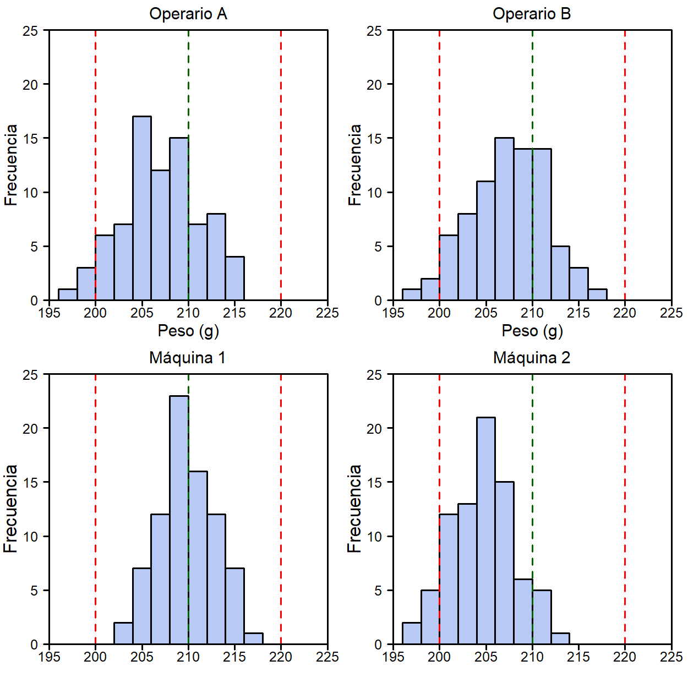
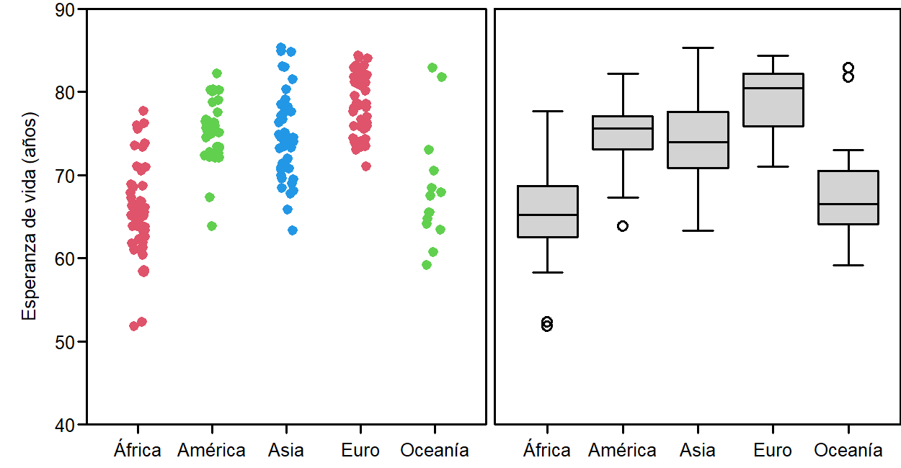
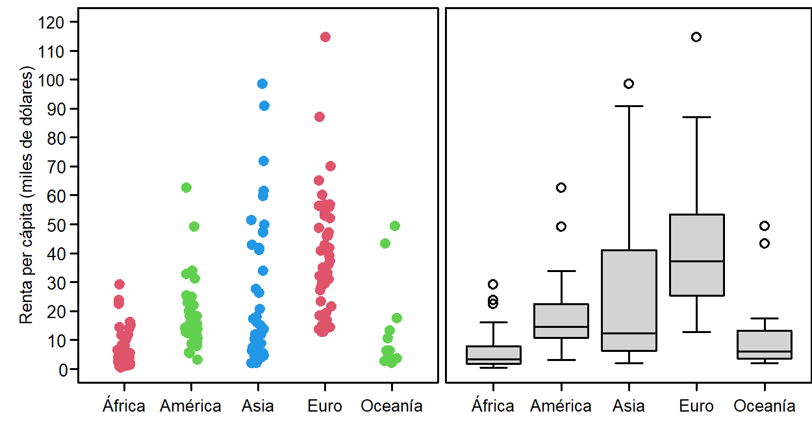

# Representaciones gráficas

Empezamos planteando un reto: El dueño de una panadería sospecha que las barras de pan que está vendiendo tienen un peso demasiado variable, de forma que algunas pueden estar por debajo del límite que marca la ley. El pan se elabora en dos máquinas que son utilizadas por dos operarios, uno por la mañana y otro por la tarde. La tabla [-@tbl-panaderia] contiene los pesos (en gramos) de las muestras que se han ido recogiendo durante 20 días.

::: {style="font-size:13px"}
+:-----------:+:---------------------------:+:------------------------------------------:+:------------------------------------------:+
| Día         | Operario                    | Máquina 1                                  | Máquina 2                                  |
+-------------+-----------------------------+--------------------------------------------+--------------------------------------------+
| 2\          | A\                          | 220,3       215,5       219,1       219,2\ | 220,3       215,5       219,1       219,2\ |
| 2\          | A\                          | 220,3       215,5       219,1       219,2\ | 220,3       215,5       219,1       219,2\ |
| 2\          | A\                          | 220,3       215,5       219,1       219,2\ | 220,3       215,5       219,1       219,2\ |
| 2\          | A\                          | 220,3       215,5       219,1       219,2\ | 220,3       215,5       219,1       219,2\ |
| 2\          | A\                          | 220,3       215,5       219,1       219,2\ | 220,3       215,5       219,1       219,2\ |
| []{}\       | []{}\                       | []{}\                                      | []{}\                                      |
| 2\          | A\                          | 220,3       215,5       219,1       219,2\ | 220,3       215,5       219,1       219,2\ |
| 2\          | A\                          | 220,3       215,5       219,1       219,2\ | 220,3       215,5       219,1       219,2\ |
| 2\          | A\                          | 220,3       215,5       219,1       219,2\ | 220,3       215,5       219,1       219,2\ |
| 2\          | A\                          | 220,3       215,5       219,1       219,2\ | 220,3       215,5       219,1       219,2\ |
| 2\          | A\                          | 220,3       215,5       219,1       219,2\ | 220,3       215,5       219,1       219,2\ |
| []{}\       | []{}\                       | []{}\                                      | []{}\                                      |
| 2\          | A\                          | 220,3       215,5       219,1       219,2\ | 220,3       215,5       219,1       219,2\ |
| 2\          | A\                          | 220,3       215,5       219,1       219,2\ | 220,3       215,5       219,1       219,2\ |
| 2\          | A\                          | 220,3       215,5       219,1       219,2\ | 220,3       215,5       219,1       219,2\ |
| 2\          | A\                          | 220,3       215,5       219,1       219,2\ | 220,3       215,5       219,1       219,2\ |
| 2\          | A\                          | 220,3       215,5       219,1       219,2\ | 220,3       215,5       219,1       219,2\ |
| []{}\       | []{}\                       | []{}\                                      | []{}\                                      |
| 2\          | A\                          | 220,3       215,5       219,1       219,2\ | 220,3       215,5       219,1       219,2\ |
| 2\          | A\                          | 220,3       215,5       219,1       219,2\ | 220,3       215,5       219,1       219,2\ |
| 2\          | A\                          | 220,3       215,5       219,1       219,2\ | 220,3       215,5       219,1       219,2\ |
| 2\          | A\                          | 220,3       215,5       219,1       219,2\ | 220,3       215,5       219,1       219,2\ |
| 2\          | A\                          | 220,3       215,5       219,1       219,2\ | 220,3       215,5       219,1       219,2\ |
+-------------+-----------------------------+--------------------------------------------+--------------------------------------------+

: Peso de barras de pan elaboradas en una panadería {#tbl-panaderia} : {tbl-colwidths="\[5, 15, 40, 40\]"}
:::

El peso debe ser de 210 $\pm$ 10 g. Las preguntas que nos planteamos son: ¿Existe algún problema? ¿Qué está pasando? ¿qué hay que hacer para resolver el problema, si es que existe?

Si trata de sacar conclusiones mirando los números seguramente se equivocará. Aunque en este caso solo hay 160 valores, analizarlos "a ojo" siempre es arriesgado. Tampoco es una buena idea empezar calculado medias y desviaciones típicas o, peor todavía, emnpezar planteando test estadísticos más o menos sofisticados.

Cuando queremos analizar datos, lo primero que siempre conviene hacer es representarlos gráficamente. Así tenemos una primera idea --muchas veces ya suficiente-- de lo que está pasando. 

En la figura +++++ por máquina y operario.

{#fig-panaderia fig-align="center" width="90%"}
Moraleja: +++++++++++++

## Forma de la distribución, valro central y dispersión

El tipo de gráfico que hemos usado para analizar los datos de la panadería 

### Histograma

Número de intervalos

Números redondos, al marcar los ejes y en la anchura de los intervalos

Si hay valro objetivo y límites es una buena idea ponerlos.

No hay que esperar que cuando proviene de una distribución normal tengan formade campana

### Diagrama de puntos

texto

### Boxplot

texto

::: {style="font-size:13px"}
+:----------+:----:+:---:+:---:+:---:+:---:+:---:+:---:+:---:+:---:+:---:+:----:+:----:+:----:+:----:+:----:+:----:+:----:+:----:+:----:+:----:+
| *Orden*\  | *1*\ |*2*\ |*3*\ | *4*\|*5*\ |*6*\ |*7*\ |*8*\ |*9*\ |*10*\|*11*\ |*12*\ |*13*\ |*14*\ |*15*\ |*16*\ |*17*\ |*18*\ |*19*\ |*20*\ | 
|**Valores**|**5** |**7**|**7**|**9**|**9**|**9**|**9**|**9**|**9**|**9**|**10**|**11**|**11**|**11**|**11**|**11**|**14**|**15**|**16**|**18**|       
+-----------+------+-----+-----+-----+-----+-----+-----+-----+-----+-----+------+------+------+------+------+------+------+------+------+------+
:::
texto deduciendo los valores de la mediana y los cuartiles. Podría poner antes el rango intercuartílico.

{#fig-boxplot fig-align="center" width="100%"}

texto

{fig-align="center" width="100%"}

{#fig-boxplotEstra fig-align="center" width="100%"}

texto

texto

## Evolución

texto

### Diagrama en serie de tiempo

Evolución de la esperanza de vida en los países donde tienen más y donede tienen menos.

{#fig-boxplotEstra fig-align="center" width="100%"}

Asia: Afganistan, Japón. Menor de áfrica y otro con EV muy alta.

También hay buenos datos en web de comunidd de Madrid: Indicadores de nacimientos.

{#fig-boxplotEstra fig-align="center" width="100%"}
Que los nombres salgan por orden alfabético.

## Relación entre variables

texto

### Las dos son cuantitativas: Diagramas bivariantes

texto

V
{#fig-boxplotEstra fig-align="center" width="100%"}

texto

{#fig-boxplotEstra fig-align="center" width="100%"}
Reflexión sobre esperanza de vida y ratios de mortalidad infantil.

La esperanza de vida está más relacionada con la mortalidad infantil que con alargar la vida de los ancianos.

Una es cuantitatica y la otra cualitativa: ejemplo de Boxplots estratificados del principio.

## Frecuencias

texto

{#fig-boxplotEstra fig-align="center" width="100%"}

texto

### Diagramas de barras

texto

### Gráficos de donut

texto en la figura  [-@fig-donutPie]. Recortar arriba y abajo con programa de manipulación de imágenes.

{#fig-donutPie fig-align="center" width="100%"}

Información más clara y mejor uso de la tinta.

{#fig-boxplotEstra fig-align="center" width="100%"}

En el recuadro se incluyen 90 países, casi la mitad del total de paises considerados (196), pero solo representa el ***% de la poblaicón mundial.

Posible polígono de frecuencias y diagrama de Pareto.

## Gráficos a evitar

veamos algunas tentaciones que conviene evitar, especialmente en trabajos académicos donde el objetivo debe ser transmitir la información de la forma más clara y directa posible.

### Gráficos con tres dimensiones  {.unnumbered}

Deben evitarse porque la profundidad no aporta ninguna información y dificulta la interpretación de las escalas. Algunas veces se utilizan en contextos publicitarios en los que se prioriza el impacto visual.

{#fig-donutPie fig-align="center" width="100%"}

### Diagramas de pastel, especialmente con tres dimensiones {.unnumbered}

Estos diagramas no son muy aprecidos en contextos científico-técnicos donde -en general- se prefieren los diagramas de barras. Si se representan en tres dimensiones y desgajando un sector que se quiere destacar ya entramos en el terreno de los gráficos tendenciosos. Un gráfico similar que transmite la información de forma más clara son los diagramas de donut.

===Comentar que en el gráfico 3d no es lo que parece===
                                             
{#fig-donutPie fig-align="center" width="100%"}

### Gráficos que ocupan mucho espacio y contienen poca información {.unnumbered}

Utilizamos los gráficos para resumir de forma visual la información que contienen los datos. Construir un gráfico para representar un solo dato no parece -en general- una buena . Así pues, contruir -por ejemplo- un gran diagrama de pastel para decir que la proporción de mujeres en un determinado ámbito es del 53% no parece una buena idea. Es más grave si en un informe o en una presentación oral se van presentando este tipo de gráficos de forma repetitiva. ===no caeremos en nuestra propia trampa poniendo un ejemplo===

### Gráficos con escalas inapropiadas {.unnumbered}

Uno de los recursos más utilizados para que el gráfico dé la impresión que interesa es adaptar la escala vertical para exagerar o disimular las diferencias, según convenga. La figura +++++ prodría representar las medidas de audiencia de cuatro cadenas de televisión, en el gráfico de la izquierda se observan unas diferencias muy claras y TV1 parece tener la mitad de la audiencia que TV4 sin embargo, si la escala parte de cero -que es lo correcto cuando se hacen comparaciones- apenas se aprecian esad diferencias.

{#fig-donutPie fig-align="center" width="100%"}

No hay que dejarse engañar con añadidos como el de la figura ++++

{#fig-donutPie fig-align="center" width="50%"}

Ya sabemos que si el eje horizontal representa el tiempo es mejor utilizar gráficos de líneas y estos son también muy sensibles a la escala vertical. Los dos gráficos de la figura ++++ representan los mismos datos:

{#fig-donutPie fig-align="center" width="100%"}

texto

Una buena opción

{#fig-donutPie fig-align="center" width="100%"}

texto

{#fig-donutPie fig-align="center" width="100%"}

### Comparar situaciones usando distintas escalas

texto

### Rectas de tendencia cuando los puntos están muy agrupados en una parte del diagrama

texto

## Malos usos y manipulaciones

texto

::: callout-note
## Ojo con ir a la búsqueda del gazapo

puede ser muy instructivo buscar ejemplos de gráficos que por falta de habilidad o por mala fe transmiten una información falsa, pero tampoco hay que transmitir la idea de que todo el mundo nos quiere engañar. En la prensa seria la mayoría de los gráficos -que pueden ser más o menos afortunados- se hacen de buena fe, con el ánimo de informar con 
:::

