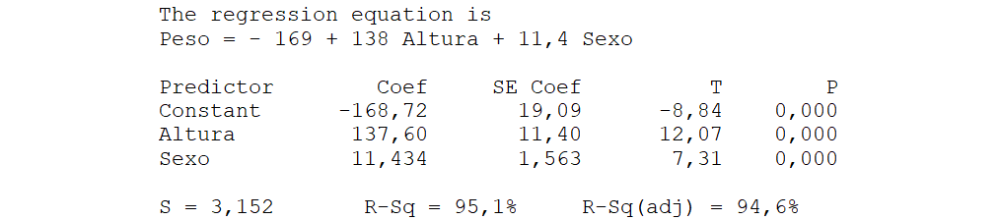
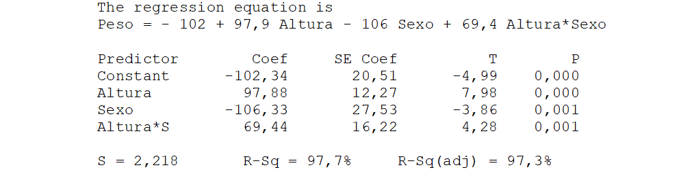

# Regresión Múltiple

Los modelos de regresión múltiple pueden ser muy útiles para explicar el comportamiento de una variable, pero también pueden ser un arma peligrosa en manos inexpertas. Vamos a ver cuáles son sus posibilidades, algunas ideas sobre cómo construirlos, y también cuáles son sus peligros.

## ¿Qué es la regresión múltiple?

La respuesta es sencilla, es como la regresión simple pero con más de una variable regresora.

De esta forma se amplían las posibilidades de explicar el comportamiento de la respuesta o de realizar previsiones sobre cuál será su valor en unas determinadas condiciones. Incluso las variables que, de manera aislada, no servirían para un modelo de regresión simple pueden resultar muy útiles cuando se combinan con otras en una regresión múltiple.

En la [@fig-ventajasRM] tenemos una variable $y$ que muestra una cierta relación con $x_1$ ($R^2 = 0.65$) pero prácticamente ninguna con $x_2$ ($R^2 = 0.12$), sin embargo, usando las dos en un modelo de regresión múltiple la explicación del comportamiento de $y$ es muy buena, obteniéndose un valor de $R^2 = 0.98$. 

Observe que de la misma forma que un modelo de regresión simple se ajusta a una línea, con dos variables se ajusta a un plano, y podríamos seguir hasta espacios con tantas dimensiones como variables regresoras. En la [@fig-ventajasRM] los puntos están muy pegados a la superficie ajustada, ayuda a verlo la línea vertical que sale de cada punto y que indica su distancia a la superficie, es decir, su residuo.

{#fig-ventajasRM .fig-normal0 fig-align="center" width="100%"}

## Variables candidatas y variables elegidas

En general, partimos de un conjunto de variables candidatas a formar parte del modelo. Se trata de variables que sospechamos que pueden estar relacionadas con la respuesta, así como de posibles transformaciones de esas variables originales.

Identificar cuales conviene incluir no es trivial. La tabla \ref{datosYX1X2X3} contiene los valores de una variable respuesta $y$, y tres posibles variables regresoras: $x_1$, $x_2$, $x_3$. También hemos representado los diagramas bivariantes de la respuesta frente a cada una de esas posibles variables regresoras ([@fig-YX1X2X3]). 

\begin{table}[h!]
	{\footnotesize %\small%
		\begin{center}
			\caption{\small{\textit{Valores de una respuesta y tres posibles variables regresoras.}}}
			\label{datosYX1X2X3}
			\begin{tabular}{ccccc}
				\hline
				\multicolumn{1}{m{1.3cm}}{\centering 
					Observación} & 
				\multicolumn{1}{m{1 cm}}{\centering 
					$y$} &
				\multicolumn{1}{m{1cm}}{\centering 
					$x_1$} &
				\multicolumn{1}{m{1cm}}{\centering 
					$x_2$} &
				\multicolumn{1}{m{1 cm}}{\centering 
					$x_3$} \\ \hline
				1 & 22,17 & 20,07 & 22,56 & 2,10\\
				2 & 26,08 & 13,14 & 26,55 & 12,94\\
				3 & 23,28 & 21,05 & 24,51 & 2,23\\
				4 & 12,56 & 22,48 & 12,84 & -9,92\\
				5 & 18,12 & 14,07 & 20,79 & 4,05\\ \arrayrulecolor{gray75} \hline
				6 & 26,49 & 29,49 & 22,28 & -3,00\\
				7 & 12,51 & 7,17  & 12,38 & 5,33\\
				8 & 19,19 & 12,87 & 17,58 & 6,32\\
				9 & 12,05 & 13,77 & 10,81 & -1,72\\ 
				10 &21,15 & 19,04 & 18,67 & 2,10\\  \arrayrulecolor{gray75} \hline
				11 &27,64 & 28,34 & 25,16 & -0,70\\
				12 &27,79 & 29,26 & 24,10 & -1,47\\
				13 &22,90 & 27,02 & 21,98 & -4,12\\
				14 &22,22 & 21,04 & 22,66 & 1,18\\ 
				15 &22,87 & 24,58 & 24,48 & -1,71\\  \arrayrulecolor{gray75} \hline
				16 &18,08 & 19,47 & 18,02 & -1,39\\
				17 &18,46 & 22,24 & 19,95 & -3,77\\
				18 &15,94 & 13,57 & 15,25 & 2,37\\
				19 &18,56 & 12,66 & 23,54 & 5,91\\
				20 &15,49 & 10,29 & 14,86 & 5,20\\ \hline
			\end{tabular}
	\end{center}}
	\vspace{-0.1cm}
\end{table}

{#fig-YX1X2X3 .fig-normal6 fig-align="center" width="95%"}

Si para realizar previsiones sobre el valor de $y$ solo pudiéramos elegir una de esas tres posibles variables regresoras, la elegida sería, sin ninguna duda, $x_2$, por ser la que presenta mayor correlación con la respuesta. Pero ¿y si pudiera elegir dos? Si está pensando que serían $x_2$ y $x_1$ —las dos más correlacionadas con la respuesta—, se equivoca. Las dos variables que mejor explican el comportamiento de $y$ son $x_1$ y $x_3$. Exactamente tenemos que: $y = x_1 + x_3$. Puede comprobarlo echando un vistazo a los valores de la tabla.

### Selección de variables: Analogía del examen con asesores {.unnumbered}

Supongamos que tiene que realizar un examen en el que entran 100 temas y usted no sabe ninguno. Pero no todo está perdido; puede llevar asesores elegidos entre sus compañeros de clase y, puestos a suponer, supondremos que usted conoce los temas que sabe cada uno de sus compañeros. Si solo pudiera llevar a uno, llevaría al que más temas sepa, sobre eso no hay ninguna duda. Pero, ¿y si pudiera llevar a dos? La mejor solución no necesariamente sería elegir a los dos que más saben porque si el primero sabe 80 y el segundo 75, pero que están incluidos en los que sabe el primero, el segundo no le sirve para nada. Sería mejor elegir uno que solo sepa 10 temas pero que sean distintos de los que sabe el primero. Incluso podría ocurrir que en la pareja ideal no esté el que sabe 80 temas, si hay otros dos que saben --por ejemplo-- 60 y 40 de manera que entre los dos los saben todos.

La mejor solución es elegir el mínimo número de asesores que cubren el máximo número de temas, y en ese conjunto puede no estar el que más sabe pero podría estar el que sabe menos si los pocos temas que domina sirven para completar los que no saben los demás.

Desde luego no sería una buena idea llevarlos a todos, porque los que no aportan nada solo enredarían y dificultarían la comunicación con los que sí tienen algo que decir.

Cuando debemos construir un modelo de regresión múltiple nos enfrentamos a un problema similar al de la selección de asesores. Raramente interesará incorporar todas las variables candidatas, lo que interesa es identificar el subconjunto que logra explicar mejor el comportamiento de la respuesta. 

### Estrategias para la selección de variables {.unnumbered}

Crear un modelo de regresión múltiple exige el uso de un ordenador y casi siempre también de un paquete de software estadístico. En general, el problema no es calcular los coeficientes de las variables, sino decidir cuáles son las que conviene incluir. Vamos a comentar algunas estrategias de selección.

#### Ir eliminando variables {.unnumbered}

Consiste en comenzar con un modelo que incluya todas las variables candidatas y, entre aquellas cuyo coeficiente no es significativo, eliminar la que tenga el mayor $p$-valor (la que podríamos denominar "menos significativa"). Tras esta eliminación, los coeficientes y los $p$-valores de las variables restantes cambian, por lo que se repite el proceso, eliminando en cada paso la variable con el $p$-valor más alto, hasta que el modelo ajustado solo contiene variables cuyos coeficientes son estadísticamente significativos.

Se trata de un método muy fácil de aplicar. Su principal inconveniente es que las variables eliminadas quedan descartadas y no se vuelven a considerar, a pesar de que, a medida que el modelo se va simplificando, algunas de ellas podrían resultar significativas si se reincorporan.

#### Pueden entrar y también salir {.unnumbered}

Una variante del método anterior es no olvidar ninguna variable aunque previamente haya sido descartada. A esta estrategia se le llama "regresión paso a paso" (*stepwise* en inglés). 

Se puede empezar con todas las variables dentro del modelo o con todas fuera. Si empezamos con todas fuera, la primera en entrar será la más correlacionada con la respuesta, a continuación entra la más correlacionada con los residuos del modelo anterior, y así van entrando las que mejor explican lo que falta por explicar. Al entrar una nueva variable cambian los $p$-valores de las que ya habían entrado y si alguna ha pasado a ser no significativa se elimina del modelo antes de que entre la siguiente. Si son varias las que quedan no significativas se quita la de mayor $p$-valor y se repite el proceso. Cuando ninguna de las variables que quedan fuera tendría un coeficiente significativo si entrara, se para el proceso.

Los paquetes de software estadístico suelen incorporar esta estrategia para ser ejecutada de forma automática. Los $p$-valores frontera para entrar y salir no necesariamente deben ser iguales aunque ambos se suelen fijar en 0,05. Tiene la ventaja de ser rápida y exigir pocos recursos computacionales incluso aunque se tengan muchas variables candidatas. Su inconveniente es que el modelo final puede no ser el que más convenga. 

En el ejemplo de los asesores para el examen, primero elegiríamos al que más temas sepa, a continuación, el que más sepa de los que faltan, y así mientras haya alguien que conozca algún tema no conocido por los asesores seleccionados. Antes de elegir un nuevo asesor veríamos si con lo que aporta el último resulta innecesario alguno de los que ya había entrado, y en ese caso se descartan esos que ya no aportan nada antes de incorporar uno nuevo.

#### Mediante fuerza bruta {.unnumbered}

Se trata de calcular todos los posibles modelos que se pueden obtener con las variables candidatas, ordenarlos con algún criterio razonable y presentar los mejores para elegir el que más convenga. Con $k$ variables candidatas se pueden construir $2^k$ modelos[^12-1].

[^12-1]: La primera variable puede estar o no estar en el modelo. para cada una de estas dos opciones existen otras dos para la segunda (ya tenemos $2^2$). Con $k$ variables tendremos $2^k$. Este número también incluye un modelo sin variables regresoras ($\hat{y} = \bar{y}$), si este no se quiere contar el número será $2^k -1$.

La ventaja es que presenta un panorama muy exhaustivo de los modelos disponibles y el inconveniente es que si el número de variables candidatas es grande el tiempo de computación puede ser muy largo. Los paquetes de software no pueden tratar más de 31 variables debido a cómo se codifican internamente, pero incluso con bastantes menos deja de ser computacionalmente razonable. En general, no hay problema con hasta 15 variables candidatas, entre 15 y 20 ya puede ser largo y requerir muchos recursos del ordenador. Más de 20 ya puede ser inviable.

En el ejemplo de los asesores, si tuviera 30 compañeros habría más de mil millones de posibles comités asesores. Analizarlos todos exhaustivamente está fuera de las posibilidades de los ordenadores de uso habitual.

## Uso de variables cualitativas

El modelo puede incluir variables cualitativas pero no tratadas como si fueran cuantitativas. Si queremos usar el día de la semana como variable explicativa y tenemos los días codificados como lunes = 1, martes = 2, ..., es evidente que esta variable no se puede considerar así, ya que el modelo entendería que el domingo es 7 veces el lunes, cosa evidentemente falsa. Sin embargo, sí hay forma de utilizar variables cualitativas. 

Supongamos que tenemos los datos correspondientes al peso, la estatura y el sexo de 20 individuos. Se trata de encontrar una ecuación para explicar el peso en función de la estatura y el sexo. Lo primero será echar un vistazo a los datos a través de un gráfico. En este caso basta con un diagrama bivariante usando distinto símbolo según el sexo ([@fig-varCualitativa], primer cuadrante). Está claro que tanto la estatura como el sexo influyen en el peso.

{#fig-varCualitativa .fig-normal0 fig-align="center" width="100%"}

Si ignoramos la variable "Sexo" podemos ajustar un modelo del peso solo en función de la estatura, el mismo para hombres que para mujeres ([@fig-varCualitativa], segundo cuadrante), pero es una lástima ignorar la influencia de una variable que sabemos que también afecta.

Cuando tenemos una variable cualitativa que solo tiene dos categorías se puede introducir en el modelo codificándola con valores numéricos. Para facilitar la interpretación de los resultados lo mejor es codificar un valor como 0 y el otro como 1. En este caso convenimos: Mujer = 0 y Hombre = 1. Ajustando el modelo de regresión se obtiene:

{ .fig-normal0 fig-align="center" width="120%"}

Del resultado anterior se deduce que sí hay diferencias debido al sexo, ya que el coeficiente de esta variable es significativo. Sustituyéndola por sus valores 0 y 1, se obtienen los modelos específicos para mujeres y hombres:

-   Mujeres (sexo = 0): $\text{Peso = -169,7 + 137,6·Altura}$

-   Hombres (sexo = 1): $\text{Peso = -157,3 + 137,6·Altura}$

Así de sencillo. El problema es que ajustando el modelo de esta forma la pendiente de la recta es la misma tanto para mujeres como para hombres ([@fig-varCualitativa], tercer cuadrante). Esto es debido a que al cambiar el valor de la variable codificada solo cambia el valor de la ordenada en el origen $b_0$. 

Si queremos que las pendientes de las rectas puedan ser distintas deberemos incluir el producto de la variable cualitativa por las otras variables regresoras (en este caso solo la altura). De esta forma se obtiene:

{ .fig-normal6 fig-align="center" width="120%"}

La significación del término Altura*Sexo pone de manifiesto la diferencia en las pendientes de las rectas. Los modelos que se obtienen son: 

-   Mujeres (sexo = 0): $\text{Peso = -102,3 + 97,9·Altura}$

-   Hombres (sexo = 1): $\text{Peso = -208,7 + 167,3·Altura}$

En la [@fig-varCualitativa], cuarto cuadrante, tenemos su representación gráfica. Seguro que ahora nos quedamos más tranquilos con los ajustes obtenidos.

¿Y si la variable cualitativa tiene más de dos valores distintos? La regla general es que una variable cualitativa con $ k $ valores debe sustituirse por $ k-1 $ variables binarias que toman valores 0 y 1. En el caso de la variable "día de la semana", como $k=7$ habrá que sustituirla por 6 variables binarias tal como se indica en la tabla \ref{VariablesCodificadas}. 

\vspace{5pt}
\begin{table}[h!]
	{\footnotesize
		\begin{center}
			\caption{\small{\textit{Codificación de variable cualitativa: ``Día de la semana''}}}
			\label{VariablesCodificadas}
			\begin{tabular}{ccccccc}
				\hline
				\multirow{2}{1.5cm}{\centering 
					Valores originales} & 
				\multicolumn{6}{m{5cm}}{\centering Variables auxiliares} \\
				&
				\multicolumn{1}{m{0.5cm}}{\centering 
					$Z_1$} &
				\multicolumn{1}{m{0.5cm}}{\centering 
					$Z_2$} &
				\multicolumn{1}{m{0.5cm}}{\centering 
					$Z_3$} & 
				\multicolumn{1}{m{0.5cm}}{\centering 
					$Z_4$} & 
				\multicolumn{1}{m{0.5cm}}{\centering 
					$Z_5$} & 
				\multicolumn{1}{m{0.5cm}}{\centering 
					$Z_6$} \\ \hline
				Lunes & 1 & 0 & 0 & 0 & 0 & 0  \\
				Martes & 0 & 1 & 0 & 0 & 0 & 0   \\
				Miércoles & 0 & 0 & 1 & 0 & 0 & 0   \\
				Jueves & 0 & 0 & 0 & 1 & 0 & 0   \\
				Viernes & 0 & 0 & 0 & 0 & 1 & 0   \\ 
				Sábado & 0 & 0 & 0 & 0 & 0 & 1   \\
				Domingo & 0 & 0 & 0 & 0 & 0 & 0   \\ \hline
			\end{tabular}
	\end{center}}
\end{table}

Si el número de observaciones de que se dispone no da para estimar con solvencia tantos coeficientes, una opción podría ser usar los días clasificados solo como laborables y festivos. Si esta división tiene interés en el marco de la situación que se está analizando, el análisis será más sencillo y la presentación de los resultados se podrá realizar de una forma más clara y compacta, lo cual también es importante.

## Medidas de calidad del ajuste en regresión múltiple 

### Coeficiente de determinación ajustado $\mathbf{R_{Aj}^2}$ {.unnumbered}

El coeficiente de determinación $R^2$ es una buena medida en el ámbito de la regresión simple, pero tiene un problema importante cuando se aplica a la regresión múltiple: su valor siempre aumenta al añadir nuevas variables, aunque estas no expliquen nada. 

Si a partir de una muestra de 50 individuos queremos ajustar un modelo para explicar el peso, podemos empezar usando la altura como variable regresora y obtendremos un determinado valor de $R^2$. Si añadimos una variable que no tiene nada que ver, como el dinero que cada uno lleva en el bolsillo, ¿cómo cambiará $R^2$? Pues sí, aumentará. Y si añadimos el número de la casa donde viven volverá a aumentar, de manera que si buscamos un ajuste con el máximo valor de $R^2$ acabaremos con un modelo grande y enredado lleno de variables que no explican absolutamente nada. Esto ocurre porque el coeficiente de correlación entre los residuos del ajuste realizado (lo que falta por explicar del comportamiento de $Y$) y la nueva variable nunca es exactamente igual a cero. Parece que explica algo, pero es pura casualidad.

Para evitar este problema se ha corregido la definición de $R^2$, dando origen al llamado **coeficiente de determinación ajustado**. Simplemente se dividen las sumas de cuadrados por sus grados de libertad. Habíamos definido:

$$R^2 = \frac{Q_Y - Q_R}{Q_Y} = 1 - \frac{Q_R}{Q_Y}$$
Los grados de libertad son $n-p$ para $Q_R$  y $n-1$ para $Q_Y$, siendo $n$ el número de observaciones y $p$ el de parámetros del modelo. El coeficiente de determinación ajustado es:
$$R_{\text{Aj}}^2= 1 - \frac{\frac{Q_R}{n-p}}{\frac{Q_Y}{n-1}} =  1 - \frac{s_R^2}{s_Y^2}$$
Observe que el valor de $p$ penaliza la incorporación de nuevas variables. Cuando la relación $n/p$ se hace grande, es decir que el número de datos supera mucho al número de parámetros, los dos coeficientes se acercan en sus valores. Si  con  $n=10$ observaciones se ajusta un modelo con 8 variables regresoras ($p=9$) y resulta un coeficiente de determinación $R^2= 90\%$, podría pensarse que estamos ante un buen modelo. Sin embargo, utilizando la fórmula anterior es fácil deducir que  $R_{Aj}^2 =$ 0,1, es decir, nos indica que en esas condiciones el valor creíble del coeficiente de determinación es el 10 %, el ajuste es bastante pobre. Si lo único que cambia es que tenemos $n=90$ observaciones resulta $R_{Aj}^2 =0.89$. Pasamos del 90 al 89 %, es decir que ha tenido muy poco cambio. 

::: callout-note
## Maximizar $R_{Aj}^2$ es equivalente a minimizar la varianza de los residuos

Basta observar la fórmula de $R_{Aj}^2$. El valor de $s_Y^2$ solo depende de los valores de $Y$, no de las variables que se incluyan en el modelo. Por tanto, a mayor valor de  $s_R^2$ menor será el de $R_{Aj}^2$. 
:::

### Validación cruzada {.unnumbered}

Valorar la bondad de un modelo a partir de su capacidad para predecir las mismas observaciones que han sido utilizadas para su construcción puede conducir a resultados excesivamente optimistas. Esto se debe a que el modelo se ajusta especialmente bien a los datos con los que ha sido construido, ya que incorpora la información que han aportado esos mismos datos.

Si se tienen suficientes observaciones, se puede destinar una parte (pongamos el 75 %) a construir el modelo y valorar su capacidad de predicción del 25 % restante. Siempre es más "limpio" prever valores que no han sido utilizados para construir el modelo.

Más allá de los modelos de regresión, este procedimiento se utiliza también en los algoritmos de aprendizaje supervisado (*machine learning*) o redes neuronales para confirmar que funcionan correctamente con nuevos datos.

## ¿Qué es un buen modelo?

A veces se habla de la selección del "mejor modelo" pero no necesariamente existe un modelo que sea mejor que todos los demás; puede haber distintas buenas opciones, cada una con sus ventajas y sus inconvenientes. Si solo nos fijamos en medidas cuantitativas, como el valor de $R_{Aj}^2$, sí se pueden ordenar con ese criterio, pero existen otros aspectos, como los que a continuación se comentan, que también conviene tener en cuenta.

#### Respecto a las variables regresoras {.unnumbered}

-   **Que sean fáciles de medir**. Un modelo capaz de realizar buenas predicciones pero que utilice variables cuya medición es lenta, difícil o poco precisa será, en la práctica, menos útil que otro que no ajuste tan bien pero resulte más sencillo de aplicar. Medir el contenido de humedad de un producto puede ser lento si es necesario secarlo y medir la diferencia de pesos. Si se dispone de otra variable alternativa, como el simple peso inicial, es probable que se prefiera esta segunda opción, aunque el ajuste del modelo sea algo peor.
	
-   **Que sean fáciles de manejar**. Si estamos interesados en ir regulando el valor de la respuesta, será preferible un modelo que incluya variables a las que se pueda acceder fácilmente y cuyo valor pueda modificarse con rapidez. En un horno industrial, por ejemplo, es mucho más fácil cambiar el caudal de gas que alimenta los quemadores que modificar la temperatura del horno, ya que esta última suele presentar una elevada inercia.
	
-   **Que sean independientes**. Si dos variables regresoras están muy correlacionadas su aportación a la explicación de la respuesta será muy similar y seguramente se podrá prescindir de una de ellas. Por otra parte, una alta correlación entre dos variables regresoras provoca un aumento de la varianza de los coeficientes, haciendo menos sensible el análisis de su significación estadística.

#### Respecto al modelo {.unnumbered}

-   **Que sea sencillo**. Aumentar ligeramente el valor de $R_{Aj}^2$ a base de incluir nuevas variables en el modelo no suele ser una buena idea. En general se prefieren modelos compactos, sencillos y fáciles de utilizar.
	
-   **Que sea interpretable**. Interesa que el modelo responda a lo que se espera. Si sabemos que aumentar el valor de una variable aumentará la respuesta, el coeficiente de esa variable debe ser positivo. Mejorar el ajuste a base de introducir nuevas variables o transformaciones artificiosas no suele ser una buena idea. 

#### Respecto a los residuos {.unnumbered}

-   **Comportamiento adecuado**. Un mal comportamiento de los residuos (falta evidente de Normalidad, varianza que aumenta con el valor de la respuesta) compromete la validez de las estimaciones y de las pruebas de significación que se realizan. Un patrón no aleatorio en el gráfico de residuos frente a valores previstos o frente a otras variables de interés, también puede sugerir la necesidad de transformar alguna variable. 

### Modelos predictivos y modelos explicativos {.unnumbered}

Lo que se pide a un modelo  depende del objetivo con que se ha construido. Según sea ese objetivo nos referimos a ellos como modelos explicativos o modelos predictivos.

#### Modelos explicativos {.unnumbered}

Tratan de identificar cuáles son las variables que afectan a la respuesta y cómo lo hace cada una de ellas. El objetivo principal es entender porque la respuesta se comporta tal como lo hace para saber cómo actuar para que tome el valor que interesa. Se prioriza que sea compacto e interpretable.

#### Modelos predictivos {.unnumbered}

Lo que más interesa es ser capaces de prever cual será la respuesta en función de los valores de cada una de las variables consideradas. No importa tanto si el modelo es fácil o difícil de interpretar ni si tiene muchas o pocas variables. Lo vemos como una caja negra donde entran los valores de unas variables y sale el valor de la respuesta. Si el valor que se predice se aproxima al real dentro de los márgenes establecidos, el modelo cumple su función.

Naturalmente, aunque se pretenda construir un modelo explicativo no se puede ignorar su capacidad de predicción (si no es capaz de predecir no sirve como modelo de ningún tipo) y si es predictivo también interesa poder entender por qué la respuesta se comporta tal como hace para, si hay problemas, poderlos corregir actuando sobre las causas que los provocan.

En el ámbito de los modelos predictivos, además de los métodos estadísticos clásicos (regresión, series de tiempo[^12-2]), la previsión puede abordarse mediante otras técnicas como las redes neuronales, que suelen ofrecer mayor capacidad predictiva a costa de menor interpretabilidad.

[^12-2]: No tratamos las series de tiempo --o series temporales-- que tienen como objetivo realizar previsiones cuando los valores están autocorrelacionados. En este caso intervienen conceptos como estacionalidad, periodicidad o tendencia. Estas técnicas no se incluyen en cursos introductorios.

::: callout-note
## No olvidemos lo que ya sabemos

Para prever el volumen de madera que se puede extraer de un árbol en función del diámetro y la longitud de su tronco, lo mejor no es un modelo de regresión múltiple con esas variables, sino una regresión simple con una nueva variable igual al producto de la longitud por el cuadrado de la circunferencia. 
:::
	
## Peligros y malos usos de la regresión múltiple

Conviene tener claras algunas ideas para no cometer errores de mucho bulto. Veamos un par de aspectos a los que hay que prestar atención.

### Explicaciones milagrosas {.unnumbered}

Usted puede construir un modelo que explique la cotización en bolsa de cinco grandes empresas en función de algunos valores del día anterior. Tome esas cinco cotizaciones de hoy al cierre de la jornada (serán las $y$), seleccione ahora los siguientes datos del día de ayer: las temperaturas máximas en cinco capitales europeas ($x_1$), el tipo de cambio frente al dólar de las 5 monedas que usted elija ($x_2$), los precios de cinco materias primas en el mercado de Londres ($x_3$) y la temperatura media en cinco ciudades colombianas ($x_4$). Ajuste el modelo que explica $y$ en función de $x_1$, $x_2$, $x_3$ y $x_4$. ¡Ajuste perfecto!  Lástima que para hoy llega tarde, y para mañana es inútil.

Ya hemos visto que por dos puntos pasa una recta (modelo con dos parámetros: $b_0$ y $b_1$ ), por tres puntos pasa un plano (tres parámetros), y así sucesivamente. No es ninguna sorpresa que si se tienen cinco observaciones, estas ajusten perfectamente a un modelo con cinco parámetros. No importa cuáles sean los valores de esas observaciones el ajuste será perfecto por la misma razón por la que por dos puntos pasa una recta sin importar cuales son las coordenadas de esos dos puntos.

Lo podemos ver gráficamente si en vez de cuatro variables distintas consideramos una y tres transformaciones de la misma, que es como tener cuatro variables regresoras. En la [@fig-puntosIgualParametros] (izquierda) tenemos cinco puntos y a la derecha esos mismos puntos con una curva que los ajusta perfectamente. No importa dónde estén esos puntos, siempre se pueden ajustar perfectamente a un polinomio de cuarto grado.

{#fig-puntosIgualParametros .fig-normal0 fig-align="center" width="100%"}

::: callout-note
## Si el modelo se comporta demasiado bien, seguramente algo está mal

Si el modelo se comporta sorprendentemente bien seguramente algo está mal. Puede que tenga un número de variables cercano al número de puntos, o que haya puesto la respuesta --o una transformada de esta-- como variable regresora. 
:::

La recomendación es que haya un mínimo de 10 observaciones por cada parámetro del modelo.

### Valores anómalos {.unnumbered}

Si existen valores anómalos y estos pasan desapercibidos, el modelo obtenido puede estar distorsionado respecto al que realmente andamos buscando. Este problema también aparece en la regresión simple, lo peculiar de la múltiple es que tratamos con puntos multidimensionales, y no es fácil detectar todas las anomalías solo con análisis gráficos.

Analizando las variables una a una se pueden identificar valores anómalos en cada una de ellas. Si tenemos un individuo que mide 2,30 m podemos decir que estamos ante un valor anómalo, pero si mide 1,85 diremos que es un individuo alto pero no un valor anómalo. Por otro lado, si una persona pesa 55 kg podemos pensar que está delgada, pero no que es un error. Sin embargo, si la persona que mide 1,85 pesa 55 kg --no analizándolas una a una, sino las dos a la vez-- está claro que estamos ante un valor anómalo ([@fig-anomalia2D]).

{#fig-anomalia2D .fig-normal6 fig-align="center" width="100%"}

En la regresión simple estos casos se ven fácilmente realizando diagramas bivariantes, pero en regresión múltiple una observación puede ser anómala debido a los valores que toman varias de sus variables asociadas y esto no es fácil de ver gráficamente. Los valores pueden ser anómalos por dos razones:

-   Por no seguir el patrón general del resto de observaciones. Son fáciles de identificar gráficamente porque tienen residuos singularmente grandes. 
	
-   Por estar lejos de la nube de puntos general (será una nube de puntos con $p+1$ dimensiones, siendo $p$ el número de variables regresoras). Estos puntos pueden tener una influencia exagerada sobre el modelo y conviene estar atentos para detectar su presencia y actuar según se considere más adecuado.

Los paquetes de software estadístico suelen dar una lista de valores inusuales --podrían ser anómalos, pero de entrada no está claro que lo sean-- y siempre es conveniente darles un vistazo para asegurarnos de que todos ellos son considerados.

## APÉNDICE 12.A: Álgebra en estado puro {.unnumbered}

El planteamiento matricial del cálculo de los coeficientes pone de manifiesto un interesante enfoque geométrico que se puede generalizar a cualquier número de variables regresoras.

### Regresión simple {.unnumbered}

Un modelo de regresión simple se puede escribir de manera compacta usando vectores y matrices (ambos en negrita) de la forma:
$$\mathbf{Y} = \mathbf{X} \; \mathbf{b} + \mathbf{e} $$
Siendo $\mathbf{Y}$ el vector de respuestas, $\mathbf{b}$ el de coeficientes --que en el caso de la regresión simple tiene solo dos elementos--, $\mathbf{e}$  es el vector de residuos y $\mathbf{X}$ una matriz con dos columnas, en la primera contiene solo unos y la segunda los valores de la variable regresora. También podemos ignorar el vector de residuos y referirnos a los valores estimados:  $\mathbf{\hat{Y}} = \mathbf{X} \; \mathbf{b}$. Veamos un ejemplo con números muy sencillos:

\begin{table}[h!]
		\begin{center}
			%\caption{\small{\textit{Datos del ejemplo}}}
			%\label{DatosEjemplo}
			\begin{tabular}{rccc}
				\multicolumn{1}{m{4cm}}{$Y$ (Respuesta):} & 
				\multicolumn{1}{m{0.5cm}}{3} &
				\multicolumn{1}{m{0.5cm}}{1} &
				\multicolumn{1}{m{0.5cm}}{5} \\ 
				\multicolumn{1}{m{4cm}}{$X$ (Variable regresora):} & 
				\multicolumn{1}{m{0.5cm}}{5} &
				\multicolumn{1}{m{0.5cm}}{0} &
				\multicolumn{1}{m{0.5cm}}{4}  
			\end{tabular}
	\end{center}
	\vspace{-0.5cm}
\end{table}

Matricialmente escribimos el modelo de la forma:

\setlength{\abovedisplayskip}{9pt}
\setlength{\belowdisplayskip}{9pt}
\begin{equation*}
	\begin{split}
		\mathbf{Y} \;\;=\,\quad \mathbf{X} \;\, \cdot \;\; \mathbf{b} \;\;\; + \;\;\; \mathbf{e} \;\;\; \\[-2pt]
		\left [ 
		\begin{matrix}
			3 \\
			1 \\
			5
		\end{matrix}
		\right ]  
		= 
		\left [ 
		\begin{matrix}
			1 & 5 \\
			1 & 0\\
			1 & 4
		\end{matrix}
		\right ] 
		\left [ 
		\begin{matrix}
			b_0 \\[5pt]
			b_1
		\end{matrix}
		\right ] 
		+
		\left [ 
		\begin{matrix}
			e_1 \\
			e_2 \\
			e_3
		\end{matrix}
		\right ] 
	\end{split}
\end{equation*}

Como solo tenemos tres observaciones, podemos representar en un espacio de tres dimensiones los vectores correspondientes a la respuesta **Y** y a las columnas de la matriz **X**, que llamamos **U** (vector de unos) y {$\textbf{X}_{\textbf{1}}$} (valores de la variable regresora) tal como se representa en la parte superior de la [@fig-vectores].

{#fig-vectores .fig-normal6 fig-align="center" width="100%"}

Los vectores **U** y $\textbf{X}_{\textbf{1}}$ definen el plano que pasa por los puntos (0, 0, 0), (1, 1, 1) y (5, 0, 4). El vector correspondiente a los valores previstos $\mathbf{\hat{Y}}$ estará situado en ese mismo plano ya que es una combinación lineal de los vectores que aparecen en la matriz **X**:
$$\mathbf{\hat{Y}}  = b_0 \cdot \mathbf{U} + b_1 \cdot \mathbf{X_1}$$
Por otra parte, minimizar la suma de los cuadrados de los residuos equivale a minimizar el módulo del vector: $\mathbf{e} = \mathbf{Y} - \mathbf{\hat{Y}} $. La forma de conseguirlo es haciendo que  sea perpendicular al plano definido por $\mathbf{U}$ y $\mathbf{X_1}$. La ecuación de este plano se puede deducir teniendo en cuenta que pasa por los puntos  (0, 0, 0), (1, 1, 1) y (5, 0, 4). Su expresión es: 
$$4x + y -5z = 0$$
y el punto de corte en este plano de una recta perpendicular trazada desde el punto (3, 1, 5) es: (29/7, 9/7, 25/7).

En la parte inferior de la [@fig-vectores] se ha añadido la representación del plano $\Omega$ definido por los vectores $\mathbf{U}$ y  $\mathbf{X_1}$ (con un color más intenso en la zona entre ambos vectores) y también los vectores perpendiculares $\mathbf{\hat{Y}}$ --situado en el plano $\Omega$--, y el vector de residuos $\mathbf{e}$.

El vector $\mathbf{e}$ es perpendicular a todos los vectores situados en el plano $\Omega$, en particular a $\mathbf{U}$ y $\mathbf{X_1}$. Cuando dos vectores son perpendiculares su producto escalar es igual a cero, por tanto:

\begin{equation*}
	\begin{split}
		\mathbf{U \! \cdot \! e} &= 0 \\
		\mathbf{X_1 \! \cdot \!  e} &= 0
	\end{split}
\end{equation*}

Lo cual es equivalente a plantear el producto matriz-vector con la matriz traspuesta $\mathbf{X'}$: 
$$\mathbf{X'e=0}$$

Por otra parte, $\mathbf{e = Y - \hat{Y}}$ y como $\mathbf{\hat{Y}=Xb}$, tenemos:
$$\mathbf{ X'(Y - Xb) = 0}$$

Por tanto:
$$\mathbf{X'Y = X'Xb }$$

Para despejar $\mathbf{b}$ multiplicamos los dos miembros de esta expresión por la matriz $\mathbf{(X'X)^{-1}}$. Multiplicamos por la izquierda, ya que el producto de matrices no tiene la propiedad conmutativa. Nos queda:
$$\mathbf{b} = \left ( \mathbf{X'X} \right )^{-1}  \mathbf{X'Y}$$
Con nuestros números:

\begin{equation*}
	\begin{split}
		\mathbf{X'X} = 
		\left [ 
		\begin{matrix}
			1 & 1 & 1 \\
			5 & 0 & 4 
		\end{matrix}
		\right ]  
		\cdot
		\left [ 
		\begin{matrix}
			1 & 5 \\
			1 & 0\\
			1 & 4
		\end{matrix}
		\right ] 
		=
		\left [
		\begin{matrix}
			3 & 9 \\
			9 & 41
		\end{matrix}
		\right ] 	
	\end{split}
\end{equation*}

\begin{equation*}
	\begin{split}
		\mathbf{(X'X)^{-1}}= 
\left [
\begin{matrix}
	3 & 9 \\
	9 & 41
\end{matrix}
\right ] ^{-1}	
=	
		\left [
		\begin{matrix}
		\frac{41}{42} & -\frac{9}{42} \\[5pt]
		-\frac{9}{42} & \frac{3}{42} \\[5pt]
		\end{matrix} 
		\right ] 
	\end{split}
\end{equation*}

\begin{equation*}
	\begin{split}
		\mathbf{X'Y}= 
		\left [
		\begin{matrix}
			1 & 1 & 1\\
			5 & 0 & 4
		\end{matrix}
		\right ]
		\cdot	
		\left [
		\begin{matrix}
			3 \\
			1 \\
			5
		\end{matrix} 
		\right ] 
		=
		\left [
		\begin{matrix}
			9 \\
			35 
		\end{matrix} 
		\right ] 
	\end{split}
\end{equation*}

\begin{equation*}
	\begin{split}
		\mathbf{b} = 	\mathbf{(X'X)^{-1}} \mathbf{X'Y}= 
			\left [
		\begin{matrix}
			\frac{41}{42} & -\frac{9}{42} \\[5pt]
			-\frac{9}{42} & \frac{3}{42} \\[5pt]
		\end{matrix} 
		\right ] 
		\cdot	
		\left [
		\begin{matrix}
			9 \\
			35 
		\end{matrix} 
		\right ] 
		=
		\left [
		\begin{matrix}
			\frac{54}{42}\\[5pt]
			\frac{24}{42} \\[5pt]
		\end{matrix} 
		\right ] 
		=
		\left [
		\begin{matrix}
			\frac{9}{7}\\[5pt]
			\frac{4}{7} \\[5pt]
		\end{matrix} 
		\right ] 
	\end{split}
\end{equation*}

Que son los valores de los coeficientes que resultan de aplicar las fórmulas que ya habíamos visto. La ventaja de este planteamiento matricial es que no solo se puede generalizar a situaciones con cualquier número de observaciones --tendremos más filas en los vectores-- sino también a cualquier número de variables regresoras, caso en que tendremos más columnas en la matriz	$\mathbf{X}$.

### Regresión múltiple {.unnumbered}

La situación es la misma, pero el vector de residuos debe ser ortogonal a todos los vectores definidos por las columnas de la matriz $\textbf{X}$. Con solo dos variables regresoras esos vectores ($\mathbf{U}$, $\mathbf{X_1}$ y $\mathbf{X_2}$) ya no definen un plano sino un espacio de tres dimensiones y la perpendicularidad a ese espacio no se puede representar gráficamente. Lo que sí podemos hacer es aplicar la expresión que ya hemos visto, el álgebra sí permite moverse en esos espacios con $p+1$ dimensiones ($p$ es el número de variables regresoras) ya que conocemos bien sus propiedades y las reglas que imperan. 

Veamos un ejemplo con números muy sencillos. Tenemos cinco observaciones y dos variables aleatorias:

\begin{table}[h!]
	\begin{center}
		%\caption{\small{\textit{Datos del ejemplo}}}
		%\label{DatosEjemplo}
		\begin{tabular}{rccccc}
			\multicolumn{1}{m{0.7cm}}{$Y$} & 
			\multicolumn{1}{m{0.5cm}}{1} &
			\multicolumn{1}{m{0.5cm}}{3} &
			\multicolumn{1}{m{0.5cm}}{4} & 
			\multicolumn{1}{m{0.5cm}}{6} &
			\multicolumn{1}{m{0.5cm}}{8} \\ 
			\multicolumn{1}{m{0.7cm}}{$X_1$} & 
			\multicolumn{1}{m{0.5cm}}{0} &
			\multicolumn{1}{m{0.5cm}}{1} &
			\multicolumn{1}{m{0.5cm}}{0} & 
			\multicolumn{1}{m{0.5cm}}{1} &
			\multicolumn{1}{m{0.5cm}}{2} \\  
			\multicolumn{1}{m{0.7cm}}{$X_2$} & 
			\multicolumn{1}{m{0.5cm}}{0} &
			\multicolumn{1}{m{0.5cm}}{0} &
			\multicolumn{1}{m{0.5cm}}{1} & 
			\multicolumn{1}{m{0.5cm}}{1} &
			\multicolumn{1}{m{0.5cm}}{1}  
		\end{tabular}
	\end{center}
	\vspace{-0.5cm}
\end{table}

Siguiendo el procedimiento que hemos visto:

\begin{equation*}
	\begin{split}
		\mathbf{X'X} = 
		\left [ 
		\begin{matrix}
			1 & 1 & 1 & 1 & 1 \\
			0 & 1 & 0 & 1 & 2 \\ 
			0 & 0 & 1 & 1 & 1
		\end{matrix}
		\right ]  
		\cdot
		\left [ 
		\begin{matrix}
			1 & 0 & 0 \\
			1 & 1 & 0 \\
			1 & 0 & 1 \\
			1 & 1 & 1 \\
			1 & 2 & 1
		\end{matrix}
		\right ] 
		=
		\left [
		\begin{matrix}
			5 & 4 & 3 \\
			4 & 6 & 3 \\
			3 & 3 & 3
		\end{matrix}
		\right ] 	
	\end{split}
\end{equation*}

\begin{equation*}
	\begin{split}
		\mathbf{(X'X)^{-1}}= 
		\left [
		\begin{matrix}
			5 & 4 & 3 \\
			4 & 6 & 3 \\
			3 & 3 & 3
		\end{matrix}
		\right ]^{-1}	
		=	
		\frac{1}{15} \left [
		\begin{matrix}
			9 & -3 & -6 \\
			-3 & 6 & -3 \\
			-6 & -3 & 14 
		\end{matrix} 
		\right ] 
	\end{split}
\end{equation*}

\begin{equation*}
	\begin{split}
		\mathbf{X'Y}= 
		\left [
		\begin{matrix}
			1 & 1 & 1 & 1 & 1 \\
			0 & 1 & 0 & 1 & 2 \\
			0 & 0 & 1 & 1 & 1 
		\end{matrix}
		\right ]
		\cdot	
		\left [
		\begin{matrix}
			1 \\
			3 \\
			4 \\
			6 \\
			8
		\end{matrix} 
		\right ] 
		=
		\left [
		\begin{matrix}
			22 \\
			25 \\
			18
		\end{matrix} 
		\right ] 
	\end{split}
\end{equation*}

\begin{equation*}
	\begin{split}
		\mathbf{b} = 	\mathbf{(X'X)^{-1}} \mathbf{X'Y}= 
			\left [
		\begin{matrix}
			\frac{3}{5} & \frac{1}{5} & -\frac{2}{5} \\[5pt]
			-\frac{1}{5} & \frac{2}{5} & -\frac{1}{5} \\[5pt]
			-\frac{2}{5} & -\frac{1}{5} & \frac{14}{15} 
		\end{matrix}
		\right ]
		\cdot	
			\left [
		\begin{matrix}
			22 \\
			25 \\
			18
		\end{matrix} 
		\right ] 
		=
	\left [
	\begin{matrix}
		1 \\
		2 \\
		3
	\end{matrix} 
	\right ] 
	\end{split}
\end{equation*}

\vspace{5pt}

Estos cálculos se pueden automatizar en una hoja de cálculo, pero conocer los valores de los coeficientes informa de poco si no se conoce su desviación típica. También interesan medidas de calidad del ajuste, el análisis de los residuos, medidas de relación entre variables regresoras... en fin, la forma más rápida, cómoda y segura es usar un paquete de software estadístico.

::: {style="text-align: center; font-size: 1.1em;"}
\_\_\_\_\_\_\_\_\_\_\_\_\_\_\_\_\_\_\_\_\_\_\_\_ [◇]{style="margin: 0 0.4em;"} \_\_\_\_\_\_\_\_\_\_\_\_\_\_\_\_\_\_\_\_\_\_\_\_
:::

 

