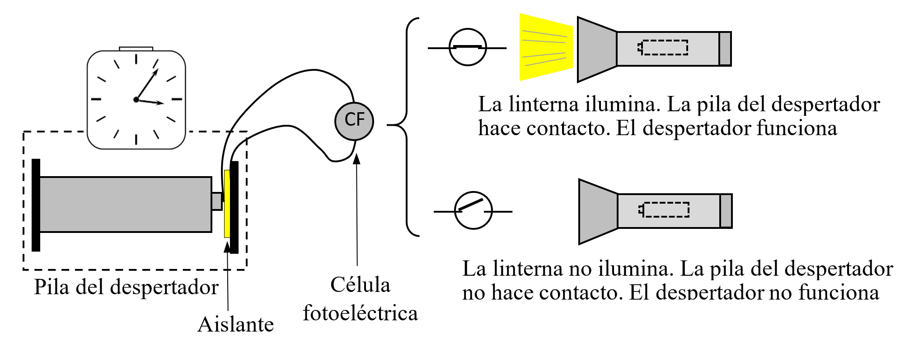
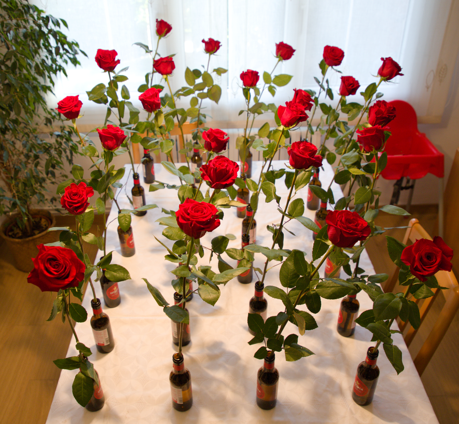
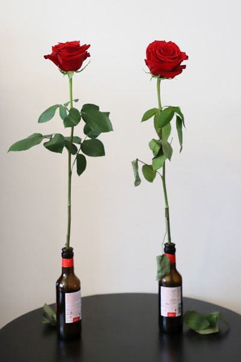

# Datos frente a opiniones

Plantearse una pregunta cuya respuesta requiera obtener y analizar datos es, seguramente, la mejor manera de entender de qué trata la estadística. Conviene que la pregunta tenga cierto interés y que no sea de respuesta obvia ni trivial. Mejor aún si ya existe una opinión popular al respecto, pero que no está respaldada por ninguna evidencia objetiva. Para valorar la viabilidad del estudio, antes de empezar conviene tener claro:

-   ¿Qué datos harán falta para responder a la pregunta planteada?

-   ¿Cómo se conseguirán esos datos? ¿Existen? ¿Será fácil obtenerlos en un tiempo razonable?

-   ¿Serán fiables? ¿Están actualizados? ¿Responden exactamente a lo que se quiere saber?

-   ¿Cómo se analizarán esos datos? No hace falta pensar en análisis complicados, pueden ser simples representaciones gráficas.

Desde luego, también hay que abordar la pregunta con espíritu crítico y teniendo claro el significado de los términos que se emplean. Por ejemplo, preguntarse si conducen mejor los hombres que las mujeres (o viceversa) no es una buena pregunta, porque no está claro qué significa «conducir mejor». Podría reformularse preguntándose si tienen más accidentes los hombres que las mujeres, aunque habría que tener en cuenta que los datos disponibles seguramente solo recogen los accidentes graves. Además, sería necesario considerar el número de horas que conducen hombres y mujeres, un dato que probablemente no es fácil de obtener.

Las preguntas pueden dividirse en aquellas que requieren datos que ya existen --aunque puede ser difícil encontrarlos-- y aquellas en las que los datos no existen y hay que obtenerlos, ya sea mediante encuestas o realizando experimentos. Veamos algunas preguntas que pueden ser abordadas en el proceso de aprendizaje.

## Los datos existen, pero hay que buscarlos

### ¿Hay más nacimientos los días de luna llena? {.unnumbered}

Esta es una creencia bastante extendida. Para ver si es verdad basta con tener los datos del número de nacimientos diarios y ver si los días de luna llena se observa un incremento respecto al resto. Conseguir esta serie para un país o una región no siempre es fácil. En la web del Instituto de Estadística de la Comunidad de Madrid[^13_Epilogo-1] están disponibles los de esa Comunidad desde 1975. Es razonable suponer que esos datos se pueden considerar representativos de la población en general a efectos de la influencia de la luna llena en el número de nacimientos.

[^13_Epilogo-1]:[Instituto de Estadística de la Comunidad de Madrid](https://web.comunidad.madrid/iestadis) > Demografía > Movimiento natural de la población > Nacimientos > Acceder a los datos > Información adicional - 37 Nacidos cada día. Este camino para llegar a los datos puede cambiar.  (https://web.comunidad.madrid/iestadis/fijas/estructu/demograficas/mnp/descarga/mnpnacidosdias.xlsx) 

Aunque están en formato Excel y son fáciles de manejar, hay que reorganizarlos para facilitar su análisis. Los días de luna llena se pueden obtener fácilmente aunque, en rigor, la luna llena se produce en un instante y se considera día de luna llena el día en que se produce ese instante, sin importar la hora a que se produce. También hay que tener en cuenta que los días de luna llena dependen del uso horario. 

Tener muchos datos a veces complica los análisis gráficos porque solo se observa una gran mancha de puntos en la que es imposible distinguir nada en particular. La [@fig-lunaLlena] muestra, para los años 2020-2023, el número de nacimientos por día de la semana, identificando con una línea horizontal negra el valor del percentil del 90% en cada grupo. Los valores correspondientes a días de luna llena --que aparecen identificados con un cuadrado rojo-- no destacan por ser singularmente altos. Realizando unos cálculos rápidos, en cada año tenemos 12-13 días de luna llena y un 10% de esos días (entre 1 y 2) deberían tener un número de nacimientos superior al percentil del 90%, y esto es lo que observamos.

{#fig-lunaLlena .fig-normal1 fig-align="center" width="100%"}

Hemos dividido los datos por día de la semana porque se observa una clara disminución del número de nacimientos los fines de semana (y también los días festivos, aunque eso no lo hemos tenido en cuenta), seguramente debido al aumento de partos programados que siempre se realizan en día laborable. 

A veces buscando una cosa se encuentran otras, igual o más interesantes. En la [@fig-boxPlotLuna] se observa una disminución del número de nacimientos a partir de la crisis de 2008, y también que la diferencia entre los días laborables y fines de semana va aumentando hasta esa fecha y después parece tender a disminuir aunque se sigue manteniendo.

{#fig-boxPlotLuna .fig-normal3 fig-align="center" width="100%"}

En esta línea de nacimientos y hospitales también se puede comparar la proporción de nacimientos por cesárea por región, por países, o por hospitales dentro de cada país, aunque no está claro que sea fácil conseguir los datos.

Volviendo a la influencia de la luna llena, se puede cambiar el número de nacimientos por el de accidentes, delitos, defunciones...

### ¿Cuál es la fuente más fiable para predecir el tiempo? {.unnumbered}

Existen bastantes servicios meteorológicos, cada uno con su página web, que dan previsiones a varios días vista. ¿Cuál es el que más acierta en un lugar concreto?

Lo que más suele interesar es si lloverá o no, pero no todos dan la información con el mismo detalle: algunos la desglosan por horas e indican la cantidad de precipitación prevista en cada franja horaria, mientras que otros solo dan la probabilidad de que llueva. Hay que definir bien lo que se entiende por acertar la previsión (puede haber diversos niveles de acierto) y realizar un seguimiento de lo previsto por cada uno de los servicios analizados comparado con lo que realmente ocurre. Previamente, conviene asegurarse de que es posible conocer con fiabilidad lo que sucede en el lugar de interés. 

También en esta línea, se puede analizar si son ciertos los dichos sobre el tiempo en una región: "En abril, aguas mil", ¿es realmente abril el más lluvioso? o "Hasta el 40 de mayo, no te quites el sayo", ¿es verdad que hasta el 10 de junio puede haber días fríos y a partir de esa fecha ya no los hay? (lo que sí parece cierto es que en estos dichos se fuerza la rima a cualquier precio).

### ¿Es más probable llegar a deportista profesional si se nace en los primeros meses del año? {.unnumbered}

\noindent Como se comenta en el apartado 5.2, se dice que haber nacido en los primeros meses del año aumenta la probabilidad de llegar a ser deportista profesional. Si se elige un deporte como el fútbol, donde las fechas de nacimiento de los jugadores de equipos de las primeras categorías son fáciles de conseguir, se puede comparar la proporción de nacidos en el primer y el segundo semestre del año, como hemos hecho en el apartado antes citado, o la proporción de los nacidos en los tres primeros meses del año respecto a los nacidos en los tres últimos, o de los nacidos en enero frente a los nacidos en diciembre. Hay que considerar cuáles son las proporciones en la población en general, y también la existencia de futbolistas que se han formado en otros países donde el criterio de organizar las categorías infantiles --razón por la que se justifica esa posible diferencia-- es distinto al nuestro. 

### ¿Se ponen menos multas las semanas previas a las elecciones municipales? {.unnumbered}

\noindent En algunas ciudades se comenta que en las semanas previas a las elecciones municipales se ponen menos multas, atribuyendo esa mayor tolerancia al interés por no irritar a ciudadanos que al ser multados (seguro que piensan que es de forma injusta o demasiado estricta) dejen de votar a los actuales gobernantes. Analizar la serie del número de multas por semana para comprobar si antes de las elecciones se produce un bajón permitirá responder a la pregunta planteada. Naturalmente, que baje el número de multas puede ser debido simplemente al azar, habrá que analizar si esa diferencia es estadísticamente significativa. Realizar el análisis en una ciudad donde se ponen muchas multas y tener los datos de varias elecciones facilita poder afirmar que la diferencia es estadísticamente significativa, en el caso de que realmente lo sea.

En una línea similar, cuando se pone un nuevo radar en la carretera para detectar --y multar-- a los coches que circulan con exceso de velocidad, algunas personas afirman que su fin es meramente recaudatorio, mientras que la administración afirma que lo hace para reducir el número de accidentes. Si se tienen datos de la fecha de colocación de un nuevo radar y del número de accidentes en su zona de influencia antes y después de su instalación, se puede analizar si la diferencia es estadísticamente significativa. Que no lo sea no significa necesariamente que tengan razón los que afirman que el objetivo es solo recaudatorio. Puede ocurrir que su influencia vaya más allá de la zona considerada o que, simplemente, el radar no haya logrado el objetivo que se pretendía.

### ¿Hay relación entre el precio de la vivienda y el número de hijos por mujer? {.unnumbered}

Parece que muchas parejas esperan a tener un hogar y una cierta estabilidad económica antes de decidirse a tener hijos y que, en las ciudades donde la vivienda es muy cara --muchas veces inaccesible para las parejas jóvenes (y para las no tan jóvenes)-- tener hijos se pospone y acaba reduciéndose el número de hijos por mujer. ¿Avalan los datos esta teoría?

Seguramente, el valor relevante no es tanto el precio de la vivienda como la relación entre el precio y el salario. Si en una ciudad los precios de los alquileres son el doble que en otra, pero también se gana el doble, no debería haber diferencia en lo que interesa analizar.

Habrá que buscar un indicador del precio de la vivienda o de los alquileres y ver si un diagrama bivariante del número de hijos por mujer frente a esta variable muestra algún tipo de relación. Al interpretar estos resultados, hay que tener en cuenta que la existencia de correlación no implica necesariamente una relación de causa-efecto. Una ciudad cara suele ser también una ciudad grande, y las grandes ciudades presentan otras características —como el estrés, mayores tiempos de desplazamiento o viviendas más pequeñas— que también podrían influir en el número de hijos.

### ¿Abandonan más los que entran con notas más bajas? {.unnumbered}

Sobre las calificaciones obtenidas, las tasas de abandono y, en general, el desempeño en los estudios universitarios, se pueden plantear muchas preguntas interesantes que solo se pueden responder si se tienen datos. Seguramente, lo primero que se descubre es lo difícil que es conseguirlos --convenientemente anonimizados, por supuesto--, a pesar de que pueden estar muy cerca.

Se puede analizar si existe alguna relación entre la nota con que se accede a los estudios (en general, calculada a partir de la obtenida en el bachillerato y en los exámenes de acceso) y la nota de salida, o con la obtenida en determinados cursos o asignaturas. También se podría estudiar si el cambio entre la nota de entrada y la de salida depende del tipo de centro --público o privado-- donde se han realizado los estudios preuniversitarios, así como si hay diferencias entre hombres y mujeres. También sería interesante identificar qué asignaturas tienen las notas más correlacionadas entre ellas, si en alguna se obtienen notas que no tienen nada que ver con las obtenidas en las otras asignaturas, o si las notas de cada asignatura siguen una serie estable o si hay subidas y bajadas que se pueden asociar a algún hecho concreto.

Un trabajo, ya de cierta envergadura, sería construir un *dashboard*, por ejemplo con *Power BI*, capaz de mostrar los indicadores clave sobre las calificaciones obtenidas en un centro y construir gráficos de forma interactiva que permitan responder a las preguntas planteadas[^13_Epilogo-2], si se tiene acceso a los datos, naturalmente.

[^13_Epilogo-2]: Puede ver, por ejemplo, [aquí](https://upcommons.upc.edu/handle/2117/356194) (en catalán).

## Los datos no existen, hay que obtenerlos con medios propios

Cuando los datos no existen, se pueden obtener por muestreo --seleccionando elementos o individuos al azar, como se realiza en las encuestas-- o diseñando experimentos para obtener esos datos en unas condiciones controladas. Por ejemplo, en la siguiente pregunta que nos planteamos sobre si duran más las pilas caras, podríamos intentar conseguir la duración de pilas que se han usado si esos datos existieran y fuera posible obtenerlos, o analizar su duración en condiciones controladas. A continuación, comentamos este caso y otros del mismo tipo.

### ¿Duran más las pilas caras? {.unnumbered}

Es curioso observar que existe una diferencia de precio importante entre las pilas de marca conocida (algunas incluso se han anunciado en televisión) y las de marca blanca, aunque ambas tengan idénticas características técnicas.

Por tanto, la pregunta parece pertinente, aunque es necesario concretarla. Pilas caras las hay de varias marcas y algunas pueden durar mucho y otras poco. Lo mismo puede ocurrir con las de marca blanca. Por tanto, es más adecuado plantearse si las pilas de la marca X (que son caras) duran más que las de la marca Y (que son baratas).

Pero todavía hay más aspectos a considerar. Quizá, para algunos usos en los que las pilas duran mucho (como en un reloj de pared) las caras duran lo mismo que las baratas, pero, para otras aplicaciones, como juguetes que tienen un motor, quizá sí duran más las pilas caras (ojo, no es lo mismo preguntarse si las pilas caras duran más que si vale la pena comprarlas).

Hay que elegir, por tanto, una aplicación concreta en la que se van a comparar las pilas. Un tipo de aplicación con una duración intermedia puede ser una linterna. En este caso, la pregunta completa sería: ¿duran más las pilas de la marca X que las de la marca Y alimentando una linterna?

Mejor elegir una linterna que se alimente con una sola pila para medir la duración de esa pila en concreto. Las linternas con bombilla incandescente tienen el problema de que, si se utilizan mucho tiempo seguido, especialmente en un ambiente cerrado, es fácil que se funda la bombilla. En las de led no sabemos si la electrónica interna puede afectar a la duración de la pila.

La forma de seleccionar las pilas con las que se va a realizar la comparación también tiene relevancia. Si se van a usar 16 pilas de cada tipo (cuantas más mejor) no conviene comprarlas todas juntas en la misma tienda, ya que muy probablemente formarán parte del mismo lote y se habrán fabricado en idénticas condiciones, no reflejando adecuadamente la variabilidad que se presenta en la duración de esa marca de pilas. Además, pueden durar un poco más o un poco menos dentro de su marca y no ser representativas del conjunto. Para evitar esa posibilidad, es mejor comprarlas en sitios diferentes, por ejemplo, un blíster de 4 unidades en 4 tiendas distintas, esperando que de esta forma la muestra sea más representativa de la población que representa. También habría que tener en cuenta que las fechas de caducidad en las dos marcas sean similares.

Por otra parte, medir la duración de una pila en una linterna no es trivial. La luz se va apagando poco a poco y es muy difícil mantener el mismo criterio para determinar el momento en que se debe dar la pila por acabada, especialmente si la luz ambiental va cambiando.

Una opción puede ser usar una célula fotoeléctrica (CF) y un despertador, con un montaje como el que se muestra en la [@fig-celulaFotoelectrica].

{#fig-celulaFotoelectrica .fig-normal3 fig-align="center" width="100%"}

La CF actúa como un interruptor que permanece cerrado cuando la cantidad de luz que recibe está por encima de un cierto umbral. Este umbral se puede fijar al valor que se desee, aunque ese valor es poco importante si se mantiene constante. 

La pila que se coloca en el despertador hace contacto normal en un extremo, pero el otro tiene un aislante. El contacto en ese extremo se realiza a través de un hilo conductor que va desde el despertador hasta la pila pasando por la CF. Cuando la CF está iluminada, la pila hace contacto y el despertador funciona normalmente, mientras que cuando la iluminación de la linterna cae por debajo del umbral establecido, deja de haber contacto en la pila del despertador --es como si la quitáramos-- y el reloj se para. Así pues, el despertador mide la duración de la pila, aunque hay que mirarlo cada 12 horas.

Naturalmente, la linterna y la célula fotoeléctrica deben estar dentro de una caja opaca, tal como se muestra en la [@fig-cajaConLinterna].

{#fig-cajaConLinterna .fig-normal3 fig-align="center" width="75%"}

Después de tener la duración de todas las pilas[^13_Epilogo-3] en orden aleatorio --para que, si el orden de medida tiene alguna influencia, esta se difumine en los valores de las dos marcas--, solo habrá que representar los valores gráficamente, valorar lo que se hace con los posibles valores anómalos (¿por qué se han producido?: ¿error?, ¿pila con duración excepcional?) y seguramente con eso sea suficiente. En caso de duda, se puede realizar un test, que en este caso será el de la $t$ de Student para comparar las medias de muestras independientes, o uno basado en la diferencia en la suma de los números de orden que corresponden a cada grupo cuando se ordenan todos los resultados de menor a mayor.

[^13_Epilogo-3]: La práctica siempre suele mostrar dificultades imprevistas o aspectos que no se han tenido en cuenta, que habrá que ir resolviendo.

Existen otras preguntas que se pueden formular en este contexto: ¿la duración de las pilas está relacionada con su voltaje inicial? Nuestro estudio puede responder también a esa pregunta si se tiene previsto desde el principio y se miden los voltajes iniciales de cada pila. ¿Y por qué no medir también los voltajes finales y analizar si la duración depende de esa diferencia? Solo hace falta disponer de un buen voltímetro.

Hay otros aspectos que se podrían considerar, pero que no forman parte de nuestra pregunta. Puede ser que las pilas caras tengan otras características que las diferencian de las baratas más allá de la duración. Quizá las pilas caras son más seguras, o más herméticas; eso no lo consideramos.

### ¿Conserva mejor el gas poner una cucharilla en la boca de una bebida gaseosa? {.unnumbered}

Puede parecer absurdo, pero lo cierto es que se trata de una práctica bastante extendida con el vino espumoso (champán) porque el tapón se dilata al salir de la botella y ya no se puede volver a poner. Hemos visto referencias a artículos que han abordado el tema con instrumentos de laboratorio y no han encontrado ninguna diferencia entre poner la cucharilla y no poner nada[^13_Epilogo-4]. También se puede plantear la prueba con un refresco con burbujas, aunque no es evidente que las conclusiones se puedan generalizar a cualquier bebida y cualquier tipo de botella.

[^13_Epilogo-4]: La práctica siempre suele mostrar dificultades imprevistas o aspectos que no se han tenido en cuenta, que habrá que ir resolviendo.
	En un libro titulado "Hierro en las espinacas …y otras creencias" (bajo la dirección de Jean-François Bouvet, editorial Suma de letras S. L., septiembre de 2000) se incluye un pequeño apartado sobre este tema. Después de una introducción, dice (sin disimular la ironía):
	
	<blockquote>
		En 1995, el equipo de físico-químicos del Centro Interprofesional de los Vinos de Champaña, en Épernay, llevó a cabo una obra de utilidad pública al desarrollar un programa de investigación serio y completo: tras haber vaciado parcialmente muchas botellas de la misma cosecha descorchadas al unísono determinaron las variaciones de la presión del gas en el curso del tiempo. Algunas botellas abiertas no tenían cucharilla; otras la incluían de plata o de metales distintos; otras, a su vez, estaban cerradas por un tapón hermético y un cuarto lote, por una cápsula.
		
		Gracias al estudio en cuestión este problema acuciante ha quedado por fin resuelto: la cucharilla en el cuello de la botella no sirve para nada, mientras que los tapones --herméticos, naturalmente-- conservan la presión del champán.
	</blockquote>
	
	Al final se incluye una referencia al estudio mencionado: "Champagne et petite cuiller", informe "Science et gastronomie", en "Pour la Science", marzo de 1995. Pero no hemos conseguido encontrarlo.

Habrá que disponer de varias botellas de refresco que el día antes de la prueba se dejarán a medias, y la mitad se dejarán abiertas sin nada en la boca de la botella y a las otras se les colocará la cucharilla. La prueba puede consistir en presentar 8 vasos, 4 con refresco de la botella con cucharilla y otros 4 de la otra, y el catador --preferiblemente alguien que crea que sí se puede distinguir-- debe clasificarlos en los dos grupos.

La prueba debe ser doble ciego, es decir, el que cata no debe saber el origen del refresco, pero el que sirve y anota los resultados tampoco, para evitar que algún gesto o comentario pueda dar pistas al catador. Esto tiene mucho que ver con el experimento de Fisher y la catadora de té, visto en el Apéndice 8.1.

### Se conservan mejor las flores echando aspirina al agua del jarrón? {.unnumbered}
	
Este es un consejo ampliamente difundido en internet, donde se argumenta que la aspirina aporta nutrientes o reduce el crecimiento de bacterias, aunque también hay voces críticas que sugieren incluso efectos negativos. También se han presentado ponencias en congresos y publicado artículos en revistas científicas, pero tampoco en este ámbito hay consenso sobre los efectos de la aspirina. 

Es posible realizar un estudio casero, pero riguroso, sobre este tema. Una diferencia entre las revistas con "consejos para el hogar" y las publicaciones científicas es que las primeras hablan de ramos de flores en general, mientras que las segundas se refieren siempre a un tipo concreto de flor. Parece razonable que lo que va bien a un tipo de flor no necesariamente debe ir bien a todos los demás. Así pues, habrá que definir para qué tipo de flor se va a realizar el estudio. También podría influir la cantidad de flores en el ramo (seguramente la dosis de aspirina depende del tamaño del jarrón o del número de flores). Una opción es analizar qué ocurre con las rosas en el caso de tener una sola colocada en un jarrón individual. 

La duración de la rosa se puede valorar estableciendo patrones visuales. Por ejemplo, se colocan varias rosas del tipo considerado en jarrones similares a los que se van a utilizar y, cada día --hasta que claramente se han marchitado-- se hacen varias fotos a cada rosa de forma que se pueden apreciar los detalles de su evolución. Colocando seguidas las fotos de cada flor se tendrá una "película" de su evolución. Seguramente esas rosas no evolucionarán todas exactamente igual (si así fuera, bastaría con tener solo una) pero a partir de las fotos obtenidas se podrá establecer una escala de manera que, dada una rosa que lleva unos días en el jarrón, comparándola con los patrones visuales, se pueda asignar una puntuación a su estado. Además, si la escala va de 1 (flor en perfecto estado) a 10 (flor claramente deteriorada), se puede establecer un valor frontera (7, por ejemplo) y contar cuántos días tarda en alcanzarlo. Aunque, ya puestos, sería interesante mirar la puntuación diaria y ver como evoluciona.

Pero existe otra forma de realizar el estudio sin necesidad de medir la duración de las flores. Si tenemos $n$ flores, formamos $n/2$ parejas, cada una con flores lo más parecidas posible. Por ejemplo, si hemos comparado 24 rosas, aunque se consideren idénticas, seguro que hay algunas más bonitas, más enteras o mejor conservadas que otras. Entre la mejor y la peor seguro que hay una diferencia clara, pero las dos mejores serán prácticamente indistinguibles, y lo mismo pasará con las dos peores. En cada pareja de flores, a una se le pone aspirina y a la otra no. Cada cierto tiempo una o varias personas que no saben dónde está la aspirina indican que flor les parece mejor conservada en cada pareja. Si siempre eligen la que tiene la aspirina, será que esas se conservan mejor. Si hay varios evaluadores pueden decidor por consenso, o excluir del análisis las parejas en las que haya controversia.

Naturalmente, todos los factores que puedan afectar a la duración de las flores (cantidad y tipo de agua, cantidad de aspirina, temperatura, luz, humedad...) deben afectar exactamente igual, o lo más parecido posible, a todas ellas. También existe un aspecto del que se habla poco, que es el cambio de agua. ¿Se cambia el agua? ¿Cada cuánto? ¿Se vuelve a poner aspirina al agua nueva?. Todos estos aspectos deben estar claros y quedar reflejados en el informe que se realice sobre los resultados del estudio.

::: {#fig-fotoflores} 
::: {layout-ncol="2"} 
{width="60%"}

{width="37.5%"}
:::

Mesa con 12 parejas de rosas (una con aspirina y la otra sin) dispuestas todas ellas al azar. A la derecha una pareja al cabo de unos días.
:::

Resultados evidentes (gana en 12 de 12 o en 11 de 12) significarán que la aspirina es eficaz. Si no está tan claro, deberemos echar mano del cálculo de probabilidades para evaluar la probabilidad de que una diferencia como la observada se deba al azar. La distribución binomial será de ayuda en este caso.

En vez de aspirina se puede realizar la prueba con el producto del sobrecito que dan en algunas floristerías para este menester. Observe que analizar si un producto alarga la vida de las flores se puede relacionar con analizar si un nuevo tratamiento quirúrgico reduce el tiempo de recuperación, o si un nuevo fármaco aumenta el tiempo de supervivencia. También aquí hay variabilidad (no todos los pacientes son iguales ni responden del mismo modo) y, aunque las consideraciones teóricas apunten a un cierto resultado, siempre es necesario confirmarlos con pruebas bien organizadas.

### ¿Sirven las bolsas de plástico llenas de agua para espantar las moscas? {.unnumbered}

\noindent Esta es también una curiosa práctica muy extendida, y hay controversia sobre su eficacia. Un buen resumen del "estado del arte" se publicó en elDiario.es[^13_Epilogo-5]. La conclusión principal es que no se conocen estudios serios sobre este tema y que hay opiniones contrapuestas, aunque los expertos se muestran escépticos sobre su eficacia.

[^13_Epilogo-5]: Ver artículo [aquí](https://www.eldiario.es/consumoclaro/).

¿Cómo salir de dudas? No podemos preguntar a las moscas, y hacer cábalas sobre cómo son sus ojos, cómo ven las bolsas con agua o qué "piensan" al verlas, es pura especulación. Solo hay una forma de intentar responder a esta pregunta: haciendo la prueba.

Claro que no es fácil. Se debe llevar a cabo en un lugar amplio y donde haya muchas moscas (siempre parece que hay muchas, excepto cuando queremos que realmente las haya), y habrá que colocar bolsas de plástico llenas de agua en unas zonas, teniendo en cuenta que deben haber otras zonas similares sin bolsa que estén suficiente alejadas de las primeras. 

Con todo bien dispuesto, contar cuántas moscas se mueven en cada zona no parece sencillo y habrá que ser creativo con los medios disponibles. Se pueden  colocar tiras pegajosas en ambas zonas y ver donde se pegan más moscas, o realizar fotos de forma automática cada cierto tiempo (se puede hacer la foto con un fondo claro que facilite el recuento). Si hacemos fotos necesitaremos dos cámaras para hacer las fotos simultáneamente[^13_Epilogo-6]

[^13_Epilogo-6]: Quede claro que nosotros no hemos hecho este estudio, y seguro que al hacerlo aparecen dificultades imprevistas que habrá que resolver.

Si se encuentran menos moscas en la zona de las bolsas con agua habrá que analizar si la diferencia es estadísticamente significativa mediante un contraste de hipótesis en el que la hipótesis nula será que la bolsa con agua no es eficaz, la carga de la prueba la tiene el que afirma que sí lo es. 

En definitiva, se trata de responder a la pregunta que nos hemos planteado, recogiendo --con rigor-- y analizando datos que reflejen de la mejor manera posible lo que ocurre en la realidad. 

Esto es estadística y esto es método científico.
  

  
  &#9671;
  

 

