# Representaciones gráficas

Empezamos planteando un reto: la [Tabla 3.1](#tbl-Panaderia) contiene los pesos de una muestra de las barras de pan producidas en una panadería. El pan es elaborado en dos máquinas que son utilizadas por dos operarios, uno por la mañana y otro por la tarde. El peso debe ser de $220 \pm 10$ g. ¿Observa algún problema? Si lo hay, ¿qué se debería hacer para resolverlo? 

```{=html}
<div id="tbl-Panaderia" class="tabla-wrapper42">
<table class="tabla-0301">

<caption>Tabla 3.1: Datos tomados en una panadería</caption>

<colgroup>
    <col style="width: 6%;">
    <col style="width: 14%;">
    <col style="width: 9.5%;">
    <col style="width: 9.5%;">
    <col style="width: 9.5%;">
    <col style="width: 9.5%;">
    <col style="width: 4%;">
    <col style="width: 9.5%;">
    <col style="width: 9.5%;">
    <col style="width: 9.5%;">
    <col style="width: 9.5%;">
  </colgroup>
  
  <thead>
      <tr>
        <th style="vertical-align: middle; text-align: center;"> Día </th>
        <th style="vertical-align: middle; text-align: center;"> Operario </th>
        <th colspan="4" style="vertical-align: middle; text-align: center;"> Máquina 1 </th>
        <th>&nbsp;</th>
        <th colspan="4" style="vertical-align: middle; text-align: center;"> Máquina 2 </th>
      </tr>
   </thead>
    <tbody>
      <tr>
        <td>1</td> <td>B</td> <td>220,3</td> <td>215,8</td> <td>220,4</td> <td>221,5</td> <td>&nbsp;</td> <td>217,7</td> <td>214,9</td> <td>214,7</td> <td>218,2</td>
      </tr>
      <tr>
        <td>2</td> <td>A</td> <td>217,7</td> <td>222,7</td> <td>216,0</td> <td>219,4</td> <td>&nbsp;</td> <td>214,1</td> <td>216,2</td> <td>213,1</td> <td>214,7</td>
      </tr>
      <tr>
        <td>3</td> <td>A</td> <td>219,8</td> <td>220,2</td> <td>218,0</td> <td>219,3</td> <td>&nbsp;</td> <td>216,8</td> <td>214,2</td> <td>215,4</td> <td>215,9</td>
      </tr>
      <tr>
        <td>4</td> <td>B</td> <td>220,0</td> <td>223,9</td> <td>220,1</td> <td>216,9</td> <td>&nbsp;</td> <td>218,9</td> <td>218,8</td> <td>215,2</td> <td>219,9</td>
      </tr>
      <tr>
        <td>5</td> <td>B</td> <td>217,9</td> <td>224,2</td> <td>214,1</td> <td>221,1</td> <td>&nbsp;</td> <td>216,5</td> <td>218,0</td> <td>213,8</td> <td>215,2</td>
      </tr>
      
      <tr>
        <td>6</td> <td>A</td> <td>215,5</td> <td>222,0</td> <td>221,7</td> <td>227,0</td> <td>&nbsp;</td> <td>220,1</td> <td>217,6</td> <td>217,9</td> <td>218,4</td>
      </tr>
      <tr>
        <td>7</td> <td>B</td> <td>225,3</td> <td>215,1</td> <td>218,8</td> <td>218,3</td> <td>&nbsp;</td> <td>216,5</td> <td>217,5</td> <td>216,2</td> <td>215,8</td>
      </tr>
      <tr>
        <td>8</td> <td>B</td> <td>222,6</td> <td>219,5</td> <td>223,9</td> <td>221,6</td> <td>&nbsp;</td> <td>218,9</td> <td>215,4</td> <td>215,0</td> <td>215,4</td>
      </tr>
      <tr>
        <td>9</td> <td>B</td> <td>214,1</td> <td>220,6</td> <td>218,8</td> <td>221,6</td> <td>&nbsp;</td> <td>212,8</td> <td>213,4</td> <td>215,1</td> <td>220,8</td>
      </tr>
      <tr>
        <td>10</td> <td>A</td> <td>225,7</td> <td>216,2</td> <td>219,7</td> <td>225,0</td> <td>&nbsp;</td> <td>221,4</td> <td>216,7</td> <td>215,9</td> <td>212,9</td>
      </tr>
      
      <tr>
        <td>11</td> <td>A</td> <td>219,1</td> <td>218,9</td> <td>220.6</td> <td>219,5</td> <td>&nbsp;</td> <td>218,0</td> <td>223,5</td> <td>216,9</td> <td>213,4</td>
      </tr>
      <tr>
        <td>12</td> <td>B</td> <td>223,0</td> <td>219,6</td> <td>217,9</td> <td>216,7</td> <td>&nbsp;</td> <td>216,0</td> <td>214,2</td> <td>221,6</td> <td>213,1</td>
      </tr>
      <tr>
        <td>13</td> <td>A</td> <td>221,1</td> <td>222,4</td> <td>219,6</td> <td>218,8</td> <td>&nbsp;</td> <td>206,5</td> <td>212,5</td> <td>212,0</td> <td>210,3</td>
      </tr>
      <tr>
        <td>14</td> <td>A</td> <td>224,3</td> <td>219,5</td> <td>218,4</td> <td>220,6</td> <td>&nbsp;</td> <td>212,1</td> <td>210,6</td> <td>211,0</td> <td>208,2</td>
      </tr>
      <tr>
        <td>15</td> <td>A</td> <td>222,2</td> <td>219,9</td> <td>222,4</td> <td>222,7</td> <td>&nbsp;</td> <td>211,1</td> <td>208,2</td> <td>209,8</td> <td>210,7</td>
      </tr>
      
      <tr>
        <td>16</td> <td>B</td> <td>219,2</td> <td>213,6</td> <td>219,6</td> <td>222,5</td> <td>&nbsp;</td> <td>209,4</td> <td>211,0</td> <td>210,4</td> <td>212,2</td>
      </tr>
      <tr>
        <td>17</td> <td>B</td> <td>218,0</td> <td>217,3</td> <td>213,0</td> <td>224,1</td> <td>&nbsp;</td> <td>209,4</td> <td>211,8</td> <td>212,7</td> <td>212,5</td>
      </tr>
      <tr>
        <td>18</td> <td>B</td> <td>217,7</td> <td>219,9</td> <td>221,9</td> <td>219,9</td> <td>&nbsp;</td> <td>211,6</td> <td>211,9</td> <td>207,9</td> <td>212,0</td>
      </tr>
      <tr>
        <td>19</td> <td>A</td> <td>217,4</td> <td>219,6</td> <td>217,9</td> <td>222,6</td> <td>&nbsp;</td> <td>217,7</td> <td>215,4</td> <td>214,9</td> <td>216,5</td>
      </tr>
      <tr>
        <td>20</td> <td>A</td> <td>216,1</td> <td>220,4</td> <td>224,5</td> <td>222,2</td> <td>&nbsp;</td> <td>214,3</td> <td>221,4</td> <td>213,4</td> <td>215,0</td>
      </tr>
  </tbody>
</table>
</div>
```

Si trata de sacar conclusiones solo mirando los números es fácil que se equivoque. Aunque solo hay 160 valores, analizarlos "a ojo" siempre es arriesgado. Tampoco es una buena idea empezar calculando medias y desviaciones típicas o, peor todavía, empezar planteando test estadísticos más o menos sofisticados.

Después de valorar la calidad de los datos, es decir, de reflexionar sobre si son representativos del conjunto sobre el que se pretende sacar conclusiones, lo primero que conviene hacer es representarlos gráficamente. De esta manera tenemos una primera idea –muchas veces ya suficiente– de lo que está pasando. También podemos detectar posibles valores anómalos (en nuestro ejemplo no los hay) que si pasan desapercibidos pueden alterar completamente las conclusiones finales.

En la [@fig-histoPanaderia] tenemos los histogramas de nuestros datos separados primero por máquina y después por operario. Siempre es una buena idea analizar los datos según su origen. También habíamos construido histogramas específicos para los datos de cada operario en cada máquina ya que el problema podría estar concentrado en el uso que uno de los operarios hace de una de las máquinas, pero vimos que esto no ocurre. 

::: callout-note
## Analizar los datos separándolos según su origen

Cuando se busca la causa de un problema siempre conviene analizar los datos separándolos según su procedencia, por si el problema se concentra en un origen concreto. Pero esto solo es posible si los datos se han recogido teniendo en cuenta ese interés. Si en la panadería se hubieran anotado únicamente los pesos, sin identificar su origen, sería imposible comparar las máquinas y, por tanto, descubrir el origen del problema.
:::

Lo que nuestros gráficos indican es que la máquina 2 está desajustada: está fabricando aproximadamente en torno a 215 g cuando debería hacerlo en torno a 220. Sobre el peso de las unidades de la máquina 1 no hay objeciones. Respecto a los operarios, aunque --como es natural-- sus histogramas no son iguales, no se observa ninguna diferencia que sugiera un comportamiento distinto.

En resumen: habría que ajustar la máquina 2 para que -en promedio- dé el peso objetivo. Respecto a la máquina 1 y a los operarios, no aparece ninguna información relevante.

{#fig-histoPanaderia .fig-normal3 fig-align="center" width="85%"}


## Forma de la distribución, valor central y dispersión

Cuando el interés se centra en conocer la forma que presenta la distribución (si es simétrica, bimodal, ...), el gráfico de uso más habitual es el histograma, aunque cuando se tienen pocos datos es preferible usar diagramas de puntos. 

Una alternativa a los histogramas son los boxplots, que permiten resumir en poco espacio la información más relevante de grandes volúmenes de datos, destacando de forma explícita los posibles valores anómalos.

### Histograma {.unnumbered}

\noindent En la [Tabla 3.1](#tbl-Tabulacion) están tabulados los valores obtenidos en la máquina 1. El histograma es la representación gráfica de esa tabla y, por lo general, se construye a partir de las frecuencias absolutas. No obstante, cuando se comparan situaciones con distinto número de datos, puede resultar más adecuado emplear frecuencias relativas o porcentajes. El aspecto del histograma no cambia al pasar de un tipo de frecuencia a otro; únicamente se modifica la escala vertical.

```{=html}
<div id="tbl-Tabulacion"; class="tabla-wrapper42">
<table class="tabla-0302">

<caption>Tabla 3.2: Tabulación de los valores obtenidos en la máquina 1.</caption>

<colgroup>
    <col style="width: 25%;">
    <col style="width: 25%;">
    <col style="width: 25%;">
    <col style="width: 25%;">
   
</colgroup>
<thead>
  <tr>
    <th rowspan="2" style="vertical-align: middle; text-align: center;"> Pesos </th>
    <th style="vertical-align: middle; text-align: center;"> Frecuencia </th>
    <th style="vertical-align: middle; text-align: center;"> Frecuencia </th>
    <th rowspan="2" style="vertical-align: middle; text-align: center;"> Porcentaje </th>
  </tr>
  <tr>
    <th> absoluta (<i>n</i>) </th>
    <th> absoluta (<i>f</i>) </th>
  </tr>
</thead>
   
<tbody>
  <tr>
    <td>>212 - 214</td> <td>2</td> <td>0,025</td> <td>2,5</td>
  </tr>
  <tr>
    <td>>214 - 216</td> <td>7</td> <td>0,0875</td> <td>8,75</td>
  </tr>
  <tr>
    <td>>216 - 218</td> <td>12</td> <td>0,15</td> <td>15</td>
  </tr>
  <tr>
    <td>>218 - 220</td> <td>23</td> <td>0,2875</td> <td>28,75</td>
  </tr>
  <tr>
    <td>>220 - 222</td> <td>16</td> <td>0,02</td> <td>20</td>
  </tr>
  <tr>
    <td>>222 - 224</td> <td>12</td> <td>0,015</td> <td>15</td>
  </tr>
  <tr>
    <td>>224 - 226</td> <td>7</td> <td>0,0875</td> <td>8,75</td>
  </tr>
  <tr>
    <td>>226 - 228</td> <td>1</td> <td>0,0125</td> <td>1,25</td>
  </tr>
 <tr>
    <td>Total</td> <td><i>N</i> = 80</td> <td>1</td> <td>100</td>
  </tr>
</tbody>      

</table>
</div>
```

Los histogramas se construyen para variables continuas (las que pueden tomar cualquier valor dentro de un intervalo: peso, longitud, tiempo,...) de forma que cuando acaba una barra empieza otra, sin espacio entre ellas. 

Si la variable es discreta (solo toma valores concretos: número de hijos por familia, número de pedidos que se reciben cada día, ...) hablamos de diagrama de barras. En este caso se levanta una barra sobre cada uno de los valores posibles (o grupos de ellos) y las barras pueden no tocarse. 

Algunos aspectos a considerar en la construcción de los histogramas son:

-   Conviene tener unos **25 datos como mínimo**. Con menos datos no es capaz de reflejar de forma adecuada la información relevante.
	
-   Existen fórmulas para orientar en la selección del **número de intervalos** ($h$) en función del número de datos ($N$). La más sencilla es $h=\sqrt{N}$, aunque no interesa tener menos de 5 ni suelen ser necesarios más de 15. En cualquier caso, lo más importante es que la escala del eje horizontal, así como los extremos y la anchura de los intervalos sean números redondos, fáciles de leer y de interpretar. Esta tarea no la suelen hacer bien los paquetes de software y conviene editar el gráfico o hacer uso de las opciones disponibles para colocar los valores que interesan.
	
-   Cuando se construyen tablas de frecuencia o histogramas siempre surge la duda de a qué intervalo asignar los **valores frontera**. La respuesta es que no importa, solo hay que ser coherente y usar el mismo criterio en todos los intervalos. Nosotros hemos asignado los valores frontera al extremo superior, tal como lo hace por defecto el programa R. Si con los mismos datos, misma anchura de intervalo, mismos valores de los extremos, en fin, todo igual, hacemos el histograma con Minitab[^30_graficos-1], sale distinto. La razón es que Minitab asigna los valores frontera al extremo inferior.
	
[^30_graficos-1]: <small>R y Minitab son paquetes de software estadístico.</small>

::: callout-note
## La forma del histograma no es única.

Fijando las escalas de los ejes, la forma del histograma depende de la anchura que se elija para los intervalos y también del punto en que se empiezan a construir. Si decidimos que la anchura sea igual a 2, el perfil del histograma no será el mismo si los extremos  son 0, 2, 4, 6,.. que si son 1, 3, 5, 7,... Aún así, si tenemos suficientes datos, aunque el perfil cambie, la impresión que dará será la misma.
:::

Un último comentario sobre los histogramas: no hay que esperar que cuando provienen de una distribución Normal su perfil sea simétrico y con la típica forma de campana. Eso hay que esperar cuando se tienen muchos datos (pongamos que más de 1000), pero no cuando se tienen 50 o 100. Lo volveremos a comentar con ejemplos gráficos cuando hablemos de la distribución Normal.

```{=html}
<div id="tbl-ProsCons"; class="tabla-wrapper34">
<table class="tabla-ProsCons">

<caption>Tabla 3.3: Histograma. Pros y contras</caption>

  <colgroup>
    <col style="width: 10%;">
    <col style="width: 90%;">
  </colgroup>
  <tbody>
    <tr style="border-top: 1px solid #dee2e6; border-bottom: 1px solid #dee2e6;">
      <!-- ✅ PRIMERA CELDA -->
      <td style="padding: 22px 0px 8px 0px; vertical-align: top; text-align: center;">
      <!-- top right bottom left -->
        <div style="display: flex; flex-direction: column; align-items: center; gap: 12px;">
          <strong>PROS</strong>
          <span class="fa-solid fa-thumbs-up fa-xl" style="color: #0ca701;"></span>
        </div>
      </td>

      <!-- ✅ SEGUNDA CELDA -->
      <td style="padding: 12px 15px 8px 0px; vertical-align: top;">
        <ul style="margin: 0; padding-left: 6px; line-height: 1.2;">
          <li>Da una visión de la forma de la distribución, del valor en torno al que se mueven los datos y de su dispersión.</li>
          <li>Si se añaden las tolerancias y el valor objetivo, ayuda a valorar como está saliendo la producción en procesos industriales.</li>
        </ul>
      </td>
    </tr>

    <tr style="border-top: 1px solid #dee2e6; border-bottom: 1px solid #dee2e6;">
      <!-- ✅ PRIMERA CELDA -->
      <td style="padding: 22px 0px 8px 0px; vertical-align: top; text-align: center;">
        <div style="display: flex; flex-direction: column; align-items: center; gap: 12px;">
          <strong>CONS</strong>
          <span class="fa-solid fa-thumbs-down fa-xl" style="color: #f03333; "></span>
        </div>
      </td>
      
       <!-- ✅ SEGUNDA CELDA -->
      <td style="padding: 12px 15px 8px 0px; vertical-align: top;">
        <ul style="margin: 0; padding-left: 18px; line-height: 1.2;">
          <li>No es útil si se tienen pocos datos.</li>
          <li>Su aspecto depende del número de intervalos y de los valores en que están situados.</li>
          <li>No informa sobre posibles tendencias o evolución de los datos.</li>
        </ul>
      </td>
    </tr>
  </tbody>
</table>
</div>
```


### Diagrama de puntos {.unnumbered}

Cuando se tienen pocos datos, y especialmente cuando se trata de comparar los de varios grupos, los diagramas de puntos  son una herramienta clara y sencilla. Basta construir una escala y colocar cada valor donde le corresponde. Naturalmente, si se comparan varios grupos la escala debe ser la misma para todos ellos. 

Se puede pensar que si se tienen pocos datos no vale la pena representarlos gráficamente, pero los gráficos siempre ayudan a ver de forma más clara los resultados obtenidos y también a detectar posibles valores anómalos, si los hay. 

Observe los siguientes valores que podrían corresponder a los resultados obtenidos con dos tratamientos, A y B: 

```{=html}
<table class="tabla-03sn1">

  <colgroup>
    <col style="width: 14%;">
    <col style="width: 8.6%;">
    <col style="width: 8.6%;">
    <col style="width: 8.6%;">
    <col style="width: 8.6%;">
    <col style="width: 8.6%;">
    <col style="width: 8.6%;">
    <col style="width: 8.6%;">
    <col style="width: 8.6%;">
    <col style="width: 8.6%;">
    <col style="width: 8.6%;">
  </colgroup>

  <tbody>
    <tr>
      <td>Grupo A:</td>
      <td>14,0</td><td>16,0</td><td>14,5</td><td>13,9</td><td>15,3</td>
      <td>12,9</td><td>14,7</td><td>15,1</td><td>15,9</td><td>13,5</td>
    </tr>
    <tr>
      <td>Grupo B:</td>
      <td>17,9</td><td>17,3</td><td>17,3</td><td>15,4</td><td>16,3</td>
      <td>16,9</td><td>17,8</td><td>17,6</td><td>15,7</td><td>16,6</td>
    </tr>
  </tbody>
</table>
```

Seguramente solo mirando los números ya se dará cuenta de que en el grupo B los valores son más altos, pero la situación queda mucho más clara a la vista del diagrama de puntos ([@fig-dotplot]).

{#fig-dotplot .fig-normal3 fig-align="center" width="90%"}

::: callout-note
## ¿Qué aportaría un test estadístico formal?

A la vista de estos diagramas de puntos estamos prácticamente seguros de que el nivel de respuesta con el tratamiento B es mayor que con el A. No hace falta realizar análisis más sofisticados para llegar a esa conclusión. Cuando a la vista del gráfico hay dudas, un test estadístico formal no las aclara, simplemente les asigna un valor numérico (una probabilidad) relacionado con la discrepancia observada. Ese valor ayuda a decidir si nos inclinamos a considerar que hay diferencias o que no las hay. Tratamos este tema con más detalle en el capítulo 8.
:::

```{=html}
<div id="tbl-ProsCons"; class="tabla-wrapper34">
<table class="tabla-ProsCons">

<caption>Tabla 3.4: Diagrama de puntos</caption>

  <colgroup>
    <col style="width: 10%;">
    <col style="width: 90%;">
  </colgroup>
  <tbody>
  
    <tr style="border-top: 1px solid #dee2e6; border-bottom: 1px solid #dee2e6;">
      <!-- ✅ PRIMERA CELDA -->
      <td style="padding: 8px 0px 8px 0px; vertical-align: top; text-align: center;">
      <!-- top right bottom left -->
        <div style="display: flex; flex-direction: column; align-items: center; gap: 12px;">
          <strong>PROS</strong>
          <span class="fa-solid fa-thumbs-up fa-xl" style="color: #0ca701;"></span>
        </div>
      </td>

      <!-- ✅ SEGUNDA CELDA -->
      <td style="padding: 12px 15px 8px 0px; vertical-align: top;">
        <ul style="margin: 0; padding-left: 18px; line-height: 1.2;">
          <li>Especialmente útil para comparar situaciones con pocos datos.</li>
          <li>Es fácil de construir --incluso a mano-- y de interpretar.</li>
        </ul>
      </td>
    </tr>

    <tr style="border-top: 1px solid #dee2e6; border-bottom: 1px solid #dee2e6;">
      <!-- ✅ PRIMERA CELDA -->
      <td style="padding: 8px 0px 8px 0px; vertical-align: top; text-align: center;">
        <div style="display: flex; flex-direction: column; align-items: center; gap: 12px;">
          <strong>CONS</strong>
          <span class="fa-solid fa-thumbs-down fa-xl" style="color: #f03333; "></span>
        </div>
      </td>
      
       <!-- ✅ SEGUNDA CELDA -->
      <td style="padding: 18px 15px 24px 0px; vertical-align: top;">
        <ul style="margin: 0; padding-left: 18px; line-height: 1.2;">
          <li>Hay alternativas mejores cuando se tienen muchos datos.</li>
        </ul>
      </td>
    </tr>
  </tbody>
</table>
</div>
```

### Boxplot {.unnumbered}

Capta los aspectos más relevantes de grandes volúmenes de datos: valor central, simetría y dispersión, destacando de forma individual cada uno de los valores que se podrían considerar anómalos.

Su interpretación exige recordar algunas de las medidas que definimos en el capítulo anterior. Vamos a construir uno paso a paso usando un sencillo conjunto de 15 valores que ya presentamos ordenados: 

```{=html}
<table class="tabla-03sn2">

  <colgroup>
    <col style="width: 6,67%;">
    <col style="width: 6,67%;">
    <col style="width: 6,67%;">
    <col style="width: 6,67%;">
    <col style="width: 6,67%;">
    <col style="width: 6,67%;">
    <col style="width: 6,67%;">
    <col style="width: 6,67%;">
    <col style="width: 6,67%;">
    <col style="width: 6,67%;">
    <col style="width: 6,67%;">
    <col style="width: 6,67%;">
    <col style="width: 6,67%;">
    <col style="width: 6,67%;">
    <col style="width: 6,67%;">
  </colgroup>

  <tbody>
    <tr>
      <td><i>1</i></td> <td><i>2</i></td> <td><i>3</i></td> <td><i>4</i></td> <td><i>5</i></td>
      <td><i>6</i></td> <td><i>7</i></td> <td><i>8</i></td> <td><i>9</i></td> <td><i>10</i></td>
      <td><i>11</i></td> <td><i>12</i></td> <td><i>13</i></td> <td><i>14</i></td> <td><i>15</i></td>
      <td>12,9</td><td>14,7</td><td>15,1</td><td>15,9</td><td>13,5</td>
    </tr>
    <tr>
      <td>8</td><td>17</td><td>24</td><td>27</td><td>27</td>
      <td>30</td><td>31</td><td>32</td><td>33</td><td>35</td>
      <td>39</td><td>39</td><td>50</td><td>60</td><td>62</td>
    </tr>
  </tbody>
</table>
```
Empezamos calculando los siguientes valores:

-   Mediana ($Me$). Como tenemos 15 valores, la mediana será el que queda en la posición 8, por tanto: $Me = 32$.

-   Cuartiles ($Q_1$ y $Q_3$). Primero identificamos la posición ($P$) y después calculamos los valores. Como en este caso la posición nos da números enteros no hace falta interpolar.
$$P_{Q_1}=0,25(n+1) = 4  \rightarrow Q_1 = 27$$
$$P_{Q_3}=0,75(n+1) = 12  \rightarrow Q_3 = 39$$

-   Rango intercuartílico: $IQR = Q_3 - Q_1 = 39 -27 = 12$

-   Valores frontera ($F_1$ y $F_3$): Marcan el inicio de la zona de anomalías y se sitúan a una distancia de 1,5 veces el rango intercuartílico a partir de cada cuartil, es decir:
$$F_1 = Q_1 -1,5 \cdot IQR = 9$$
$$F_3 = Q_3 +1,5 \cdot IQR = 57$$
Ya podemos construir el boxplot. Tomando como referencia una escala que abarque el rango de variación de nuestros datos, seguimos los siguientes pasos:

1.    Construir la caja (rectángulo) cuyos extremos inferior y superior corresponden al valor de los cuartiles $Q_1$ y $Q_3$. El ancho de la caja no importa. Dentro de la caja se traza una línea correspondiente al valor de la mediana.

2.    Colocar las "patas". La de arriba va desde $Q_3$ hasta la última observación antes de entrar en la zona de anomalías. Esta zona empieza en $F_3 = 57$. La última observación antes de llegar a 57 es igual a 50 por tanto, hasta ahí llegará la pata superior. El valor frontera en la parte inferior es $F_1 = 9$, el último valor antes de llegar a 9 es 17 y hasta ahí llega la pata inferior.

3.    Añadir los valores anómalos. Se coloca un símbolo, normalmente un asterisco, en el lugar correspondiente de la escala.<br>


{#fig-boxplotConstruccion .fig-normal3 fig-align="center" width="100%"}

::: callout-note
##  Otros nombres para el boxplot

Boxplot se puede traducir por "diagrama de caja". Para que el nombre incluya la referencia a las patas también se le ha llamado "box-and-whisker plot" y como *whisker* se traduce como "bigote", a veces en español se le ha denominado "diagrama de caja y bigotes". En aras de la brevedad nosotros le llamaremos simplemente boxplot. Meter los bigotes seguramente solo sirve para llamar la atención.
:::

Volvamos a los datos de la panadería. En la [@fig-boxplotPanaderia] comparamos los pesos de cada máquina y de cada operario usando boxplots. Igual que en los histogramas, puede verse que la máquina 1 produce en torno al valor objetivo y con una variabilidad que es compatible con las tolerancias establecidas, mientras que la máquina 2 está claramente desajustada. Entre los operarios, tal como habíamos visto, no se aprecia una diferencia relevante.

{#fig-boxplotPanaderia .fig-normal3 fig-align="center" width="90%"}

La figura \ref{boxplotEspeVida} muestra la esperanza de vida en 2019 para cada uno de los 196 países del mundo, agrupados según el continente al que pertenecen (datos: Gapminder)\endnote{\url{https://www.gapminder.org/data}. Esta página web contiene datos económicos y de desarrollo en formatos fáciles de tratar. También es una fuente de inspiración sobre cómo visualizar esa información mediante gráficos no convencionales.}. En el gráfico de la izquierda, la esperanza de vida de cada país se representa con un punto en la columna correspondiente a su continente. Los puntos se desplazan ligeramente de forma aleatoria en el eje horizontal para evitar la superposición y facilitar la percepción de su densidad. 

A la derecha se muestran los boxplots correspondientes. En un caso como este, ambos tipos de gráfico pueden resultar apropiados. Sin embargo, si el número de datos fuera muy elevado, sería preferible utilizar los boxplots, ya que en el gráfico de puntos los valores acabarían formando masas compactas en las que no sería posible distinguir unos puntos de otros.

En los boxplots hemos añadido los nombres de los países que aparecen como anomalías en cada continente. En África y en América lo son por tener una esperanza de vida singularmente baja, y en Oceanía, por tenerla alta. Los paquetes de software suelen tener opciones para identificar con facilidad el origen de esos puntos, que muchas veces son los más interesantes.

{#fig-boxplotEspeVida fig-align="center" width="90%"}

::: callout-note
##  ¿Son siempre "anómalos" los valores marcados como anomalías?

Cuando provienen de una distribución Normal (forma de campana simétrica y con la mayoría de observaciones agrupadas en torno al valor central) si un valor aparece como anomalía significa que está bastante más lejos de donde "debería estar" y vale la pena prestarle atención. Si los datos provienen de otro tipo de distribución, como distribuciones asimétricas con cola larga hacia un lado, estos valores pueden ser perfectamente normales y no deberían considerarse anómalos.
:::

```{=html}
<div id="tbl-ProsCons"; class="tabla-wrapper34">
<table class="tabla-ProsCons">

<caption>Tabla 3.5: Boxplots. Pros y contras</caption>

  <colgroup>
    <col style="width: 10%;">
    <col style="width: 90%;">
  </colgroup>
  <tbody>
  
    <tr style="border-top: 1px solid #dee2e6; border-bottom: 1px solid #dee2e6;">
      <!-- ✅ PRIMERA CELDA -->
      <td style="padding: 8px 0px 8px 0px; vertical-align: top; text-align: center;">
      <!-- top right bottom left -->
        <div style="display: flex; flex-direction: column; align-items: center; gap: 12px;">
          <strong>PROS</strong>
          <span class="fa-solid fa-thumbs-up fa-xl" style="color: #0ca701;"></span>
        </div>
      </td>

      <!-- ✅ SEGUNDA CELDA -->
      <td style="padding: 12px 15px 8px 0px; vertical-align: top;">
        <ul style="margin: 0; padding-left: 18px; line-height: 1.2;">
          <li>Pueden resumir en poco espacio la información más relevante de grandes volúmenes de datos.</li>
          <li>Muy útiles para comparar varios grupos, especialmente si el número de datos es muy grande.</li>
        </ul>
      </td>
    </tr>

    <tr style="border-top: 1px solid #dee2e6; border-bottom: 1px solid #dee2e6;">
      <!-- ✅ PRIMERA CELDA -->
      <td style="padding: 8px 0px 8px 0px; vertical-align: top; text-align: center;">
        <div style="display: flex; flex-direction: column; align-items: center; gap: 12px;">
          <strong>CONS</strong>
          <span class="fa-solid fa-thumbs-down fa-xl" style="color: #f03333; "></span>
        </div>
      </td>
      
       <!-- ✅ SEGUNDA CELDA -->
      <td style="padding: 18px 15px 24px 0px; vertical-align: top;">
        <ul style="margin: 0; padding-left: 18px; line-height: 1.2;">
          <li>No se puede deducir con cuantos datos se ha construido y este es un valor relevante para poderlo interpretar adecuadamente.</li>
          <li>Su interpretación no es intuitiva.</li>
        </ul>
      </td>
    </tr>
  </tbody>
</table>
</div>
```

## Evolución

texto

### Diagrama en serie de tiempo

Evolución de la esperanza de vida en los países donde tienen más y donede tienen menos.

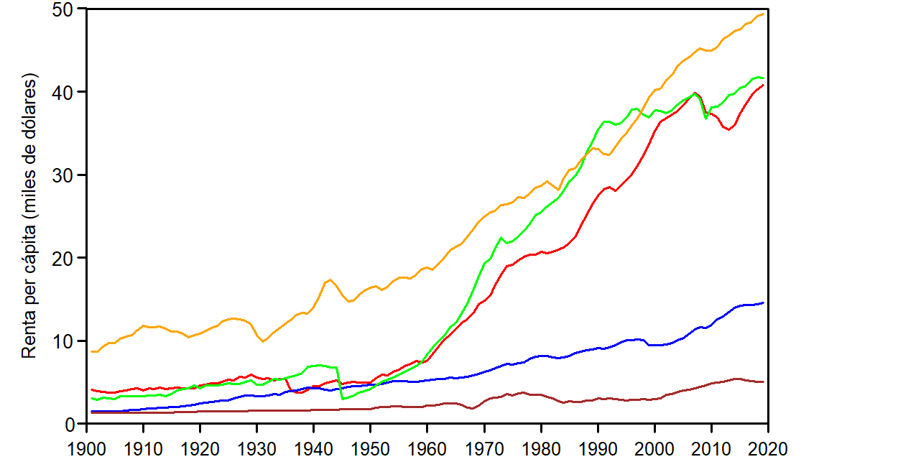{fig-align="center" width="100%"}

Asia: Afganistan, Japón. Menor de áfrica y otro con EV muy alta.

También hay buenos datos en web de comunidd de Madrid: Indicadores de nacimientos.

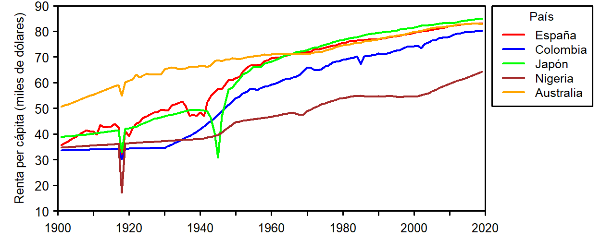{fig-align="center" width="100%"} Que los nombres salgan por orden alfabético.

## Relación entre variables

texto

### Las dos son cuantitativas: Diagramas bivariantes

texto

V 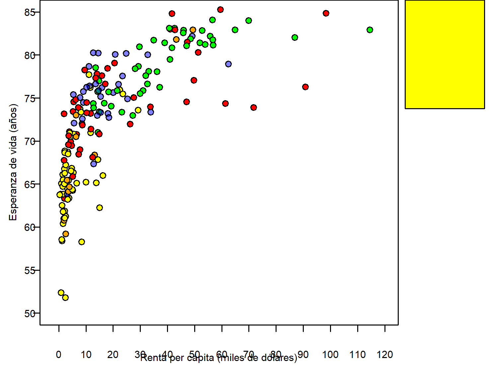{fig-align="center" width="100%"}

texto

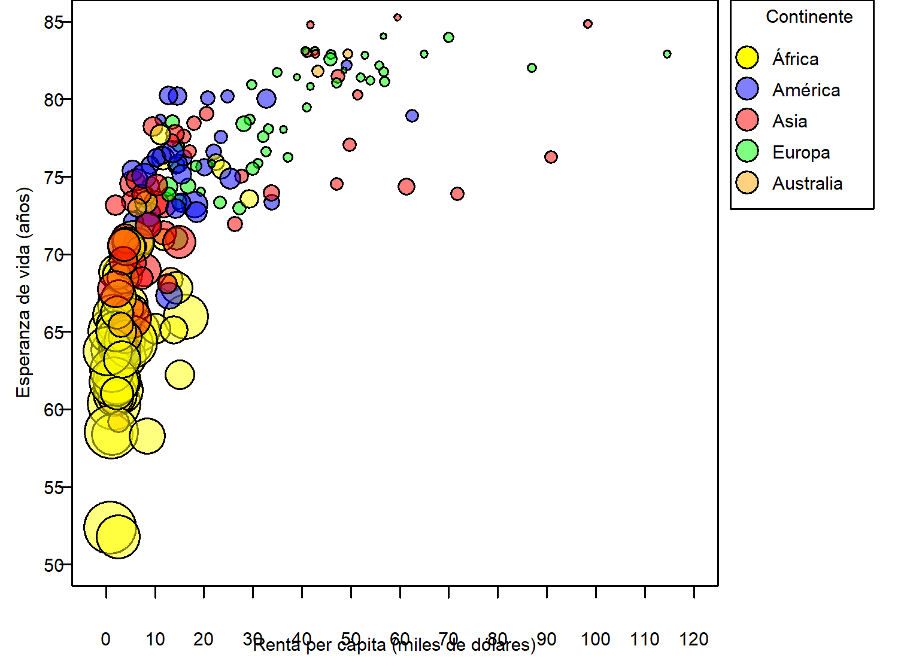{fig-align="center" width="100%"} Reflexión sobre esperanza de vida y ratios de mortalidad infantil.

La esperanza de vida está más relacionada con la mortalidad infantil que con alargar la vida de los ancianos.

Una es cuantitatica y la otra cualitativa: ejemplo de Boxplots estratificados del principio.

## Frecuencias

texto

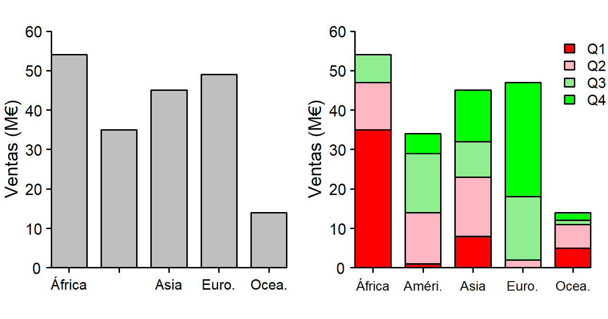{fig-align="center" width="100%"}

texto

### Diagramas de barras

texto

### Gráficos de donut

texto en la figura [-@fig-donutPie]. Recortar arriba y abajo con programa de manipulación de imágenes.

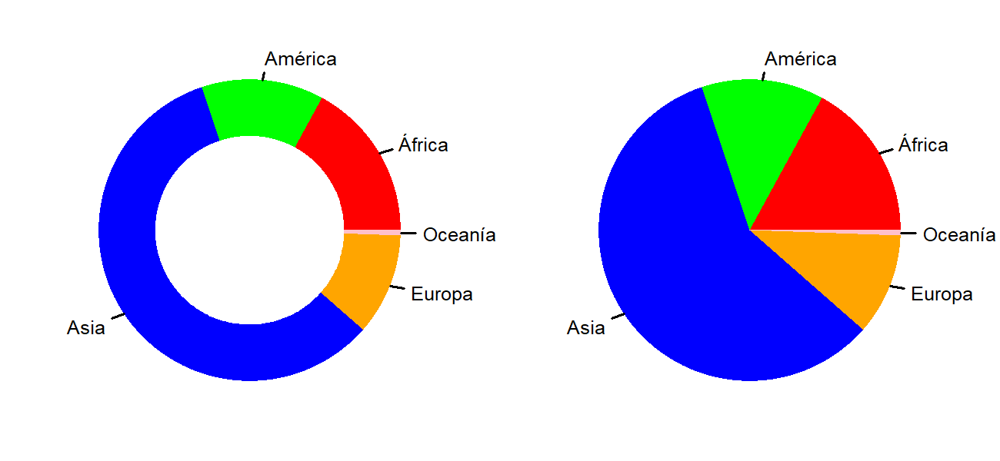{#fig-donutPie fig-align="center" width="100%"}

Información más clara y mejor uso de la tinta.

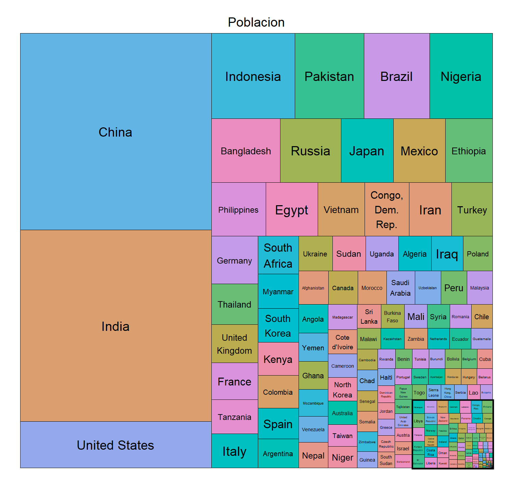{fig-align="center" width="100%"}

En el recuadro se incluyen 90 países, casi la mitad del total de paises considerados (196), pero solo representa el \*\*\*% de la poblaicón mundial.

Posible polígono de frecuencias y diagrama de Pareto.

## Gráficos a evitar

veamos algunas tentaciones que conviene evitar, especialmente en trabajos académicos donde el objetivo debe ser transmitir la información de la forma más clara y directa posible.

### Gráficos con tres dimensiones {.unnumbered}

Deben evitarse porque la profundidad no aporta ninguna información y dificulta la interpretación de las escalas. Algunas veces se utilizan en contextos publicitarios en los que se prioriza el impacto visual.

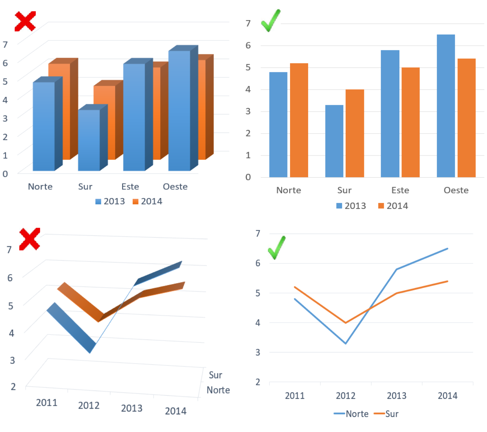{fig-align="center" width="100%"}

### Diagramas de pastel, especialmente con tres dimensiones {.unnumbered}

Estos diagramas no son muy aprecidos en contextos científico-técnicos donde -en general- se prefieren los diagramas de barras. Si se representan en tres dimensiones y desgajando un sector que se quiere destacar ya entramos en el terreno de los gráficos tendenciosos. Un gráfico similar que transmite la información de forma más clara son los diagramas de donut.

===Comentar que en el gráfico 3d no es lo que parece===

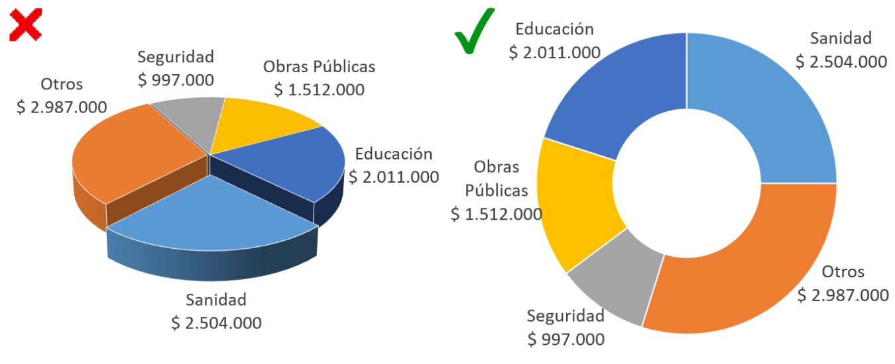{fig-align="center" width="100%"}

### Gráficos que ocupan mucho espacio y contienen poca información {.unnumbered}

Utilizamos los gráficos para resumir de forma visual la información que contienen los datos. Construir un gráfico para representar un solo dato no parece -en general- una buena . Así pues, contruir -por ejemplo- un gran diagrama de pastel para decir que la proporción de mujeres en un determinado ámbito es del 53% no parece una buena idea. Es más grave si en un informe o en una presentación oral se van presentando este tipo de gráficos de forma repetitiva. ===no caeremos en nuestra propia trampa poniendo un ejemplo===

### Gráficos con escalas inapropiadas {.unnumbered}

Uno de los recursos más utilizados para que el gráfico dé la impresión que interesa es adaptar la escala vertical para exagerar o disimular las diferencias, según convenga. La figura +++++ prodría representar las medidas de audiencia de cuatro cadenas de televisión, en el gráfico de la izquierda se observan unas diferencias muy claras y TV1 parece tener la mitad de la audiencia que TV4 sin embargo, si la escala parte de cero -que es lo correcto cuando se hacen comparaciones- apenas se aprecian esad diferencias.

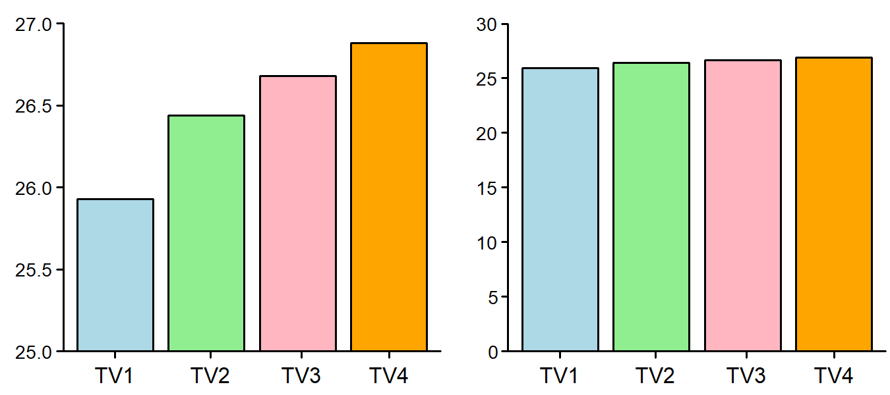{fig-align="center" width="100%"}

No hay que dejarse engañar con añadidos como el de la figura ++++

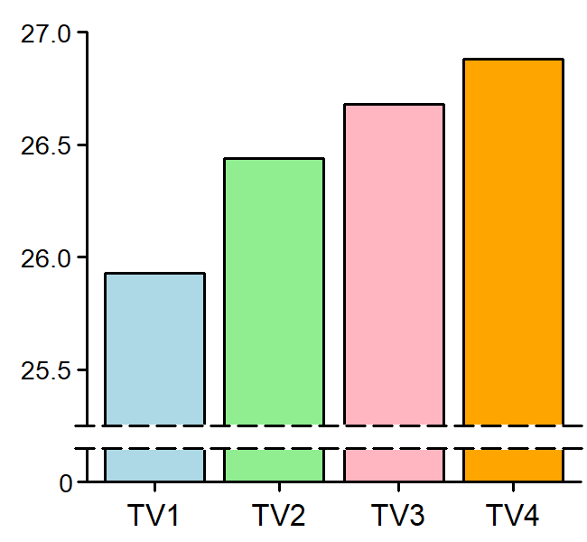{fig-align="center" width="50%"}

Ya sabemos que si el eje horizontal representa el tiempo es mejor utilizar gráficos de líneas y estos son también muy sensibles a la escala vertical. Los dos gráficos de la figura ++++ representan los mismos datos:

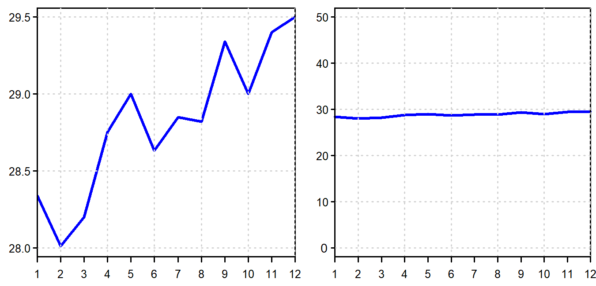{fig-align="center" width="100%"}

texto

Una buena opción

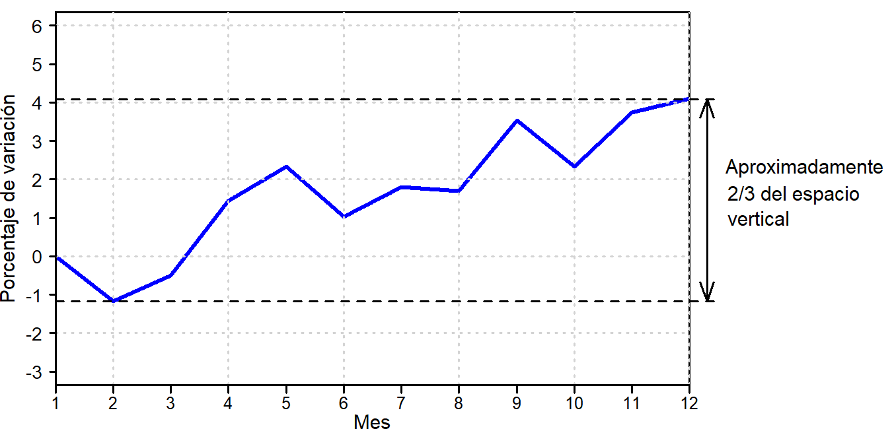{fig-align="center" width="100%"}

texto

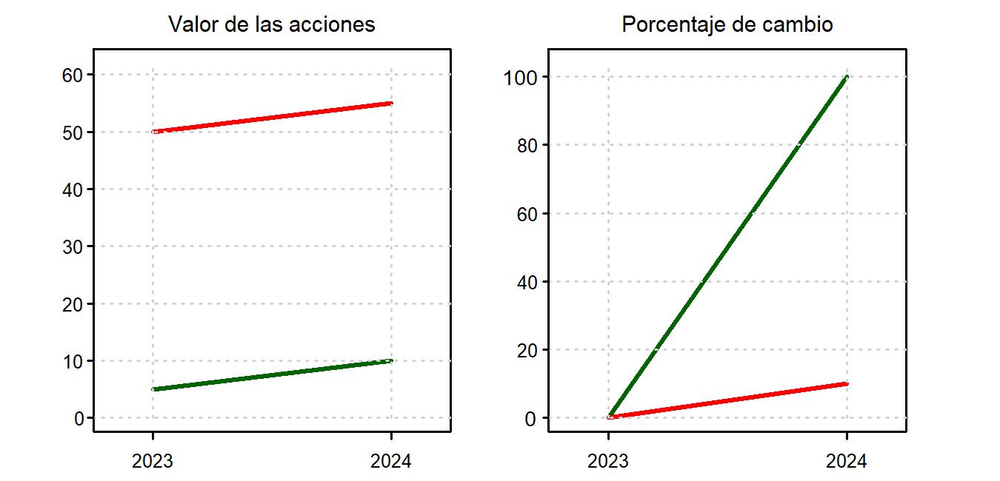{fig-align="center" width="100%"}

text

::: {layout-ncol="2"}


:::

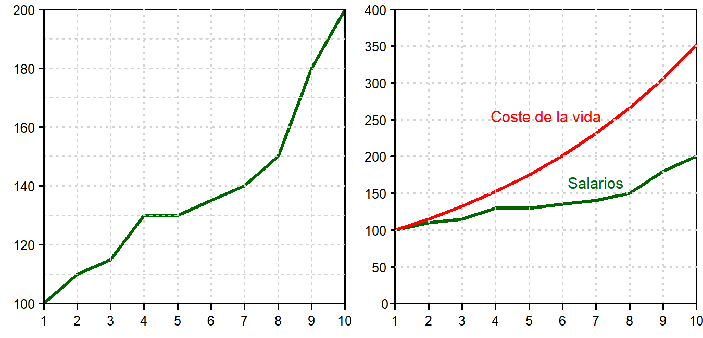{fig-align="center" width="100%"}

text

::: grid
::: g-col-5
::: {style="font-size:14.5px"}
+:--------:+:--------:+:--------:+:-----------:+
| \        | \        | \        | Poder\      |
| Año      | Precios  | Salarios | adquisitivo |
+----------+----------+----------+-------------+
| 1\       | 100,0\   | 100\     | 100\        |
| 2\       | 115,0\   | 110\     | 95,7\       |
| 3\       | 132,3\   | 115\     | 87,0\       |
| 4\       | 152,1\   | 130\     | 85,5\       |
| 5\       | 174,9\   | 130\     | 74,3\       |
| 6\       | 201,1\   | 135\     | 67,1\       |
| 7\       | 231,3\   | 140\     | 60,5\       |
| 8\       | 266,0\   | 150\     | 56,4\       |
| 9\       | 305,9\   | 180\     | 58,8\       |
| 10\      | 351,8\   | 200\     | 56,9\       |
+----------+----------+----------+-------------+

: {tbl-colwidths="\[15, 20, 20, 20\]"}
:::
:::

::: g-col-7
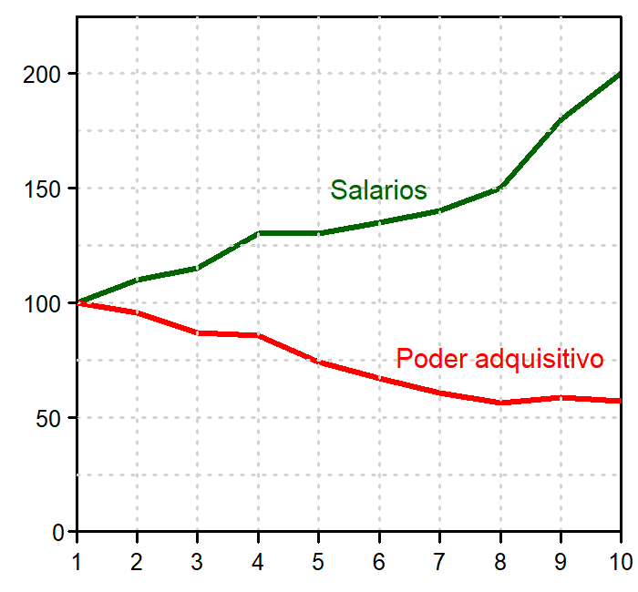{fig-align="center" width="100%"}
:::
:::

text

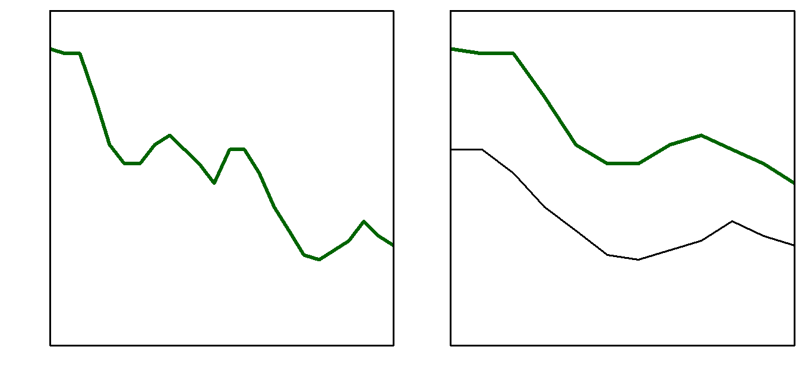{fig-align="center" width="100%"}

texto

{fig-align="center" width="100%"}

texto

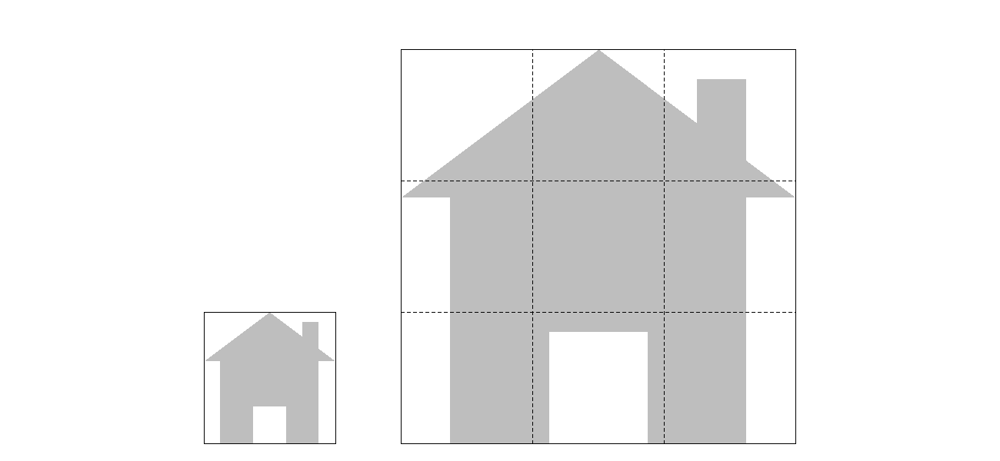{fig-align="center" width="100%"}

texto

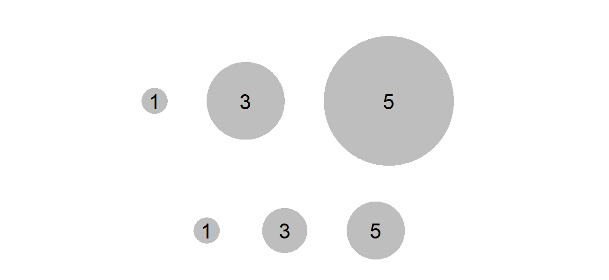{fig-align="center" width="100%"}

text

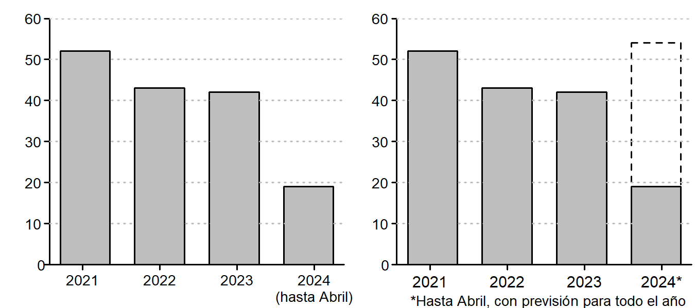{fig-align="center" width="100%"}

text

{fig-align="center" width="100%"}

### Comparar situaciones usando distintas escalas

texto

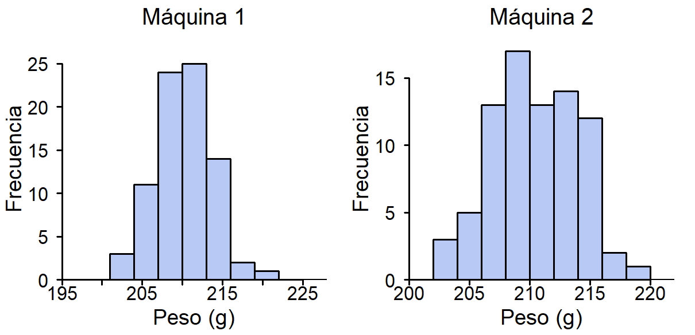{fig-align="center" width="100%"}

### Rectas de tendencia cuando los puntos están muy agrupados en una parte del diagrama

texto

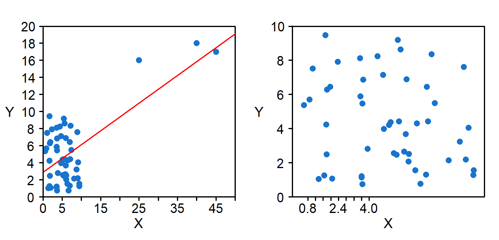{fig-align="center" width="100%"}

## Malos usos y manipulaciones

texto

::: callout-note
## Ojo con ir a la búsqueda del gazapo

puede ser muy instructivo buscar ejemplos de gráficos que por falta de habilidad o por mala fe transmiten una información falsa, pero tampoco hay que transmitir la idea de que todo el mundo nos quiere engañar. En la prensa seria la mayoría de los gráficos -que pueden ser más o menos afortunados- se hacen de buena fe, con el ánimo de informar con
:::
